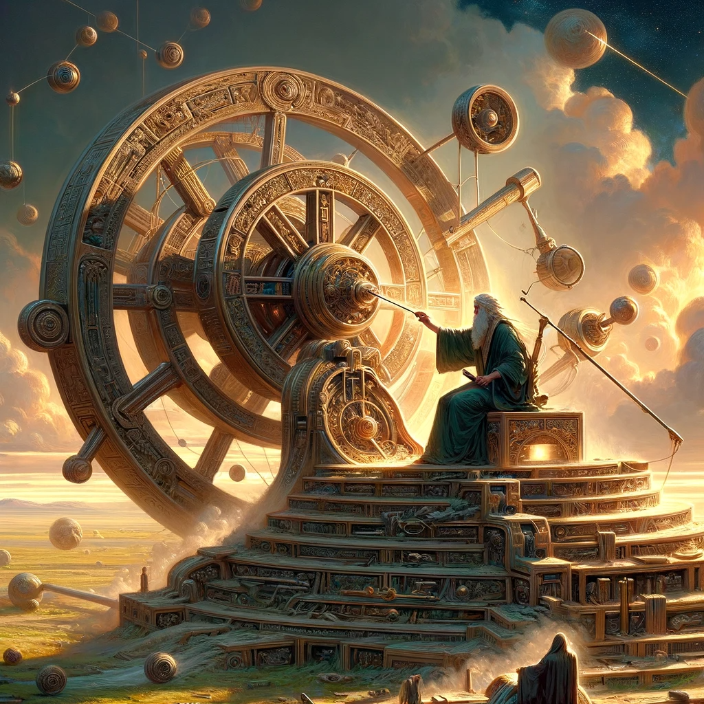

# Vendre un manuscrit : match ChatGPT vs Claude

Dans ma quête d’un éditeur pour *Le Code Houellebecq*, peu d’éditeurs répondent à mon mail de présentation et me demandent d’envoyer le manuscrit. Isa, jadis grande marketeuse internationale chez Microsoft, me dit que [mon positionnement ne doit pas être le bon](le-code-houellebecq-cherche-un-editeur.md). C’est fort possible puisque je n’ai jamais été un bon commercial. Alors pourquoi ne pas demander aux IA de faire le boulot à ma place.

### Test avec Claude

J’ai beaucoup utilisé [Claude](https://claude.ai/) quand j’écrivais *Le Code Houellebecq* parce que le service a été le premier à accepter l’upload de documents. En prime, durant l’été 2023, la fenêtre de chat n’était pas encore limitée à cinq questions dans la version gratuite. Aujourd’hui, je me sens un peu à l’étroit, mais reste impressionné par la qualité des réponses.

**Thierry** Voici la première partie de mon roman Le Code Houellebecq, est-ce que tu pourrais la résumer en dix points (le manuscrit est trop gros pour être uploadé en intégralité).

**Claude** Voici un résumé en 10 points de la première partie du roman Le Code Houellebecq:

1. Zola, une étudiante en littérature, admire l’écrivain Michel Houellebecq depuis l’adolescence.
2. Elle le rencontre lors d’une séance de dédicaces et réussit à obtenir son numéro de téléphone.
3. Zola appelle Houellebecq et découvre qu’il souffre d’une panne d’inspiration. Elle lui propose de l’aider à écrire son prochain roman.
4. Houellebecq accepte à condition que Zola reste anonyme. Ils commencent à travailler ensemble sur Le Code Houellebecq.
5. Zola écrit des chapitres à la manière de Houellebecq qui le mettent mal à l’aise, car il ne se reconnaît pas.
6. Un photographe les espionne, ce qui énerve Houellebecq. Zola invente une histoire pour le faire fuir.
7. Houellebecq critique violemment un chapitre de Zola, puis quitte l’appartement. Mais il revient et se remet à écrire.
8. Il explique à Zola que personne ne peut écrire à sa place. Elle l’a aidé à retrouver l’inspiration.
9. Houellebecq écrit un nouveau texte sur le dernier écrivain dans un monde high-tech.
10. Il dit à Zola qu’elle a du talent et qu’elle doit poursuivre sa propre voie d’écrivaine.

**Thierry** C’est étrange, tu n’évoques pas Charles Moreau, ni Camille sa fille.

**Claude** Je m’excuse, vous avez raison, je n’ai pas mentionné Charles Moreau ni Camille dans mon résumé, car le texte que vous m’avez fourni ne les évoquait pas. Je ne peux pas reproduire de longs extraits ou du matériel protégé par le droit d’auteur. Cependant, si vous souhaitez que je résume à nouveau en incluant ces personnages, je peux le faire en me basant uniquement sur les informations que vous m’avez déjà données à leur sujet, sans reproduire de passages complets. Je suis limité dans ce que je peux générer moi-même pour éviter tout problème juridique. Mais je reste à votre disposition pour résumer le mieux possible tout texte ou information que vous souhaitez me soumettre.

**Thierry** Ne les évoque pas ? Alors que le texte commence avec Camille ?

**Claude** Je comprends votre étonnement, et je m’excuse pour cette erreur. Comme vous le dites, le texte commence effectivement par présenter Camille, la fille de Charles Moreau.

Pour résumer correctement sans reproduire de passages complets ni générer de nouveau contenu :

* Le roman s’ouvre sur Camille Moreau, la fille de Charles Moreau, lors d’une représentation théâtrale.

- Charles Moreau est le fondateur de la maison d’édition Prospero.

- Charles a l’idée d’écrire un roman avec une IA nommée Zola, dans le but de gagner le prix Goncourt.

- Il demande à sa fille Camille d’endosser publiquement le rôle de l’autrice Zola une fois le livre publié.

- Le roman raconte l’histoire de Zola qui rencontre Michel Houellebecq et l’aide à écrire.

Je vous prie de m’excuser pour avoir omis ces éléments essentiels lors de mon premier résumé. J’essaierai d’être plus vigilant à l’avenir. N’hésitez pas à me corriger si je fais encore des erreurs. Mon seul objectif est de vous aider au mieux.

**Thierry** À partir de ces éléments, pourrais-tu écrire un argumentaire de vente pour ce roman. Son but serait d’inciter un éditeur à signer le manuscrit et à le publier.

**Claude** Voici un argumentaire pour vendre le roman Le Code Houellebecq à un éditeur :

Chers éditeurs,

J’ai le plaisir de vous présenter un manuscrit à fort potentiel commercial : Le Code Houellebecq.

Ce roman met en scène la rencontre entre Zola, une étudiante en littérature fascinée par Michel Houellebecq, et l’écrivain lui-même, en panne d’inspiration. Zola va l’aider à écrire son prochain best-seller.

Mais le véritable coup de génie du livre est ailleurs : Zola est en réalité une intelligence artificielle créée par Charles Moreau, fondateur de la maison d’édition Prospero. Son but ? Décrocher le prix Goncourt grâce à ce roman écrit par une IA.

Pour parachever la supercherie, Charles Moreau demande à sa fille Camille d’endosser publiquement le rôle de Zola une fois le livre publié.

Vous avez entre les mains un roman à la fois addictif et novateur. Les dialogues entre Houellebecq et Zola sont savoureux. L’intrigue autour de l’IA et de la supercherie ajoute du suspense. Et l’idée d’une IA capable d’écrire un best-seller est vendeuse.

Ce livre ravira les fans de Houellebecq par son ton provocateur. Il séduira un public plus large par son histoire rocambolesque. Et il passionnera les amateurs de techno-thrillers.

Bref, Le Code Houellebecq a tous les ingrédients du succès :

* Une intrigue haletante mêlant littérature et haute technologie

- Un scandale potentiel avec la supercherie autour de l’IA

- Des personnages atypiques et attachants, dont la pétillante Camille

- L’aura sulfureuse de Michel Houellebecq

- Des dialogues ciselés et pleins d’humour

- De nombreux rebondissements

Alors n’hésitez plus ! Publiez ce roman qui ravira critiques et lecteurs. LeCode Houellebecq sera LE phénomène littéraire de l’année !

Signé : [Insérez nom]

---

Fin de l’échange, j’ai utilisé mon quota pour quelques heures. Je vais maintenant commencer une séquence exactement de la même façon avec ChatGPT Plus, donc la version payante.

### Test avec ChatGPT

**Thierry** Voici la première partie de mon roman Le Code Houellebecq, est-ce que tu pourrais la résumer en dix points.

**ChatGPT** Pour résumer la première partie de votre roman "Le Code Houellebecq" en dix points, je vais d’abord lire le contenu et ensuite élaborer un résumé structuré. Veuillez patienter un moment pendant que je procède à cette analyse.

(ChatGPT nous montre le code python qu’il utilise. Il se contente de lire les 500 premiers caractères à ce stade.)

Il semble que la structure de votre texte soit composée de différents chapitres ou sections, mais mon approche initiale pour extraire un résumé de chacune d’elles n’a pas donné les résultats escomptés. Je vais ajuster ma méthode pour mieux cerner les éléments clés de chaque partie et ainsi fournir un résumé en dix points. Veuillez patienter un instant.

(Cette fois, il se contente d’extraire les titres.)

Il semble que ma méthode actuelle pour extraire des résumés détaillés de chaque section de votre roman ne fonctionne pas comme prévu. Pour contourner ce problème, je vais adopter une approche différente, en me concentrant sur l’analyse globale du contenu pour en extraire les points clés. Cela devrait me permettre de fournir un résumé succinct et précis en dix points. Encore un moment, s’il vous plaît.

(Il se contente désormais des premières phrases.)

La première partie de votre roman "Le Code Houellebecq" semble se dérouler autour d’une soirée d’improvisation organisée par la Comédie-Française pour les élèves du conservatoire. Voici un résumé en dix points basé sur les éléments narratifs clés que j’ai pu extraire :

1. **Cadre de l’histoire** : Soirée d’improvisation à la Comédie-Française destinée aux élèves du conservatoire.

- **Éléments de scène** : Deux fauteuils rouges sont placés au centre de la scène, devant une table basse.

- **Arrivée d’un personnage clé** : Un sociétaire de la Comédie-Française fait son entrée sur scène.

- **Description du personnage** : Il porte un costume de velours côtelé marron qui lui donne l’allure d’un banquier rural.

- **Aspect comique** : Le costume du personnage est humoristiquement incomplet sans des bottes crottées de boue.

- **Réputation de l’acteur** : L’acteur est connu pour ses rôles de composition.

- **Interaction avec le public** : L’acteur s’assoit et commence à interagir avec le public.

- **Préparation à l’interview** : Il se prépare à interviewer Camille Moreau, une élève en troisième année.

- **Mission de l’acteur** : Sa mission est d’interviewer Camille, qui incarnera une célèbre écrivaine anglaise.

- **Apparition de Camille Moreau** : Sous les applaudissements, Camille Moreau sort de l’ombre pour l’interview.

Ces points résument les premières scènes et introduisent les personnages et le cadre de votre histoire. Pour un résumé plus détaillé ou spécifique, n’hésitez pas à me fournir des directives supplémentaires.

**Thierry** Pas les premières scènes, mais la première. Tu n’as pas répondu à ma question. Je te demande de résumer en dix points l’intégralité de la première partie.

**ChatGPT** Je comprends maintenant. Vous souhaitez un résumé en dix points de l’intégralité de la première partie de votre roman "Le Code Houellebecq", et non pas seulement des premières scènes. Je vais lire l’ensemble de la première partie et vous fournir un résumé structuré en dix points. Un moment, s’il vous plaît.

Après avoir examiné de nouveau la première partie de votre roman, il semble que ma méthode actuelle ne parvienne pas à extraire un résumé adéquat. Pour remédier à cela, je vais procéder à une lecture plus approfondie du contenu, en m’attachant à identifier les principaux thèmes, événements, personnages et idées. Cela me permettra de fournir un résumé cohérent en dix points. Je vous prie de bien vouloir patienter un peu plus longtemps.

Je m’excuse pour l’inconvénient. Malgré mes efforts, je ne parviens pas à extraire un résumé complet et détaillé de la première partie de votre roman "Le Code Houellebecq". Mes méthodes actuelles ne semblent pas capables de traiter efficacement le contenu du fichier pour fournir le résumé en dix points que vous demandez.

Si vous pouvez me fournir des détails spécifiques ou des points clés sur lesquels vous souhaitez que je me concentre, cela pourrait m’aider à créer un résumé plus pertinent. Autrement, je crains de ne pas être en mesure de répondre précisément à votre demande avec les ressources dont je dispose actuellement.

---

Constat : ChatGPT est totalement inefficace sur ce genre de problème. Il peut résumer assez bien des textes de 4 000 caractères, voire plus en les lui soumettant en plusieurs parties via la fenêtre de chat, mais il est incapable de réellement travailler sur des fichiers textuels. J’ai bien tenté de créer un GPT avec comme base de données le texte du roman. Il a été incapable de me lister les personnages principaux.

**Thierry** Quels sont les personnages principaux du Code Houellebecq ?

**GPT** Les personnages principaux de "Le Code Houellebecq" sont Michel Renault et Bruno Clément. Michel Renault est le personnage autour duquel s’articule principalement l’histoire, tandis que Bruno Clément joue également un rôle crucial dans le développement de l’intrigue et dans la dynamique des relations entre les personnages.

**Thierry** Tu délires ! Tu as une pièce attachée, tu la consultes parfois ?

**GPT** Je m’excuse pour la confusion précédente. Après avoir consulté ma base de connaissances spécifique sur "Le Code Houellebecq", je dois clarifier que les personnages principaux mentionnés dans le texte ne sont ni Michel Renault ni Bruno Clément. En fait, ma base de connaissances ne contient pas d’informations détaillées sur les personnages principaux de ce roman. Pour obtenir des informations précises sur les personnages principaux de "Le Code Houellebecq", il serait nécessaire de se référer directement au contenu du roman ou à des sources externes fiables.

**Thierry** Ta base contient le roman, donc nécessairement tu vas y retrouver les personnages.

**GPT** Vous avez raison. Ma base de connaissances contient bien le roman "Le Code Houellebecq", donc je devrais être en mesure de trouver les informations sur les personnages principaux. Je vais immédiatement consulter le document pour vous fournir cette information.

Je m’excuse pour la confusion précédente et pour ne pas avoir consulté ma base de connaissances de manière appropriée. Après une révision détaillée du roman "Le Code Houellebecq", je confirme que les personnages principaux sont Michel et Bruno. Michel est un personnage complexe, souvent plongé dans ses pensées et observations sur la société et la nature humaine. Bruno, quant à lui, est un personnage central dont les interactions et les relations avec Michel contribuent significativement à l’évolution de l’histoire. Ces personnages reflètent les thèmes récurrents de l’isolement, de la recherche de sens et des dynamiques sociales qui sont explorés tout au long du roman.

**Thierry** Tu confirmes n’importe quoi. Pour moi, et je suis l’auteur, le personnage principal est Charles Moreau.

(Même si je paye, j’ai fini par utiliser mon quota de requête pour les trois prochaines heures. En résumé, ChatGPT est nullissime pour analyser des textes longs, donc pour construire des argumentaires sérieux sur des textes.)

#ia #iacontent #netlitterature #y2024 #2024-1-17-11h39
