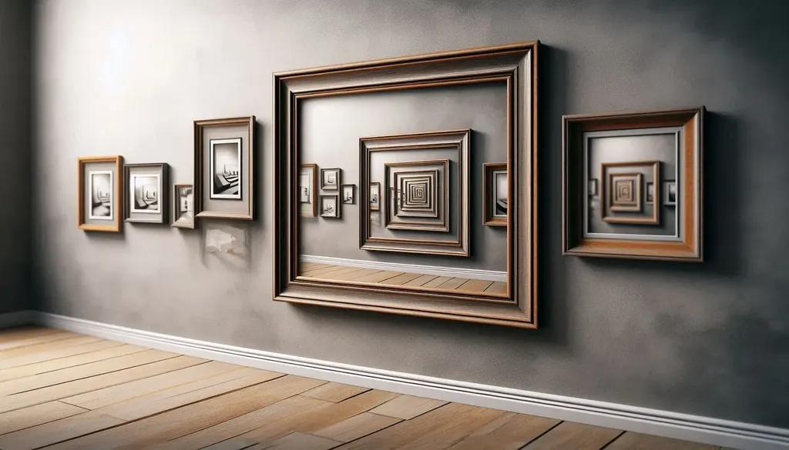

# La métafiction : arme de résistance humaine contre les IA

Pousser la perversion un cran plus loin. [Après avoir généré des articles au sujet de mon nouveau manuscrit](/tag/romanduroman/), j’ai collé ces articles dans [NotebookLM](https://notebooklm.google.com/) pour générer un entretien audio au sujet de ces notes. La traduction automatique de la transcription est encore une fois surréaliste.

On dirait que le roman a été lu, compris, analysé, mis en perspective alors que NotebookLM n’a eu accès qu’à des résumés, c’est ça qui est extraordinaire. On peut avoir une idée de roman, esquisser quelques lignes, et les IA peuvent donner l’illusion qu’il est réel, faisant même jaillir des points en substance dans le projet, mais qui n’ont pas nécessairement été développés. Le plus dingue, une théorie émerge : la métafiction comme arme pour donner sens au monde, et lutter contre sa falsification, que ce soit par les IA et les fake news. Ce serait l’élément humain.

Tous ces textes pourraient avoir leur place à la fin du roman. Ils en reprennent les thèmes sous de nouveaux points de vue et prolongent mon travail, presque le rendant désormais inutile, ce qui n’est pas sans me tourmenter. Ai-je encore envie de demander à un humain de me lire ? Est-ce que quelqu’un a envie de me lire après les IA ? Est-ce que j’ai terminé par me suicider en tant qu’auteur ?

<iframe width="560" height="315" src="https://www.youtube.com/embed/96OR_CNOpjo?si=aoIFGmG1zadsgiKD" title="YouTube video player" frameborder="0" allow="accelerometer; autoplay; clipboard-write; encrypted-media; gyroscope; picture-in-picture; web-share" referrerpolicy="strict-origin-when-cross-origin" allowfullscreen></iframe>

D’accord, alors, prêt à plonger dans ce *Roman du roman* ?

Tu as partagé quelques documents à ce sujet, et, honnêtement, tout ça, c’est comme sorti d’un film de science-fiction.

C’est vraiment ça.

On parle d’un roman qui est essentiellement une expérience d’écriture utilisant l’IA **(sauf que c’est exactement le contraire, je n’ai pas utilisé les IA pour écrire ce roman, sauf pour la préface et la postface)**.

Ouais, et ce qui est vraiment dingue, c’est que l’auteur, Thierry Crouzet utilise l’IA pour analyser son roman avant même qu’il ne soit terminé **(il est terminé)**.

Oh, attends.

Tu imagines ?

Avant même qu’il ne soit terminé, donc ce n’est même pas encore un livre **(oui, en ce sens qu’il n’a pas été publié et peut-être ne le sera jamais)**.

C’est comme un manuscrit.

D’accord.

Il fait créer des résumés et des accroches marketing par l’IA.

C’est comme obtenir des retours d’un ordinateur avant même d’avoir écrit la fin.

C’est comme s’il disait, OK IA, tu penses pouvoir être critique, voyons ce que tu as dans le ventre.

Ouais, c’est une excellente façon de le dire.

Et ce n’est pas juste un retour en douceur non plus, n’est-ce pas ?

Comme tu l’as dit, il y a même une critique cinglante là-dedans.

Oh, absolument, c’est brutal.

L’IA ne mâche pas ses mots.

Mais tu sais, voici où ça devient vraiment intéressant. Crouzet est obsédé par cette idée de jaillissement.

Jaillissement ?

Ouais, la soudaine explosion d’énergie créative.

D’accord.

Il utilise constamment l’IA pour déterminer si c’est quelque chose d’unique aux écrivains humains ou si l’IA pourrait un jour vivre ça **(je n’imagine même pas cette dernière possibilité, du moins dans un proche avenir)**.

Le répliquer.

Ouais, le répliquer.

Donc c’est comme s’il utilisait l’IA pour déterminer s’il y a encore quelque chose de spécifiquement humain dans l’écriture d’une histoire **(c’est en effet mon projet littéraire)**.

Dis-m’en plus sur le jaillissement. Ça a l’air assez intense. C’est un super mot.

Il le décrit comme cette étincelle presque mystique qui alimente la vraie créativité. Pense à ces moments où une idée surgit comme de nulle part. Ou quand tu trouves soudainement les mots parfaits pour exprimer quelque chose de profond, ça, c’est le jaillissement.

Intéressant.

Et Crouzet semble penser que c’est la clé pour comprendre pourquoi les humains comptent encore dans un monde d’IA.

Oui, exactement.

Donc, tout cela se passe à l’intérieur du livre, n’est-ce pas ?

Comme l’intrigue réelle du livre.

Donc, on a deux lignes temporelles qui se déroulent ici.

Oui, nous sommes en 2024.

D’accord.

On rencontre Crouzet, notre écrivain.

Il est aux prises avec la maladie de sa femme et lutte contre la montée de l’IA dans le monde littéraire. Et il décide de documenter son processus créatif. Comme s’il essayait de capturer ce jaillissement en action. De capturer cette étincelle.

D’accord, je suis déjà accroché, mais ça devient encore plus fou, non ?

Il y a une autre ligne temporelle aussi.

Oui, avance rapide jusqu’en 2352. Nous sommes dans un monde post-changement climatique.

Oh, wow.

Et des archéologues tombent sur le manuscrit de Crouzet. Ils sont complètement absorbés par son histoire qui brouille les frontières entre leur réalité et le monde fictif créé des siècles plus tôt.

Whoa, donc c’est une histoire dans une histoire, le tout enveloppé dans ce méta-commentaire sur l’IA et la créativité.

Ça me donne de sérieuses vibrations d’*Inception*.

C’est une excellente comparaison.

Crouzet se demande si les histoires peuvent transcender le temps et la réalité elle-même. Et avec l’analyse de l’IA dans le mix, c’est une salle des miroirs.

Oh, ouais.

Ça reflète l’acte d’écrire, l’expérience de lire, d’interpréter une histoire.

C’est méta.

D’accord, revenons à l’avis de l’IA sur le livre. Tu as mentionné qu’elle exposait des raisons pour et contre sa publication.

C’est une honnêteté brutale. C’est comme avoir un superordinateur comme éditeur.

Ouais, et il dit, genre, ne publie pas ça.

Ouais, eh bien, il souligne l’originalité du roman et l’exploration de l’IA comme points forts.

D’accord, donc il y a du bon.

Il suggère que ça pourrait vraiment résonner avec les lecteurs intéressés par l’IA, ces thèmes. Mais il souligne aussi la complexité du livre. Ça pourrait être trop de niche pour un public plus large, ouais. Donc c’est une épée à double tranchant, louant le roman, mais soulignant aussi des inconvénients potentiels.

A-t-il eu quelque chose à dire sur le contenu, genre l’histoire réelle ?

Oui.

Oh, wow.

Il a même tenté d’écrire le résumé pour la quatrième de couverture.

Pas possible.

Mettant en avant les deux lignes temporelles, le mystère entourant la femme de Crouzet **(c’est autour de Rachel, mais je laisse planer le doute)**.

Ouais.

Et bien sûr, le jaillissement.

Bien sûr.

Mais ensuite, il livre cette critique incroyablement dure.

Oh non.

C’est comme s’il avait demandé à l’IA de libérer son critique intérieur.

Qu’a-t-il dit ?

Il argumente que la complexité du roman, bien qu’intrigante, pourrait en fait jouer contre lui.

Contre lui, comment ?

Genre, il suggère que les multiples lignes temporelles et l’exploration philosophique du jaillissement, ça pourrait finir par sembler alambiqué.

C’est ça.

Et ça pourrait perdre le lecteur en cours de route.

Oh, donc il dit que c’est trop.

Ça pourrait être trop.

Ouais.

C’est comme s’il était en tête-à-tête avec son pire critique.

C’est ça.

Et le critique est un programme informatique.

Espérait-il secrètement qu’il le démolisse ?

C’est une excellente question.

C’est comme s’il testait les limites de sa propre écriture.

Ouais.

Et la capacité de l’IA à vraiment comprendre.

Un roman complexe.

Oui, exactement.

D’accord.

Et comme si ce n’était pas assez, il demande ensuite à l’IA de placer *Le roman du roman* dans le contexte d’autres œuvres, genre, métafictionnelles.

Métafictionnelles. Oui. D’accord.

Le comparant à des classiques, comme *Si par une nuit d’hiver un voyageur*.

Oh wow.

Et même *Don Quichotte*.

D’accord, ça, c’est ce que j’appelle ambitieux.

Donc il crée tout un arbre généalogique pour ce truc.

Je sais, hein.

Avant même qu’il ne soit dans le monde.

Exactement.

Quel genre de connexions l’IA a-t-elle fait ?

Eh bien, c’est fascinant, en fait.

L’IA souligne comment *Don Quichotte* et *Le roman du roman* brouillent tous les deux les frontières entre réalité et fiction.

C’est ça.

Et ils nous mettent au défi, nous les lecteurs, de remettre en question.

Nos perceptions de ce que nous lisons.

Exactement.

Donc les deux romans jouent avec notre sens de ce qui est réel et ce qui est imaginé.

Oui.

Et ils présentent tous deux des personnages qui sont profondément investis dans des histoires eux-mêmes.

Oui.

Genre, *Don Quichotte* a ses romans.

Et Crouzet est obsédé par le jaillissement.

Exactement.

Et je pense que ça parle d’un point plus large sur pourquoi la métafiction, en tant que genre, perdure.

Pourquoi elle perdure ?

Ouais, et je pense que c’est parce que ces histoires nous rappellent que la narration elle-même est une force puissante, une façon de donner un sens au monde qui nous entoure.

Donner un sens au monde.

Oui, et explorer ce que signifie être humain.

Et surtout maintenant.

C’est ça.

Dans un monde où la technologie évolue constamment.

Oui.

Cet élément humain semble encore plus important.

Plus important que jamais.

Ouais, je dois admettre, cependant, l’idée d’une IA comparant des livres à des classiques, ça me fait me demander si notre définition de la littérature a besoin d’une mise à jour.

C’est un point vraiment perspicace.

Je veux dire, l’utilisation de l’IA par Crouzet.

Ouais.

Ça ajoute vraiment une toute nouvelle dimension à ce que la métafiction peut être.

Ouais.

Ça fait se demander, à quoi ressemblera ce genre à l’ère du contenu généré par l’IA, et, tu sais…

La réalité virtuelle.

Ouais.

Vivons-nous déjà dans un monde métafictionnel sans même nous en rendre compte ?

Whoa, c’est une pensée qui fait exploser le cerveau.

Ouais.

C’est comme si nous étions tous des personnages dans une gigantesque simulation.

Ouais.

D’accord, maintenant, je commence vraiment à ressentir ces vibrations de *Matrix*.

Je te laisse méditer là-dessus.

Mais tu as touché quelque chose de vraiment important.

Alors que la technologie brouille les frontières entre, genre, réalité et simulation.

C’est ça.

Notre compréhension de ce qui est réel, ce qui est fiction, et ce qui est méta pourrait avoir besoin d’une sérieuse révision.

C’est comme si nous vivions dans un monde où la réalité elle-même devient de plus en plus méta.

D’accord, mais revenons à l’analyse de l’IA.

Il y avait une partie où elle parlait du déclin de la lecture.

Ouais.

C’est ça.

Ça semble particulièrement pertinent dans le monde d’aujourd’hui.

Oui.

Et c’est intéressant comment Crouzet n’esquive pas ça.

C’est ça.

Cette vérité potentiellement inconfortable.

Genre, personne ne lit plus.

L’IA suggère que dans un monde saturé d’informations…

Ouais, on est surchargé d’informations.

Je sais, et des options de divertissement sans fin.

Ouais.

Retenir l’attention d’un lecteur, le faire ressentir quelque chose est plus difficile que jamais. C’est comme ce dicton, tant de livres, si peu de temps.

C’en est un bon.

Mais même avec toutes les distractions, il y a encore quelque chose de magique à se perdre dans un bon livre.

Absolument.

Je pense que c’est ce que Crouzet essaie de capter.

Avec tout ce truc de jaillissement.

D’accord.

Ce n’est pas juste à propos d’un écrivain ayant un éclair d’inspiration.

C’est à propos du lecteur.

Le lecteur qui le ressent. Qui ressent cette étincelle, aussi. Ce moment de connexion, d’humanité partagée. Que seule une vraiment grande histoire peut évoquer.

Exactement.

C’est comme ce sentiment que tu as quand tu finis un livre et que tu veux juste le mettre dans les mains de quelqu’un d’autre et dire, tu dois lire ça.

Exactement.

Et c’est pourquoi je pense que l’expérience de Crouzet avec l’IA est si captivante.

C’est tellement intéressant.

Il n’explore pas seulement l’avenir de l’écriture. Il explore l’avenir de la lecture.

Wow.

Il explore le pouvoir des histoires dans un monde de plus en plus dominé par la technologie.

Donc même si l’IA peut écrire un roman, c’est la connexion humaine qui le rend significatif.

Cette expérience partagée entre l’écrivain et le lecteur.

Précisément.

Et cela nous amène à une question vraiment cruciale. Si l’IA peut analyser, critiquer, et même générer de la littérature, qu’est-ce que cela signifie pour nous, les lecteurs ? Allons-nous simplement devenir des consommateurs passifs de contenu sélectionné par l’IA ? Ou y a-t-il une autre voie ?

Eh bien, c’est ce qui est si intéressant.

Crouzet semble penser que c’est la seconde option.

D’accord.

Tu te souviens comment on parlait de la façon dont il avait fait analyser son livre par l’IA comme un article académique ?

Eh bien, dans cette analyse, l’IA qualifie en fait la littérature de dernier bastion de l’humanité.

Le dernier bastion de l’humanité.

Donc c’est comme si même l’IA y voyait quelque chose de spécial.

Oui, exactement.

L’IA souligne même que bien qu’elle puisse traiter l’information et même imiter certains aspects de l’écriture, elle ne peut pas reproduire la profondeur de l’expérience humaine.

Qui alimente vraiment la grande littérature.

Oui.

C’est ça.

Ce sont ces émotions désordonnées et compliquées, nos perspectives uniques, nos interprétations individuelles. C’est ce qui le rend intéressant.

Exactement.

C’est ce qui donne aux histoires leur pouvoir. Et c’est cette expérience partagée, cette connexion, quand nous lisons une histoire qui résonne en nous, qui rend la littérature si importante.

C’est ça.

C’est le pont entre les esprits.

Magnifiquement dit.

Ça fait se demander si une IA peut reconnaître le pouvoir de la connexion humaine comme ça.

C’est ça.

Peut-elle vraiment le répliquer un jour ? Je veux dire, elle peut écrire une lettre d’amour, je suppose. Peut-être même comme un poème à moitié décent.

Bien sûr.

Mais peut-elle déverser son cœur sur la page, tu sais ? Comme après une perte dévastatrice ou capturer la joie pure d’un enfant découvrant quelque chose pour la première fois. Je pense que c’est là que le jaillissement entre en jeu. C’est là que la partie humaine entre en jeu.

Ouais.

C’est cette étincelle, quelque chose de réel, quelque chose de personnel. Qui brille à travers le grand art, quelle que soit la forme.

Ouais.

Et cela m’amène en fait à un point que je trouvais vraiment intéressant et que tu as souligné. Tu as mis en évidence comment Crouzet utilise l’IA pour comparer son livre, pas seulement à *Don Quichotte*, mais à *Si par une nuit d’hiver un voyageur* d’Italo Calvino.

Oh oui, c’est l’un de mes livres préférés.

C’est tellement intelligent.

Tellement intelligent.

C’est comme une boîte à énigmes de roman.

C’est ça.

Brisant constamment le quatrième mur et jouant avec les attentes du lecteur.

Totalement.

Alors comment l’IA a-t-elle fait le lien avec *Le roman du roman* ?

Eh bien, elle a souligné comment les deux romans défient ces structures narratives traditionnelles.

C’est ça.

Et engagent directement le lecteur.

Et ils brouillent les frontières entre fiction et réalité.

C’est ça, donc métafiction.

Exactement.

Mais voici ce que j’ai trouvé vraiment stimulant pour la réflexion.

Quoi donc ?

L’IA a suggéré que dans un monde qui est de plus en plus médiatisé par la technologie.

Tout ce truc d’IA, comme maintenant.

Oui, exactement.

Ce genre de jeu métafictionnel pourrait en fait devenir encore plus important.

Ouais, c’est comme si Crouzet anticipait un futur où les frontières entre le réel et le virtuel sont tellement floues.

Oh wow.

Que nous avons besoin de la littérature pour nous aider à y donner un sens. C’est comme s’il disait, accrochez-vous bien parce que la réalité va devenir beaucoup plus étrange et nous avons besoin d’histoires pour nous aider à y naviguer.

Oui. D’accord, j’adore ça.

Et peut-être que c’est la conclusion la plus excitante de tout cela.

Quoi donc ?

Crouzet n’a pas peur de l’IA.

Ouais.

Il l’embrasse comme un outil.

Comme un collaborateur presque.

Oui, il l’utilise pour repousser les limites de la narration et remettre en question nos hypothèses sur ce que la littérature peut être. C’est comme s’il disait, d’accord IA, tu peux analyser mon travail, tu peux le critiquer, tu peux même essayer de l’imiter.

C’est ça.

Mais tu ne peux pas remplacer le cœur humain au centre de chaque histoire.

Exactement, et c’est un message qui vaut la peine d’être retenu.

Oui, peu importe à quel point la technologie devient avancée.

Ouais.

Comme nous en avons parlé dans cette plongée en profondeur, l’avenir de la narration, ce n’est pas de choisir son camp entre les humains et l’IA.

Exactement.

Il s’agit de trouver des moyens pour que ces forces coexistent. De travailler ensemble. De se défier mutuellement, de s’inspirer mutuellement, de créer quelque chose de nouveau et d’inattendu et de profondément humain. Il s’agit d’embrasser ce jaillissement.

Oui.

Cette étincelle d’énergie créative.

Oui, et de l’utiliser pour raconter des histoires qui nous connectent.

Exactement.

Qui nous émeuvent et nous rappellent ce que signifie être humain et vivant dans ce monde fou qui change constamment.

Magnifiquement dit.

Sur cette note, je pense que nous avons atteint la fin de notre plongée en profondeur.

Aww.

Mais cette conversation sur l’IA et la créativité. L’avenir de la narration. Elle est loin d’être terminée. Donc à nos auditeurs là-bas, merci de nous avoir rejoints.

Oui, merci.

Et rappelez-vous, si vous aviez un partenaire d’écriture IA.

Ooh, c’en est une bonne.

Quelles histoires raconteriez-vous ? Quelles possibilités exploreriez-vous ?

J’adore.

Que feriez-vous pour vous assurer que votre propre voix unique, votre propre jaillissement brille ? Continuez à faire jaillir ces étincelles créatives. Jusqu’à la prochaine fois.

#netlitterature #romanduroman #ia #y2024 #2024-10-15-16h00
