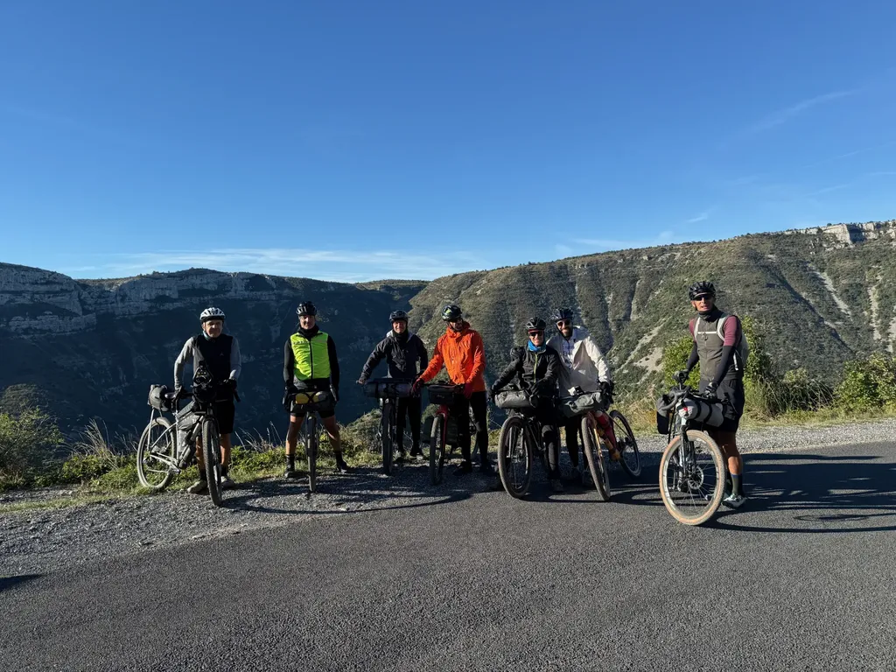
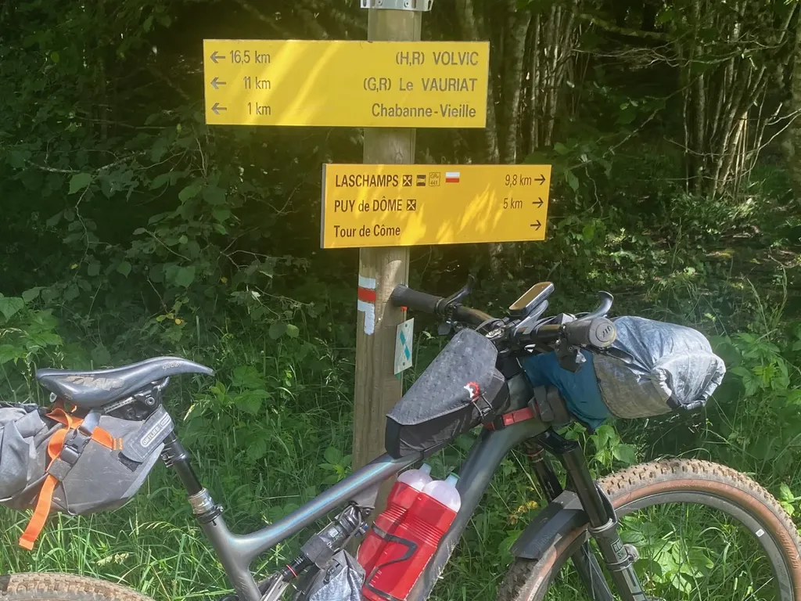

# Cintre droit ou moustache en gravel longue distance ?

Encore une fois, il ne s’agit pas ici de faire polémique, mais de raconter mon expérience, et de dire ce qui marche ou ne marche pas pour moi (et sans doute pour ceux qui pédalent dans le même état d’esprit que moi - pour le plaisir des sens et la fraternité, non pour la performance). Je sors du [g727 2024](g727-2024.md), effectué sur un monster gravel, plus détruit que par tous mes autres bikepacking effectués à VTT, souvent sur de plus longues distances et des difficultés plus grandes.

Si je roule en gros 6 000 km/an à VTT, 5 000 km/an gravel, c’était la première fois que je m’engageais sur un parcours gravel de 727 km et 10 000 de D+ avec un vélo à cintre moustache, [en l’occurrence, un VTT semi-ride transformé en monster gravel](https://tcrouzet.com/2024/09/04/monster-gravel/).

### Pourquoi pas un pur gravel

Je n’aurais pas attaqué le g727 avec mon Canyon Grizl : dès que je dépasse les 120 bornes, il me provoque des douleurs aux épaules, insupportables au-delà de 160 bornes. Je parle de parcours gravel par chez nous dans le Midi, où on va très peu sur l’asphalte (35 % tout au plus), où les chemins ne sont pas toujours des billards (et on aime ça), où les cailloux croisés sont autant de petits chocs répercutés dans toute la carcasse.

Il en allait de même quand je roulais sur un Diverge, même sur des 100 miles aux USA. La suspension Future Shock ne le rendait pas plus confortable que le Grizl qui accepte des pneus plus généreux, les pneumatiques restant, à mon sens, un des éléments clés pour le confort d’un gravel.

J’ai 61 ans, c’est à prendre en compte. Mais les copains de 10 ou 20 ans de moins font souvent le même constat : dès que les distances s’allongent, le gravel tape dans le corps beaucoup plus qu’un VTT. Il y a bien sûr des cyclistes qui encaissent mieux, comme le Grand Will qui a promené son Crux dans le g727 (mais il n’aurait pas craché sur un tout suspendu — il est mûr).

Ce n’est pas que le g727 soit extrêmement difficile. Il y a certes des passages rugueux, certains dûs aux intempéries, d’autres à des trous de mémoire, et j’ai déjà corrigé la trace, mais Will nous disait que la [Basajaun](https://www.transiberica.club/basajaun/) en Espagne était une épreuve gravel beaucoup plus chaotique. J’ai pas roulé la [Gravel Tro Breizh](https://erminig.cc/epreuves/la-gravel-tro-breizh/), mais il paraît qu’elle est pas mal dans son genre. Le g727 n’a donc rien d’extrême dans le paysage gravel. Une trace plus soft m’aurait provoqué moins de douleurs, certes, mais toute trace gravel digne de ce nom m’aurait malmené (pour moi, une trace est gravel s’il y a beaucoup plus de terre que d’asphalte — le but étant de fuir loin dans la nature).

Si, sur les sorties à la journée, j’apprécie le dynamisme du gravel, tout cela s’estompe quand la fatigue s’installe et que je dois m’économiser pour les jours suivants. Même les compétiteurs les plus aguerris arrivent au même constat sur les ultras de référence, comme la Tour Divide, gagnée cette année par [Justinas Leveika](https://bikepacking.com/news/justinas-leveika-wins-2024-tour-divide/) sur un tout-suspendu, alors que c’est typiquement un parcours gravel (en prime, il a pulvérisé le record de Mike Hall).

Quand on roule très vite sur piste, ou qu’on fonce en descente comme j’aime le faire, le moindre caillou rencontré devient un obstacle, alors il faut augmenter la section des pneus pour ne pas meurtrir le corps, voire ajouter des suspensions (ou descendre sur les freins ce qui devient du masochisme). Un gravel pour la nature et les grands espaces, même pour des sorties à la journée, surtout aventureuses et exploratrices, doit donc selon moi accepter à minima des pneus de 50 mm, voire posséder une suspension digne de ce nom.

### Côté vélo

J’adore mon monster avec ses pneus en 50 mm. Très fun à piloter, bon rendement, avale les imperfections du terrain grâce à la fourche hydraulique de 120 mm. Beaucoup plus confortable que mon Grizl, même poids, et tout aussi dynamique, même plus grâce à des roues plus haut de gamme. J’ai réussi à enchaîner les journées du g727 mieux qu’avec un gravel. Ça ne fait aucun doute, mais c’était loin d’être parfait.

### Côté bonhomme

Dès le premier soir, fourmis persistantes à l’index gauche (et elles restent présentes après deux jours de repos), ampoules dans la paume des mains, mal aux cervicales et aux épaules… Rien de rédhibitoire, mais je n’ai jamais rien ressenti de comparable sur le même vélo équipé d’un cintre plat. Pire, j’ai eu de plus en plus mal au cul, alors que j’utilise la même selle que par le passé. J’ai craqué le dernier jour et j’ai terminé en train (aussi parce que je revenais à la maison et connaissais trop bien les moindres détours).

Je n’ai cessé de me dire que je me faisais du mal avec ce cintre moustache, sans rien y gagner finalement, sinon de répondre à la mode du gravel (et ne me parlez pas de position, j’ai justement fait une étude posturale gravel et je suis positionné au mieux pour mon corps). En plus, je ne roule pas assez vite pour profiter d’un quelconque avantage aérodynamique. J’étais jaloux des copains qui avaient choisi un VTT et j’ai alors compris qu’à l’avenir je ne roulerai plus en bikepacking qu’avec un VTT, peu importe le parcours, mon but étant d’aller loin et longtemps, le confort étant alors l’élément primordial à prendre en compte (entre mon Grizl et mon tout-suspendu il n’y a qu’un kilo d’écart).

### Idée reçue

Le cintre moustache serait mieux pour les ultras parce qu’il offre trois positions pour les mains : sur les cocottes, en bas, à l’intérieur. En pratique sur les parcours gravel comme le g727, je passe 95 % du temps sur les cocottes, je ne vais en bas que très rarement, et à l’intérieur encore moins souvent (ceux qui avaient des prolongateurs de triathlète ne les ont quasiment jamais utilisés). OK, tout ça parce que je suis un vététiste, que je ne viens pas de la route, que le cintre moustache n’est pas gravé dans mon ADN. Je conçois qu’un routier soit beaucoup plus à l’aise sur un cintre moustache (je connais des routiers qui se font aussi défoncer les cervicales par les cintres moustache des gravel).

Mais les cintres plats équipés d’inner bars SQLab offrent aussi trois positions : poignées saisies à pleines mains (mains à l’horizontale), à cheval sur les inner bars (mains à 45°), inner bars saisies à pleines mains (mains verticales). Ils peuvent même en offrir une quatrième à l’intérieur. Je trouve les trois premières positions tout aussi confortables et je ne cesse de basculer entre elles, ce qui évite les problèmes subis sur le cintre moustache.

Par ailleurs, varier l’écartement de mes bras en fonction de ces positions m’aide à détendre mes épaules, ce qui contribue à me détendre dans tout le corps, jusqu’à mon fondement. De même, les différentes positions impliquent une rotation des avant-bras que je trouve très bénéfique.

Bien-sûr j’aime relancer avec mon cintre gravel. Il dynamise le pilotage et le vélo, mais tout cela ne fait aucun sens sur les ultras où je cherche à économiser mes forces et évite les excès. Je n’utilise jamais mon cintre gravel pour foncer à 40 km/h ou pour sprinter à la poursuite des copains.

### Avantage du cintre plat

En bikepacking, on peut y accrocher un sac plus long, ce qui permet de réduire le volume du sac de selle, et donc de mieux équilibrer le vélo, ce qui reste fondamental quand on emprunte des sentiers et veut conserver un vélo agréable à piloter.

### Avantage du tout-suspendu

Il absorbe mieux les chocs à l’avant et à l’arrière. Les amortisseurs trinquent avant le pilote. J’ai toujours moins mal aux fesses sur un tout-suspendu.

### Conclusion

Je réserverai le gravel aux sorties à la journée, le tout-suspendu au pur VTT, mais aussi au bikepacking. Sur [le g727 2025](https://727bikepacking.fr/g727-Grand-Depart/), je monterai des pneus gravel de 50 mm sur le tout-suspendu, je remplacerai la tige de selle télescopique par une tige de selle carbone, gagnant ainsi presque un kilo, pour arriver à un vélo de moins de 10 kg. Beaucoup de gravellistes roulent avec des vélos plus lourds, tout en prenant moins de plaisir en descente.

Nous sommes peut-être en train de sortir de la mode du tout rigide. Peu à peu, les vélos trouvent la place où ils sont les plus efficaces au regard des desiderata des cyclistes. En bikepacking, mon crédo est simple : confort, confort, confort… même sur les traces gravel les plus douces (où je ne vais pas parce que je m’y emmerde). Après, si pour vous ça passe avec un vélo bout de bois, tant mieux pour vous. Perso, je ne suis pas maso.

#velo #bikepacking #gravel #y2024 #2024-10-4-12h00
