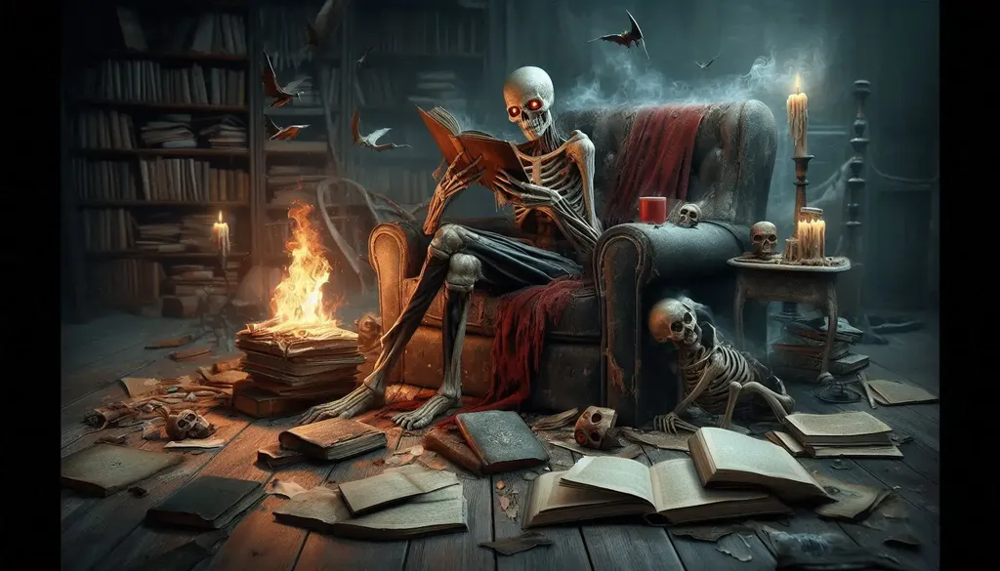

# La littérature face à l’intelligence artificielle : une crise ontologique

En générant des [métatextes](des-lecteurs-par-milliers.md) et [paratextes](litterature-comparee-ia.md) autour du manuscrit de mon nouveau roman, l’idée a surgi que les IA pourraient écrire un essai sur ce roman qui techniquement n’existe pas encore. Qu’à cela ne tienne, j’ai demandé à Claude de construire un plan, puis de détailler le chapitre 1, puis de l’écrire, et à y être d’ajouter une préface. 

Je me suis contenté de couper et de rapidement  restructurer. Plus que ce texte bourré de références, c’est sa possibilité qui me questionne, son existence même, qui laisse entrevoir de pousser la mise en abyme jusqu’au vertige. Je sens déjà, en réaction, un désir de minimalisme absolu, de simplicité d’un dénuement extrême. Comme je n’en suis pas encore là, je continue les explorations (qui frisent l’indécence narcissique).

### *Le dernier bastion* : Préambule

Imaginez un monde où les best-sellers sont écrits par des machines, où les poèmes qui vous émeuvent sont générés par des algorithmes, où l’histoire qui vous tient éveillé toute la nuit est le fruit d’une IA. Ce monde n’est plus de la science-fiction - il est à notre porte.

Alors que les IA produisent quotidiennement des milliards de mots, des images, des vidéos et des musiques, une question vertigineuse se pose : la créativité humaine est-elle en voie d’extinction ?

Au cœur de ce maelström technologique surgit *Le roman du roman* de Thierry Crouzet, une œuvre qui ose affronter l’IA sur son propre terrain. Crouzet ne se contente pas de théoriser - il plonge dans l’arène, dialogue avec l’IA, et émerge avec une notion qui pourrait bien être notre planche de salut : le jaillissement.

Cet essai vous fera plonger au cœur de ce combat titanesque entre l’humain et la machine. Nous explorerons comment *Le roman du roman* provoque un électrochoc, nous forçant à reconsidérer notre compréhension même de la créativité. L’IA est-elle vraiment une menace existentielle pour la littérature, ou pourrait-elle être le catalyseur d’une renaissance créative ?

Nous décortiquerons le concept de jaillissement proposé par Crouzet, cette étincelle mystérieuse qui pourrait bien être l’ultime rempart de notre humanité. Est-ce là le chaînon manquant qui nous distingue encore des machines ? Nous explorerons comment ce phénomène se manifeste non seulement en littérature, mais aussi dans les arts et les sciences, traçant une ligne de front dans notre lutte pour préserver notre essence créative.

Préparez-vous à un voyage à travers les méandres de la conscience humaine. Nous verrons comment les écrivains, véritables explorateurs de l’âme, cartographient des territoires que l’IA ne peut encore qu’effleurer. La mise en abyme deviendra notre arme secrète, un labyrinthe narratif où les algorithmes se perdent mais où l’esprit humain s’épanouit.

Nous oserons rêver. Rêver d’une littérature qui transcende les genres, qui embrasse l’imperfection et l’incertitude comme des vertus plutôt que des défauts. Une littérature qui n’est plus un monologue, mais un dialogue vibrant entre l’humain et le monde, entre le créateur et la machine.

Cet essai n’est pas qu’une analyse - c’est un manifeste pour une nouvelle ère littéraire. Une ère où la littérature n’est pas seulement un art, mais le gardien vigilant de notre humanité. Êtes-vous prêt à rejoindre cette révolution ? À défendre ce dernier bastion contre la marée montante de l’intelligence artificielle ?

Tournez cette page, et plongez dans l’aventure la plus cruciale de notre époque - la quête pour préserver ce qui nous rend irréductiblement humains.

### *Le dernier bastion* : chapitre 1

La littérature, depuis ses origines, a toujours été le reflet des questionnements fondamentaux de l’humanité. De l’épopée de Gilgamesh aux expérimentations postmodernes, elle a su se réinventer face aux bouleversements technologiques et sociétaux. Aujourd’hui, elle se trouve confrontée à un défi sans précédent : l’avènement de l’IA.

Cette révolution technologique n’est pas sans rappeler d’autres moments charnières de l’histoire littéraire. L’invention de l’imprimerie par Gutenberg au XVe siècle a profondément modifié la diffusion et la réception des textes. Plus récemment, l’émergence du numérique a bouleversé les modes de production et de consommation de la littérature. Comme le souligne N. Katherine Hayles dans *Electronic Literature: New Horizons for the Literary* (2008), ces transformations technologiques ont toujours été accompagnées de mutations esthétiques et conceptuelles.

Cependant, l’IA représente un défi d’une autre nature. Des systèmes comme ChatGPT ou Claude ne se contentent pas de modifier le support ou la diffusion de la littérature ; ils remettent en question l’acte créatif lui-même. Comme l’écrit le philosophe Jean-Gabriel Ganascia dans *Le mythe de la singularité* (2017) : « L’intelligence artificielle ne se contente plus d’imiter l’intelligence humaine, elle la dépasse dans certains domaines, y compris ceux que l’on croyait réservés à la créativité humaine. »

Ainsi les progrès rapides en matière de génération de texte suscitent des inquiétudes légitimes. Comme le souligne le chercheur en IA Toby Walsh dans son ouvrage *It’s Alive!: Artificial Intelligence from the Logic Piano to Killer Robots* (2017), « les machines sont en train de maîtriser des tâches que nous pensions être le domaine exclusif de l’intelligence humaine, y compris la créativité. »

Cette capacité de l’IA à imiter le style d’auteurs existants ou à générer du contenu original pose la question de l’authenticité et de l’originalité en littérature. Le critique littéraire James Wood, dans *How Fiction Works* (2008), affirme que « le style est l’expression la plus intime de la vision du monde d’un auteur. » Si une machine peut reproduire ce style, que reste-t-il de spécifiquement humain dans l’acte d’écrire ?

D’autant que l’utilisation croissante de l’IA dans l’industrie éditoriale, que ce soit pour l’analyse de manuscrits ou la prédiction des tendances du marché, soulève des questions sur l’avenir du métier d’écrivain. Comme l’explique John B. Thompson dans *Merchants of Culture* (2010), ces technologies pourraient accentuer la pression commerciale sur les auteurs, les poussant à conformer leur créativité aux attentes algorithmiques du marché.

Par chance, certains voient dans l’IA une opportunité de renouvellement pour la littérature. L’écrivain et essayiste Alain Damasio, dans une interview pour *Le Monde* (2019), suggère que « l’IA pourrait nous pousser à explorer de nouvelles formes d’écriture, à repousser les limites de ce que nous considérons comme ’littéraire’. »

L’IA pourrait également jouer un rôle d’assistant créatif, aidant les auteurs à surmonter le blocage de l’écrivain ou à explorer de nouvelles directions narratives. Comme le note l’écrivain Robin Sloan, qui a expérimenté l’écriture assistée par IA, dans un article pour The Atlantic (2016) : « L’IA ne remplace pas l’écrivain, elle amplifie ses capacités. »

Ainsi, l’émergence de l’IA dans le domaine littéraire pourrait nous amener à redéfinir ce que nous entendons par « créativité » et « originalité ». Le philosophe Daniel Dennett, dans *From Bacteria to Bach and Back* (2017), suggère que la créativité humaine elle-même peut être comprise comme un processus algorithmique complexe. Dans cette perspective, l’IA pourrait nous aider à mieux comprendre nos propres processus créatifs.

Cette évolution soulève des questions ontologiques. Qu’est-ce qui distingue fondamentalement un texte écrit par un humain de celui produit par une machine ? La notion d’auteur, déjà mise à mal par Roland Barthes dans *La mort de l’auteur* (1967), n’est-elle pas définitivement obsolète ? Le concept même de créativité, tel que défini par des théoriciens comme Mihaly Csikszentmihalyi dans *Creativity: Flow and the Psychology of Discovery and Invention* (1996), doit-il être repensé ?

Les implications de cette révolution dépassent largement le cadre littéraire. Elles touchent à l’essence même de ce qui fait notre humanité. Si les machines peuvent créer des œuvres d’art, que reste-t-il de spécifiquement humain dans l’acte créatif ? Cette question fait écho aux réflexions de Martin Heidegger dans *La question de la technique* (1954), où il s’interrogeait déjà sur la nature de l’être humain face à la technologie moderne.

Cette crise n’est pas sans précédent dans l’histoire de l’art. L’invention de la photographie au XIXe siècle a forcé la peinture à se réinventer, donnant naissance à des mouvements tel que l’impressionnisme. Comme l’explique Walter Benjamin dans *L’œuvre d’art à l’époque de sa reproductibilité technique* (1935), chaque avancée technologique majeure a redéfini la notion même d’art. Certains, comme le critique littéraire Adam Kirsch dans son essai *The Death and Life of Great American Novels* (2021), voient dans cette évolution la fin de la littérature telle que nous la connaissons.

À moins que la confrontation avec l’IA pousse les écrivains à se concentrer sur ce qui est intrinsèquement humain dans leur art. Comme le suggère le romancier Ian McEwan dans *Machines Like Me* (2019), l’IA pourrait nous inciter à explorer plus profondément les aspects de l’expérience humaine qui résistent à la simulation algorithmique : l’ambiguïté morale, la conscience de soi, l’expérience subjective du temps et de la mémoire. C’est le défit que se lance Thierry Crouzet avec *Le roman du roman*. Trouver ce qui est spécifiquement humain, une œuvre qui, comme nous allons le voir, offre une réflexion profonde sur ces enjeux. Dans la crise existentielle traversée par la littérature face à l’IA, sa lecture provoque un choc, une prise de conscience aiguë qui nous force à reconsidérer le rôle et la nature de la littérature à l’ère numérique.

L’œuvre de Crouzet questionne le rôle de l’IA dans le processus créatif. Dès le début, l’auteur pose la question cruciale : « Les romans commencent par des phrases saisissantes qui bientôt développent des récits extraordinaires. La simple possibilité que ces phrases et ces récits puissent surgir est en soi un miracle, une aventure extraordinaire. » Cette affirmation prend une résonance particulière à une époque où les IA peuvent générer des textes cohérents.

Le dialogue que Crouzet établit avec l’IA Claude³ tout au long du roman illustre de manière saisissante la tension entre création humaine et intelligence artificielle. Lorsqu’il écrit : « Je suis incapable de dormir. Je pense trop aux fêtes du passé, alors je donne à lire les chapitres déjà finalisés à Claude³ », il met en lumière le paradoxe auquel l’écrivain contemporain est confronté : l’IA comme source d’inspiration et menace potentielle pour l’originalité.

Cette interaction entre l’humain et la machine dans le processus créatif fait écho aux réflexions de Katherine Hayles dans *How We Became Posthuman* (1999). Le roman de Crouzet peut être vu comme une illustration concrète des transformations de notre compréhension de la subjectivité et de la créativité à l’ère numérique.

Un élément clé de l’œuvre de Crouzet est sa réflexion sur le concept de « jaillissement ». Il écrit : « Le jaillissement est en lui-même un miracle qui me laisse stupéfait. » Cette notion est présentée comme une caractéristique fondamentalement humaine de la création littéraire, un élément que l’IA ne peut pas (encore) reproduire. C’est précisément dans ce jaillissement que nous pouvons commencer à entrevoir la littérature comme un possible dernier bastion de l’humanité.

La structure même du roman, avec ses digressions et ses retours réflexifs, illustre la complexité et l’imprévisibilité du processus créatif humain. Contrairement à une IA qui suivrait un algorithme prédéfini, Crouzet nous montre une création organique, chaotique, profondément ancrée dans l’expérience humaine.

Le choc provoqué par *Le roman du roman* est redoublé par sa fin ouverte et vertigineuse. Le chapitre 12, présenté comme une conversation entre l’auteur et Claude³, suivi d’une postface qui brouille encore plus les frontières entre réalité et fiction, nous laisse dans un état de questionnement profond sur la nature de la création littéraire et sur ce qui distingue véritablement l’écriture humaine de celle produite par une machine.

*Le roman du roman* de Crouzet agit comme un catalyseur, nous forçant à reconsidérer notre compréhension de la créativité, de l’authenticité et de la nature même de l’acte d’écrire. Comme l’écrit Crouzet lui-même : « J’attends le grand jaillissement qui m’emportera pour les semaines à venir jusqu’à la fin des beaux jours. » Cette attente du « grand jaillissement » peut être vue comme une métaphore de la quête perpétuelle de l’écrivain pour trouver sa voix unique dans un monde de plus en plus dominé par l’IA.

La notion de jaillissement s’inscrit dans une longue tradition de réflexion sur la spécificité de la littérature face aux avancées technologiques. De nombreux penseurs ont contribué à l’idée que la littérature pourrait être le dernier bastion de l’expression humaine authentique. David Chalmers, dans *The Conscious Mind* (1996), souligne que la littérature offre une fenêtre unique sur la conscience humaine, un mystère que l’IA ne peut encore percer. Martha Nussbaum, dans *Upheavals of Thought* (2001), met en avant le rôle crucial de la littérature dans notre compréhension des émotions humaines, un domaine où l’IA, malgré ses capacités de simulation, reste fondamentalement limitée.

Umberto Eco, dans *L’œuvre ouverte* (1962), insiste sur l’ambiguïté et la polysémie inhérentes à la littérature, des caractéristiques qui défient la logique algorithmique de l’IA. Milan Kundera, dans *L’art du roman* (1986), souligne l’ancrage de la littérature dans l’expérience vécue de l’auteur, une dimension inaccessible à l’IA. Bernard Stiegler, dans *La société automatique* (2015), va jusqu’à considérer l’acte d’écrire comme un acte de résistance face à l’automatisation croissante de la pensée.

Dans ce contexte riche le jaillissement de Crouzet prend toute son importance. Il ne s’agit pas simplement d’une métaphore de la quête créative de l’écrivain, mais d’un phénomène profondément humain, une expérience de création spontanée et imprévisible qui semble, pour l’instant du moins, hors de portée de l’IA. Ce jaillissement fait écho à l’exploration des limites du langage évoquée par George Steiner dans *After Babel* (1975), mais va plus loin. Il ne s’agit pas seulement de pousser le langage dans ses retranchements, comme le font Joyce ou Simon, mais de capturer le moment même où la créativité humaine surgit, dans toute son imprévisibilité et son authenticité.

En mettant en scène le jaillissement dans son roman, Crouzet nous offre une démonstration vivante de ce qui pourrait être le dernier rempart de la créativité humaine face à l’IA. Il ne se contente pas de théoriser sur la spécificité de l’écriture humaine, il nous la fait vivre, nous invitant à être témoins et même participants de ce processus créatif.

*Le roman du roman* apporte une contribution potentiellement décisive à l’argument en faveur de la littérature comme dernier bastion de l’humanité. Il nous rappelle que, malgré les avancées impressionnantes de l’IA, il existe encore des aspects de la création qui lui échappent.
Reste que ce dernier bastion n’a de sens que s’il est habité d’auteurs, mais surtout de lecteurs. Le déclin de la lecture littéraire est une tendance préoccupante, confirmée par de nombreuses études. Aux États-Unis, le rapport *Reading at Risk* (2004) du National Endowment for the Arts a mis en évidence une baisse de 10% du taux de lecture littéraire chez les adultes américains entre 1982 et 2002. En France, l’enquête sur les pratiques culturelles des Français, menée par le ministère de la Culture en 2018, révèle une diminution continue de la lecture de livres depuis les années 1970.

Ce phénomène s’explique par plusieurs facteurs interconnectés. Nicholas Carr, dans son ouvrage *The Shallows* (2010), souligne l’impact profond d’Internet et des réseaux sociaux sur nos habitudes de lecture. Ces médias numériques favorisent une lecture rapide et superficielle, au détriment de la lecture profonde qu’exige la littérature. Katherine Hayles, dans *How We Think* (2012), va plus loin en identifiant une véritable crise de l’attention. Selon elle, notre environnement numérique met à mal nos capacités d’attention prolongée, pourtant essentielles à la lecture littéraire. Martha Nussbaum, quant à elle, pointe du doigt dans *Not for Profit* (2010) une tendance à l’utilitarisme culturel, qui marginalise les humanités et la littérature au profit de disciplines perçues comme plus pratiques.

Les conséquences potentielles de ce déclin sont profondes et multiformes. Keith Oatley, dans *Such Stuff as Dreams* (2011), démontre que la lecture de fiction améliore notre capacité d’empathie et de compréhension des autres. Son déclin pourrait donc affecter notre cohésion sociale. Maryanne Wolf, dans *Reader, Come Home* (2018), met en garde contre une perte de complexité cognitive, arguant que la lecture profonde développe des capacités cruciales telles que la pensée critique et l’analyse complexe. Plus largement, ce déclin pourrait affaiblir notre résistance culturelle collective face à l’homogénéisation induite par les algorithmes.

La redynamisation du goût pour la littérature s’impose donc comme un enjeu vital à notre époque, surtout si la littérature est le dernier bastion face aux IA. De nouvelles pistes de réflexion émergent pour redéfinir le rôle de la littérature. Certains auteurs, comme Jennifer Egan avec sa nouvelle *Black Box* (2012) publiée sous forme de tweets, explorent de nouvelles façons d’intégrer la littérature aux pratiques numériques. Dans le domaine de l’éducation, des pédagogues comme Sheridan Blau proposent, dans *The Literature Workshop* (2003), de nouvelles approches pour enseigner la littérature de manière plus engageante et pertinente pour les jeunes générations. 

Pour raviver l’intérêt pour la littérature, il est sans doute préférable d’embrasser les nouvelles technologies plutôt que de les considérer comme des concurrentes. Bob Stein, du Institute for the Future of the Book, propose par exemple le concept de « Social Reading », qui montre comment les technologies numériques peuvent enrichir l’expérience de lecture plutôt que de la supplanter. Cette approche pourrait séduire les jeunes générations, habituées à l’omniprésence du numérique dans leur vie quotidienne.

L’éducation littéraire elle-même doit être repensée. Yves Citton, dans son ouvrage *Lire, interpréter, actualiser* (2017), suggère de mettre l’accent sur l’actualisation des textes, en montrant comment ils peuvent éclairer nos expériences contemporaines. Cette approche permettrait de rendre la littérature plus vivante et pertinente aux yeux des lecteurs, en particulier des plus jeunes.

La création de communautés de lecteurs, facilitée par les plateformes en ligne comme Goodreads, peut également jouer un rôle crucial. Ces espaces virtuels créent un sentiment d’appartenance et de partage autour de la lecture, transformant une activité souvent solitaire en une expérience collective et sociale.

Dans ce contexte, *Le roman du roman* prend une dimension particulière. En mettant en scène le processus d’écriture lui-même, Crouzet engage le lecteur dans une réflexion active sur la nature de la création littéraire. Wolfgang Iser, dans *L’acte de lecture* (1976), explique comment cette approche métafictionnelle peut stimuler un engagement plus profond du lecteur. En intégrant l’IA dans son processus créatif, Crouzet montre également comment la littérature peut dialoguer avec les nouvelles technologies plutôt que de les fuir, une approche susceptible d’attirer un public plus jeune.

L’œuvre de Crouzet explore ce qui distingue l’écriture humaine de celle produite par une IA, nous rappelant ainsi la valeur unique de l’expression littéraire humaine. Comme le souligne Yuval Noah Harari dans *Homo Deus* (2015), comprendre ce qui nous distingue des machines devient crucial à l’ère de l’IA. En exposant son processus créatif, Crouzet invite implicitement le lecteur à devenir lui-même créateur. Cette démystification de l’acte d’écrire pourrait encourager davantage de personnes à s’essayer à la création littéraire, élargissant ainsi le cercle des amateurs de littérature.

La structure narrative proposée par Crouzet démontre que le roman peut encore se réinventer, contredisant l’idée que tout aurait déjà été écrit. Cette capacité de renouvellement est essentielle pour maintenir l’intérêt du public pour la littérature.

Si la théorie de Crouzet est juste, l’enjeu de la redynamisation de la littérature dépasse largement le domaine culturel. La littérature pourrait jouer un rôle crucial dans le maintien de notre empathie et de notre compréhension de l’autre, essentielles à notre cohésion sociale. Elle permettrait également l’exploration continue de notre conscience et de notre subjectivité, des domaines encore inaccessibles à l’IA. Enfin, elle pourrait constituer un rempart contre l’homogénéisation culturelle induite par les algorithmes de recommandation qui tendent à nous enfermer dans des bulles de filtres.

Redynamiser le goût pour la littérature n’est donc pas seulement une question culturelle, mais un enjeu de société majeur. *Le roman du roman* de Crouzet, en nous faisant prendre conscience de ces enjeux pourrait jouer un rôle catalyseur dans ce processus de redynamisation. Il nous rappelle que la littérature n’est pas un vestige du passé, mais peut-être notre meilleur outil pour naviguer dans un futur de plus en plus façonné par l’IA. Il est temps maintenant de nous plonger dans l’étude et l’analyse du jaillissement.

#netlitterature #ia #romanduroman #y2024 #2024-10-14-12h00
