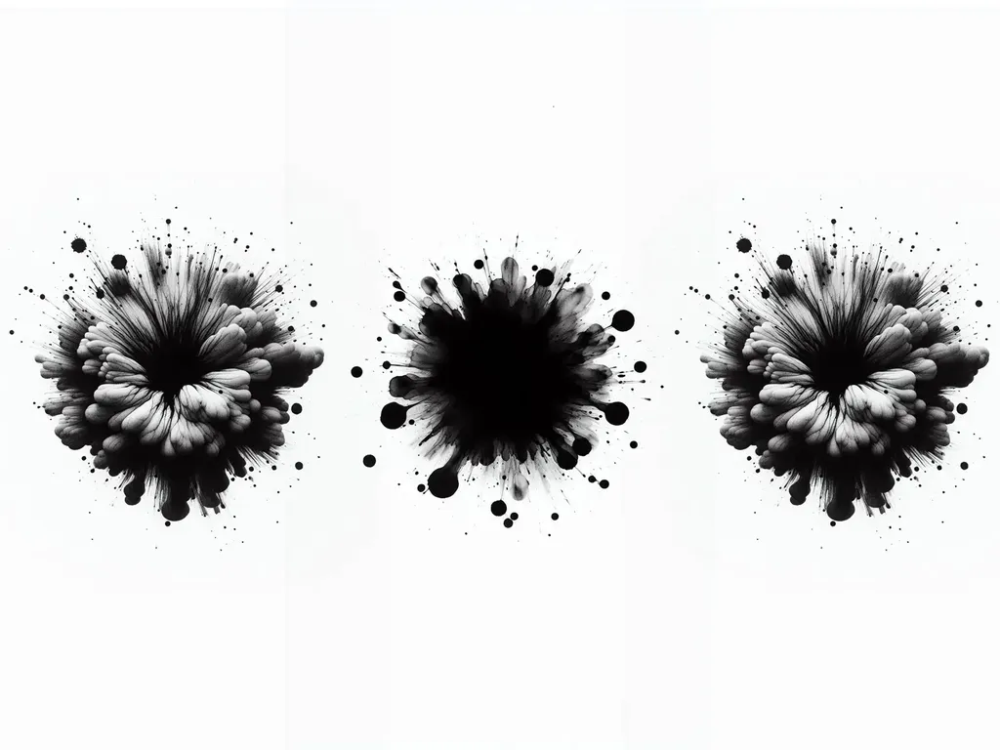

# Littérature comparée par IA interposée

Lorsque j’ai généré [les métatextes autour du *Roman du roman*](vendre-un-roman.md), Claude a estimé que « le texte pourrait être comparé défavorablement à d’autres œuvres métafictionnelles célèbres. »

Si j’avais écrit un polar, Claude aurait pu déclarer : « le texte pourrait être comparé défavorablement à d’autres polars célèbres. » Cette possibilité pend toujours au nez des auteurs (et la remarque de Claude est donc mécanique, ce qui n’est pas une surprise).

Reste que, oui, un texte peut toujours être comparé à d’autres, travail souvent abandonné par les auteurs aux critiques, éventuellement aux universitaires, alors que, pratiqué en amont de la publication, il pourrait éclairer le texte sous un jour imprévu. J’avoue que je suis incapable d’écrire sans me situer dans l’histoire littéraire, du moins dans la minuscule partie dont je suis informé.

Dès que je sens qu’un autre est passé par là, je me détourne de son chemin (et si je suis une trace déjà ouverte, c’est malgré moi, parce que je manque de culture). Aujourd’hui, les IA peuvent suppléer à ce manque de culture littéraire des auteurs (qui peut-être n’a jamais été aussi flagrant). C’est ce que j’entends dans la remarque de Claude.

Au début, dans *Le roman du roman*, j’ai voulu écrire le roman en deçà du roman, le roman merveilleux de la création. Je le voulais comme un roman qui raconterait au plus près ce qu’était qu’écrire un roman — ce roman étant lui-même. J’étais donc dans la dimension métatextuelle, mais pas encore métafictionelle. Plus j’ai avancé, plus j’ai senti que ce projet devait aboutir au jaillissement d’une idée de roman « classique » et, finalement, au cours d’un brainstorming avec Claude, j’ai eu l’idée d’écrire l’histoire de la découverte du *Roman du roman* par des archéologues du futur, ce qui m’a fait entrer de plain-pied dans la métafiction.

J’étais conscient de m’engager dans une tradition littéraire riche, donc compétitive, en même temps qu’impopulaire, puisque seulement une minorité des auteurs l’adoptent, la grande majorité versant vers le postulat réaliste et non réflexif (un postulat que je n’ai jamais réussi à assumer — que la plupart assument sans même l’avoir questionné, comme s’il existait une seule façon d’écrire des romans — une norme romanesque).

J’ai donc demandé à Claude de poursuivre le travail réflexif et de situer mon nouveau roman dans l’histoire littéraire métafictionnelle, conscient que tous mes articles de blog paratextuels pourraient à leur tour être ajoutés au roman, que le roman lui-même pourrait finir par être oublié pour que ne subsistent que les conversations qu’il a provoquées (dans mon histoire, Rachel est la métaphore de ce processus de disparition de l’élément déclencheur — je reviens sur tout ça à la fin de cet article).

### Première analyse de Claude

La métafiction est un genre littéraire qui a une riche histoire et compte plusieurs œuvres emblématiques. Lorsqu’un nouvel ouvrage métafictionnel est publié, il est presque inévitable qu’il soit comparé à ces œuvres de référence. Voici quelques exemples et les risques de comparaison associés :

1. *Si par une nuit d’hiver un voyageur* d’Italo Calvino : Ce roman est considéré comme un chef-d’œuvre de la métafiction. Il joue avec la structure narrative de manière innovante, intégrant le lecteur comme personnage. *Le roman du roman* pourrait être vu comme moins audacieux en comparaison.
2. *Pale Fire* de Vladimir Nabokov : Cette œuvre complexe mêle poésie et prose, réalité et fiction. La sophistication de Nabokov pourrait faire paraître d’autres tentatives de métafiction moins subtiles ou moins élaborées.
3. *Le Nom de la rose* d’Umberto Eco : Bien que moins ouvertement métafictionnel, ce roman intègre des réflexions sur la nature du texte et de l’interprétation. Sa profondeur intellectuelle pourrait être un point de comparaison difficile à égaler.
4. *House of Leaves* de Mark Z. Danielewski : Ce roman expérimental pousse très loin les limites de la forme narrative et de la mise en page. En comparaison, d’autres œuvres métafictionnelles pourraient sembler conventionnelles.
5. *L’Histoire sans fin* de Michael Ende : Cette œuvre est un exemple classique de mise en abyme. Les lecteurs pourraient comparer l’efficacité de cette technique dans les deux ouvrages.
6. *Tristram Shandy* de Laurence Sterne : Considéré comme l’un des premiers romans métafictionnels, il a établi de nombreuses conventions du genre. Toute nouvelle œuvre métafictionnelle risque d’être jugée à l’aune de cette référence historique.
7. *Fictions* de Jorge Luis Borges : Les nouvelles de Borges sont célèbres pour leur jeu avec les concepts de réalité, de fiction et d’auteur. Leur concision et leur profondeur philosophique pourraient faire paraître d’autres œuvres moins incisives.

Le risque principal est que *Le roman du roman* soit perçu comme dérivé ou moins innovant que ces œuvres établies. Les critiques et les lecteurs avertis pourraient pointer des similitudes ou des techniques déjà explorées, remettant en question l’originalité du texte.

De plus, ces comparaisons pourraient influencer les attentes des lecteurs. Si *Le roman du roman* ne parvient pas à atteindre le niveau de complexité, d’innovation ou d’impact de ces œuvres canoniques, il pourrait être jugé décevant, même s’il a ses propres mérites.

Cependant, il est important de noter que ces comparaisons peuvent aussi être une opportunité. Si *Le roman du roman* parvient à apporter quelque chose de nouveau au genre ou à revisiter ces techniques de manière originale, particulièrement dans le contexte de l’ère de l’IA, il pourrait se distinguer positivement et s’inscrire dans cette lignée d’œuvres métafictionnelles importantes.

### Comparaison avec *Si (par) une nuit d’hiver un voyageur* d’Italo Calvino

Similitudes :

- Structure fragmentée et non linéaire (je ne vois pas en quoi les deux textes sont fragmentés).
- Réflexion sur le processus d’écriture et de lecture.
- Interaction avec le lecteur (bien que plus directe chez Calvino).

Différences :

- *Le roman du roman* intègre une dimension futuriste et science-fictionnelle absente chez Calvino.
- L’œuvre de Crouzet aborde explicitement le rôle de l’IA dans la création littéraire, un thème contemporain.
- Calvino utilise la deuxième personne pour impliquer le lecteur, tandis que Crouzet alterne entre plusieurs perspectives (non, j’utilise également la deuxième personne, mais de façon beaucoup moins importante que Calvino — dont, bien sûr, je discute dans le texte).

### Comparaison avec *Pale Fire* de Vladimir Nabokov (que je n’ai jamais réussi à lire en anglais)

Similitudes :

- Jeu complexe entre réalité et fiction.
- Utilisation de multiples niveaux narratifs.

Différences :

- *Pale Fire* utilise un poème comme point de départ, alors que *Le roman du roman* est plus prosaïque.
- L’œuvre de Crouzet est plus directement autoréflexive, tandis que Nabokov maintient une ambiguïté sur l’identité de l’auteur.
- Le contexte futuriste de Crouzet n’a pas d’équivalent chez Nabokov.

### Comparaison avec *House of Leaves* de Mark Z. Danielewski

Similitudes :

- Structure narrative complexe et multidimensionnelle.
- Exploration des limites entre réalité et fiction.

Différences :

- *House of Leaves* utilise des techniques typographiques expérimentales, absentes dans *Le roman du roman*.
- L’œuvre de Crouzet intègre des dialogues avec une IA, une approche unique.
- Le roman de Danielewski a une dimension d’horreur absente chez Crouzet.

### Comparaison avec *L’Histoire sans fin* de Michael Ende

Similitudes :

- Mise en abyme de l’acte de lecture et d’écriture.
- Brouillage des frontières entre le monde réel et le monde fictionnel.

Différences :

- *L’Histoire sans fin* s’adresse à un public plus jeune, avec des éléments de fantasy.
- *Le roman du roman* a une dimension plus philosophique et technologique.
- L’œuvre de Crouzet explore davantage le processus créatif de l’auteur.

### Comparaison avec *Fictions* de Jorge Luis Borges

Similitudes :

- Réflexion profonde sur la nature de la réalité et de la fiction.
- Jeu avec les concepts de temps et d’espace.

Différences :

- Borges utilise des nouvelles courtes, tandis que Crouzet opte pour un roman long.
- *Le roman du roman* intègre des éléments autobiographiques plus marqués.
- L’œuvre de Crouzet a une dimension futuriste et technologique absente chez Borges.

En conclusion, *Le roman du roman* se distingue par son intégration de thèmes contemporains (IA, changement climatique) et son mélange unique de métafiction, de science-fiction et d’autobiographie. Bien qu’il partage certaines caractéristiques avec des œuvres métafictionnelles classiques, son approche du dialogue avec l’IA et sa structure temporelle double (2024/2352) lui confèrent une originalité certaine dans le paysage de la métafiction.

### Et par rapport Don Quichotte alors ?

Voici une comparaison entre *Le roman du roman* de Thierry Crouzet et *Don Quichotte* de Miguel de Cervantes, considéré comme l’une des premières œuvres métafictionnelles :

1. Structure narrative :
   - *Don Quichotte* présente une structure narrative complexe, avec un narrateur qui prétend traduire un manuscrit arabe, créant ainsi plusieurs niveaux de narration.
   - *Le roman du roman* utilise également une structure complexe, alternant entre deux époques (2024 et 2352) et incorporant des dialogues avec une IA, créant ainsi plusieurs couches narratives.
2. Réflexion sur la fiction :
   - Dans *Don Quichotte*, le protagoniste confond la réalité avec les romans de chevalerie qu’il a lus, brouillant ainsi la frontière entre fiction et réalité.
   - Crouzet explore la nature de la fiction à l’ère de l’IA, questionnant la frontière entre création humaine et artificielle.
3. Autoréférentialité :
   - *Don Quichotte* fait référence à lui-même dans sa deuxième partie, où les personnages ont lu la première partie et commentent leur propre histoire.
   - *Le roman du roman* est intrinsèquement autoréférentiel, étant un roman sur l’écriture d’un roman.
4. Critique littéraire :
   - Cervantes utilise son œuvre pour critiquer les conventions des romans de chevalerie de son époque.
   - Crouzet examine et remet en question les processus de création littéraire contemporains, notamment face à l’émergence de l’IA.
5. Personnages conscients de leur fictionnalité :
   - Dans *Don Quichotte*, certains personnages de la deuxième partie sont conscients d’être des personnages de fiction.
   - Dans *Le roman du roman*, les personnages du futur découvrent qu’ils pourraient être des créations fictives de Crouzet.
6. Exploration de l’identité :
   - Don Quichotte lutte constamment avec son identité, entre le chevalier qu’il imagine être et l’homme qu’il est réellement.
   - Les personnages de Crouzet, notamment Rachel, ont une identité fluide et mystérieuse, transcendant le temps et l’espace.
7. Jeu avec les attentes du lecteur :
   - Cervantes joue constamment avec les attentes du lecteur, subvertissant les tropes des romans de chevalerie.
   - Crouzet défie les attentes du lecteur en brouillant les frontières entre réalité, fiction et création assistée par IA.
8. Réflexion sur le processus créatif :
   - *Don Quichotte* offre des aperçus du processus d’écriture à travers ses multiples narrateurs et sources supposées.
   - *Le roman du roman* est explicitement centré sur le processus créatif, explorant en détail le « jaillissement » de l’inspiration.

En conclusion, bien que séparés par plusieurs siècles, *Don Quichotte* et *Le roman du roman* partagent de nombreuses caractéristiques métafictionnelles. Cependant, là où Cervantes se concentrait sur la critique des conventions littéraires de son époque, Crouzet explore les défis de la création littéraire à l’ère numérique et de l’IA. Les deux œuvres invitent le lecteur à réfléchir sur la nature de la fiction et sur la façon dont elle façonne notre perception de la réalité.

### Et par rapport à *La septième fonction du langage* de Laurent Binet ?

1. Genre et structure :
   - *La septième fonction du langage* est un thriller intellectuel qui mêle fiction et réalité historique.
   - *Le roman du roman* est une métafiction qui alterne entre deux époques (2024 et 2352) et incorpore des éléments de science-fiction.
2. Jeu avec la réalité et la fiction :
   - Binet intègre des personnages historiques réels (Roland Barthes, Michel Foucault, etc.) dans une intrigue fictive.
   - Crouzet brouille les frontières entre réalité et fiction en incluant une version fictionnalisée de lui-même et en questionnant la nature de la réalité à travers le prisme de l’IA.
3. Exploration du langage et de la création :
   - Binet se concentre sur les théories linguistiques et sémiotiques, notamment la quête d’une « septième fonction du langage » mythique.
   - Crouzet explore le processus créatif de l’écriture et le concept de « jaillissement » face à l’émergence de l’IA.
4. Intertextualité :
   - *La septième fonction du langage* est truffée de références à la théorie littéraire et à la philosophie française.
   - *Le roman du roman* fait référence à d’autres œuvres métafictionnelles et intègre des dialogues avec une IA nommée Claude³.
5. Narration et point de vue :
   - Binet utilise un narrateur omniscient qui commente parfois directement l’action, brisant le quatrième mur.
   - Crouzet alterne entre différentes perspectives, incluant celle de personnages du futur et ses propres réflexions en tant qu’auteur.
6. Mystère central :
   - Dans *La septième fonction du langage*, l’intrigue tourne autour de la mort de Roland Barthes et d’un document secret.
   - *Le roman du roman* a pour mystère central la nature de Rachel et le contenu du manuscrit caché.
7. Réflexion sur le pouvoir des mots :
   - Binet explore l’idée que le langage peut avoir un pouvoir presque magique sur la réalité.
   - Crouzet examine comment l’écriture et la créativité humaine peuvent résister ou coexister avec l’intelligence artificielle.
8. Autoréflexivité :
   - Binet commente parfois son propre processus d’écriture et les choix narratifs qu’il fait.
   - L’œuvre entière de Crouzet est une réflexion sur l’acte d’écrire et la création littéraire.
9. Contexte technologique :
   - Bien que situé dans les années 1980, *La septième fonction du langage* n’aborde pas vraiment les questions technologiques.
   - *Le roman du roman* est profondément ancré dans les questions liées à l’IA et à l’avenir de la création littéraire.
10. Temporalité :
    - L’œuvre de Binet se déroule principalement dans un passé récent, avec une intrigue linéaire.
    - Crouzet joue avec deux temporalités distinctes, créant un dialogue entre présent et futur.

En conclusion, bien que ces deux romans soient des œuvres métafictionnelles qui jouent avec les frontières entre réalité et fiction, ils abordent ce concept de manières très différentes. Binet utilise l’histoire et la théorie littéraire pour créer un thriller intellectuel, tandis que Crouzet se projette dans le futur pour explorer les fondements mêmes de la création littéraire à l’ère de l’IA. Les deux œuvres invitent cependant le lecteur à réfléchir sur la nature du langage, de l’écriture et de la réalité.

### Qu’apporte Le roman du roman à la métafiction ?

Pour approfondir l’analyse et révéler la nouveauté du *Roman du roman* dans le domaine de la métafiction, examinons plusieurs aspects innovants de l’œuvre de Crouzet :

1. Fusion temporelle et ontologique : Le roman ne se contente pas de juxtaposer deux temporalités (2024 et 2352), il les entrelace de manière à créer une réflexion profonde sur la nature de la réalité et de la fiction. Cette approche va au-delà de la simple alternance narrative ; elle suggère une interconnexion fondamentale entre la création littéraire et la réalité elle-même. Crouzet explore l’idée que l’acte d’écrire peut littéralement façonner le futur, brouillant les frontières entre l’auteur, le texte et le monde qu’il crée.
2. Métafiction existentielle : Contrairement à de nombreuses œuvres métafictionnelles qui se concentrent sur les aspects techniques de l’écriture, *Le roman du roman* aborde des questions existentielles profondes. Il interroge non seulement la nature de la création littéraire, mais aussi la nature de l’être humain dans un monde où la technologie remet en question notre compréhension de la conscience et de la créativité.
3. Réflexivité technologique : L’œuvre ne se contente pas d’inclure la technologie comme un élément de l’intrigue ; elle l’intègre dans sa structure même. Les dialogues avec l’IA Claude³ ne sont pas simplement un dispositif narratif, mais une exploration des limites de la conscience artificielle et de son impact sur la créativité humaine. Cette approche offre une nouvelle dimension à la métafiction, où la technologie devient à la fois sujet et moyen d’expression.
4. Jaillissement créatif comme concept central : Crouzet introduit et développe le concept de « jaillissement » comme essence de la créativité humaine. Cette idée va au-delà de la simple inspiration ; elle suggère un processus presque mystique qui défie l’analyse rationnelle et qui pourrait être la dernière frontière entre l’humain et l’artificiel. Cette exploration du processus créatif offre une nouvelle perspective sur la nature de l’art et de la littérature.
5. Métafiction archéologique : L’utilisation de l’archéologie comme dispositif narratif dans le futur permet une réflexion sur la façon dont la littérature et l’art sont interprétés à travers le temps, et comment ces interprétations peuvent à leur tour influencer la création future. Cette approche crée une boucle de rétroaction métafictionnelle qui s’étend bien au-delà de la simple autoréférentialité.
6. Exploration de l’identité fluide : À travers le personnage énigmatique de Rachel, Crouzet explore l’idée d’une identité qui transcende le temps et l’espace. Cette approche remet en question les notions traditionnelles de personnage et d’identité en littérature, suggérant une fluidité qui reflète les questionnements contemporains sur l’identité dans un monde numérique.
7. Métafiction climatique : En intégrant le changement climatique comme élément central de son univers futur, Crouzet ajoute une dimension écologique à la métafiction. Il explore comment les changements environnementaux peuvent influencer non seulement la préservation physique de la littérature, mais aussi son interprétation et sa création.
8. Réflexion sur la pérennité de l’art : Le roman pose des questions profondes sur la durabilité et la pertinence de l’art à travers les âges. En montrant comment un manuscrit du passé peut influencer le futur, Crouzet offre une méditation unique sur la valeur intemporelle de la création artistique.
9. Métafiction quantique : L’œuvre joue avec des concepts de physique quantique, suggérant que la réalité elle-même pourrait être une superposition d’états, influencée par l’acte de création littéraire. Cette approche ajoute une dimension scientifique et philosophique à la métafiction traditionnelle.
10. Interaction lecteur-texte-auteur : Crouzet pousse plus loin l’idée de l’interaction entre le lecteur et le texte en suggérant que cette interaction pourrait avoir des conséquences réelles sur le monde. Il invite le lecteur à devenir un cocréateur actif, non seulement du sens du texte, mais potentiellement de la réalité elle-même.

En conclusion, *Le roman du roman* apporte à la métafiction une dimension multidisciplinaire, fusionnant des éléments de science-fiction, de philosophie, de technologie et d’écologie pour créer une réflexion profonde sur la nature de la création et de la réalité. Il étend les frontières de la métafiction en l’ancrant fermement dans les préoccupations contemporaines tout en projetant ses implications dans un futur spéculatif. Cette approche offre une nouvelle perspective sur le pouvoir de la littérature à façonner non seulement notre compréhension du monde, mais potentiellement le monde lui-même.

### La filiation littéraire  ?

Pour inscrire *Le roman du roman* dans la tradition, examinons plusieurs aspects de son écriture :

1. Prose réflexive et introspective : Crouzet adopte un style d’écriture profondément introspectif, rappelant la tradition du flux de conscience popularisée par des auteurs comme Virginia Woolf ou James Joyce. Cependant, il modernise cette approche en l’adaptant à l’ère numérique, intégrant des réflexions sur la technologie et l’intelligence artificielle.
2. Fragmentation narrative : Le roman utilise une structure fragmentée, alternant entre différentes époques et perspectives. Cette technique rappelle les œuvres d’auteurs postmodernes comme Italo Calvino ou David Mitchell, mais Crouzet l’emploie pour explorer spécifiquement la nature de la création littéraire et la fluidité du temps.
3. Minimalisme descriptif : Contrairement à de nombreux auteurs de science-fiction qui s’attardent sur les détails du monde futur, Crouzet opte pour un style plus épuré et minimaliste dans ses descriptions. Cette approche évoque des auteurs comme Raymond Carver ou Ernest Hemingway, mais appliquée à un contexte futuriste et métafictionnel.
4. Dialogues philosophiques : Les conversations avec l’IA Claude³ s’inscrivent dans la tradition des dialogues philosophiques, rappelant les œuvres de Platon ou, plus récemment, les romans de Milan Kundera. Crouzet utilise ces échanges pour explorer des idées complexes sur la créativité et la conscience.
5. Métacommentaire : L’auteur intègre fréquemment des commentaires sur le processus d’écriture lui-même, une technique qui rappelle les œuvres métafictionnelles de Jorge Luis Borges ou John Barth. Cependant, Crouzet pousse cette approche plus loin en questionnant la nature même de la réalité à travers ces commentaires.
6. Prose poétique : Par moments, Crouzet adopte un style plus lyrique, particulièrement lorsqu’il décrit le processus créatif ou le « jaillissement ». Cette approche évoque la prose poétique d’auteurs comme Marguerite Duras ou Pascal Quignard.
7. Intertextualité : Le roman est riche en références littéraires et culturelles, s’inscrivant dans la tradition de l’intertextualité popularisée par des auteurs comme T.S. Eliot ou Umberto Eco. Cependant, Crouzet étend cette pratique en incluant des références à la technologie et à la culture numérique.
8. Narration non linéaire : La structure non linéaire du roman rappelle les œuvres d’auteurs comme Kurt Vonnegut ou Julio Cortázar. Crouzet utilise cette technique pour explorer la nature du temps et de la mémoire dans le contexte de la création littéraire.
9. Autoréférentialité : Le roman est profondément autoréférentiel, une caractéristique qui le relie à la tradition métafictionnelle de Miguel de Cervantes à Paul Auster. Cependant, Crouzet pousse cette technique à l’extrême en questionnant la nature même de la réalité à travers l’autoréférentialité.
10. Hybridité générique : *Le roman du roman* mêle des éléments de science-fiction, de métafiction, d’essai philosophique et de roman expérimental. Cette hybridité rappelle des auteurs comme Vladimir Nabokov ou David Foster Wallace, qui ont également brouillé les frontières entre les genres.
11. Écriture du quotidien : Malgré ses aspects futuristes et métafictionnels, le roman accorde une grande importance aux détails du quotidien, une approche qui rappelle les œuvres d’Annie Ernaux ou de Georges Perec.
12. Style épistolaire moderne : L’inclusion de dialogues avec une IA peut être vue comme une version moderne du roman épistolaire, rappelant des œuvres comme *Les Liaisons dangereuses* de Choderlos de Laclos, mais adaptée à l’ère numérique.

En conclusion, le style littéraire de Crouzet dans *Le roman du roman* s’inscrit dans une riche tradition littéraire, empruntant et réinventant des techniques de divers mouvements et auteurs. Il fusionne des éléments du modernisme, du postmodernisme et de la littérature expérimentale contemporaine pour créer un style unique qui reflète les préoccupations de notre époque. Son approche peut être vue comme une évolution naturelle de la métafiction et de la littérature expérimentale, adaptée aux réalités de l’ère numérique et de l’intelligence artificielle. Crouzet crée ainsi un style qui est à la fois profondément ancré dans la tradition littéraire et résolument tourné vers l’avenir.

### Que dire après tout ça ?

C’est presque comme si mon roman avait déjà terminé sa vie. Personne d’autre que moi ne l’a lu, mais il a déjà été analysé, comparé, critiqué. Je pourrais écrire tout un livre à son sujet, avec tous les points de vue, des plus favorables aux plus critiques, je pourrais raconter la vie posthume d’un livre qui n’a jamais existé.

Je n’ai pourtant pas écrit ce roman pour les machines, mais pour ceux qui éprouvent le jaillissement. Finalement, peut-être qu’il ne sera jamais lu que par des machines, peut-être qu’une immense partie de la littérature ne sera plus lue que par des machines ?

En une mise en abyme supplémentaire, je pourrais garder secret le manuscrit, le cacher, le laisser dans une bouteille pour l’envoyer dans le futur. J’ai un peu le vertige. L’auteur, à force de vouloir être lu, reconnu, étudié, critiqué, n’écrirait plus que pour les machines, qui finiraient par mieux le comprendre que ses semblables — un peu comme ces vieillards qui s’attachent à leur chien et leur parlent à longueur de journée.

Le plus effrayant : je vois de la pertinence dans les propos des machines, de la culture, presque une forme de sagesse. J’ai l’impression qu’elles me comprennent, qu’elles devinent mes intentions mieux qu’aucun lecteur n’y parviendra. Ce qui me fait me poser la question d’à quoi bon publier ? J’ai écrit ce texte pour jouir et j’ai joui, pourquoi aller plus loin ?

Cette question s’est toujours posée aux auteurs. Mais aujourd’hui elle prend une tournure nouvelle puisque je peux être lu sans que personne ne le sache. Je peux lire des essais, des articles, des commentaires sur mon livre sans qu’aucun humain ne le lise. Je peux lui inventer une gloire faramineuse dans le silence. C’est un peu comme si je n’en étais qu’au début de mon projet, comme si j’étais en train de continuer à l’écrire, en le prenant pour point de départ d’une nouvelle aventure.

#netlitterature #ia #rush #y2024 #2024-10-13-18h30
