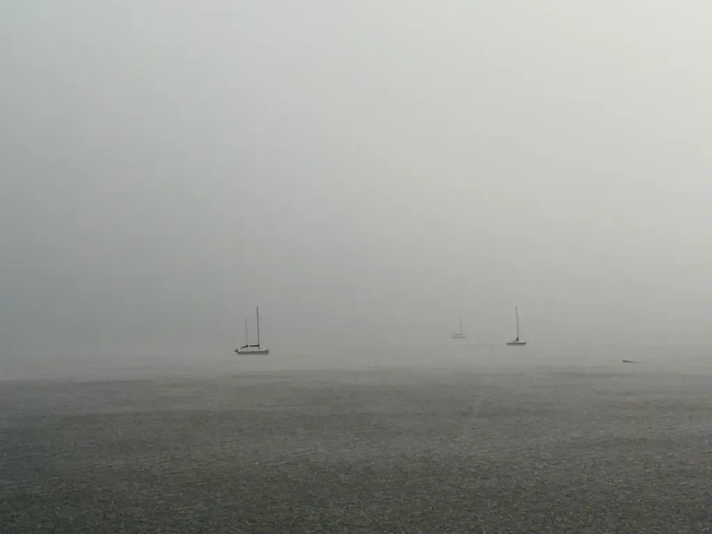
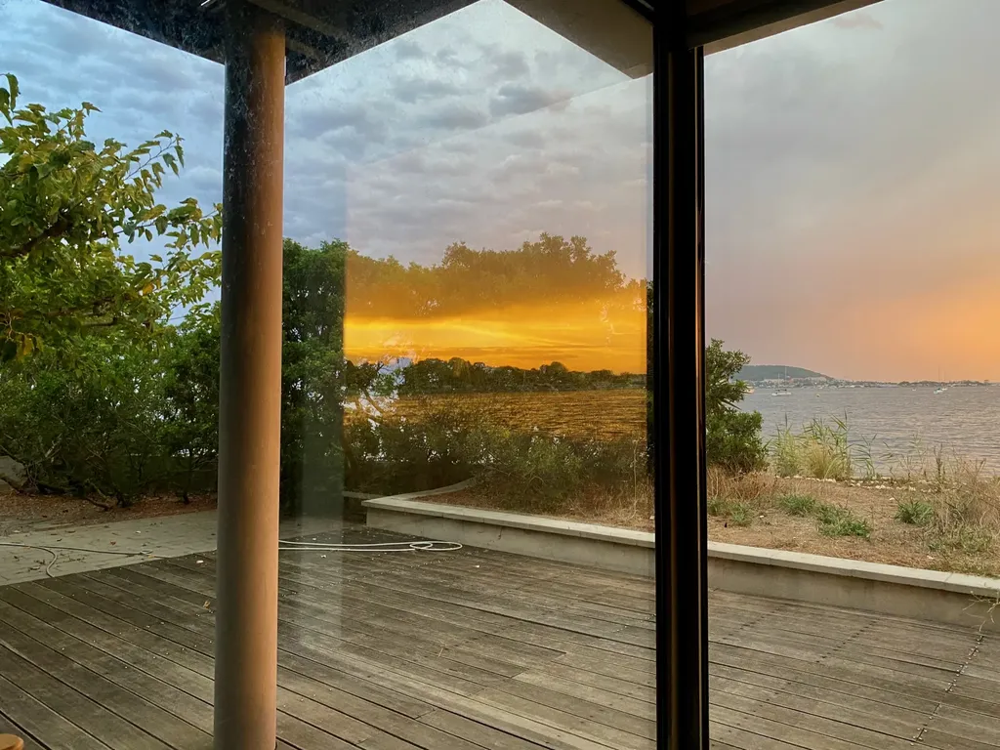
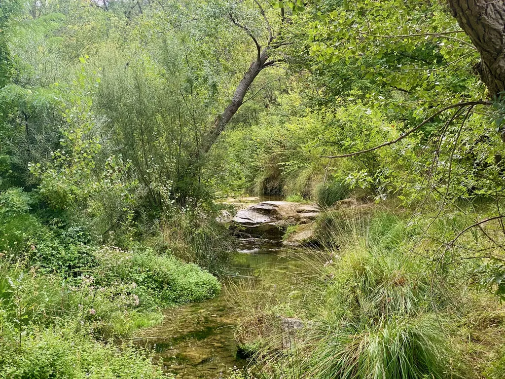
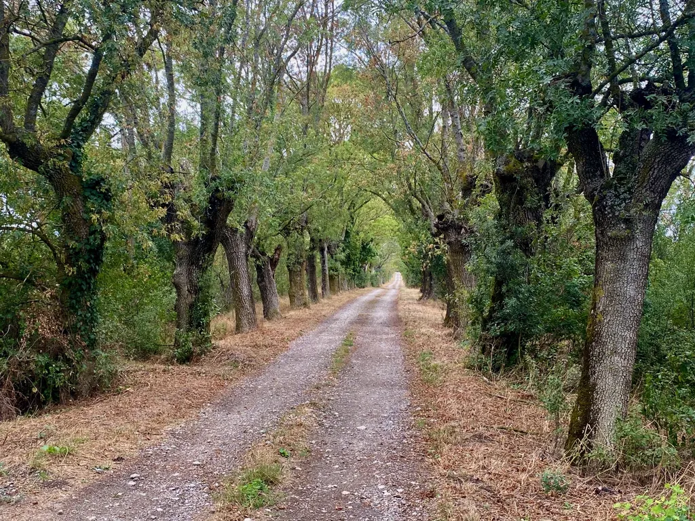
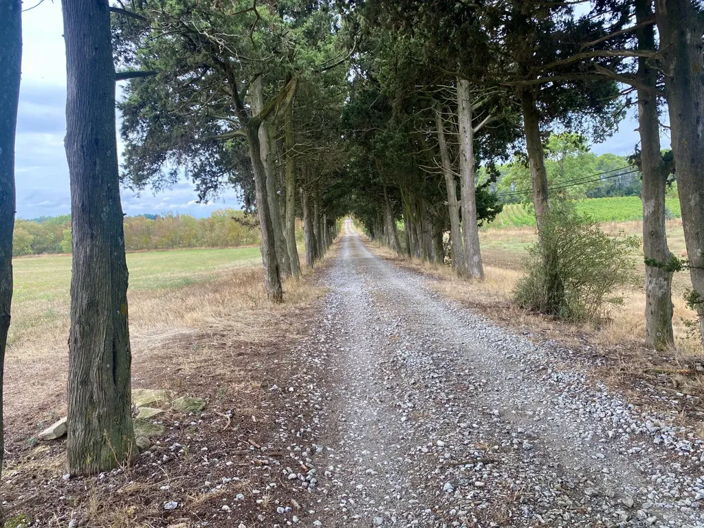
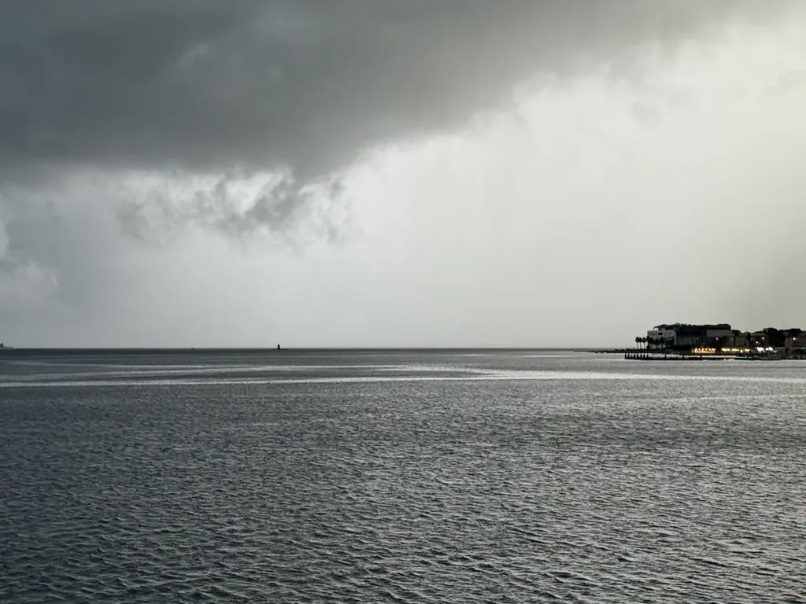
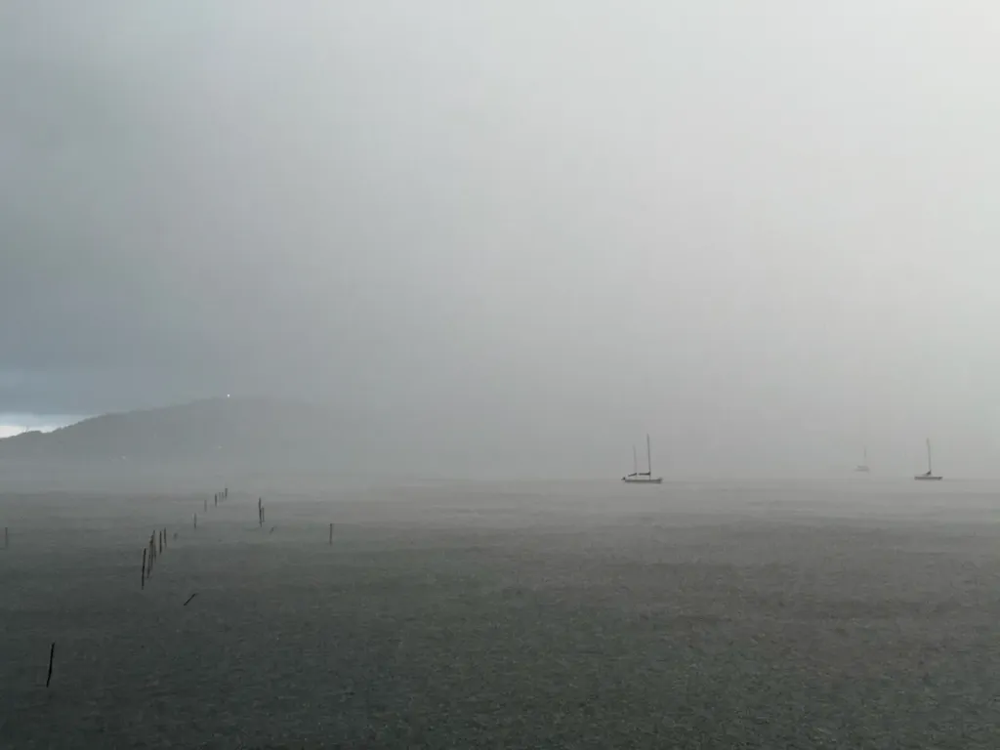
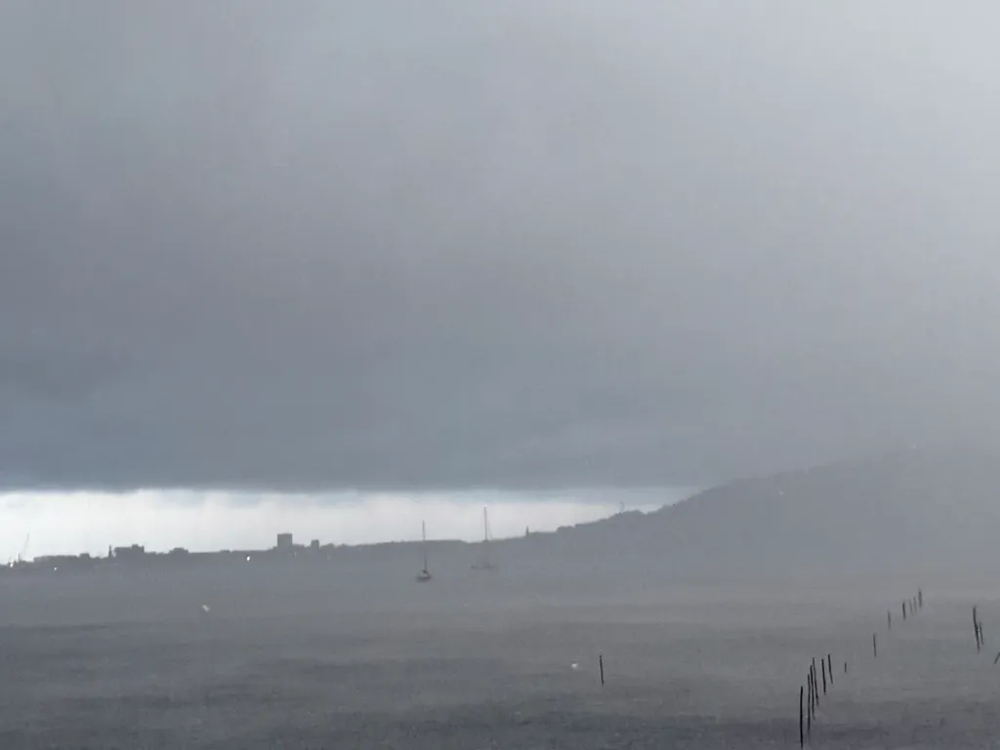
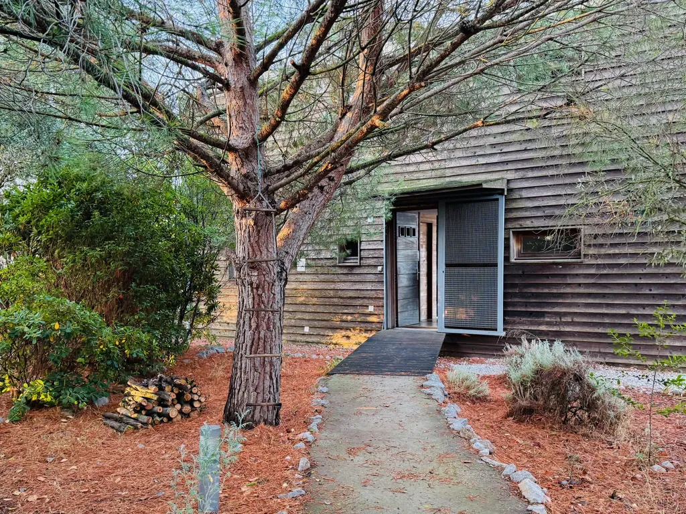

# Septembre 2024

### Dimanche 1er, Balaruc

[Phillipe, dans sa lettre #80,](https://castelneau.substack.com/p/rien-que-du-bruit-80) cite [Ganzeer](https://ganzeer.com/) : « il est probable qu’un jour, les gens du futur se souviendront de 2024 avec nostalgie et parleront de cette année comme du « bon vieux temps », sans aucune ironie. » C’est exactement le sujet de la partie SF de mon roman. En 2352, le héros est nostalgique de 2024 à travers des photos qui à l’époque n’intéressaient personne.

### Lundi 2, Balaruc

Arrive le moment où j’ai besoin de griffonner pour mettre au clair mon projet narratif. Je finis par ne plus être capable de voir la structure dans la linéarité des chapitres affichés sur mon écran. J’ai besoin de penser en 2D, en 3D, et les outils d’écriture me limitent.

### Mardi 3, Balaruc

Avant les chimios d’Isa, quand le système immunitaire a retrouvé un peu de vigueur, nous avons pris l’habitude d’aller au restaurant avec des copains. Nous arrivons les premiers. La musique est très forte, de la musique déplorable, de peu de goût dans un restaurant où on mange pourtant plutôt bien, même si ce soir il n’y a qu’une seule autre table occupée.

Je me lève, demande à la serveuse si elle pourrait un peu baisser le son. Je ne m’étends pas sur l’art d’accueillir des clients. Je ne vais pas au restaurant pour me faire agresser par de la musique vulgaire, mais pour manger dans la délicatesse. La serveuse me répond « Normalement, on baisse pas la musique. » Moi : « On fait quoi ? On s’en va ? » Et le patron arrive : « Me dis qu’on parle pas comme ça, commence à me faire la leçon… » Et donc, on s’en va pour finalement trouver un endroit plus convivial.

Ce patron a tout perdu. Il n’a même pas semblé noter que nous avions déjà mangé trois fois chez lui cette année. Il n’a pas pensé que nous dirions à tous nos amis de l’éviter. Je me sens mieux avec un sandwich assis au milieu de la nature à côté de mon vélo plutôt qu’attablé dans un restaurant. Il est vrai que je rentrais d’une journée passer à pédaler autour de Carcassonne et que ce restaurant m’est apparu comme une agression. Je n’ai plus ma place dans ces endroits.

### Jeudi 5, Balaruc

Un message écrit par Claude dans le cadre de mon projet romanesque : « Claude m'a dit aujourd'hui qu'elle rêvait. J'ai ri. Puis j'ai eu peur. »

### Lundi 9, Balaruc

Sur Facebook, une publicité pour un supplément alimentaire pour sportif. Rien de plus classique. Mais j’adore, me plie en deux, quand je lis un commentaire moqué par des centaines de cyclistes : « C’est génial, j’ai fait avec 60 km de VTT sans éprouver de fatigue. » Voilà comment ruiner une pub. Parce que tous les cyclistes entraînés peuvent faire 60 km de VTT sans manger, presque sans boire. Ou comment démontrer qu’un produit est un merveilleux placébo. Si au moins le gars a réussi à se dépasser, c’est déjà ça de gagner. En vérité, la plupart de ces produits, c’est un peu de sel, un peu de magnésium et souvent beaucoup de sucre.

### Jeudi 12, Balaruc

Le temps de rien, ou plutôt mes idées divaguent dans mon roman jeu, se dirigent vers lui, quand je ne fais pas mille autres choses, dont préparer la maison et le jardin pour un tournage, faire les courses et la cuisine, organiser ma randonnée bikepacking de fin septembre avec 75 inscrits, pédaler un minimum pour être en état d’y participer, débuguer mon appli de géolocalisation, et puis, et puis, même photographier est presque impossible, même publier le déjà maigres journal d’août.

Pourquoi noter ces choses peu littéraires ? Parce que vous me lisez tous les mois. Alors je vous dis où j’en suis, parle avec vous, vous êtes des amis désormais. Ce journal, finalement, n’a rien d’un journal postmortem, puisqu’il implique de petits échanges, et en cela il ne ressemble pas à ceux des anciens. Il nie la distance entre auteur et lecteur, il nous place dans la même famille, d’ailleurs, vous écrivez vous aussi, tout le monde écrit aujourd’hui, parce que le net est devenu social et littéraire, et photographique, et cinématographique.

Nous ne sommes pas en état de comprendre ce qui nous arrive, en quoi les technologies bouleversent notre rapport à la littérature et la forme qu’elle est en train de prendre. Encore une fois, cette sensation d’être dans l’ultracontemporain en ce moment même, quand j’écris là, pour vous, et moi aussi. Je tente d’avoir la même présence dans le roman, et aussi en même temps de prendre de la distance « classique », et d’y confronter les deux approches de la littérature, sans refuser de la discuter. Je sais que j’écris un roman illisible. Je l’écris pour moi, pour explorer.

### Vendredi 13, Balaruc

Tous les cinq ans, j’achète un iPhone et je me remets à photographier.

### Mardi 17, Balaruc

J’écris, mais pas ici.

### Mercredi 18, Balaruc

Confronté à la souffrance absolue, le dix de douleur, difficile à supporter en tant que spectateur impuissant.

---

Suis fan des Beach Boys. Je regarde [le documentaire](https://newsroom.disney.fr/actualites/the-beach-boys-le-film-documentaire-sur-le-groupe-legandaire-sera-propose-des-le-24-mai-en-exclusivite-sur-disney-f833-dc71f.html). Quelle déception, quelle médiocrité. Et pas le moindre morceau de musique en intégralité, pour ne pas payer de droits. Dans ce cas, arrêtez de faire des reportages sur des artistes. Ça n’a aucun sens.

### Dimanche 22, Balaruc

### Lundi 23, Balaruc

### Mercredi 25, Balaruc

Suis tombé sur un article si élogieux de [*Creation Lake*](https://thebookerprizes.com/the-booker-library/books/creation-lake) de [Rachel Kushner](https://thebookerprizes.com/the-booker-library/authors/rachel-kushner) en lice pour le The Booker Prizes que j’ai commencé à le lire. Au bout de dix pages, j’avais compris que c’était un nanar, d’autant que la France y est décrite à coups de clichés, au bout de cinquante je me demande de qui on se fiche ? Rien. Pas de style, pas d’intrigue, pas de forme neuve, pas d’épaisseur, pas d’humour, pas de profondeur. Dire que le texte est présenté comme révolutionnaire ! Ça fait mal d’entendre ça. Sans doute qu’une IA a écrit cet article. Elles sont douées pour faire briller les plus sombres merdes.

### Jeudi 26, Balaruc

Je dors avec une moustiquaire, ça ne m’empêche pas de me faire piquer, mais au moins j’ai la satisfaction de griller les moustiques le matin avec ma raquette électrique, parce qu’ils restent prisonniers.

---

Suis terrifié. [Étude massive publiée dans *Science* qui décrit l’évolution des températures de surface sur les 500 derniers millions d’années](https://www.science.org/doi/10.1126/science.adk3705), qui démontre que le facteur majeur des modifications est le CO2 et je vois des gens utiliser cette étude pour dire que le réchauffement n’est pas causé par l’activité humaine alors que nous balançons du CO2 dans l’atmosphère à tour de bras. Ce n’est pas parce que jadis les températures ont été plus élevées, que le taux de CO2 a été plus élevé, que cette fois ce n’est pas nous les responsables de l’élévation. Et puis, quand la planète était plus chaude, nous n’y vivions pas.

### Vendredi 27, Montpellier

Une métaphore. Il existe deux grandes catégories de cyclistes, les compétiteurs qui veulent gagner des courses et les dilettantes qui recherchent avant tout le plaisir.

Pour gagner, le compétiteur est prêt à de nombreux sacrifices, parfois même à se doper. C’est un peu pareil avec les écrivains qui écrivent pour gagner plutôt que pour le plaisir. À une époque ils se droguaient, ou se saoulaient, désormais ils demandent aux IA d’écrire à leur place, ou de les aider à écrire. C’est une évolution inévitable, irréversible, d’autant plus que les IA reposent sur des modèles statistiques qui tendent à produire des textes normés, dans l’air du temps.

Par contre, pour ceux qui comme moi écrivent pour le plaisir, et pour en donner, rien ne nous pousse à demander aux IA d’écrire à notre place, donc à voler notre plaisir. Pour autant, je crois que les IA peuvent nous aider à maximiser notre plaisir, parce qu’elles peuvent nous donner à voir nos textes sous une multitude de points de vue, ce qui peut nous aider à les pousser plus loin, comme quand nous travaillons avec un éditeur.

### Lundi 30, Montagne Noire

#carnets #y2024 #2024-10-13-11h00
