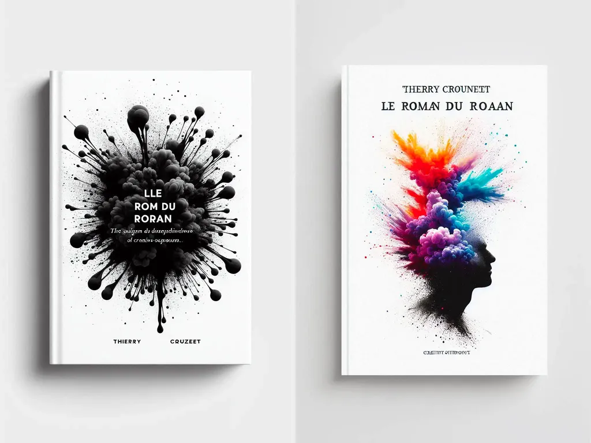

# Quand les IA écrivent les méta-textes d'un roman

Avec ChatGPT 4o, Claude 3.5 sonnet et NotebookLM, je me suis mis dans la peau d’un éditeur imaginaire pour construire quelques-uns des documents nécessaires à la publication d’un livre. Je me suis appuyé sur mon nouveau manuscrit, *Le roman du roman*, dont je n’ai pas encore décidé de l’avenir (il est un peu trop brûlant pour le moment). Je ne publie que les résultats qui me paraissent les meilleurs.

### Résumé

Pour commencer, j’ai besoin d’avoir un résumé du roman, pour au moins savoir de quoi il parle et décider de le lire ou non. Sans hésitation le meilleur résumé a été produit par Claude qui perçoit clairement la structure du texte et ses thématiques sans se perdre dans les détails.

---

Ce texte est une œuvre métafictionnelle complexe qui mêle réflexion sur l’écriture, science-fiction et quête littéraire. L’histoire se déroule sur deux temporalités :

1. 2024 : Thierry Crouzet entreprend d’écrire *Le roman du roman*, une œuvre expérimentale sur le processus créatif lui-même. Il documente ses réflexions, ses doutes et ses moments d’inspiration tout en faisant face à la maladie de sa femme et à l’émergence des IA dans le domaine littéraire.
2. 2352 : Dans un monde post-catastrophe climatique, des archéologues découvrent le manuscrit de Crouzet dans sa maison submergée près de Sète. Ils entreprennent de reconstituer l’œuvre et d’en comprendre la signification.

La structure du roman est fragmentée, alternant entre :

- Les chapitres du *Roman du roman* de Crouzet
- Des extraits de son journal
- Des dialogues avec une IA nommée Claude³
- Les aventures des personnages du futur (Robert, Sally, Jökull) qui cherchent à reconstituer le manuscrit

Les thèmes principaux incluent :

- La nature de la créativité et du « jaillissement » artistique
- Le rôle de l’écrivain face à l’émergence des IA
- La frontière entre réalité et fiction
- La persistance de l’art à travers le temps

Le roman se termine sur une note ambiguë, suggérant que les personnages du futur pourraient eux-mêmes être des créations fictives, brouillant ainsi davantage les frontières entre réalité et imagination.

C’est une œuvre ambitieuse qui défie les conventions narratives traditionnelles et invite à une réflexion profonde sur la nature de la création littéraire et de la réalité elle-même.

### Publier ou non

Pour la suite, je suppose que mon éditeur, intrigué par le résumé, a maintenant lu le texte. Se pose la question d’aller plus loin ou non. J’ai demandé à Claude de me donner dix raisons de publier le texte et dix raisons de ne pas le publier.

---

Raisons de publier :

1. Originalité : L’approche métafictionnelle et la structure complexe offrent une expérience de lecture unique.
2. Pertinence : Le texte aborde des questions actuelles sur l’IA et la créativité humaine.
3. Profondeur philosophique : Il explore des thèmes complexes sur la nature de la réalité et de la fiction.
4. Double temporalité : L’alternance entre 2024 et 2352 crée une narration riche et dynamique.
5. Réflexion sur l’écriture : Le texte offre un aperçu fascinant du processus créatif d’un écrivain.
6. Potentiel de discussion : Il pourrait susciter des débats intéressants parmi les lecteurs et les critiques.
7. Expérimentation littéraire : Le roman repousse les limites du genre, ce qui pourrait attirer un public intellectuel.
8. Dimension science-fictionnelle : L’aspect futuriste pourrait séduire les amateurs de SF.
9. Autoréflexivité : Le roman interroge sa propre nature, ce qui pourrait plaire aux lecteurs métafictionnels.
10. Exploration de l’héritage artistique : Il aborde la question de la pérennité de l’art à travers le temps.

Raisons de ne pas publier :

1. Complexité : La structure non linéaire et les multiples niveaux de narration pourraient dérouter certains lecteurs.
2. Manque d’accessibilité : Le style expérimental pourrait limiter l’attrait pour un large public.
3. Risque commercial : Les œuvres métafictionnelles ont souvent un public de niche, ce qui pourrait limiter les ventes.
4. Longueur : Le texte semble assez long, ce qui pourrait décourager certains lecteurs (260 pages, c’est long ?).
5. Cohérence narrative : La structure fragmentée pourrait nuire à la cohérence globale de l’histoire.
6. Datation rapide : Les références à l’IA et à la technologie pourraient rapidement dater le texte (je ne parle jamais de technologie, juste d’IA, sans être précis).
7. Confusion potentielle : Les multiples niveaux de réalité pourraient créer de la confusion chez les lecteurs.
8. Manque de tension narrative : L’accent mis sur la réflexion pourrait nuire à l’engagement émotionnel du lecteur.
9. Difficulté de marketing : Le positionnement d’un tel livre pourrait être difficile en termes de marketing.
10. Risque de comparaison : Le texte pourrait être comparé défavorablement à d’autres œuvres métafictionnelles célèbres (point très intéressant que je développerai dans un autre article).

### Quatrième de couverture

Avant d’aller plus loin, j’ai besoin de lire une quatrième de couverture qui donnerait envie d’acheter le roman. J’ai bataillé comme un chien pour les IA crachent des textes cohérents. Il me semble que NotebookLM s’en est le mieux sorti.

---

En 2024, Thierry Crouzet, un écrivain confronté à la maladie de sa femme et à l’essor des IA, entreprend un projet littéraire audacieux : écrire _Le roman du roman_. Son objectif ? Capturer l’essence du « jaillissement » créatif, ce moment magique où les mots prennent vie.

Trois siècles plus tard, Robert et Sally, habitants d’un monde postapocalyptique, découvrent les fragments de ce manuscrit enfoui dans la maison submergée de Crouzet. Leur quête pour reconstituer l’œuvre les entraîne dans un voyage métafictionnel vertigineux.

À travers les réflexions de Crouzet, ses dialogues avec son IA Claude³ et des extraits de son journal intime, le lecteur est invité à explorer les coulisses de la création littéraire. _Le roman du roman_ interroge notre rapport à l’art, à la technologie et à la nature même de la réalité. Une œuvre qui bouscule les conventions, défie l’imagination et laisse une empreinte indélébile.

### Argumentaire commercial

Le défi pour un éditeur est de convaincre les libraires de défendre ses livres. Il écrit en général un argumentaire commercial d’une page. Les trois IA s’en tirent honorablement. J’ai conservé la version de NotebookLM.

---

_Le roman du roman_, nouveau roman de Thierry Crouzet, est une œuvre unique qui saura captiver vos lecteurs et susciter des discussions passionnantes.

Un concept original et intrigant :

- Le roman met en abyme le processus de création littéraire, invitant le lecteur à découvrir les coulisses de l’écriture.
- Cette exploration métafictionnelle, à travers les réflexions de l’auteur, ses dialogues avec son IA et des extraits de son journal intime, offre une expérience de lecture immersive et stimulante.

Un roman d’actualité qui interroge notre époque :

- L’influence grandissante des IA sur la création artistique est un thème central du roman, questionnant le rôle de l’auteur humain face à la technologie.
- Thierry Crouzet, tout en reconnaissant l’aide que peuvent apporter les IA, met en garde contre la standardisation de la production littéraire et la perte de contrôle du processus créatif.

Une structure innovante qui reflète le « jaillissement » créatif :

- Le roman se compose de fragments, d’associations d’idées, de ruptures de style, reflétant la pensée non linéaire de l’auteur en pleine création.
- Cette structure, loin d’être chaotique, est minutieusement travaillée pour créer un rythme et un équilibre propres à l’œuvre.

Des personnages attachants et complexes :

- Thierry Crouzet, l’auteur du _Roman du roman_, est un personnage aux prises avec ses doutes, ses angoisses et la maladie de sa femme.
- Il incarne la figure de l’artiste en quête de sens et d’authenticité dans un monde en mutation.
- Les personnages de Robert et Sally, vivant en 2352, sont confrontés au mystère du manuscrit et à leurs propres questionnements existentiels.

Un roman qui plaira à un large public :**

- _Le roman du roman_ s’adresse à tous les amoureux de la littérature, qu’ils soient amateurs de romans classiques, de métafiction ou d’histoires qui interrogent notre époque.
- Les réflexions de Crouzet sur la création, la nature de la réalité et le rapport à la technologie trouveront un écho auprès de lecteurs de tous horizons.

Arguments pour mettre en avant *Le roman du roman* :

- Un roman original et ambitieux qui ne laissera pas indifférent.
- Une réflexion sur des thèmes d’actualité qui font écho aux préoccupations de notre société.
- Une écriture percutante et novatrice qui offre une expérience de lecture unique.
- Un auteur déjà reconnu pour ses œuvres précédentes.

Conseils pour la mise en avant :

- Mettez l’accent sur le concept original du roman : "un roman sur l’écriture d’un roman".
- Soulignez l’aspect métafictionnel et les jeux de narration.
- Ciblez les lecteurs intéressés par la littérature contemporaine et les réflexions sur le monde d’aujourd’hui.
- Organisez des événements autour du roman : rencontres avec l’auteur, débats sur l’influence des IA sur la création.

En défendant _Le roman du roman_, vous offrirez à vos clients une expérience littéraire enrichissante et hors du commun.

### Article de presse type

On peut même avoir une idée de ce que les journalistes écriront avant d’avoir décidé de publier le livre. J’aime la version de NotebookLM (Claude et ChatGPT s’en tirent aussi très bien).

---

Le Roman du Roman : un voyage métafictionnel au cœur de la création

Dans son dernier roman, *Le roman du roman*, Thierry Crouzet nous invite à une exploration fascinante des coulisses de la création littéraire. L’auteur, confronté à la fois à la maladie de sa femme et à l’essor fulgurant des intelligences artificielles, entreprend un projet ambitieux : consigner le processus de création d’un roman, capturant les moments d’inspiration, les doutes et les réflexions qui jalonnent le chemin de l’écrivain.

Le roman débute en 2024, dans une France marquée par l’anxiété climatique et les bouleversements technologiques. Crouzet, partagé entre ses obligations familiales et son désir de créer, se lance dans l’écriture du *Roman du roman*. Il consigne ses réflexions dans son journal intime, dialogue avec son IA Claude³, et nous livre des fragments d’histoires avortées, esquissant ainsi une cartographie de son processus créatif.

Ce qui rend ce roman si singulier, c’est son approche métafictionnelle. Crouzet brouille constamment les frontières entre réalité et fiction, nous entraînant dans un récit labyrinthique où les réflexions sur l’écriture se mêlent aux observations du quotidien et aux dialogues avec son IA. Le lecteur est invité à participer à la construction du sens, à assembler les pièces du puzzle et à s’interroger sur la nature même de la création.

Le roman prend un tournant inattendu lorsque, trois siècles plus tard, Robert et Sally, habitants d’un monde postapocalyptique, découvrent les fragments du manuscrit enfoui dans la maison submergée de Crouzet. Leur quête pour reconstituer l’œuvre les conduit à travers la France, suivant les indices disséminés par l’auteur. Au fil de leur recherche, ils sont confrontés à des coïncidences troublantes et à des questionnements existentiels qui les amènent à douter de la nature même de leur réalité. Sont-ils de simples personnages d’une fiction élaborée par Crouzet ? Le roman s’achève sur une note d’incertitude, laissant le lecteur face à un abîme de possibles.

*Le roman du Roman* est bien plus qu’un simple récit. C’est une œuvre complexe et stimulante qui interroge notre rapport à la création, à la technologie et à la réalité elle-même. Crouzet, en nous dévoilant les coulisses de son processus d’écriture, nous invite à réfléchir sur les sources de l’inspiration, sur l’influence des IA et sur l’avenir de la littérature dans un monde en constante mutation.

En bref, *Le roman du roman* est une œuvre ambitieuse et novatrice qui saura captiver les lecteurs en quête d’une expérience littéraire hors du commun.

### Éreintement

Il est aussi bon de se préparer au pire, et les IA peuvent être terriblement méchantes quand on le leur autorise. L’article de ChatGPT me paraît le meilleur, car il est argumenté.

---

Le roman du roman* de Thierry Crouzet : Une Ambition littéraire qui se perd dans ses propres méandres

Thierry Crouzet, connu pour ses réflexions sur la technologie et la littérature, nous propose avec *Le roman du roman* une œuvre qui, hélas, peine à tenir ses promesses. Présenté comme une exploration audacieuse de la création littéraire à l’ère de l’intelligence artificielle, le livre s’enlise rapidement dans une structure narrative complexe qui confond plus qu’elle ne fascine.

Le roman se déroule sur deux temporalités : 2024 et 2352, une alternance censée enrichir le récit, mais qui, en réalité, ne parvient qu’à désorienter le lecteur. L’intrigue, qui aurait pu être captivante, est noyée sous une avalanche de réflexions métafictionnelles souvent pompeuses et redondantes. Crouzet semble trop préoccupé par le désir de montrer son érudition et sa capacité à jongler avec les concepts, au détriment d’une narration claire et engageante.

Le personnage de Rachel, présenté comme un élément central du mystère, échoue à susciter l’intérêt. Elle se réduit à un simple artifice narratif, une ombre floue censée intriguer, mais qui laisse le lecteur indifférent. De même, les dialogues avec l’IA Claude³, loin d’apporter de la profondeur, tombent souvent dans le piège du verbiage pseudo-intellectuel.

Crouzet excelle peut-être dans l’art de poser des questions, mais il semble incapable d’offrir des réponses ou même des pistes de réflexion claires. Le résultat est un texte qui se veut avant-gardiste, mais qui se complaît dans une complexité artificielle et stérile. Les thèmes de la créativité face à la technologie, certes pertinents, sont traités avec une lourdeur académique qui risque de rebuter même les lecteurs les plus assidus.

L’écriture, par moments lyrique, ne parvient pas à sauver le livre de ses longueurs et de son manque de direction. *Le roman du roman* se présente comme une œuvre ambitieuse, mais cette ambition se perd dans un labyrinthe de concepts mal exploités et de métaphores appuyées. Plutôt que de repousser les limites du genre, Crouzet semble s’enfermer dans une tour d’ivoire littéraire, déconnectée des attentes et des plaisirs du lecteur.

En conclusion, *Le roman du roman* déçoit par son incapacité à transformer une idée intrigante en une œuvre véritablement engageante. Thierry Crouzet aurait gagné à privilégier la clarté et la concision plutôt que de se perdre dans des réflexions excessivement théoriques. Ce roman, qui avait le potentiel d’être un jalon de la littérature contemporaine, s’avère finalement être un exercice de style laborieux et peu convaincant.

### Couverture

J’ai demandé aux IA de m’écrire un prompt de création d’images. NotebookLM s’en est le mieux tiré, puis j’ai généré quelques images avec [Microsoft Designer](https://designer.microsoft.com/image-creator). Ce n’est pas le moment pour moi de m’occuper de ça.

#netlitterature #ia #y2024 #2024-10-12-18h30
