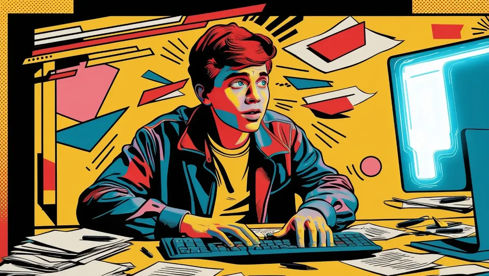
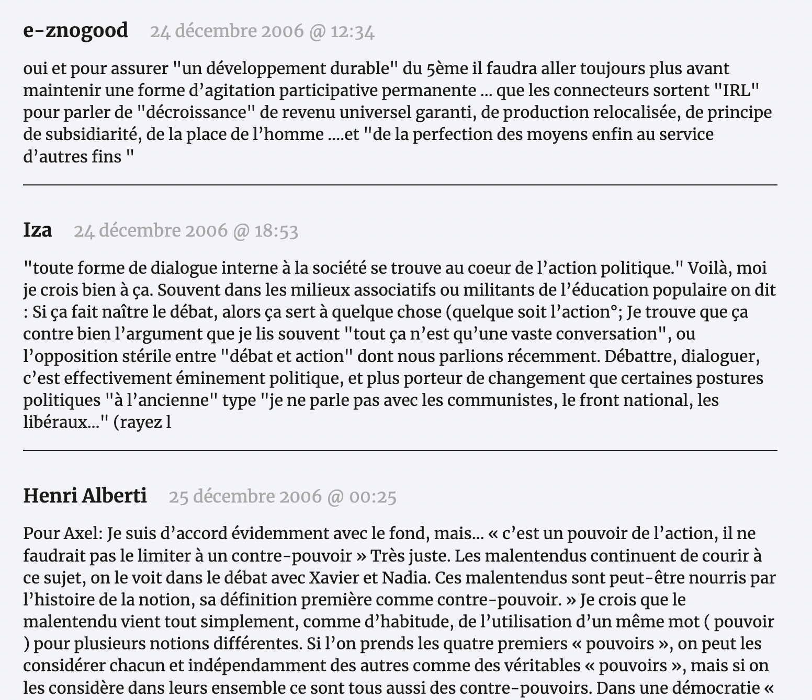

# Faire famille avec les lecteurs

Lionel, l’éditeur de [*One Minute*](/books/une-minute/), me reproche de m’être [coupé de mes lecteurs](https://mamot.fr/deck/@ludomire@tooting.ch/113669407381332186). Il n’a pas tort. Bien sûr, il évoque le contact direct dans les festivals, où je n’accepte d’aller que [dans les conditions de la charte des auteurs](https://www.la-charte.fr/inviter-chartiste/recommandations-tarifaires/), ce qui me paraît un minimum, surtout pour défendre les droits des auteurs plus dans le besoin que moi, et où on ne m’invite, dans les conditions de la charte, que quand je sors un nouveau bouquin (parce que nous sommes si nombreux à publier qu’il faut laisser la place aux autres). Comme je n’ai pas publié depuis quelque temps, je quitte peu ma tanière.

Mais je me suis aussi coupé de mes lecteurs en ligne. Parce que je me suis fait discret sur les réseaux sociaux, surtout parce que j’ai coupé les commentaires sur mon blog depuis plus de deux ans. Il y a quelques mois, j’ai relu un vieux billet qui n’était qu’un commentaire sur des commentaires, et qui, de fait, devenait incompréhensible sans les commentaires associés aux billets précédents.

Sur les blogs, et notamment sur le mien, nous avons vécu des moments d’échanges intenses, qu’il m’est apparu dommage de faire disparaître, ne serait-ce que pour leur valeur documentaire d’un moment dans l’histoire de l’écriture. J’ai donc redonné vie à cette matière. Près de 20 Mo, désormais disponibles sur [le dépôt GitHub du blog](https://github.com/tcrouzet/md/tree/main/comments). 

À ce stade, je me suis dit pourquoi pas autoriser l’affichage de ces commentaires sous les anciens billets, par exemple sous [la chronologie du cinquième pouvoir](https://static.tcrouzet.com/2006/12/24/chronologie-du-cinquieme-pouvoir/) où je retrouve, non sans nostalgie, Axel, Iza, Alberti, Carlo… tous devenus des amis, même si nos routes nous ont souvent éloignées depuis. Après quelques lignes de JavaScript, c’était fait.

De fil en aiguille, j’ai fini par rétablir la possibilité de commenter, sans pour autant renoncer au côté statique de mon site (ça exige quelques acrobaties). Je n’espère pas revivre les échanges enfiévrés qui m’ont conduit au burn-out de 2011, je n’en ai pas envie, mais je laisse la porte entrouverte pour quelques débats discrets, conscient qu’aujourd’hui on ne débat plus beaucoup et cherche avant tour à attirer l’attention (je me demande bien pour quel bénéfice).

Peut-être qu’un blog sans possibilité de commenter, c’est un peu trop officiel, ça empêche la connexion, ça impose un dialogue top-down. En rouvrant les commentaires, j’en reviens à la logique du *Peuple des connecteurs*. Voilà, vous pouvez continuer à m’envoyer des messages privés ou les rendre publics pour les lecteurs qui auront le courage de cliquer sur le bouton commentaire.

#cuisine #y2024 #2024-12-30-14h00
