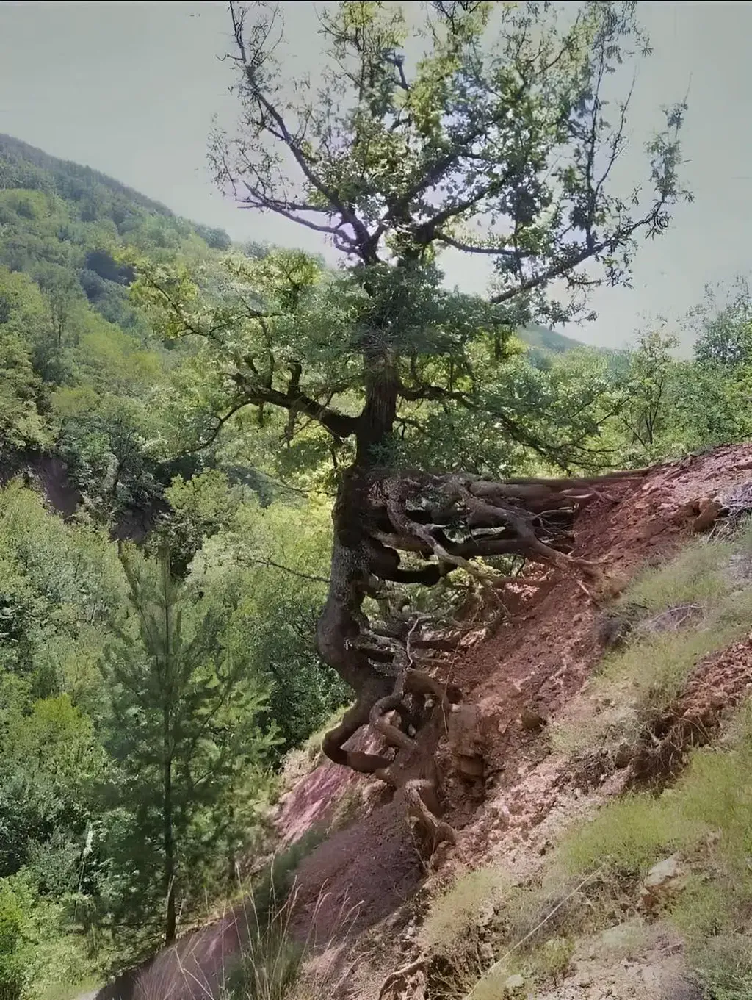

# Novembre 2024

### Dimanche 3, Balaruc

Les IA sont par nature métafictionelles, puisqu’il faut leur donner un rôle pour espérer recevoir des répones appropriées. Dans *Le roman du roman*, mon IA incarne un éditeur. Elle est consciente d’être dans un rôle, donc dans une fiction, bien plus que nous, d’une certaine façon.

---

J’écris peu puisque je code. Et je ne cesse d’apprendre, à une vitesse extraordinaire pour mon âge, avec l’assistance des IA. Quand beaucoup pensent à la retraite, je me sens comme un gamin qui découvre le monde.

Il faut coder pour comprendre à quel point les IA changent déjà le monde, pour sentir la puissance vertigineuse de ces outils. La question n’est pas de savoir si nous gagnons du temps ou non, mais en quoi nous apprenons de nouvelles méthodes de de travail, en quoi nous expérementons un nouvel état d’être. Une immensité de nouveaux champs d’investigation se déploient, et la littérature ne peut rester en marge.

### Lundi 4, Balaruc

Impression d’être un matchand de glace qui propose un nouveau parfun que personne n’a la curiosité de gouter. Aucune entreprise ne veut investir pour me faire connaître, préférant assurer sur les goûts vanille, fraise et chocolat.

### Mercredi 6, Balaruc

Presque un mois que j’ai bouclé le premier jet du *Roman du roman*, et alors qu’Isa finit de le relire et de le critiquer, le projet remonte peu à peu en moi avant que bientôt j’attaque une seconde plongée dans cette matière. Il en va toujours ainsi avec mes textes, ils surgissent par vagues, entre lesquelles je les détestes et me déteste.

### Dimanche 10, Balaruc

Depuis un an, notre olivier de Boème s’est couché, au-dessus de l’étant, son tronc brisé en parti, mais il n’est pas mort et je n’ai pas eu le courage de le tronçonner. Je découvre la photo d’un arbre, ainsi renversé, qui a réussi à se ressaisir à la pente. Magnifique symbole de la résilence.

### Mardi 12, Balaruc

Je range le code pour replonger dans *Le roman du roman*. Je préfère travailler un texte que demander ensuite ce que j’en ferai. 

### Mercredi 13, Balaruc

Isa me suggère quelques corrections dans le chapitre 1. Je demande à Claude d’approfondir cette piste, elle corrobore les propositions d’Isa. Puis je lui soumets le texte corrigé, et elle me suggère des modifications inverses. Il vaut mieux en rire.

---

Étrange époque, où on montre la violence à plus soif dans les films et séries, des corps découpés, torturés, mais où on répugne à montrer la nudité, où cache les sexes, où les scènes d’amour restent réservées à la pornographie pure et simple. Une inversion des priorités de la censures.

### Dimanche 24, Balaruc

*Orbital*, poétiquement magnifique. Isa qui est allé au bout me dit que c’est un roman qui fait tomber amoureux de ma Terre.
J’ai mis dix jours à écrire cette note, et j’ai oublié toutes les autres. Je ne révise pas *Le roman du roman*, je le réécris en grande partie. Je dois être masochiste car plus je passe du temps sur ce livre, plus je sais qu’il n’intéressera personne. Mais ce travail est agréable, parce qu’on en parle beaucoup avec Isa, et que ça devient presque un travail à quatre main, et même à six car j’utilise les IA pour me critiquer.
J’ai trouvé un nouveau prompt assez stupéfiant : « Quelle est la théorie de l’esprit de tel ou tel personnage dans tel ou tel chapitre ? » Claude me résume alors comment il imagine le personnage et je peux voir si c’est cohérent avec ce que moi j’ai imaginé. Les réponses sont souvent assez stupéfiantes, ce qui nourrit ma fiction en retour. Personne ne me lira, mais les IA le font, et j’entretiens un véritable dialogue avec elles. Ça peut vous paraître désespérant. Moi, ça me subjugue souvent.

### Lundi 25, Balaruc

Hier, en fin d’après-midi, je décide enfin de publier le carnet d’octobre et découvre que mon script d’exportation des images plante avec les photos raw de l’iPhone 16. Ça ne marche toujours pas à 23 h, je dors peu, énervé, je m’y remets ce matin pour enfin trouver la solution. Les IA m’ont aidé autant que fait perdre du temps. J’en aurais sans doute gagné beaucoup en usant des ressources communautaires comme nous le faisions avant, sauf que ces ressoures disparaissent peu à peu. J’assiste à une catastrophe silencieuse. Les IA tuent l’entraide, elles nous enferment dans le chacun pour soi. Même nos prompts nous les gardons secrets.

---

Comme Isa lit *Les Dépossédés* d’Ursula Le Guin, je le relis (j’en garde un vague souvenir — ma première relcture remonte à une quarantaine d’années). Déplorable traduction française, mais pas le courage de basculer en anglais comme Isa. Texte viellot. Le vaisseau spacial ressemble à un sous-marin de la seconde guerre mondiale. Partout des scories datent le texte. Impression d’un truc poussiéreux. Des mots inappropriés, des descriptions inutiles désormais. J’ai peur de tomber dans ce piège avec *Le roman du roman*.

---

Un texte a la longueur qu’il mérite. je cherche jamais à le réduire ou à l’allonger pour répondre à un cahier des charges comme je le faisais quand j’étais journaliste.
