# L’art de la composition photographique

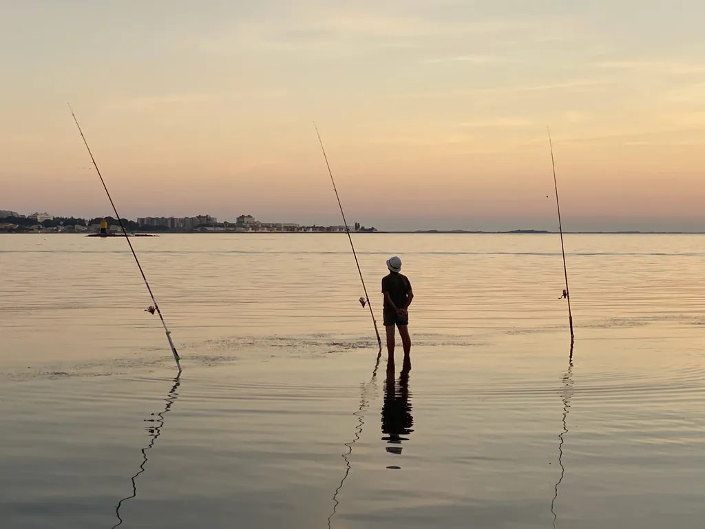

Un artiste apprend les règles, puis les rejette, puis finit avec une palette composé de règles anciennes et nouvelles qui ne valent souvent que pour lui. J’ai traversé cette aventure pour l’écriture, et elle n’en finit pas de se prolonger.

Pour mes photos, je suis beaucoup plus instinctif, même si à force de regarder des images et d’en prendre j’ai découvert mon style, plutôt fait de plans all over que de gros plans (je ne vais guère plus loin que le cadrage, passe très peu de temps au développement, me contentant d’utiliser l’app photo d’Apple — je ne suis qu’un photographe amateur qui rechigne à utiliser Lightroom). [En parcourant un article sur l’art de la composition](https://fstoppers.com/education/beyond-rule-thirds-photographers-love-hate-relationship-composition-685389), je me suis demandé si je pouvais trouver une de mes photos de 2023-2024 pour illustrer chacune des règles listées.

### Règle des tiers

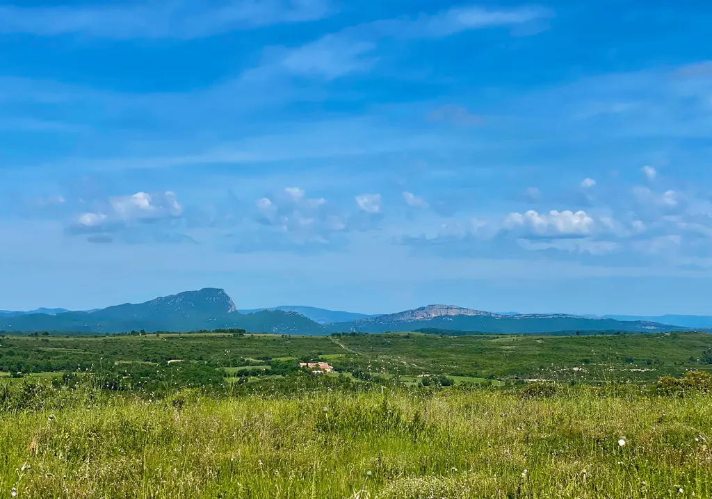

L’idée quadriller l’image en trois lignes horizontales et verticales et [faire en sorte de s’appuyer sur ces lignes](https://www.adobe.com/fr/creativecloud/photography/discover/rule-of-thirds.html). Sur cette photo du pic Saint-Loup au nord de Montpellier, la ligne de verdure suit le second tiers horizontal. J’ai tendance à me moquer de cette règle, et ne surtout pas passer de temps à recadrer mes images pour qu’elles la respectent.

### Équilibre

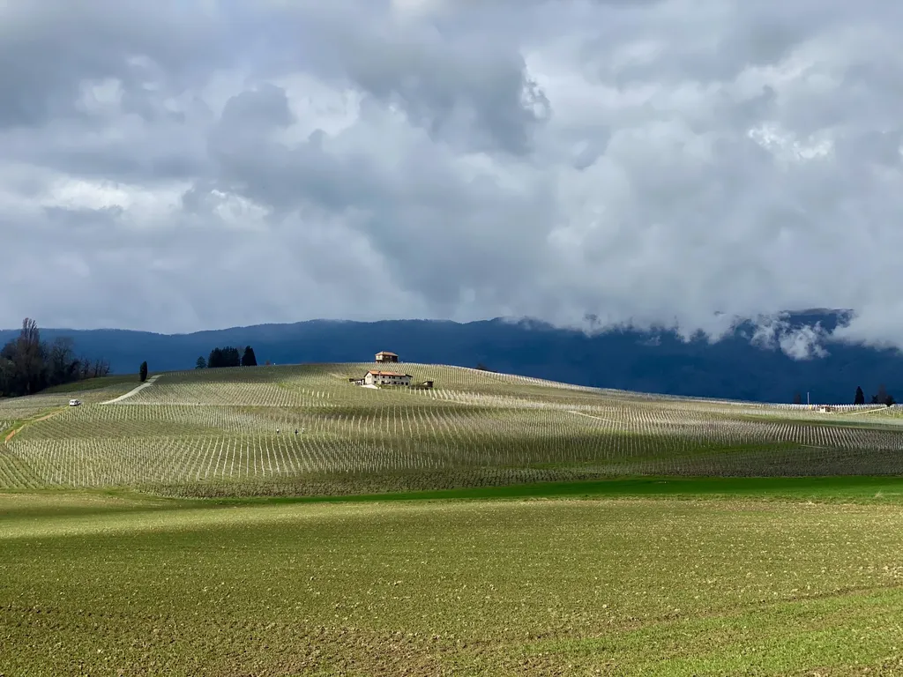

Quand tout semble à sa place. La terre, la colline avec les maisons, la montagne et le ciel. C’est un concept assez subjectif.

### Emphase

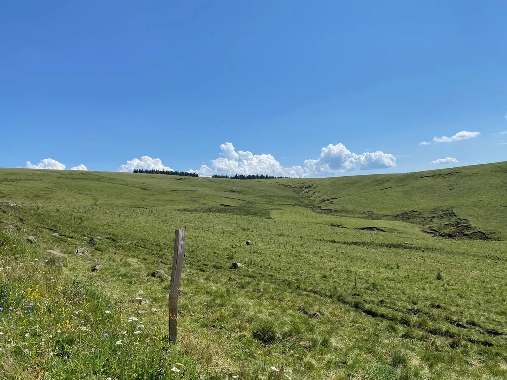

Attirer l’attention vers un point. Ici, le piquet, sans lequel le paysage serait plat (mais j’ai tendance à ne pas être fan de l’emphase, que je trouve souvent trop lisible).

### Mouvement

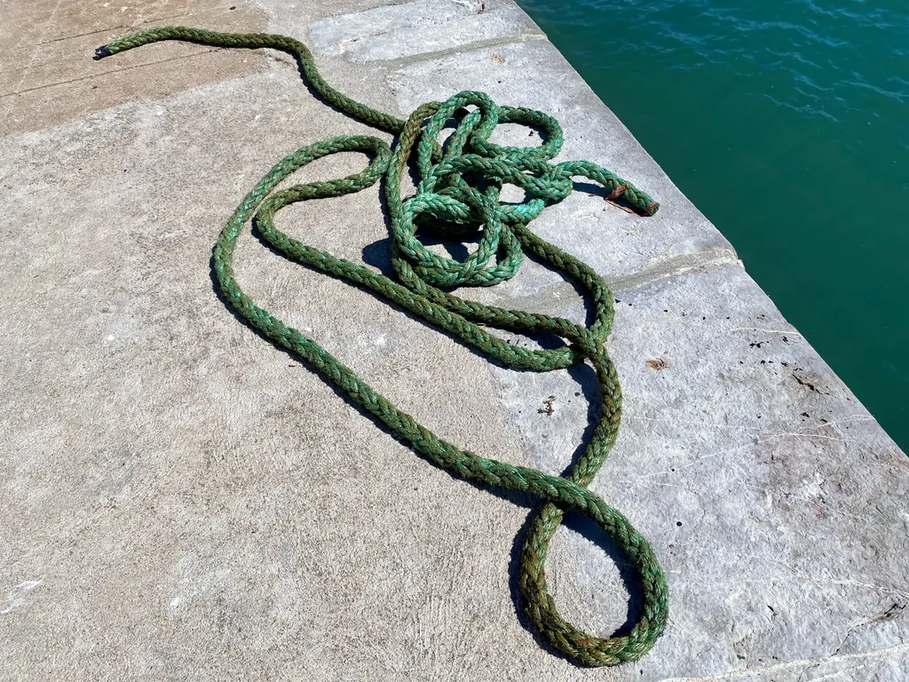

La corde ressemble à un serpent qui traverse l’image. Pas simple de prendre des photos qui racontent une histoire.

### Variété

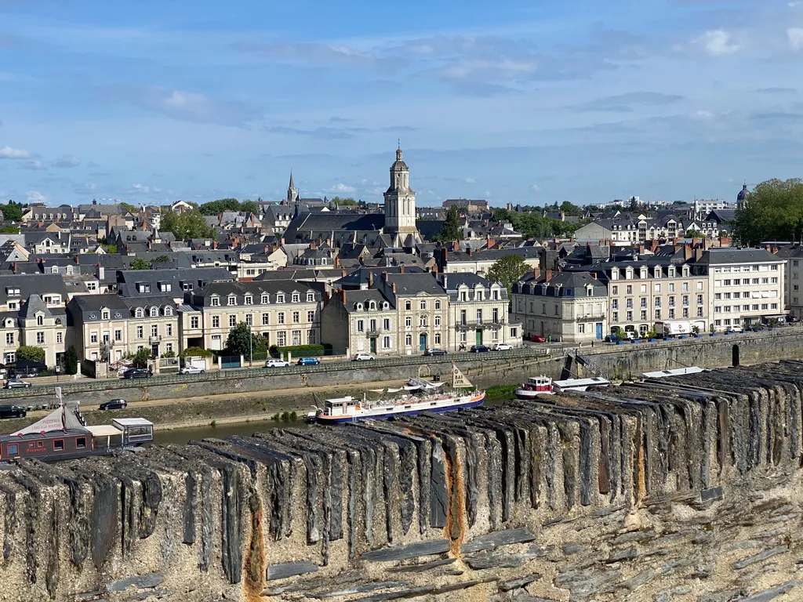

La ville, le mur et la rouille, les péniches, les voitures, tous les éléments attirent le regard, sans l’accaparer.

### Unité

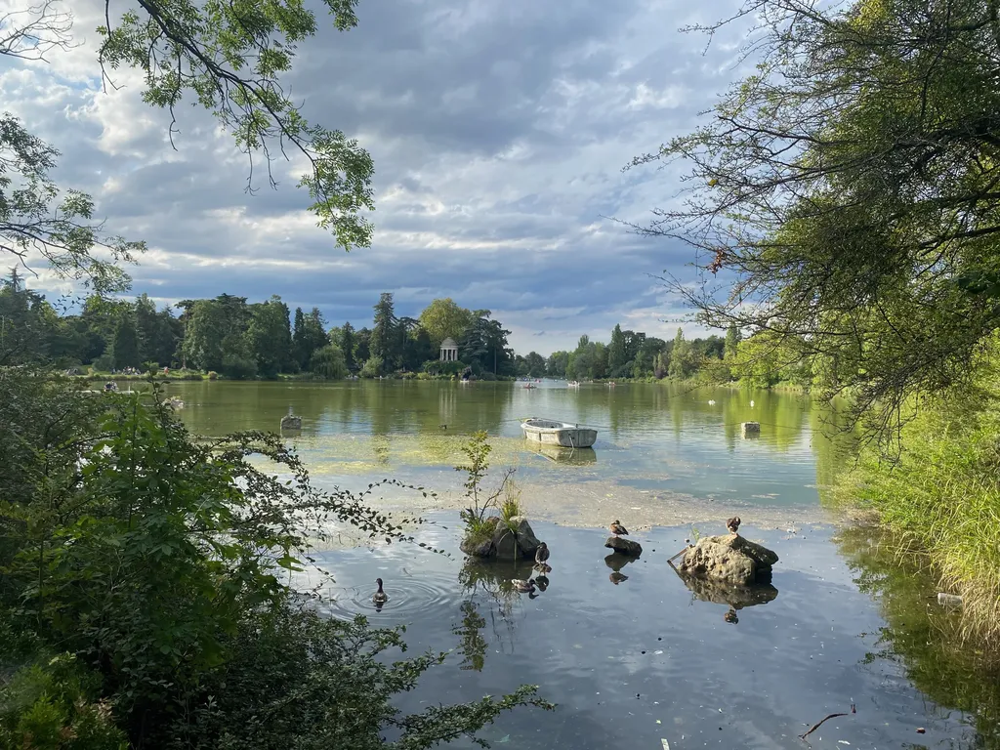

Quand tous les éléments fonctionnent ensemble (encore très subjectif).

### Contraste

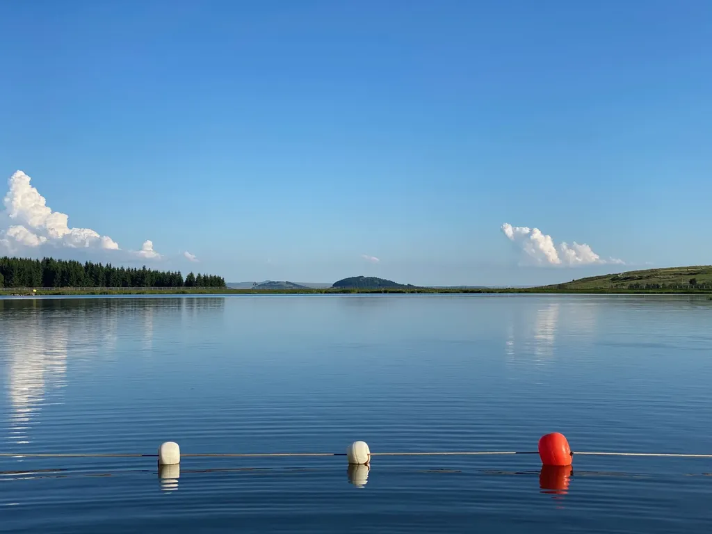

La bouée rouge crée un contraste fort par rapport aux deux bouées blanches, mais aussi aux autres couleurs de l’image.

### Hiérarchie

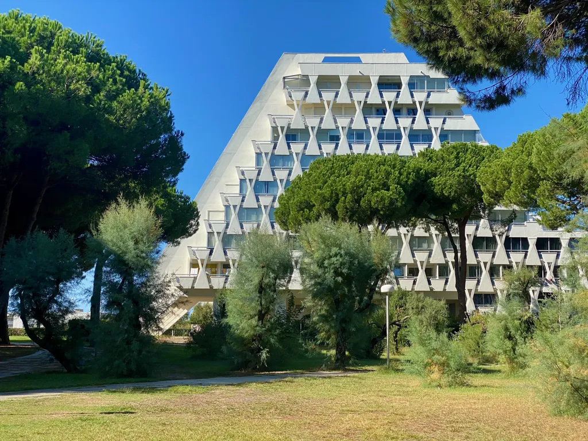

Combiner des éléments de différente importance (pyramide, arbres et lampadaire). Sans le lampadaire, l’image ne fonctionne plus, il me semble.

### Proportion

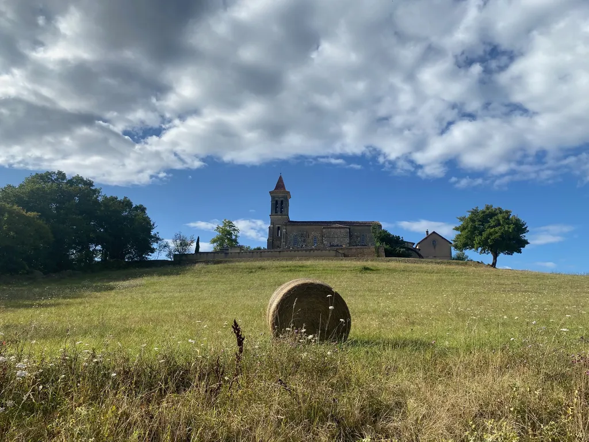

Taille de l’église comparée à celle d’une meule de foin, le tout sous un ciel immense.

### Espace

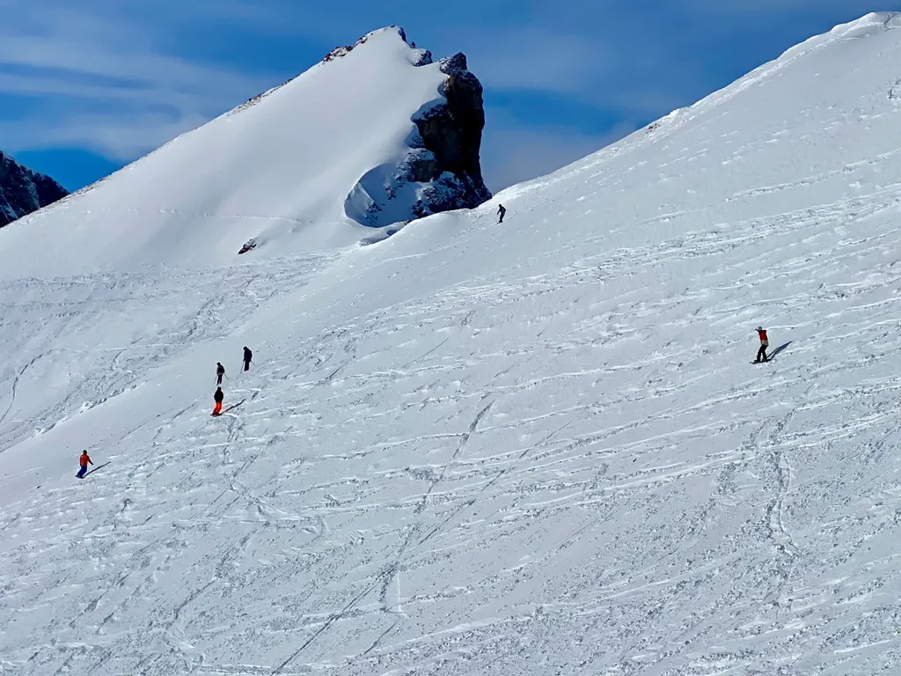

Laisser le sujet respirer (assez facile avec cette photo de surfeurs).

### Répétition

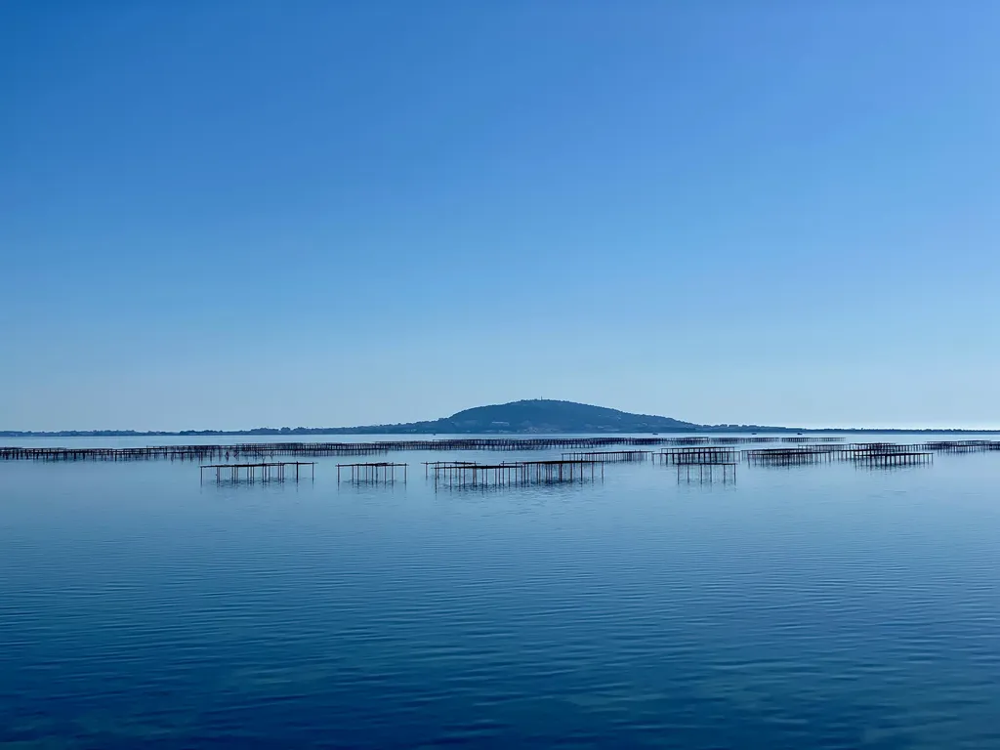

Par leur répétition les parcs à huîtres donnent de la tenue à la composition.

### Rythme

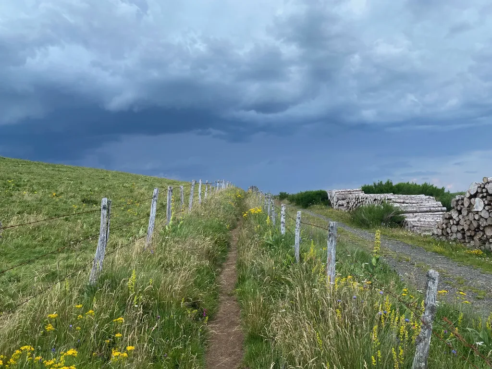

Les poteaux en se répétant créent une dynamique, ici doublée par celles des grumes sur la droite de l’image.

### Combiner

Combine règle du tiers, répétition, emphase…

#photos #y2024 #2024-12-01-21h00
