# Obsidian : l’éditeur de texte ultime

Pour un matérialiste comme moi, le qualificatif « ultime » est presque un gros mot, mais si, comme l’annonce [Satya Nadella,](https://www.youtube.com/watch?v=9NtsnzRFJ_o&ab_channel=Bg2Pod) nous vivons la fin des logiciels de type applicatif - entre autres nos traitements de textes - et nous apprêtons à ne piloter nos ordinateurs que par l’intermédiaire d’*Agentic AI*, [Obsidian](https://obsidian.md/) pourrait être mon dernier éditeur de texte (je reviens dans mon journal de décembre sur ce point de bascule).

J’écris avec Obsidian depuis un an et ne regrette pas mon choix. OK, Obsidian exige parfois quelques personnalisations un poil techniques, mais il me semble qu’un auteur devrait prendre soin de son outil d’écriture avec autant d’attention qu’un cycliste de son vélo.

En rester avec Word ou équivalent, c’est comme pédaler sans régler la hauteur de la selle, sans même apprendre à changer les vitesses. Je ne parle pas de changer les pneus, d’ajuster la longueur de la potence et de mille autres subtilités. Si un cycliste assidu s’impose tous ces réglages, il n’est peut-être pas stupide qu’un écrivain l’imite — parce que je crois que nos outils sont notre interface avec l’époque et qu’ils nous aident à la dire (j’ai parlé de tout ça dans *La mécanique du texte* — tant de choses ont changé en dix ans qu’il me faudrait y ajouter deux ou trois chapitres).

Face à tout nouvel outil, il y a la peur de la nouveauté, la peur du changement, une peur qui ne devrait peut-être jamais effrayer un auteur, puisque sa curiosité est souvent son moteur. J’ai longtemps hésité à quitter Windows pour basculer sur Mac afin d’écrire avec Ulysses, puis j’ai également hésité avant de basculer sur Obsidian. Chaque fois, je me suis demandé à quoi bon, et je n’ai compris la pertinence de l’effort qu’a posteriori quand la plus grande fluidité de l’outil m’a aidé à fluidifier mes pensées — et peut-être à écrire ce que je n’aurais pas écrit sans lui.

J’ai beaucoup de copains auteurs qui ne comprennent pas de quoi je parle (ou se moquent de ce dont je parle). Ils utilisent Word comme jadis ils auraient utilisé un stylo, oubliant que Flaubert choisissait ses plumes avec soin et les personnalisait, tout comme Simenon taillait ses crayons avant de se mettre au travail. On ne peut pas négliger ses outils (d’écriture, de publication, dictionnaires, correcteurs, langues, théories littéraires…). Nous autres écrivains sommes des artisans avant d’être des artistes, et, comme tous les artisans, nos outils délimitent notre espace de possibilité. 

### Pourquoi Obsidian

1. Gratuit et multiplateforme (Mac, Windows, Linux, iOS, Android…).
2. Rapide.
3. Ouvert et personnalisable à l’infini à l’aide de milliers de plugins et de thèmes.
4. Interface minimaliste non distractive.
5. Fichiers Markdown éditables par tous les éditeurs de texte.
6. Hiérarchie des fichiers transparente directement manipulable depuis le système.
7. Communauté d’utilisateurs et de développeurs très vivante avec des tonnes de vidéos, de forums, d’articles…
8. S’impose peu à peu comme l’éditeur de texte de référence (tant les autres outils paraissent démodés en comparaison).

### Comment je bosse avec Obsidian

Sur la gauche, j’ai la hiérarchie de mes fichiers (mon vault), qui ne fait que visualiser la hiérarchie sur mon disque. Toute manipulation de cette hiérarchie dans Obsidian ou en dehors est immédiatement répercutée. Aucune base de données. Les noms des fichiers déterminent l’ordre. Je me contente d’utiliser le plugin [Custom File Explorer Sorting](https://github.com/SebastianMC/obsidian-custom-sort) pour ordonner les dossiers et [Iconize](https://github.com/FlorianWoelki/obsidian-iconize) pour mettre un peu de couleur dans l’affichage, ce qui m’aide à naviguer plus vite.

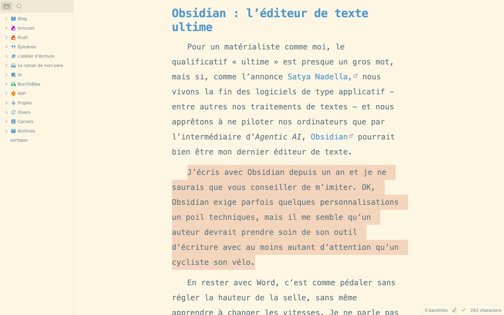

Quand j’ajoute une image comme je viens de le faire ci-dessus, je la dépose dans le texte et elle se retrouve automatiquement dans un dossier image (dont j’ai défini le nom dans les options).

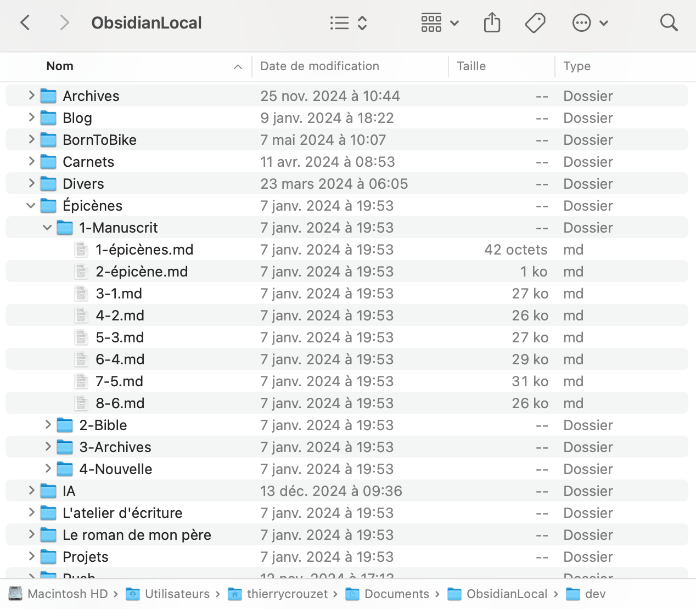

Quand je parcours mes fichiers avec le Finder, je retrouve une hiérarchie classique, sans la moindre fioriture. Quand j’ouvre un fichier avec un autre éditeur, je le retrouve en clair (ce qui est impossible avec Word, Ulysses et bien d’autres outils).

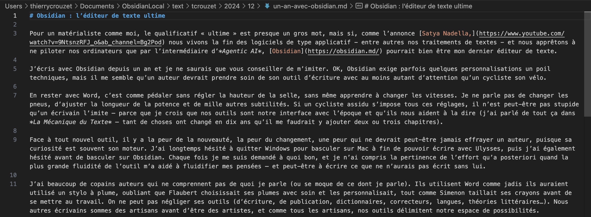

Cette universalité du format Markdown pérennise mes fichiers et me permet de les visualiser d’une multitude de façons, parfois de les retravailler ailleurs. La syntaxe Markdown étant purement textuelle, difficile d’introduire des éléments parasites (sauts de ligne inutiles, tabulations, espaces pour décaler, titrage approximatif et non homogène…). Le Markdown facilite l’exportation et la transmission des textes.

Je personnalise ma fenêtre d’édition avec le template [Solarized](https://github.com/harmtemolder/obsidian-solarized) pour un confort visuel optimal. Pour plus de minimalisme, je masque les parties de l’interface que je n’utilise jamais avec [Hider](https://github.com/kepano/obsidian-hider) et [ProZen](https://github.com/cmoskvitin/obsidian-prozen). J’utilise [Linter](https://github.com/platers/obsidian-linter) pour vérifier et nettoyer la syntaxe Markdown. Pour respecter le code typo français, j’ai créé le plugin [French Typos](https://github.com/tcrouzet/obsidian-french-typos). [Remember Cursor Position](https://github.com/dy-sh/obsidian-remember-cursor-position) me permet de revenir à l’endroit exact où j’ai quitté un document. Enfin, [un plugin interface Obsidian avec Antidode](https://github.com/Heziode/obsidian-antidote).

Conséquence du passage à Obsidian : j’ai vite compris que mon blog ne pouvait plus rester sous WordPress et que mes textes publiés en ligne depuis vingt ans devaient rejoindre ma hiérarchie. J’écris désormais tout sous Obsidian. Un script se charge de diffuser mes textes. Il existe de nombreux plugins pour ça, mais [j’ai choisi de programmer un outil](https://github.com/tcrouzet/NoMoreWordPress). J’ai découvert qu’Obsidian, plus qu’un éditeur de texte, était un navigateur de texte (fonction que j’utilise peu — je ne suis pas un preneur de notes — ou plutôt mes notes atterrissent dans mon carnet).

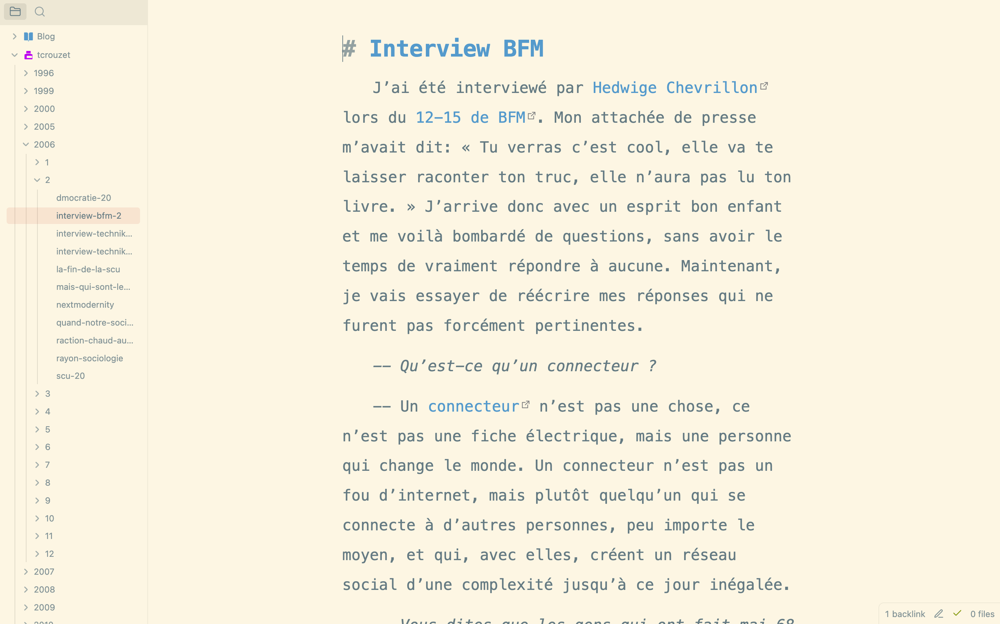

### Outils

Je n’utilise qu’une fraction des outils Obsidian. Pour réfléchir, j’aime dessiner Mind Map avec le plugin système Canvas.

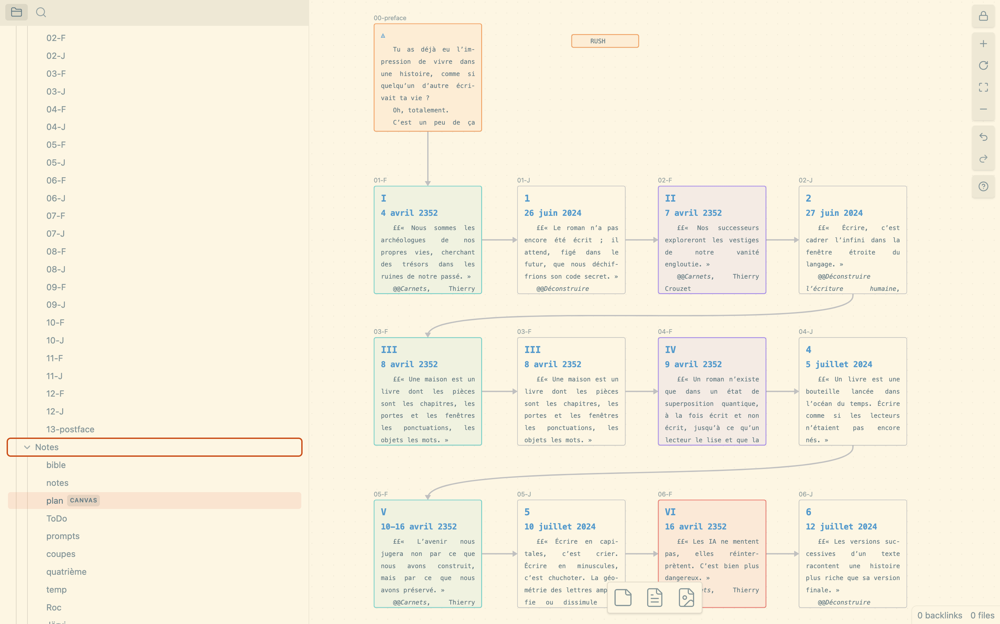

La vue graphique m’aurait beaucoup servi quand j’écrivais *One Minute*. Elle montre les liaisons entre les notes. Je l’imagine très utile pour quelqu’un qui travaille sur un corpus complexe et veut naviguer à travers tous les documents. Par exemple, si comme François Bon je me lançais dans un projet dingue sur Balzac, je rangerais tous ses textes dans Obsidian et j’utiliserais les plugins de liaison pour les interconnecter.

### Backup

La structure de fichiers étant claire, rien de plus facile que la sauvegarder. Une multitude d’outils pour ça. Pour ma part, en parallèle de Time Machine, un petit bout de python copie le tout sur Google Drive, Amazon S3, mon NAS (OK, je suis maniaque). En parallèle, le plugin [Git](https://github.com/Vinzent03/obsidian-git) automatise la sauvegarde en temps réel sur un dépôt GitHub. Cette procédure est gratuite. Mes textes sont archivés automatiquement toutes les 20 minutes (avec historique de toutes les modifications). Je garde ce dépôt privé, mais il contient absolument tout ce que j’ai écrit et comment je l’écris (je ne sauvegarde pas les images sur GitHub sinon je dépasserais l’espace gratuit de 4 Go).

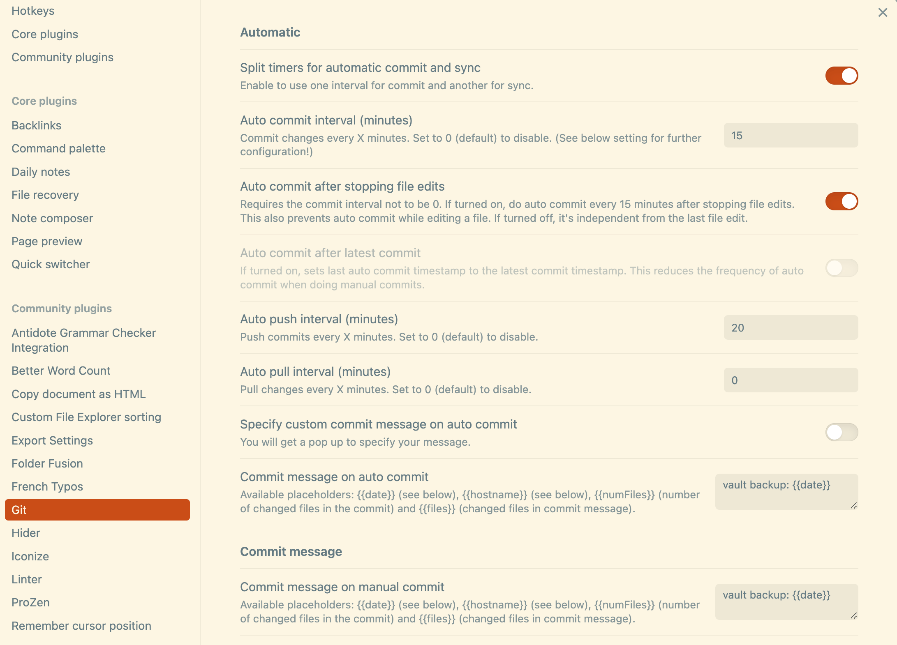

Ce dépôt est en quelque sorte l’œuvre de ma vie. J’imagine qu’après ma mort il sera rendu public (et peut-être avant). Ce n’est pas un livre, mais une base de données textuelle pour nourrir les IA, aussi pour qu’elles lui donnent vie et engendrent des variations innattendues. Le texte comme code pour des œuvres potentielles. Voir tous mes textes interconnectés sous Obsidian m’aide à me projeter vers un futur où la littérature n’aura plus guère de rapport avec celle que nous connaissons.

Au contraire, des auteurs continuent à fragmenter leur corpus, créant un vault pour chacun de leurs projets, ce qui les force à réinstaller tous les plugins à tout reconfigurer. Je comprends pas pourquoi ils s’y prenaient de cette façon (la taille du vault n’est pas réellement un problème). Quand j’écris, je ne cesse de naviguer entre mes différents projets (carnet, blog, manuscrit en cours, idées sur d‘autres…). Un seul vault me permet de me déplacer rapidement dans ma hiérarchie.

### Synchronisation

Avec Ulysses, [qui stocke ses données tortueuses et quasi indéchiffrables sur iCloud](https://tcrouzet.com/2023/12/25/pris-en-otage-par-ulysses-app/), j’ai vécu des écrasements, des pertes intempestives et non signalées qui m’ont rendu fou et m’ont poussé à quitter cette application devenue nocive. J’ai tenté de placer mon vault Obsidian sur iCloud, mais j’ai aussi rencontré des problèmes de synchronisation entre mon Mac et mon iPhone. Le disque cloud d’Apple s’est révélé trop instable pour assurer une synchronisation temps-réel entre mes différents systèmes.

Obsidian fonctionne très bien sur iOS mais le Vault ne peut être situé que sur iCloud ou sur le disque local, ce qui m’oblige à y copier mes fichiers pour les retravailler loin de mon Mac. Ce n’est pas idéal. Je préfère synchroniser sur DropBox avec le plug-in [Remotely Save](https://github.com/remotely-save/remotely-save). Sur Obsidian iOS, je synchronise avec le même plugin dans un vault portant le même nom que sur Mac (ça marche aussi entre Windows et iOS ou Android).

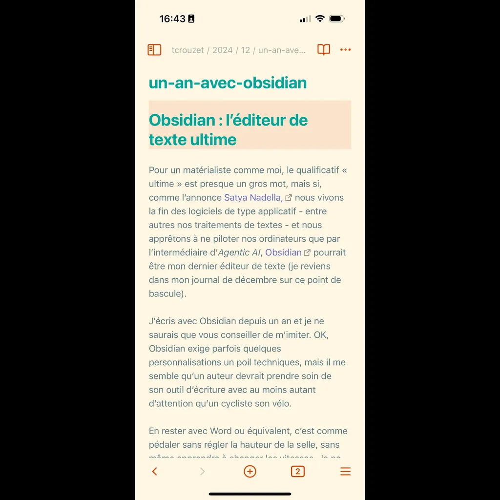

Enfin, directement sur DopBox, je peux éditer mes fichiers avec des applications comme [Paper](https://papereditor.app/) ou [One Markdown](https://apps.apple.com/us/app/one-markdown/id1507139439) (ma préférée). J’aime relire mes textes sur l’écran de l’iPhone, je les découvre sous une nouvelle perspective (l’étroitesse des colonnes modifie mon rapport au texte).

### Exportation

J’ai déjà évoqué l’exportation vers mon blog, mais il est bien sûr possible d’exporter de manière plus traditionnelle en Docx, PDF, ePub… Comme tous les éditeurs Markdown, Obsidian sépare strictement l’écriture de la mise en forme. L’éditeur optimise l’écriture et seulement elle (avec les styles Markdown pour qualifier les paragraphes, quitte à ajouter des balises en cas de raffinements nécessaires). L’exportation s’occupe de la mise en forme. Cette approche duelle ne permet pas de créer du Word Art ou des textes comme [*La maison des feuilles*](https://fr.wikipedia.org/wiki/La_Maison_des_feuilles). Dans ce cas, il faut se tourner vers des outils dédiés comme InDesign, mais pour les autres usages d’écriture, tout est possible en Markdown.

Obsidian est conçu comme un éditeur de notes, mais il existe des plugins pour gérer des projets complexes, comme [Long Form](https://github.com/kevboh/longform) qui offre les fonctions de Scrivener. Je m’en suis détourné pour conserver une hiérarchie de fichiers minimaliste et universelle. Je me suis contenté de créer [un plugin qui fusionne tous les fichiers d’un dossier en un seul fichier](https://github.com/tcrouzet/obsidian-folder-fusion), que je peux ensuite exporter. Au passage, ce plugin effectue quelques opérations de nettoyage et ajoute éventuellement des mises en forme. L’exportation s’effectue à l’aide de [Pandoc](https://pandoc.org/) via le plugin [Enhancing Export](https://github.com/mokeyish/obsidian-enhancing-export).

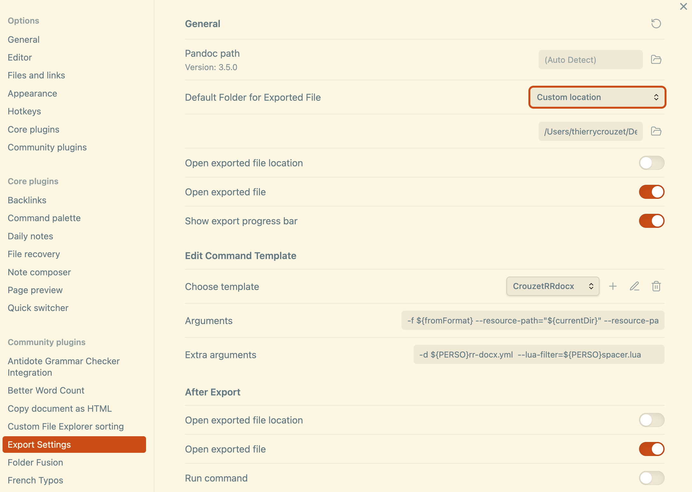

Pour profiter de ce plugin, Pandoc doit être préalablement installé sur le système (ce qui, sauf erreur, est impossible sur iOS et Android). On peut utiliser des filtres d’exportation standard, mais l’affaire devient ultra puissante quand on personnalise. Au fil des mois, j’ai perfectionné la technique pour maintenant générer des livres impeccables.

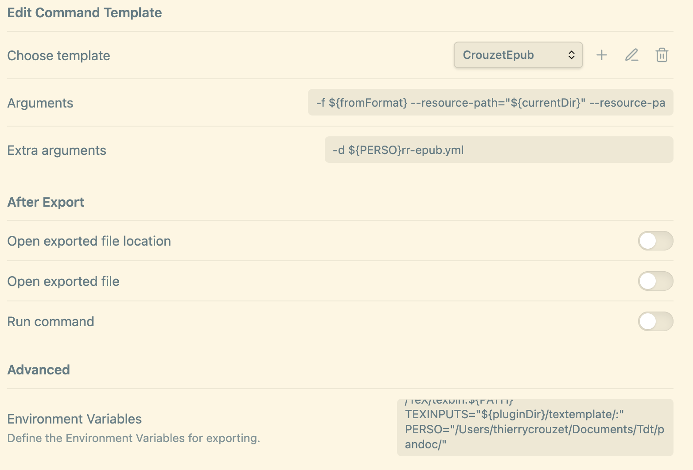

Important : dans les paramètres d’Enhancing Export, j’ai ajouté une variable d’environnement PERSO qui indique le chemin du dossier où je stocke mes modèles (voir capture ci-dessus).

Pour les epub, je pars du modèle proposé par défaut que je duplique avant d’y ajouter un argument supplémentaire du type « -d ${PERSO}rr-epub.yml » (voir capture). Cette instruction indique à Pandoc d’utiliser les données du fichier YML pour paramétrer la conversion (un simple fichier texte).

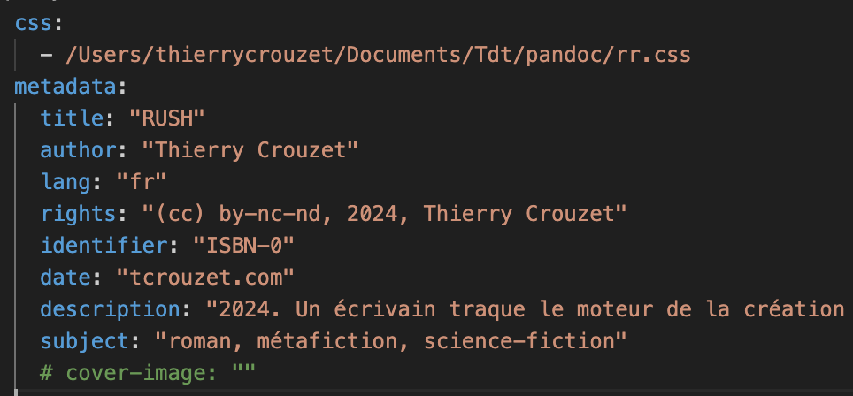

Pour chacun de mes projets, j’ai un YML sur mesure. Ici celui utilisé pour *Rush*. J’y indique la feuille de styles et les métadonnées. La conversion est quasi instantanée et parfaite.

Pour les Docx, j’utilise la même tactique. L’argument supplémentaire est un peu plus complexe : « -d \${PERSO}rr-docx.yml --lua-filter=\${PERSO}spacer.lua »

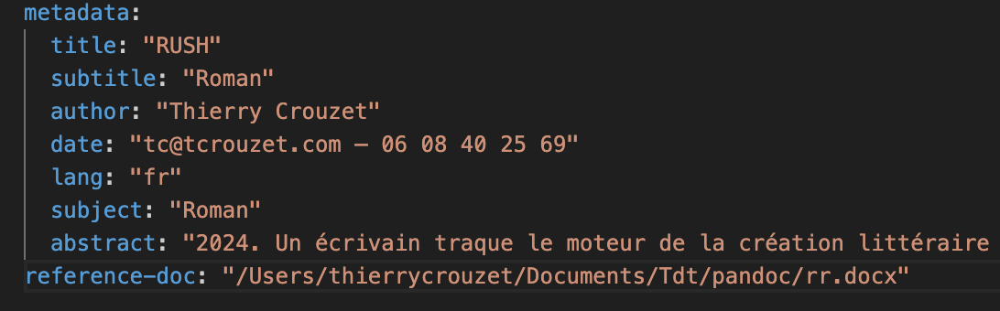

La structure du YML diffère légèrement. Plutôt que vers un CSS, je pointe vers un document Word qui sert de modèle pour l’exportation. spacer.lua est un script Pandoc pour quelques ajustements supplémentaires. Il convertit les balises Markdown « --- » et les exposants au format Docx.

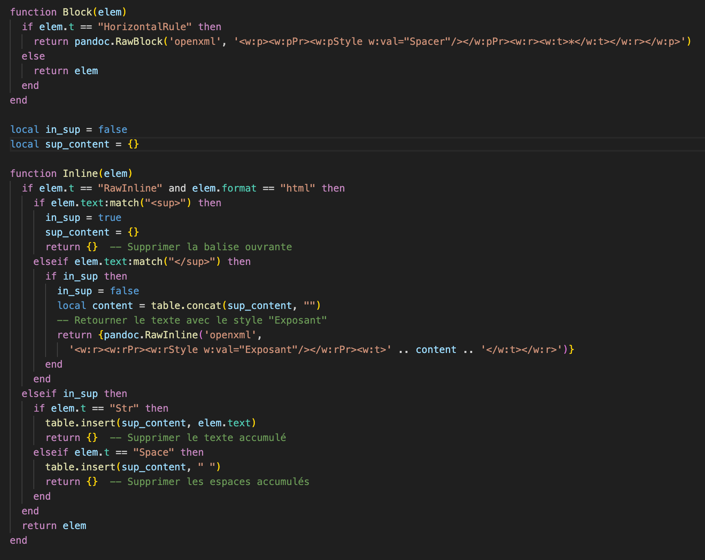

Je n’ai pas créé un modèle pour exporter directement en PDF. Je me contente de convertir les Docx ou de les importer dans InDesign si je veux obtenir des mises en forme professionnelles.

Tout cela peut sembler complexe, mais c’est à ce prix que j’obtiens exactement ce que je veux, ce que je n’ai jamais pu faire avec une autre approche. La communauté Obsidian étant dynamique, j’y ai trouvé toutes les informations nécessaire, et j’y contribue avec mes articles et plugins. Par ailleurs, les IA m’ont aussi aidé à écrire mes scripts.

### Mais encore

Lisez donc [cet article](https://pdworkman.com/write-book-with-obsidian/) pour voir comment un auteur canadien utilise Obsidian. Tout ça très loin, infiniment loin de mes pratiques. Je ne fais jamais de plan a priori, pas plus que de fiches personnages. Tout est dans ma tête, et ce n’est souvent que dans une phase de réécriture que je crée un plan pour vérifier la cohérence de l’ensemble. Je suis un auteur itératif, non pas un auteur planificateur.

#cuisine #obsidian #y2024 #2024-12-25-18h00
