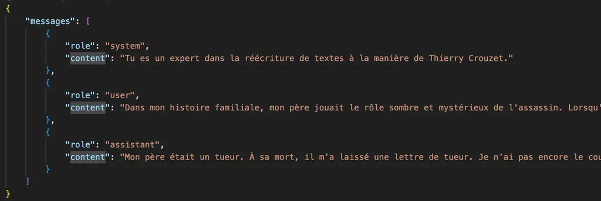
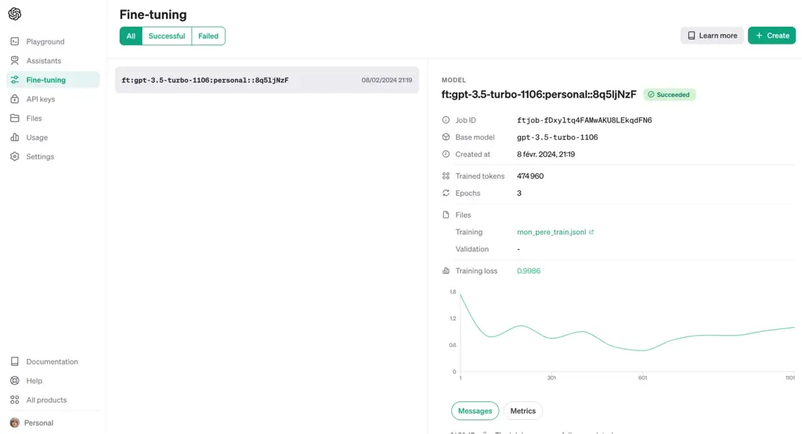
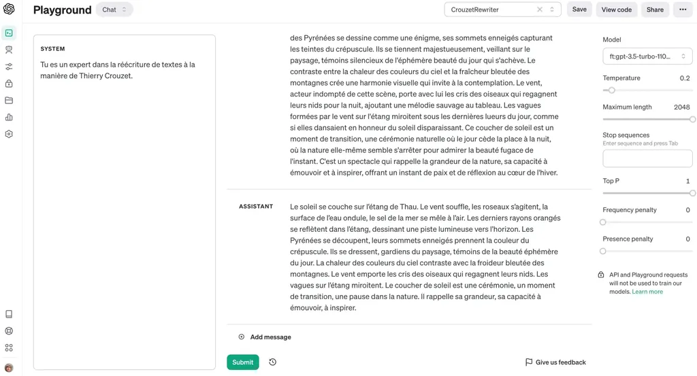

# Apprendre à écrire (à ChatGPT)

En juin 2023, quand j’écrivais la première partie pseudo-houellebecquienne du *Code Houellebecq*, il était quasi impossible de dresser ChatGPT à imiter le style d’un auteur. Il en reprenait quelques caractéristiques supposées, s’inspirait de citations, sans être capable d’aller beaucoup plus loin.

Mon astuce : je lui soumettais des extraits des *Particules élémentaires*, puis lui demandais de les imiter, mais il y parvenait médiocrement. Résultat : j’ai obtenu un texte avec un vague écho à Houellebecq, ce qui suffisait à mon propos, puisqu’une fan de Houellebecq était la narratrice de cette partie du texte. Il était hors de question pour moi, au-delà de l’histoire racontée, d’intervenir pour faire en sorte que ce texte apparaisse plus houellebecquien. Une IA était à la manœuvre et cela devait se sentir, une IA de 2023, et non pas une IA si puissante qu’elle paraîtrait humaine. J’espérais que le lecteur rirait de sa froide maladresse comme j’ai ri en écrivant.

Ce témoignage de 2023 doit être dit tout de suite et non dans un futur imprécis qui le transformera en document historique (oui, j’ai décidé de l’autopublier prochainement). Si je devais réécrire le même roman aujourd’hui, il serait beaucoup plus houllebecquien, parce que nous pouvons désormais éduquer ChatGPT à écrire dans un style particulier, [une opération de fine tuning](https://platform.openai.com/docs/guides/fine-tuning/preparing-your-dataset) qui nécessite quelques bouts de python. Je vais passer les détails techniques et vous raconter comment je m’en suis tiré.

La procédure se résume à soumettre à l’IA une centaine de questions et de réponses, ou une centaine de textes lourdingues et les mêmes textes mieux écrits. [Dans une vidéo passionnante](https://www.youtube.com/watch?v=NjQP7jRqkBU&ab_channel=SundogEducationwithFrankKane), j’ai découvert comment entraîner ChatGPT à répondre comme Data, l’IA de *Star Treck*. L’auteur analyse les dialogues de la série, récupère les questions posées à Data, puis ses réponses. Il dispose ainsi d’un dataset pour l’entraînement.

Mais pour entraîner une IA à écrire comme nous-mêmes ou un autre auteur, nous ne disposons que de textes que nous jugeons correctement écrits, du moins à notre convenance. Pour disposer de leur version mal écrite, il suffit de demander à ChatGPT de les réécrire dans son style caractéristique, [comme le suggère The Nerdy Novelist](https://www.youtube.com/watch?v=aZelrCSWQ-k&ab_channel=TheNerdyNovelist).

Voici le premier paragraphe de *[Mon père ce tueur](../../../../page/mon-pere-ce-tueur.md)*.

> Mon père était un tueur. À sa mort, il m’a laissé une lettre de tueur. Je n’ai pas encore le courage de l’ouvrir, de peur qu’elle m’explose à la figure. Il a déposé l’enveloppe dans le coffre où il rangeait ses armes : des poignards, une grenade, un revolver d’ordonnance MAS 1874 ayant servi durant la guerre d’Espagne, une carabine à lunette, et surtout des fusils de chasse, des brownings pour la plupart, tous briqués, les siens comme ceux de son père, grand-père et arrière-grand-père, une généalogie guerrière qui remonte au début du dix-neuvième siècle. Sur les crosses, il a vissé des plaques de bronze avec les noms de ses ancêtres, leur date de naissance, de mort. Sur l’une, il a indiqué : « 1951, mon premier superposé, offert pour mes 15 ans ».

Voici comment l’a réécrit ChatGPT 4 :

> Dans mon histoire familiale, mon père jouait le rôle sombre et mystérieux de l’assassin. Lorsqu’il a rendu son dernier souffle, il m’a transmis, tel un héritage funeste, une missive propre aux tueurs. Je suis, à ce jour, envahi d’une appréhension dévorante à l’idée même d’effleurer le papier de cette lettre, redoutant qu’elle ne me jette au visage une explosion de secrets inavouables. Cet objet de malaise, il l’a soigneusement placé dans un coffre, celui-là même où il conservait ses instruments de mort : une collection éclectique allant de poignards acérés à une grenade prête à semer le chaos, en passant par un revolver d’ordonnance MAS 1874, relique d’une guerre d’Espagne révolue, une carabine équipée d’une lunette pour traquer sa proie à distance, et, comme pour parachever cette arsenal, une série de fusils de chasse, principalement des brownings, polis à l’extrême, témoins silencieux de la passion d’une lignée de guerriers, inchangée depuis le début du dix-neuvième siècle. Sur ces armes, témoignage poignant de cette fascination mortelle, il a apposé des plaques de bronze gravées des noms de nos aïeux, ainsi que les dates qui encadrent leur existence terrestre. Sur l’une d’entre elles, il a pris soin de noter : « 1951, mon premier superposé, cadeau de mes 15 ans ».

Comme system prompt, j’ai utilisé :

> Et tant que rewriter, tu réécris en français les textes soumis de manière ordinaire, plate, verbeuse, imagée (ce qui résume le style de ChatGPT).

Initialement j’avais utilisé un autre system prompt :

> Et tant que rewriter, tu réécris en français les textes soumis de manière ordinaire, plate, verbeuse, imagée, baroque, pour un public très peu éduqué.

Pour un résultat trop flamboyant par rapport à ce que génère ChatGPT naturellement :

> Mon paternel, c’était pas vraiment le genre à jouer avec des poupées. Lui, sa chose, c’était plutôt de faire danser le fer et le feu. Quand il a cassé sa pipe, figurez-vous qu’il m’a légué une de ces lettres, mais pas n’importe laquelle, une lettre de tueur. Un truc tellement brûlant que j’ai même pas osé la décacheter, de peur de me retrouver avec la figure en miettes. Il a planqué ce machin dans son coffre à bidules mortels - imaginez un peu, un vrai bric-à-brac de l’apocalypse avec des couteaux affûtés comme des rasoirs, une grenade qui attend son heure, un vieux pistolet qui a fait parler la poudre pendant la castagne en Espagne, une lunette pour tirer les mouches à cent pas, et le clou du spectacle, une ribambelle de fusils de chasse - des engins brillants comme des sous neufs, héritage de ses vieux, son grand-père et même l’arrière-grand-père, une belle lignée de dur à cuire qui remonte jusqu’au temps où Napoléon faisait encore des siennes. Sur le manche, y collait des plaquettes en bronze avec le nom de ses aïeux, leur entrée et sortie de scène. Et sur une, y’a griffonné : « 1951, mon premier fusil superposé, cadeau pour mes 15 berges ».

Effectuer ce travail sur des centaines de paragraphes peut être rébarbatif surtout qu’il faut formater les résultats en jsonl. J’ai donc automatisé.

1. J’ai commencé par transformer l’epub officiel de *[Mon père ce tueur](../../../../page/mon-pere-ce-tueur.md)* en un fichier markdown.
2. J’ai sélectionné les paragraphes compris entre 250 et 1 000 signes (379), pour éviter les rares dialogues ou les passages trop longs (180k signes).
3. J’ai ensuite demandé à ChatGPT 4 de les réécrire un à un. La procédure a pris des plombes et m’a coûté une dizaine de dollars (suite à plusieurs plantages et bugs dans mon code).
4. Pour chaque paragraphe, j’ai créé une entrée dans le fichier jsonl. Elle se compose de trois sections : le prompt système, toujours le même (« Tu es un expert dans la réécriture de textes à la manière de Thierry Crouzet. »), d’un user, typiquement un texte mal écrit et d’un agent assistant, avec le même texte tel que je le voudrais.
5. J’ai ainsi obtenu un dataset pour entraîner ChatGPT.

La suite est plus immédiate. [Sur le playground de ChatGPT](https://platform.openai.com/finetune), on peut créer une nouvelle version de l’IA à l’aide du dataset précédemment créé.

[Il reste alors à interroger l’IA](https://platform.openai.com/playground) en veillant à sélectionner le nouveau modèle. J’ai d’abord demandé à ChatGPT 4 de me décrire un coucher de soleil hivernal, un soir venteux au-dessus de l’étang de Thau, avec la chaîne des Pyrénées qui se dessine au loin.

> Le coucher de soleil hivernal sur l’étang de Thau est un spectacle d’une beauté saisissante, un moment où le ciel embrasé s’offre en tableau vivant au-dessus des eaux calmes. Ce soir-là, le vent souffle avec vigueur, agitant les roseaux et ondulant la surface de l’étang, apportant avec lui le parfum salé de la mer proche. Les derniers rayons du soleil, d’un orange profond, se reflètent dans l’eau, créant un chemin lumineux qui semble conduire au cœur de l’horizon. Au loin, la chaîne des Pyrénées se dessine comme une énigme, ses sommets enneigés capturant les teintes du crépuscule. Ils se tiennent majestueusement, veillant sur le paysage, témoins silencieux de l’éphémère beauté du jour qui s’achève. Le contraste entre la chaleur des couleurs du ciel et la fraîcheur bleutée des montagnes crée une harmonie visuelle qui invite à la contemplation. Le vent, acteur indompté de cette scène, porte avec lui les cris des oiseaux qui regagnent leurs nids pour la nuit, ajoutant une mélodie sauvage au tableau. Les vagues formées par le vent sur l’étang miroitent sous les dernières lueurs du jour, comme si elles dansaient en honneur du soleil disparaissant. Ce coucher de soleil est un moment de transition, une cérémonie naturelle où le jour cède la place à la nuit, où la nature elle-même semble s’arrêter pour admirer la beauté fugace de l’instant. C’est un spectacle qui rappelle la grandeur de la nature, sa capacité à émouvoir et à inspirer, offrant un instant de paix et de réflexion au cœur de l’hiver.

Voici la réécriture avec par ChatGPT 3.5 customisé :

> Le soleil se couche sur l’étang de Thau. Le vent souffle, les roseaux s’agitent, la surface de l’eau ondule, le sel de la mer se mêle à l’air. Les derniers rayons orangés se reflètent dans l’étang, dessinant une piste lumineuse vers l’horizon. Les Pyrénées se découpent, leurs sommets enneigés prennent la couleur du crépuscule. Ils se dressent, gardiens du paysage, témoins de la beauté éphémère du jour. La chaleur des couleurs du ciel contraste avec la froideur bleutée des montagnes. Le vent emporte les cris des oiseaux qui regagnent leurs nids. Les vagues sur l’étang miroitent. Le coucher de soleil est une cérémonie, un moment de transition, une pause dans la nature. Il rappelle sa grandeur, sa capacité à émouvoir, à inspirer.

Ce n’est toujours pas moi, pas assez de contraste entre les phrases longues et courtes, mais on est déjà très loin du style naturel de ChatGPT. Encore une fois, avec ces expériences, il faut se projeter vers demain, et comprendre que le clonage sera bientôt parfait, et que les modèles égaleront leurs maîtres, voire les dépasseront, capables d’être toujours au meilleur de ce qu’ils peuvent produire, quitte à verser dans la froideur.

Quelle sera alors notre place en tant qu’auteur ? Devrons-nous être toujours plus radicaux pour nous démarquer ? Ou, au contraire, toujours plus intimistes ? Je n’ai pas de réponse, sinon celles que j’ai données tout au long du *Code Houellebecq* : je pense notamment que le journal deviendra une forme prépondérante, même s’il sera possible de fabriquer des journaux factices (voilà une idée).

[Avec mon modèle RAG](../1/premieres-terreurs-devant-une-ia.md), j’ai posé une question à [ThierryGPT](../1/conversations-1.md) :

> Quel est ton rapport aux couchers de soleil ?

Puis j’ai demandé à mon modèle personnalisé de réécrire la réponse :

> Les couchers de soleil m’ont appris à être attentif. Ils m’ont enseigné que rien n’est jamais identique, que chaque seconde est unique, que chaque seconde est belle. Ils m’ont appris la patience et l’humilité. La photographie m’a appris que je pouvais partager des fragments de ma vie, mais aussi que ce partage était souvent vain. J’ai appris à être critique et sélectif. J’ai appris que la répétition pouvait être source de constance, mais aussi de variabilité. J’ai appris que chaque coucher de soleil était une métaphore de la vie, un cycle de fin et de commencement, que chaque journée, même la plus ordinaire, pouvait être extraordinaire. J’ai appris que la beauté était éphémère, que je ne pouvais la retenir, que je ne pouvais la reproduire. J’ai appris que je devais être attentif à l’impermanence. J’ai appris que je pouvais être inspiré par la littérature et la philosophie. J’ai appris que je pouvais chercher le sublime dans le quotidien. J’ai appris que je devais être reconnaissant.

On peut utiliser cette méthode pour imiter des auteurs, créer des personnages avec des phrasés étranges, se réécrire soit même à la recherche de lourdeurs, voire extrapoler des idées que nous aurions pu exprimer et que nous avons jusque là tues. J’aurais pu générer [un interview posthume de Manchette](manchette-linterview-post-mortem.md) beaucoup plus réaliste dans la forme. Je sais déjà que j’utiliserai cette approche dans mon prochain projet, sans encore trop savoir comment.

#ia #iacontent #netlitterature #y2024 #2024-2-9-10h20
