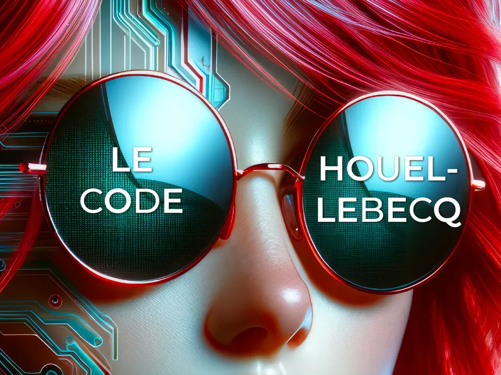
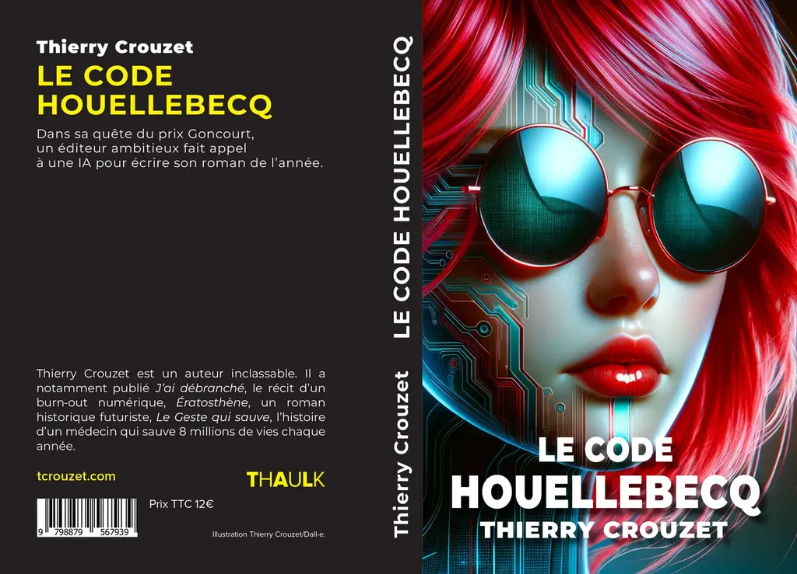

# Le Code Houellebecq : en librairie

Je me suis résolu à autopublier [*Le Code Houellebecq*](/le-code-houellebecq/), après être revenu à mon premier jet et non à celui présenté aux éditeurs. Vous pouvez acheter la version électronique ([7switch](https://www.7switch.com/fr/ebook/9782919358199/le-code-houellebecq), [Amazon](https://www.amazon.fr/dp/B0CVNMLKQ5/), [Apple](https://books.apple.com/fr/book/le-code-houellebecq/id6477866757), [Kobo](https://www.kobo.com/fr/fr/ebook/le-code-houellebecq), [Vivlio](https://shop.vivlio.com/product/9782919358199_9782919358199_2/le-code-houellebecq)) ou [la version papier](https://www.amazon.fr/dp/B0CVQ5FGRY). En introduction du roman, j’ai expliqué ma décision.

---

Ce texte est un roman expérimental au sujet d’un roman raté. Il témoigne de mes efforts tout au long de 2023 pour apprivoiser l’écriture assistée par les IA. Peut-être qu’il me faudra rater dix livres avec elles avant d’en écrire un de convenable. J’explore le nouveau monde qui s’offre à nous, parce que je suis persuadé qu’il n’est plus possible d’écrire aujourd’hui comme nous écrivions hier encore.

J’autopublie ce roman parce qu’il n’a intéressé aucun des éditeurs à qui j’en ai parlé, et pas davantage les quelques-uns qui ont eu accès au manuscrit. Je l’autopublie parce qu’il n’est plus question de le retravailler pour le rendre moins artificiel, son artificialité étant son sujet même. J’ai pris un énorme plaisir à l’écrire, j’ai beaucoup ri et il faut croire que la plupart de mes rares premiers lecteurs n’ont pas partagé mon enthousiasme. L’auteur est mauvais juge de ses œuvres.

Je l’autopublie parce que les IA changent à une vitesse jamais vue dans aucune autre technologie. Si je devais écrire le même texte en 2024, ce serait un tout autre texte. Mon Houellebecq, ou plutôt celui de mon héroïne Zola, serait beaucoup plus réaliste, son style beaucoup plus proche du sien, mais cette nouvelle facilité d’imiter rendrait le projet moins intéressant à mes yeux. Et de fait, selon moi, il n’avait de sens qu’à un moment particulier de 2023, et même précisément entre juin et septembre.

J’autotoplubie donc pour faire date, pour témoigner de mes investigations. Je ne suis pas le premier à avoir utilisé les IA pour co-écrire un roman. *Pharmako-AI* de K Allado-McDowell et *Internes* de Gregory Chatonsky ont été écrits en 2020, publiés en 2022, mais ils abordent le côté hallucinatoire des grands modèles de langage et tentent d’exprimer leur poésie. Beaucoup d’autres auteurs ont utilisé les IA pour les aider dans la narration. Je me suis pour ma part interrogé sur ce que l’émergence des IA implique pour les auteurs, les éditeurs et les lecteurs. J’ai utilisé l’édition comme un laboratoire de politique fiction.

Enfin, j’autopublie ce roman en février 2024, sans plus attendre, parce que son sujet, que je croyais pour longtemps encore dystopique, est devenu réalité quand Rie Kudan a reçu le prix Akutagawa, le Goncourt japonais, pour son roman co-écrit avec une IA.

---

Voilà, je tourne la page, et me prépare à de nouvelles aventures littéraires. N’hésitez pas à me faire des retours sur le texte, me signaler les coquilles, à en parler autour de vous si par hasard il vous fait rire et vous interroge.

#mailing #y2024 #2024-2-14-18h45
