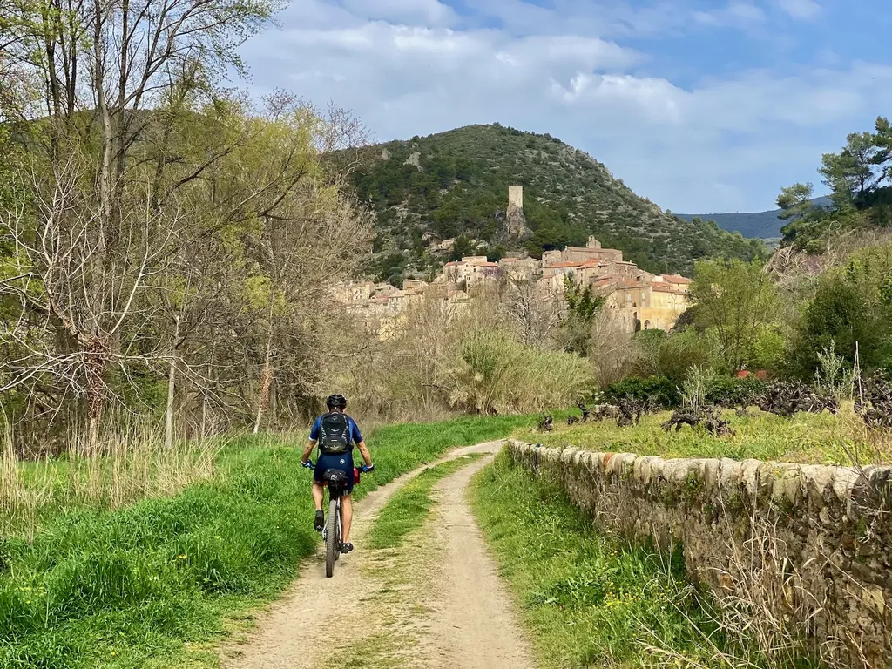
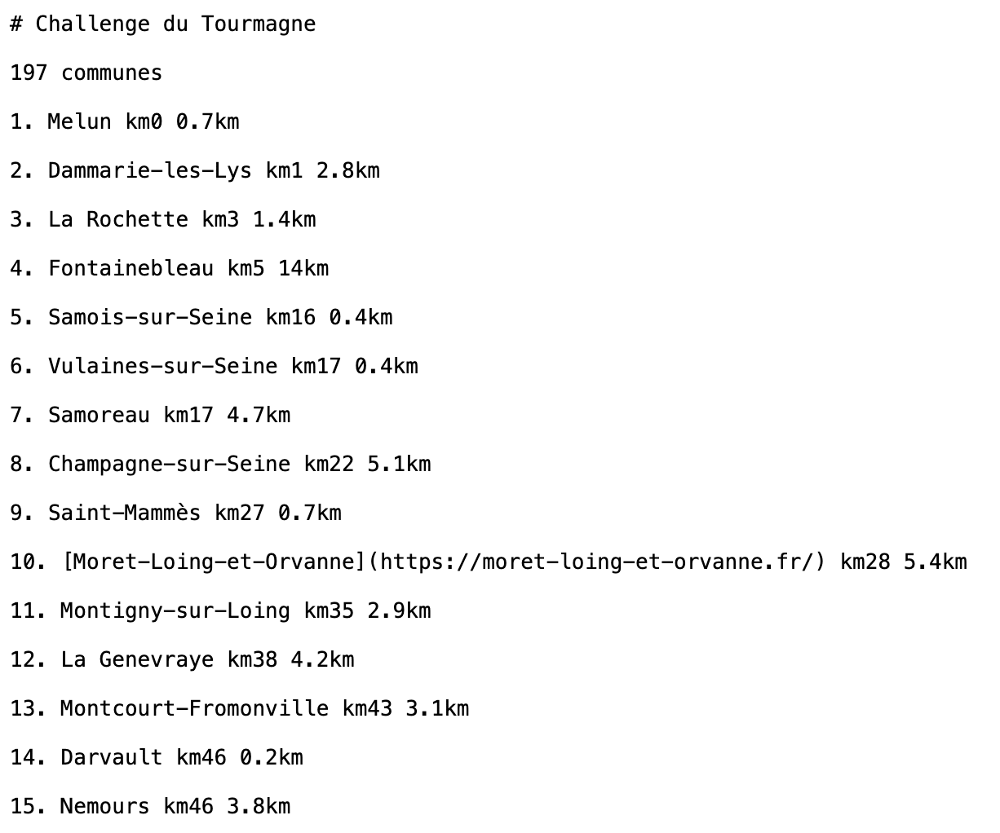
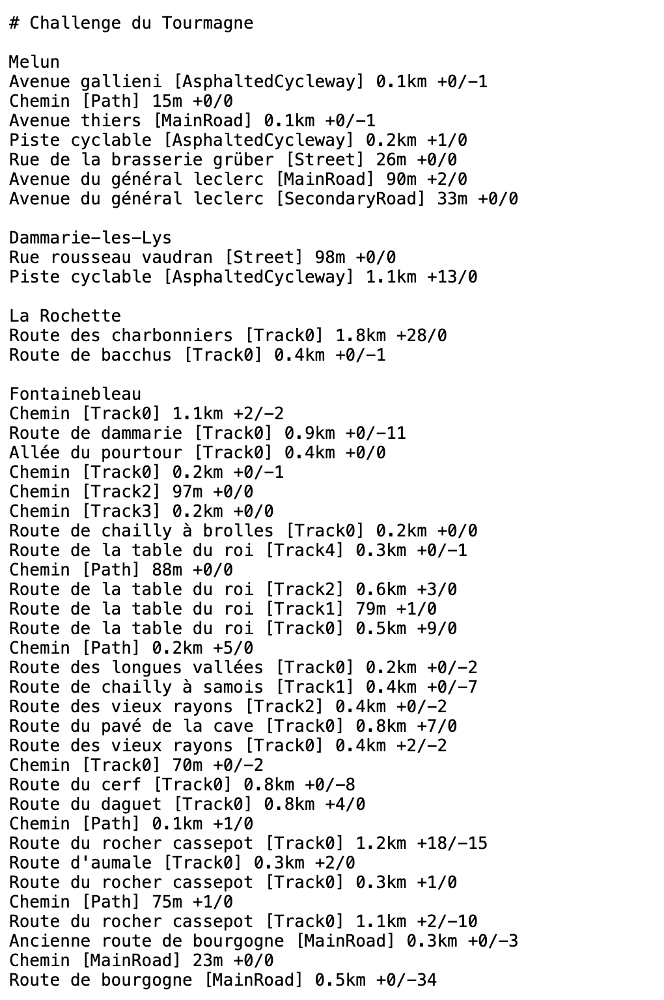
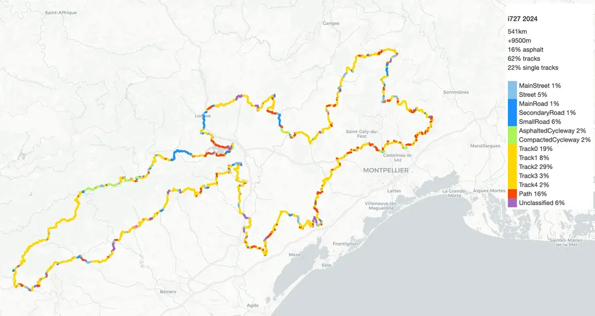

# Cuisiner les GPX pour les faire parler

Les GPS ont changé ma façon de faire du vélo, me poussant à explorer mon territoire dans ses recoins, à la recherche des moindres chemins et sentiers. Cette quasi-obsession se double d’une fascination pour nos traces GPX, et ce que nous pouvons leur faire dire. Le cerveau embrumé à cause d’un rhume insistant, j’en ai profité pour jouer encore une fois avec mes fichiers.

J’ai commencé par [créer un script python](https://github.com/tcrouzet/img2gpx) qui liste des communes traversées par une trace ([113 pour le i727](https://727bikepacking.fr/static/route-727_road_book.md), [197 pour le Challenge Tourmagne](https://727bikepacking.fr/static/route-tourmagne_road_book.md)).

J’ai en suite enrichi cette liste en insérant les noms des voies et leur nature, aboutissant un road book ([i727](https://727bikepacking.fr/static/route-727_road_book_plus.md), [Challenge Tourmagne](https://727bikepacking.fr/static/route-tourmagne_road_book_plus.md)). Il ne me restait plus qu’à consolider ces données pour générer des cartographies avec quelques statistiques ([i727](https://727bikepacking.fr/static/route-727_road_book_plus.html), [Challenge Tourmagne](https://727bikepacking.fr/static/route-tourmagne_road_book_plus.html)).

Avec ces cartes, d’un coup d’œil, on peut prendre le pouls d’une trace. Avec ses 63 % d’asphalte, le [Challenge Tourmagne](https://www.tourmagne.bike/fr/) s’impose comme une trace gravel quand le [i727](https://727bikepacking.fr/i727/) avec seulement 16 % d’asphalte est marqué VTT.

[J’avais déjà proposé un script pour générer des statistiques du même ordre](../../2023/10/asphalte-gravier-ou-terre.md), mais cette fois je suis allé un poil plus loin (même si mon code a besoin d’au moins 30 minutes pour traiter une trace de près de 1 000 km). La fiabilité de l’affaire ne dépend plus que de la fiabilité de la carte OSM, que je tente de corriger quand je note des erreurs flagrantes. Justement, ces erreurs impliquent le plus souvent de mauvaises références pour les surfaces. Avec mes cartographies colorées, il est plus facile de les repérer.

OK, beaucoup d’obsessions, mais j’ai une idée derrière la tête. J’aimerais utiliser les road books bruts pour générer des histoires qui raconteraient des traces. Je n’en suis qu’au début de ces explorations, qui ont davantage à voir avec la littérature générative que le vélo.

En attendant, il me suffit de lire les noms sur le road book du Tourmagne pour commencer à rêver. Route de la table du roi. Route du cerf. Route des vieux rayons. Me voilà parti. La toponymie m’a toujours passionnée.

#velo #y2024 #2024-3-30-15h53
