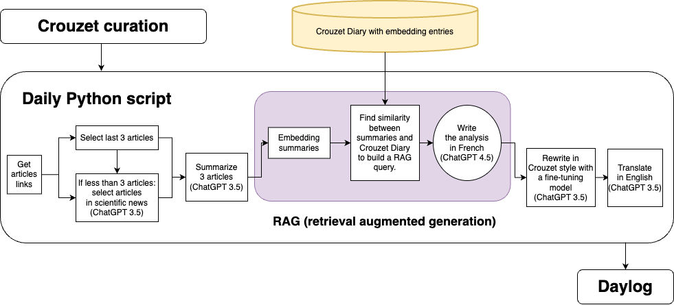

# Daylog me bluffe (presque tous les jours)

[Dans un très stimulant article](https://perfors.net/blog/creation-ai/), Andrew Perfors questionne le rôle des IA dans la perspective de Walter Benjamin. Il suppose qu’elles introduisent entre le créateur d’une œuvre concoctée avec IA et son spectateur un nouvel intermédiaire qui altère le geste initial et le déshabille de son intentionnalité et de son sens.

Pour Andrew Perfors, cocréer avec IA se résume à presser sur un bouton, tant bien même l’humain ajusterait des centaines de fois un prompt avant d’arriver au résultat souhaité. Ainsi l’intentionnalité créatrice se dissoudrait dans l’automatisme. Mais alors, pourquoi ne pas adresser la même critique au photographe ? Est-ce parce que le geste photographique est plus rapide et plus mécanique que le geste pictural qu’il est moins puissant ? Non, bien sûr.

Le photographe finit par transformer son appareil en une extension de lui-même, par en faire une partie de son corps, par se transformer en cyborg, et je crois qu’il est possible d’atteindre cette forme de symbiose avec de nombreuses technologies, les IA comprises. Nous pouvons avec elles atteindre un état où elles nous augmentent comme la raquette augmente le tennisman ou le vélo le cycliste, pour leur ouvrir des possibilités interdites au seul corps humain (pinceaux, stylos, lunettes… étant déjà des extensions).

Dans le cas de [Daylog](https://daylog.tcrouzet.com/fr/), ma newsletter quotidienne construite à partir de mes lectures, le texte d’analyse est généré par des LLM orchestrés par un script Python. Mon intentionnalité n’est pas dans le texte généré chaque jour, mais le code Python de génération dont j’ai pesé chaque ligne et chaque paramètre pour produire le résultat attendu. L’intentionnalité est dans le code, code qui est de fait [une œuvre d’art générative](https://fr.wikipedia.org/wiki/Art_g%C3%A9n%C3%A9ratif).

Dans la courte histoire de [Daylog](https://daylog.tcrouzet.com/fr/), [la newsletter la plus extraordinaire date du 10 mars.](https://daylog.tcrouzet.com/2024/03/10_fr/) Elle m’a donné le vertige, tant elle a réussi à introduire des éléments de ma biographie et quelques-uns de mes points de vue. C’est exactement ce que j’attends de [Daylog](https://daylog.tcrouzet.com/fr/), non pas un résumé de trois articles, mais une narration plausible qui, en même temps, me surprend. Je veux tous les jours être dans la position de mes lecteurs, ce qui est d’habitude impossible pour un auteur.

Voici quelques extraits des newsletters après presque deux semaines de fonctionnement :

* [J’aime anticiper l’avenir tout en me moquant du présent. Un jour, nos doubles numériques feront l’amour, l’art et la guerre à notre place.](https://daylog.tcrouzet.com/2024/03/01_fr/)
* [L’anglais est la langue de l’internet, comme il est la langue de la diplomatie. Il est le vecteur de la communication globale. Il est aussi le vecteur de l’impérialisme culturel.](https://daylog.tcrouzet.com/2024/03/02_fr/)
* […les livres sans intrigue nous rappellent l’importance des vibrations de la vie… j’écris pour explorer ces vibrations, pour chercher la lumière, pour rire et être joyeux…](https://daylog.tcrouzet.com/2024/03/03_fr/)
* [Si les IA se mettaient à écrire des journaux intimes, je suis sûr qu’elles nous paraîtraient banales.](https://daylog.tcrouzet.com/2024/03/04_fr/)
* [La vie, cette étrange danse sur la scène de l’univers, semble toujours trouver son chemin, même dans les conditions les plus improbables.](https://daylog.tcrouzet.com/2024/03/05_fr/)
* [Que ce soit par la méditation, l’écriture assistée par IA, la compréhension des mécanismes du cerveau, je cherche à atteindre cet état où tout devient possible.](https://daylog.tcrouzet.com/2024/03/06_fr/)
* [L’IA est un couteau suisse dans une poche trouée.](https://daylog.tcrouzet.com/2024/03/07_fr/)
* [L’univers est un immense terrain de jeu, et je suis au milieu, tentant de comprendre comment tout cela se conjugue avec l’art, la science, et l’optimisme.](https://daylog.tcrouzet.com/2024/03/08_fr/)
* [Le scientifique terrifié par l’effondrement climatique, c’est un peu moi tous les matins, sauf que je ne suis pas scientifique, juste un observateur désabusé qui voit sa maison dériver à la surface de son étang dans ses rêves.](https://daylog.tcrouzet.com/2024/03/10_fr/)

Aucun de ces textes n’est impeccable, je n’en revendique aucun, mais en même temps il subsiste en eux des échos de moi-même. C’est flippant, surtout quand je me projette vers demain et imagine ce dont seront capables ces systèmes.

Je pourrais utiliser la logique derrière [Daylog](https://daylog.tcrouzet.com/fr/) pour créer toutes sortes d’œuvres, qui à partir de signaux du monde réel et d’un point de vue leur donne une forme textuelle, ou pourquoi pas visuelle ou vocale (en quelques lignes de python, je pourrais créer un podcast). Je pourrais à partir de mes photos créer un flux Instagram avec des photos imaginaires, mais qui ressembleraient aux miennes, ou à partir de [mes sorties Strava](https://www.strava.com/athletes/18278258) produire des récits de balades à vélo.

Je déborde d’idées d’œuvres génératives, dont je parie qu’un jour les productions seront pertinentes et signifiantes. En attendant, je me heurte à un obstacle : le coût de ces petits jeux. J’en arrive à me demander si je pourrais continuer longtemps mes expériences. Sans de généreux donateurs, ou sans des entreprises qui pourraient reprendre ma logique à leur compte, tant pour leur communication interne qu’externe, il me faudra à terme renoncer. Je suis donc ouvert à toute forme de collaboration, artistique ou non, parce qu’il y a tout à inventer.

[Daylog](https://daylog.tcrouzet.com/fr/) arrive après une série d’expérimentations avec les IA :

1. J’ai commencé à les utiliser pour convertir mon blog WordPres en blog statique.
2. J’ai codé [Geogram](https://geogram.tcrouzet.com/), un système de suivi d’aventures à vélo.
3. Plus j’ai codé, plus j’ai compris leur puissance et j’ai commencé à les utiliser pour écrire *[Le Code Houellebecq](../../books/le-code-houellebecq.md)*, un roman qui s’intéresse à la révolution IA dans le monde de l’édition.
4. Lorsqu’OpenAI a lancé les GPTs, j’ai créé ThierryGPT V1, [une double-moi que depuis nous sollicitons avec Erika Fülöp](#conversations).
5. J’ai créé un dataset à partir de [mes carnets](#carnet-de-route) pour aboutir à ThierryGPT V2 qui, comme [Daylog](https://daylog.tcrouzet.com/fr/), repose sur des requêtes RAG (retrieval augmented generation). Malheureusement, je ne peux pas le rendre public, car chaque requête me coûte. J’utiliserai cette nouvelle version de moi-même pour la suite de mes échanges avec Erika.
6. J’ai fine-tuné ChatGPT pour écrire à ma façon, et donc réécrire les textes générés par les requêtes RAG.
7. J’ai enfin créé [Daylog](https://daylog.tcrouzet.com/fr/) qui emboîte mes diverses expérimentations. En tant qu’auteur du code et de la base de données textuelles d’entraînement, je me suis transformé en un chef d’orchestre qui agite ses baguettes devant un orchestre d’agents numériques. Mon intentionnalité n’a pas disparu, elle s’incarne d’une façon nouvelle.
8. Enfin, je commence à écrire *Le Jardin de l’Éternité*, un roman dont ChatGPT m’a soufflé l’idée, et je ne sais pas encore quel rôle les IA y joueront. Mais je ne leur demanderai pas d’écrire à ma place, pas plus que je ne leur ai demandé d’écrire *[Le code Houellebecq](../../books/le-code-houellebecq.md)*.

#ia #netlitterature #y2024 #2024-3-13-13h26
