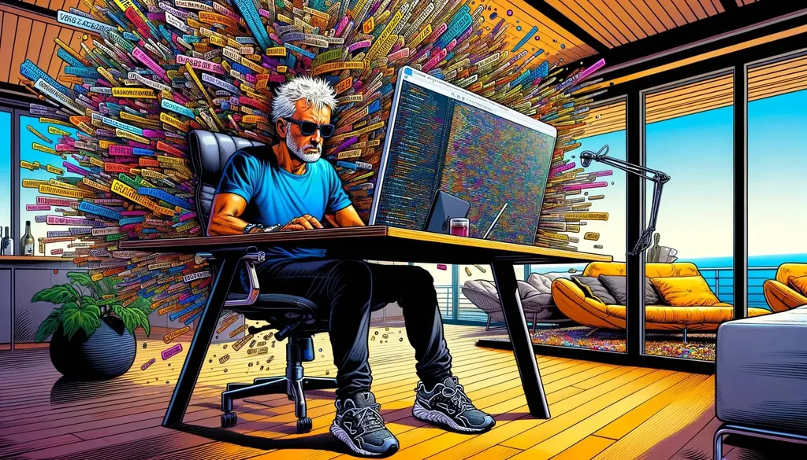

# Des textes réservés aux abonnés

Écrire aujourd’hui, ça signifie quoi ? Je n’en sais trop rien, mais j’ai envie d’ouvrir à nouveau mon atelier comme pour *[La quatrième Théorie](../../comments/page/la-quatrieme-theorie.md)* ou *[One Minute](../../comments/page/une-minute.md)*. Il ne s’agit pas d’expérimenter l’écriture collaborative, qui ne me convient pas du tout, mais de partager mon travail au fil des mois, et d’écouter les lecteurs susceptibles de m’influencer et de m’augmenter par leurs remarques. Je pourrais me contenter de m’appuyer sur les IA, mais justement leur émergence doit être contrebalancée par davantage d’humanité.

Dans ma newsletter, j’ai ajouté la possibilité de s’abonner à la rubrique *Écriture*. J’y ai inscrit par défaut ceux qui suivent mon blog et mes carnets, parce que mes projets se situeront à la croisée de ces deux modalités. Je ne publierai pas mes textes en cours d’élaboration sur le blog. Je les réserverai aux abonnées de la newsletter.

Parmi divers projets qui me préoccupent, il y a notamment *Le Jardin de l’Éternité*. Un roman sur l’histoire de l’univers selon le point de vue d’un jardinier immortel. Sur le blog, je publierai des articles pour expliquer la mécanique de l’écriture, mais les chapitres du roman seront réservés aux seuls abonnés d’*Écriture*.

Ce court billet a pour seule ambition de vous annoncer ma démarche, et de vous donner l’occasion de rester abonnés ou non à *Écriture*. Je crée cette rubrique pour ne pas encombrer votre messagerie (et segmenter mon audience comme on dit en marketing).

#cuisine #y2024 #2024-3-19-10h42
