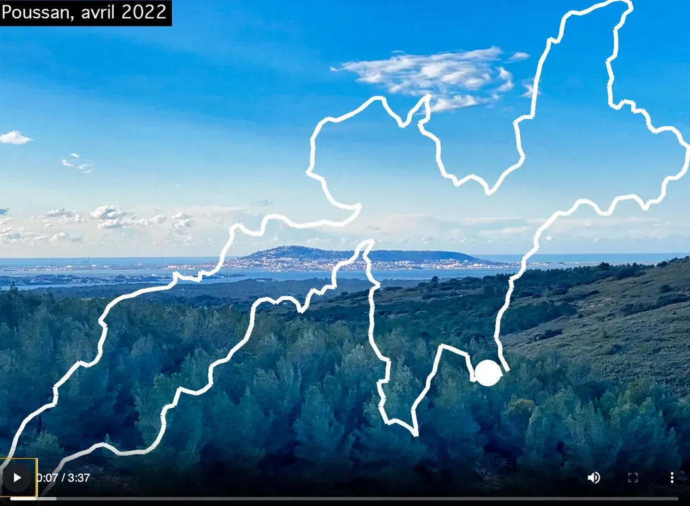

# Illustrer un GPX : exemple avec le i727

J’ai longtemps utilisé [Relive](https://www.relive.cc/) avant de trouver son modèle gratuit trop limité pour l’ajout de photos. Durant les vacances de février, j’ai initié mon fils cadet à Python en créant une variante simplifiée de Relive.

Résultat de notre collaboration, cette vidéo raconte en images la trace du [i727](https://727.tcrouzet.com/i727/) que nous roulerons début mai ([Grand Départ le 8 mai](https://727.tcrouzet.com/727-Grand-Depart/)). [Le code de notre application est disponible sur GitHub](https://github.com/tcrouzet/img2gpx) et vous pouvez l’utiliser librement pour illustrer vos propres traces.

J’avais désespérément besoin de cette solution. Je prends souvent des photos quand j’effectue des reconnaissances ou des 727, puis les empile dans le plus grand désordre, oubliant parfois de quels endroits elles proviennent. Pour compliquer le tout, je ne cesse de modifier mes traces, et certaines photos valables pour une édition ne valent plus pour une autre.

Nous avons donc imaginé un script qui recherche les photos prises à moins de 100 mètres de la trace, les ordonne, retrouve les noms des communes où elles ont été prises, génère une animation. J’y vois beaucoup plus clair, et des souvenirs remontent. À l’avenir, il me suffira de continuer d’empiler mes images pour leur donner vie.

#velo #y2024 #2024-3-8-12h44
