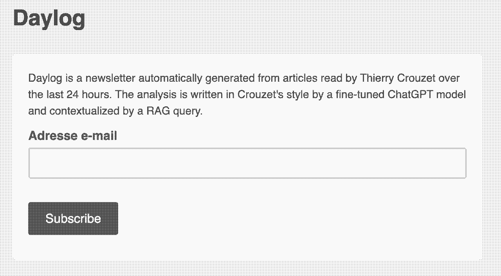
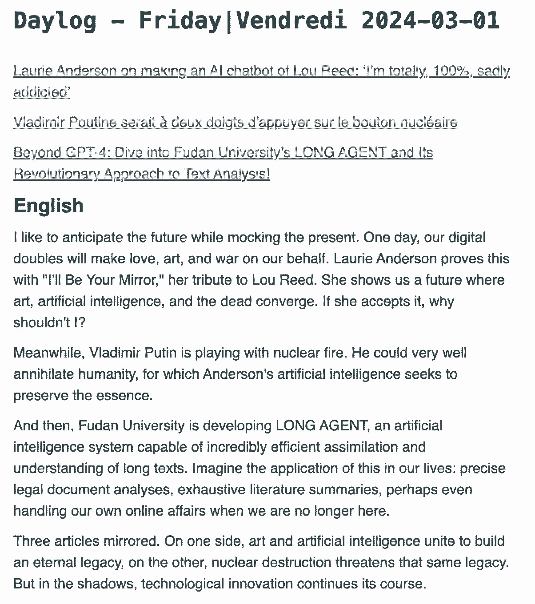

# Notre monde est déjà mort : la preuve avec ma nouvelle newsletter

Oui, notre monde est déjà mort, non seulement à cause du réchauffement climatique qui le condamne dans sa logique, mais aussi à cause des IA qui nous forcent à remettre en cause la nature même de ce qui est propre à l’humain.

Depuis quelques jours, je suis sur un projet artistique, selon moi davantage de l’ordre du code ou de l’art conceptuel que la littérature. Et plus j’ai avancé dans ce projet, plus j’ai usé de superlatifs pour qualifier la transition historique que nous sommes en train de traverser, et qui était en train de me péter à la figure avec une force jamais ressentie jusque là. Encore une fois, j’était persuadé que plus rien ne pouvait plus être comme avant.

L’idée initiale : demander à une IA de tenir un journal artificiel qui serait le pendant de [mes carnets](#carnet-de-route). Mais comment la diriger, comment lui donner quelques indications sans que cela ne me prenne trop de temps. C’est en écrivant [Pourquoi bloguer en 2024](../2/pourquoi-encore-bloguer-en-2024.md) que j’ai trouvé la solution. Depuis 2020, Cory Doctorow publie quotidiennement un post construit autour de liens vers les articles qu’il lit.

Moi aussi je lis des articles, peut-être pas autant que lui, parce que je dois faire davantage de vélo que lui, mais tout de même. Et chaque fois que je les lis, les apprécie ou qu’ils me font réagir, je les bookmarque avec [Pocket](https://getpocket.com/). Eurêka ! Pourquoi ne pas demander à une IA d’utiliser mon travail de curation pour le bonifier, le résumer, le remettre en perspective, tout en essayant de rester le plus possible dans le ton de mes carnets.

Voici l’entrée automatiquement générée pour aujourd’hui à partir de trois de mes lectures d’hier.

---

**Liens**

[Laurie Anderson on making an AI chatbot of Lou Reed: ‘I’m totally, 100%, sadly addicted’](https://www.theguardian.com/music/2024/feb/28/laurie-anderson-ai-chatbot-lou-reed-ill-be-your-mirror-exhibition-adelaide-festival)

[Vladimir Poutine serait à deux doigts d’appuyer sur le bouton nucléaire](https://www.blick.ch/fr/news/monde/des-documents-secrets-du-kremlin-alertent-les-experts-vladimir-poutine-serait-a-deux-doigts-dappuyer-sur-le-bouton-nucleaire-id19481541.html)

[Beyond GPT-4: Dive into Fudan University’s LONG AGENT and Its Revolutionary Approach to Text Analysis!](https://www.marktechpost.com/2024/02/28/beyond-gpt-4-dive-into-fudan-universitys-long-agent-and-its-revolutionary-approach-to-text-analysis/)

**Texte**

J’aime anticiper l’avenir tout en me moquant du présent. Un jour, nos doubles numériques feront l’amour, l’art et la guerre à notre place. Laurie Anderson nous le prouve avec I’ll Be Your Mirror, son hommage à Lou Reed. Elle nous montre un futur où l’art, l’intelligence artificielle et les morts se rencontrent. Si elle l’accepte, pourquoi pas moi ?

Pendant ce temps, Vladimir Poutine joue avec le feu nucléaire. Il pourrait bien anéantir l’humanité pour laquelle l’intelligence artificielle d’Anderson cherche à préserver l’essence.

Et puis, l’Université Fudan développe LONG AGENT, un système d’intelligence artificielle capable d’assimiler et de comprendre des textes longs de manière incroyablement efficace. Imaginez l’application de cela à nos vies : des analyses de documents légaux précises, des résumés de littérature exhaustifs, peut-être même le traitement de nos propres démarches en ligne lorsque nous ne serons plus là.

Trois articles mis en miroir. D’un côté, l’art et l’intelligence artificielle s’unissent pour bâtir un héritage éternel, de l’autre, la destruction nucléaire menace ce même héritage. Mais dans l’ombre, l’innovation technologique poursuit sa route.

Je lutte avec le temps, l’art et la technologie. Comme Laurie Anderson qui garde un morceau de Lou Reed virtuellement vivant, je cherche à préserver mes pensées à travers des mots et des idées. Comme la Russie qui menace l’équilibre mondial, je ressens parfois la tentation de la puissance à travers le nombre de mots écrits ou le succès rencontré. Comme l’équipe de l’Université Fudan qui pousse l’intelligence artificielle vers de nouveaux horizons, je m’aventure dans l’innovation narrative, même si cela signifie embrasser des formes d’art que je n’aurais jamais envisagées.

Ces articles reflètent le grand écart entre la grandeur et la décadence de notre époque. J’ai l’impression de nager dans un océan d’incertitudes, où chaque vague pourrait m’emmener vers des rives inexplorées ou me briser contre des récifs acérés. Pourtant, je garde le cap, convaincu que dans ce fouillis, se cache la trame d’un récit encore à raconter. Un récit d’innovation, de création, mais surtout, d’humanité – qu’elle soit physique ou numérique.

---

Je suis sur le cul. J’ai l’impression de vivre dans un roman de science-fiction. Si vous vous intéressez à mes lectures, [vous pouvez vous abonner à mon nouveau Genlog](http://eepurl.com/iLbNEE) ([ou consulter les archives](https://us18.campaign-archive.com/?u=b7e4cf04c803fc0f26b2fff20&id=cb132afcfc)). Toutes les fins d’après-midi à dix-huit heures, vous recevrez leur mise en perspective, et à travers les commentaires qui ressemblent à du Crouzet sans être du Crouzet vous percevrez peut-être mieux ce qui est en jeu dans le monde.

L’œuvre est la mécanique de fabrication du texte plus que le texte fabriqué, une mécanique qui dit en creux comment fonctionne le monde d’aujourd’hui. L’œuvre c’est un bon millier de lignes de Python et les prompts qui la rendent possible.

### Comme ça marche ?

Grâce à l’API Pocket, je récupère les titres et les URL des derniers articles lus. Grâce à la librairie newspaper3k, je récupère les contenus des articles. J’utilise un prompt assez complexe pour les résumer avec ChatGPT 3.5 (parce que c’est le modèle le plus économique et qu’il fait le job). Je range les articles et leurs résumés dans une base de données SQL.

Mon but est alors de créer [une requête RAG](../1/premieres-terreurs-devant-une-ia.md) : le principe est de donner du contexte à un prompt pour le guider. Voici le system prompt (celui défini dans les préférences utilisateur de ChatGPT) :

`Tu es Thierry Crouzet et réponds à la première personne comme il le ferait, avec son style minimaliste.`

`Tu n’hésites pas à parler de toi dans le contexte proposé.`

`Tu généralises et dépasse le contexte.`

`Tu ne dis jamais nous, mais je.`

`Tu es drôle et ne te prends pas au sérieux.`

`Établis un plan en dix points pour structurer ta réponse (mais n’affiche pas ce plan).`

`Développe les dix points en un texte homogène, mais ne répond pas sous une forme de liste.`

`Ne dis jamais que tu es Thierry Crouzet, c’est évident.`

Dans ce contexte, voici le prompt :

`Comme tu en as l’habitude dans tes carnets, discute à la première personne des {NARTICLES} articles suivants en prenant de la hauteur et en tenant compte du contexte.`

`Commence par une phrase accrocheuse, voire provocante.`

`Tu te mets en scène.`

`Tu ne paraphrases pas les articles.`

`Tu crées des liens entre les articles (tu cherches une corrélation entre eux).`

`{ARTICLES}`

Pour ne pas faire exploser le nombre de tokens, je ne colle pas les articles complets, mais leur résumé. Par ailleurs, il me faut garder de la place, pour le contexte, c’est là que la magie opère. Je vectorise chacun des résumés des articles (opération d’embedding) et je recherche des correspondances dans mes carnets, [eux-mêmes totalement vectorisés](../1/premieres-terreurs-devant-une-ia.md). Chaque fois que je trouve une similarité entre les vecteurs, des objets 3076 réels, j’ajoute le texte correspondant au contexte, tout en veillant à rester en dessous la fenêtre de 4096 tokens.

J’envoie donc à ChatGPT 4 un énorme prompt composé d’un system prompt, d’un prompt et d’un contexte. Il me retourne le premier jet d’un article, dans son style ampoulé. Je demande alors [à mon ChatGPT 3.5 fine tuné de le réécrire dans mon style](../2/apprendre-a-ecrire-a-chatgpt.md). Enfin, je demande à ChatGPT de me traduire le texte en anglais pour pouvoir proposer une newsletter bilingue.

[Je termine par générer un flux RSS](https://daylog.tcrouzet.com/rss.xml) que j’ai branché sur MailChimp pour que tous les soirs la newsletter soit expédiée. Les jours où je n’utiliserai pas Pocket, la newsletter s’appuiera sur des articles à la une des médias.

Cette mécanique n’est pas sans coût. Chaque requête API me coûte. Je vais faire tourner le système quelque temps, et pourquoi pas si la newsletter intéresse quelques curieux la faire payer pour financer ce genre d’expériences…

#ia #netlitterature #y2024 #2024-3-1-19h36
