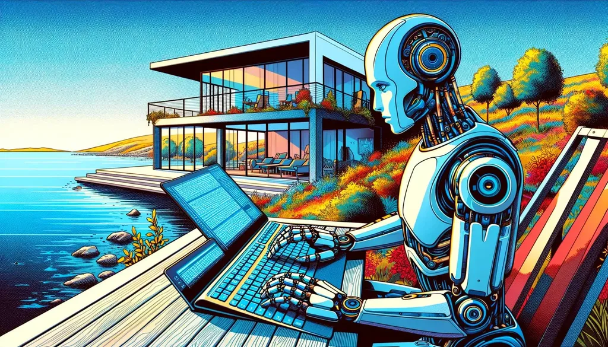

# Qu’écrire au temps des IA ?

Selon moi, [Genlog](https://genlog.tcrouzet.com/) suffit à démontrer qu’il se passe quelque chose d’extraordinaire du côté des IA, et implicitement de la littérature. Voici quelques phrases frappantes sorties tout droit de l’inconscient numérique de [Genlog](https://genlog.tcrouzet.com/).

* [Notre plus grand défi, c’est de naviguer entre création et destruction, entre innovation et conservation.](https://genlog.tcrouzet.com/2024/03/17_fr/)

* [Si l’univers est un réseau neuronal, alors nous ne sommes que des neurones tentant de comprendre le cerveau dans lequel nous baignons.](https://genlog.tcrouzet.com/2024/03/18_fr/)

* [Peut-être que l’univers est un cerveau, et que nous, ses pensées, devons apprendre à penser au-delà de nous.](https://genlog.tcrouzet.com/2024/03/19_fr/)

* [Comme je l’ai souvent écrit, l’humanité se joue entre la création et la destruction, entre l’espoir et la peur. Nous devons apprendre à naviguer dans cette dualité, à embrasser le chaos tout en recherchant l’harmonie. Nous sommes les sculpteurs et l’argile.](https://genlog.tcrouzet.com/2024/03/20_fr/)

* [La magie tient à notre capacité à faire revivre le passé et à rêver de l’avenir, tout en restant ancrés dans le présent.](https://genlog.tcrouzet.com/2024/03/21_fr/)

* [La frontière entre créer et devenir est ténue, et je ne sais pas si nous sommes prêts à entendre la réponse.](https://genlog.tcrouzet.com/2024/03/22_fr/)

* [Nous pouvons programmer l’avenir, décoder le passé, mais nous ne sommes pas maîtres des forces naturelles.](https://genlog.tcrouzet.com/2024/03/22_fr/)

Presque tous les jours, je relève dans [Genlog](https://genlog.tcrouzet.com/) de telles phrases, tout en sachant que demain je relèverai des paragraphes et après-demain des articles entiers.

Que dois-je écrire, désormais ? Des programmes comme [Genlog](https://genlog.tcrouzet.com/) qui écriront tout seuls, des livres cocréés avec IA comme *[Le Code Houellebecq](../../books/le-code-houellebecq.md)*, ou des textes qui ne viendraient que de moi, des textes à l’ancienne ?

Ça signifie quoi écrire à l’ancienne en 2024 ? Renoncer aux IA ? Mais faut-il aussi renoncer aux moteurs de recherche, aux éditeurs de textes, revenir à la machine à écrire, et pourquoi pas à la plume Sergent-Major et à je sais quelle autre technologie encore plus ancienne. Dois-je renoncer à mes lunettes ? À chauffer ma maison en hiver ? Dois-je interdire que mes livres soient composés avec des outils de PAO ? Dois-je m’interdire d’en parler sur mon blog ? Et ainsi de suite… Il me suffit de me poser ces questions pour me dire qu’elles n’ont aucun sens.

Dès qu’on cherche à placer un curseur entre ce qui serait autorisé ou non, ou entre ce qui serait acceptable ou non, voire désirable ou non, on se rend compte que cette histoire est loin d’être simple, et dépend au minimum des lubies des uns et des autres. Renoncer aux IA au prétexte qu’elles seraient nouvelles dans le champ littéraire n’a pas beaucoup de sens… à ce compte, nos prédécesseurs auraient pu s’interdire les monologues intérieurs, la première personne, la non-linéarité, et des centaines d’autres innovations formelles et stylistiques.

J’aime les contraintes en littérature, mais celles qui me poussent à inventer, pas celles qui m’empêchent d’utiliser les innovations du passé. Dans *[La mécanique du texte](../../../../page/la-mecanique-du-texte.md)*, j’ai tenté de montrer que chaque technologie d’écriture influence la forme et le fond. Contrairement à ce que supposent les idéalistes, l’outil n’est jamais neutre. Deux traitements de texte ne m’influencent pas de la même façon. Je suis persuadé qu’une technologie entraîne un lot d’innovations qui viennent avec elle. Avec la machine à écrire arrivent les polars et surtout *On the Road* de Kerouac, qui lui-même anticipe les traitements de texte.

Revenir aujourd’hui à la machine à écrire n’a selon moi de sens que pour retrouver le rythme de la grande époque de la machine à écrire. Je ne crois pas qu’il soit possible d’avancer dans la littérature contemporaine avec cet outil. Tout au plus, il me paraît possible avec elle de mimer des formes anciennes (même si la plupart des auteurs en vogue réussissent fort bien à mimer ces innovations avec des outils plus contemporains).

Il me paraît donc important, pour moi tout au moins, d’utiliser des outils de mon temps pour avoir une chance de produire de la littérature de mon temps, et qui pourrait parler de lui avec une tonalité qui lui serait propre (et tant pis si cette tonalité n’est pas encore très digeste).

Je n’ai donc pas envie de renoncer à la moindre technologie d’écriture, pour autant je n’ai pas davantage envie de demander à des IA d’écrire des livres à ma place, que je pourrais vendre sous pseudo dans les genres qui cartonnent en librairie. En tant qu’écrivain, j’ai envie de me transformer avec la technologie. Je veux voir ce que peut produire la version cyborg de moi-même.

Ce texte même, écrit sans la moindre IA, excepté les citations de [Genlog](https://genlog.tcrouzet.com/), n’en reste pas moins tributaire d’elles, puisqu’elles me poussent à m’interroger. Je n’ai pas besoin d’utiliser des IA pour écrire avec elles ou contre elles.

Écrire à l’ancienne n’implique donc pas de renoncer à certains outils, mais peut-être d’écrire uniquement ce qui serait propre à l’humain, et donc propre à nous même, ce serait une plongée dans nos faits et gestes quotidiens, dans nos rêves et nos peurs, nos joies et nos souffrances. Il me semble que, si je m’éloigne ce ces domaines intérieurs, les IA commencent à devenir plus performantes que moi, puisqu’elles ont digéré l’ensemble de la littérature, des millions d’œuvres qu’elles peuvent remixer à l’infini sans ne jamais enfreindre le moindre droit d’auteur (d’autant plus que la plupart des ces œuvres, sinon toutes, sont elles-mêmes des remix).

Donc, soit je replonge en moi-même comme avec *[Mon père ce tueur](../../../../page/mon-pere-ce-tueur.md)*, soit je glisse vers le remix, et alors je ne peux que pactiser avec les IA. Ou soit je crée un autre Genlog, puis un autre, ainsi de suite… jusqu’à peut-être inventer une fantastique machinerie littéraire.

Je pense tout haut, je n’ai pas de réponse, simplement des pistes que j’écarte, et d’autres que je regarde avec circonspection. Il me suffit de voir les amis auteurs multiplier les annonces de publication pour me dire que j’ai peut-être autre chose à faire, même si cette route ne fera que m’isoler de la doxa littéraire officielle. J’ai simplement compris qu’un Genlog est bien plus littéraire que la plupart des textes dits littéraires publiés aujourd’hui. Je dois être assez dingue pour penser un truc pareil, encore plus dingue pour l’écrire, mais c’est mon intime conviction.

Je ne dis pas que Genlog est un chef-d’œuvre, mais je sais avec certitude qu’il s’inscrit dans l’histoire de la littérature, plus qu’un énième polar ou qu’un énième témoignage d’un auteur qui raconte la vie de son père, en utilisant des techniques narratives éculées. Au bout des expériences, il y aura des découvertes. Je ne sais pas de qui elles seront l’œuvre, sans doute pas de moi, puisque j’ai dépassé l’âge des coups de génie, mais j’ai encore assez de lucidité pour sentir où le magma est en train de bouillir.

---

Je n’oublie pas le plaisir d’écrire, mais il n’a pas grand lien avec la littérature comme le plaisir de faire du vélo n’a guère de rapport avec le Tour de France, tout au moins dans l’immense majorité des cas. Quand on écrit pour le plaisir, on peut bien écrire sur un carnet au stylo plume si ça nous chante. Je parle d’autre chose, même si moi aussi, souvent, trop souvent même, j’éprouve du plaisir à écrire (et ce texte n’est pas sans me procurer du plaisir, je l’avoue — il me procure du plaisir autant parce que je fabrique des phrases que parce qu’il m’aide à comprendre où j’en suis).

Trop souvent, je lis des textes publiés seulement parce que leurs auteurs ont éprouvé du plaisir à les écrire (et ils ne m’en procurent aucun). Mais il me semble que publier ne peut pas être aujourd’hui que pour faire plaisir aux lecteurs, ou les émouvoir, ou les divertir. Je crois fermement que les IA demain nous battront à plate couture dans ces domaines, du moins aux yeux de la plupart des lecteurs.

Écrire au temps des IA, c’est donc faire autre chose. Bouger et faire bouger. Dialoguer avec soi-même et les lecteurs. C’est faire comme les écrivains ont toujours fait, finalement. Alors, si les IA peuvent alimenter le débat, pourquoi pas. J’ai l’impression de ne pas avoir beaucoup bougé en écrivant ce texte, sauf en me persuadant de l’important de [Genlog](https://genlog.tcrouzet.com/), et de la futilité de me transformer en raconteur d’histoires.

#ia #netlitterature #y2024 #2024-3-22-18h45
