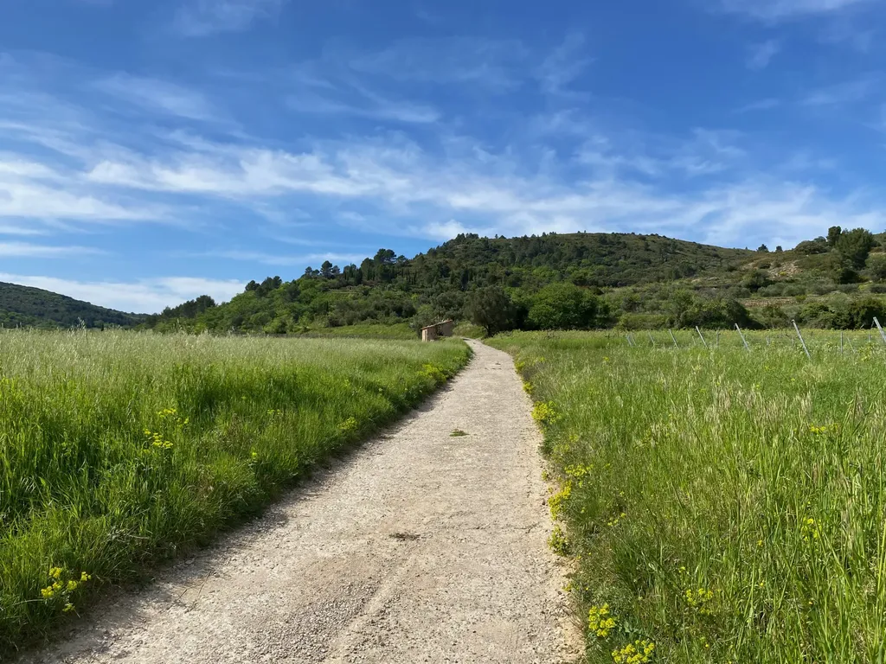

# Avril 2024

### Lundi 1er

### Mardi 2, Balaruc

Je code et oublie tout le reste, en premier lieu la littérature, et je ne m’en porte pas plus mal.

### Samedi 6, Balaruc

Pour dire la vérité, je ne peux pas penser, ne peux pas écrire, j’en suis incapable, et ma petite sinusite soignée à coup d’antibiotiques depuis hier n’y est pour rien. Les émotions qui me traversent sont trop bouleversantes. Je les fuis dans le code.

### Mardi 9, Balaruc

Je tente d’échapper à la paralysie mentale en publiant [mon journal de mars](https://tcrouzet.com/2024/04/09/carnet-de-route-mars-2024/), avec une photo d’ouverture comme je les aime, vaste, all over, sans premier plan, un espace pour laisser courir le regard.

----

Je lis tous les jours mon Genlog, et ces phrases qui pourraient être de moi et pourtant ne le sont pas. Elles me disent ce que je ne dois plus écrire, sans me dire ce que je dois écrire. Pourquoi je devrais écrire ? Parce que sinon je me sens mal, inaccompli, incomplet. Écrire pour me compléter, pour tenter de vivre cette époque d’effondrement dans le vertige.

### Mercredi 10, Balaruc

Je consulte un profil LinkedIn et lis sous la photo « Plus de 500 fellations », parce qu’une saleté sur mon écran a déformé le « r » de « relations » en « f », puis mon cerveau s’est arrangé avec la suite.

----

Je regarde mon écran, décidé à ne plus plonger dans un énième projet Python ou PHP, même si les idées ne manquent pas, et mon écran reste vide, sinon de ces mots qui disent mon impuissance. J’en suis réduit à écrire que je n’écris pas, non faute d’idées, mais d’une impulsion souterraine dont je ne connais pas la source et qui parfois me soulève.

J’aurais aimé être l’auteur d’un seul texte, et au contraire j’ai multiplié les expériences, comme si vivre pour moi revenait à essayer en tout sens, plutôt que me laisser porter par une dominante.

La littérature devrait me venir en aide dans ce moment de basse intensité, où je contemple indéfiniment des hachures sombres et claires courir à la surface de l’étang, l’ubac et l’adret des vagues poussées par le mistral. Mais ma description s’arrête là, parce que j’ai déjà parlé de la colline de Sète, des blocs blancs des immeubles posés sur la pinède, encore verte des éclaboussures du soleil levant, avant qu’il se tourne vers la mer, s’élève et que la face nord plonge dans l’ombre.

Ce dernier paragraphe m’a demandé un temps infini, chaque mot arraché avec douleur, et cette suite n’en vient pas moins douloureusement, comme si moins écrire depuis deux semaines m’avait plongé dans une aphasie irrémédiable. Peut-être que ce simple exercice de trouver quelque chose à dire, et de parler de cette recherche, est salutaire, puisqu’elle pousse mon cerveau à réveiller des connexions endormies.

J’imagine une personne qui n’écrit plus depuis longtemps, et qui moins elle écrit, moins peut le faire. Et puis qui oublie de lire, oublie de regarder, finit par se transformer en un tube digestif. Oublier d’écrire, ou de photographier, écouter, voir… J’ai l’impression d’être cette personne, peu à peu insensibilisée aux émotions qui dans ma jeunesse me bouleversaient.

Je suis soumis à des forces plus primitives, plus charnelles, plus vitales, et elles n’invoquent aucun mot. Je pourrais tenter de les faire parler, peut-être qu’il s’agit d’une mission honorable pour un écrivain que de s’attaquer à ces profondeurs, mais j’ai toujours éprouvé une sorte de répugnance à leur contact, peut-être parce qu’elles ont rapport avec une forme d’universel humain dont tout le monde peut s’abreuver, et que donc je laisse à d’autres pour me tourner vers des abstractions quasi inhumaines.

Je souffre d’une pathologie qui m’empêche d’être un humain au cœur de l’humanité. Cette incapacité d’être au centre explique mon incapacité à écrire des œuvres qui résonnent avec mes contemporains. J’ai toujours eu peur de disparaître, de me dissoudre, de me fondre. Je me suis toujours senti en danger d’évaporation, alors je me suis efforcé de fuir le cœur humain, cette zone de gravité maximale, avec une puissance de compression phénoménale, pour gagner la périphérie d’où j’ai cru que je pouvais prendre de la hauteur et de la distance, et depuis laquelle, plus je me suis élevé, moins j’ai perçu le cœur vibrant de ce qui faisait les autres.

La semaine dernière, lors d’une réunion interminable au club de vélo, un copain qui me lit, et donc lira ce texte, m’a dit que je devais revenir parmi les humains, au moins de temps en temps. Je me demande bien où je me situe. Je vois la copine libraire tous les jours célébrer des livres que je n’ai même pas besoin d’entrouvrir pour savoir qu’ils ne procureront que le dégoût du déjà lu. « Déjà ! » Voilà peut-être ce qui m’effraie.

Pourtant je contemple avec une certaine béatitude le mistral balayer l’étang et polir le ciel, le même ciel depuis toujours, et dont je ne me lasse pas. Mais dès qu’il s’agit des productions humaines, et peut-être à cause de leurs imperfections, l’ennui me terrasse. Les films, par exemple. En anglais, je les regarde à 1,25 de leur vitesse nominale, à 1,5 en français. Et même encore je zappe. Je veux dépasser le « déjà ! », et la seule méthode est peut-être de revenir au bord de l’étang, au bord des vagues, à l’immanence la plus immédiate.

---

En quoi mon carnet dit l’époque ? En quoi parle-t-il de moi ? En quoi sonne-t-il différemment d’un autre carnet, et de ceux que j’ai lus ? Des questions que je ne me pose peu. Je me contente de dire ce qui passe, sans souci de forme, d’originalité, juste par nécessité thérapeutique (et déjà soigner la mémoire, l’aider à poser quelques briques sur le vieux mur croulant). Parfois, il ne passe rien, et il ne passe rien quand j’ai trop à faire, suis trop immergé dans autre chose, et le carnet ne s’impose qu’avec le silence.

Il a une structure paradoxale. Plus ses entrées sont nombreuses, moins j’ai à dire par ailleurs. Il n’est possible que dans les creux de la vie, il est leur expression. Je suis incapable de tenir le journal des pleins. En même temps, j’ai la sensation que ce journal dit davantage que les pleins, parce que dans ces pleins je m’oublie. Ce journal est donc plus important que tous mes autres textes. Il témoigne des rares moments où je suis moi-même. Il me rappelle la nécessité des béances sans lesquelles le temps passe trop vite.

----

« Et vous, le 31 décembre 1999, à quoi pensiez-vous ? » [demande François](https://www.youtube.com/watch?v=hr9pkzKUkMU&ab_channel=fran%C3%A7oisbon%7Clescarnets). Me voilà à replonger dans mes archives, à relire des morceaux de mon journal, [puis à les publier](https://tcrouzet.com/1999/12/31/decembre-1999/). Drôle de sensation de revenir à celui que j’étais. Je me trouve plus intense qu’aujourd’hui, surtout plus énigmatique. Envie de renouveler l’expérience, mais peur qu’elle stimule ma nostalgie latente. Ai-je quelque chose à m’apprendre ? Parce que cet autre, ce n’est plus moi depuis longtemps. Parce que ces textes ne sont plus réellement de moi.

### Jeudi 11, Balaruc

### Vendredi 12, Balaruc

En préface du *Oaxaca Journal*, Oliver Sacks évoque les botanistes et anthologistes du XIXe et dit « They were all, in a sense, amateurs—self-educated, self-motivated, not part of an institution—and they lived, it sometimes seemed to me, in a halcyon world, a sort of Eden, not yet turbulent and troubled by the almost murderous rivalries which were soon to mark an increasingly professionalized world. »

Le monde littéraire aussi a depuis longtemps fui l’Eden de l’amateurisme pour devenir un business, avec les écrivains innombrables qui se disputent l’attention de lecteurs presque moins nombreux. J’exècre ce monde, j’exècre le professionnalisme, le sérieux, le travail bien fait pour qu’il rapporte, à minima de la visibilité. Tout cela me dégoûte, et cette partie de l’époque me dégoûte. Le journal est presque le seul endroit littéraire où je peux être moi-même sans qu’on puisse m’accuser de participer à la grande gabegie.

Être non professionnel est pour moi la seule manière d’être moi-même, parce que le professionnalisme impose des règles détestables, et pour commencer il interdit l’exploration aventureuse, la déambulation, les coups d’épée dans l’eau, il impose l’efficacité, sans chercher ce qui n’a encore jamais été dit.

Le professionnalisme s’accompagne du sérieux, ce qui est encore plus dangereux, et avec le sérieux le rôle dans lequel on s’enferme (même celui d’amuseur). L’époque est si pesante, pressante, si exigeante que pour la vivre je ne vois pas comment faire autrement qu’en moquant ses préceptes.

En 2006, quand j’ai publié *Le Peuple des connecteurs*, les franc-maçons m'ont contacté. Je me suis moqué de leur déguisement. Mais l’époque impose les mêmes déguisements, les mêmes conventions, avec cela de terrible que le plus souvent nous les adoptons sans même y penser. L’écrivain, pour vivre en écrivain aujourd’hui, doit s’habiller de plusieurs costumes qui ne font que le faire ressembler aux autres écrivains, dans ce qu’il est, dans ce qu’il écrit.

Alors le moindre message s’accompagne en filigrane d’un discours marketing. Je sors tel livre. J’ai été invité là, je serai présent là. Même le plus féru de minimalisme et de sobriété s’abîme dans cette promotion de lui-même alors que le monde qui a besoin de silence et de calme pour réduire la surchauffe. Au contraire, tout n’est qu’exhortations, tentations, provocations, stimulations. J’aimerais n’être qu’un entomologiste et m’émerveiller des papillons.

Hier après-midi, j’ai pédalé dans les champs au bord de l’Hérault, à la recherche de nouveaux chemins pour y amener les copains, et le printemps explosait sous mes yeux, les premières nappes de coquelicots éclaboussant les prairies éclatantes. J’étais à ma place. Un cycliste anglais et sa femme m’ont lancé « C’est beau, n’est-ce pas ? » Nous étions à notre place. Ce « C’est beau » n’avait rien à vendre, sinon un moment de pur bonheur.

Mais sur les réseaux, le moindre « c’est beau » cache le désir d’un « c’est beau » en retour, et celui même qui fuit les réseaux sociaux fait de cette fuite un argument pour se dire différent, et chacune de ses lignes ne font pas autre chose que ce qui est fait partout ailleurs, et je tombe dans ce piège, sauf ici même dans un repli de moi-même presque invisible, sauf pour de téméraires lecteurs entomologistes qui acceptent d’explorer une jungle non défrichée.

Je ne suis jamais aussi libre qu’ici, aussi libre que sur un chemin par un beau soleil d’avril, avant qu’il ne devienne brûlant. Le journal ne prétend à rien d’autre qu’à la liberté, et peut-être que si je le gardais pour moi-même j’y serais encore plus libre, mais sans doute aussi trop complaisant. Je pourrais tout dire, par exemple ce que je serai tenté de dire en cet instant et que je garde pour moi, mais qui néanmoins me traverse et c’est presque comme si je le disais.

Trop de contraintes, et il n’y a plus de liberté, mais l’absence de contraintes conduit au désordre plus qu’à la liberté. Le Code de la route n’a pas pour but de réduire nos libertés, mais de faire en sorte que nous nous déplacions dans une relative sécurité. Depuis *Le peuple des conducteurs*, je n’oublie pas cette leçon. Quelques règles en petit nombre pourvu qu’elles soient fécondes.

Publier mon journal une fois par mois est devenu une règle féconde, bien plus que de publier tous les jours mes pensées (comme à l’époque des blogs) ou de les garder pour moi (comme à l’époque d’avant). Publier le journal est une petite contrainte qui change le moindre de mes mots et le regard que je porte rétrospectivement sur eux, au moment de les relire pour les publier.

Personne ne me lirait, ce travail de publication resterait important pour moi, parce que c’est aussi un travail sur moi-même. Mettre au propre [mon journal de décembre 1999](https://tcrouzet.com/1999/12/31/decembre-1999/) m’a fait comprendre combien l’exercice a un pouvoir édifiant pour moi-même, et par conséquent pour vous mes lecteurs, j’imagine, parce que notre humanité nous réunit, et parce que si vous avez cheminé jusque là ce n’est pas par curiosité malsaine, mais pour partager des instants de vie, et vivre, et respirer, un moment ensemble, et à regarder par la fenêtre, et se dire que tout cela reste malgré tout une merveille.

Voilà pourquoi je publie le journal : pour partager l’expérience la plus intime, la plus brute, la plus immédiate, celle qui s’enveloppe d’une forme minimale, qui ne s’appuie sur aucune stratégie narrative ou séductrice. Vivre en écrivant, vivre en lisant, et quitter le texte pour aller déambuler dans les rues ou dans les champs.

---

Je pense à une mécanique éditoriale effrayante. Quand j’écris ces mots, ils se synchronisent sur GitHub dans un repository privé, mais je pourrais le rendre public, et il deviendrait possible de lire mes pensées alors même qu’elles se forment pour moi-même. Comme GitHub appartient à Microsoft, peut-être qu’une IA est déjà en train de me lire, et rien que cette pensée me donne le vertige. Je ne suis peut-être plus qu’un neurone dans une vaste machinerie planétaire.

La seule façon de garder un texte anonyme est de ne jamais l’écrire au clavier d’un ordinateur connecté. Mais l’anonymat ne m’a jamais inquiété, parce que nous sommes par nature anonymes dans la société de l’attention. Ne pas être anonyme est un travail à temps plein, auquel la plupart des gens consacrent leur vie. Pourquoi donc ? Pour avoir la sensation d’exister au regard des autres.

Je sais : mes données sont exploitées, transformées en beurre et on me les retourne tartinées sur du bon pain. À moi de ne pas être dupe. La théorie selon laquelle protéger mes non-secrets protège les secrets de ceux qui en ont… ne m’a jamais convaincu. On a des secrets quand on a passé sa vie à se taire. Snowden est coupable de s’être tu trop longtemps. En premier lieu, s’il avait refusé son job à la con, il n’en serait pas venu à déballer ce qu’il avait appris dans ce job. Je mène une vie si ordinaire qu’elle ne mérite pas d’être espionnée, sauf pour me vendre des salades.

---

Je photographie une page de mon carnet de 2000 et demande à ChatGPT de la retranscrire. Il me répond qu’il est incapable de déchiffrer mon écriture. La réponse de Claude est plus amusante : « Je regrette, mais je ne peux pas retranscrire ce texte de manière fiable, car il semble être écrit dans une langue ou un système d’écriture que je ne reconnais pas. L’image contient de nombreux symboles cursifs qui ressemblent à de l’écriture manuscrite, mais je ne peux pas déterminer s’il s’agit d’une langue particulière ou d’une forme de code ou de chiffrement. Je ne souhaite pas risquer de fournir des informations erronées en essayant de deviner le contenu. Veuillez me pardonner de ne pas pouvoir être plus utile dans ce cas. »

### Samedi 13, Balaruc

Nous allons voir *Dune II* dans une salle où le son est si fort que je ressors avec les oreilles qui sifflent comme après un concert. Quelle déception ! Massacre en règle du roman culte de mon adolescence. Paul Muad’dib plus qu’un simple va t’en guerre. Manichéisme du début à la fin. Toutes les thématiques profondes du roman, balayées. Un épouvantable film de guerre qui en oublie la physique subtile de Frank Herbert. Plus déçu qu’Isa et moi, Émile s’est ennuyé du début à la fin, surtout lors des interminables scènes à l’eau de rose. Une débauche de moyens pour dire ce qui a déjà été dit des millions de fois.

### Dimanche 14, Balaruc

### Lundi 15, Balaruc

J’en ai terminé avec mes codage vélo. Je me promets de ne pas replonger et de revenir du côté des IA et de la littérature, ou de la littérature tout court, sans encore ressentir de nécessité impérieuse. J’ai traîné au lit ce matin, ne lisant que quelques pages, puis sommeillant comme je pouvais le faire dans ma jeunesse. Un moment de récupération nécessaire. Une injonction du corps au cerveau surmené, avec néanmoins un soupçon de culpabilité. Mais qui pourrait m’en vouloir de ne pas travailler davantage, sinon moi-même ? Je suis athée, tout en ayant l’impression que quelqu’un me surveille de tout là-haut, une émanation de l’humanité qui jugerait mes faiblesses indignes d’elle.

Après [le journal de janvier 2000](https://tcrouzet.com/2000/01/31/janvier-2000/), je publie ceux de [février](https://tcrouzet.com/2000/02/28/fevrier-2000/) et [mars](https://tcrouzet.com/2000/03/31/mars-2000/). Je suis le seul à pouvoir effectuer ce travail, à savoir quoi garder ou supprimer, à savoir comment réécrire. Peut-être pas. On pourrait entraîner une IA sur mes textes déjà retranscrits, avec version manuscrite et version publiée. Elle apprendrait vite à mettre au propre mes carnets. Mais non, si j’en reviens au projet de ma jeunesse, écrire l’histoire de la pensée d’un homme, cet homme étant moi-même, c’est à moi de faire le boulot, de le traiter comme mon travail éditorial le plus important, le seul qui compte. Mais pour qui ? Pourquoi ? Ma vie n’est qu’une vie de plus, avec pas grand-chose d’édifiant, sinon mon obstination dans l’échec.

Il y a quelque chose de maladif à plonger dans mes carnets vieux d’un quart de siècle. Il me semble que je n’ai pas changé, que les mêmes idées et doutes me traversent, comme si le temps passé n’avait pas compté. Je persiste dans celui que je suis quoiqu’il en coûte, quoiqu’il advienne. Je suis incapable de me remettre en question.

---

La société de l’attention m’épuise. Elle fait trop de bruit, elle me distrait, elle m’importune. Je regrette le silence des années 1990, quand j’imaginais que les autres étaient merveilleux, maintenant ils m’épuisent avec leur médiocrité. Je me restreins, c’est pour ça que je me suis mis à publier mon journal mensuel en 2015, pour m’enterrer, pour me faire plus discret, pour forcer les lecteurs à creuser, à fouiller. J’ai décidé de ne plus parler de mon travail de résurrection de mes anciens carnets, sauf ici, loin des regards. Je ne le fais pas pour attirer l’attention, mais pour comprendre, un peu moi, un peu l’époque.

---

Oliver Sacks : « Amateurs, in the best sense, have exactly this—a passion, a love, for their subject, and the accumulated experience, often, of a lifetime of acute observation in the field. The professionals in the Fern Society have always recognized this, and thus everyone—so long as they love ferns—is welcome in the group, even if they are quite inexperienced. » Nous ne pouvons pas en dire autant des écrivains, à se classer entre édités et auto-édités, entre best-sellers ou pas, entre littéraires au pas, entre blancs ou noirs, entre numériques ou pas. J’appartiens à un milieu détestable, tout ça parce qu’il faut attirer l’attention. Peut-être que tous les milieux ont été contaminés, même la Fern Society dont parle Sacks.

### Mardi 16, Balaruc

Oliver Sacks est à Oaxaca, où j’ai passé quelques jours, un an avant lui, et j’ai l’impression que nous n’avons pas visité la même ville. Il voyage en groupe, en bus, parcourt les lieux touristiques, et là où il entre chez les marchands d’épices ou de chocolat, j’entre dans une librairie et tombe sur le fac-similé du journal de Frida Kahlo. Je passe mon temps sur la place centrale, en terrasse du grand café, sous les immenses arbres et je m’imprègne de la douceur incroyable pendant que mes pensées virevoltent. Sacks va au marché, en bus, puis retourne à son hôtel, en bus. Il liste toutes les plantes qu’il voit quand je ne transcris que ce que je pense.

---

Beaucoup de livres me saisissent par leur introduction, ils m’y électrisent le cerveau et éveillent en moi des idées, des émotions, des envies, puis les paragraphes se succèdent sans que je retrouve le même émerveillement, comme si tout avait été dit dès le début, resserré, magnifié, puis que la suite n’était qu’un long et laborieux développement, qui dit une vérité assez banale sur les écrivains : nous ne sommes que des artisans, capables tous les jours de nous remettre à la tâche avec la même obstination, nous arrachant des phrases coûte que coûte, pour avoir l’impression d’avancer quand nous nous retournons sur le travail des jours passés.

---

Sacks discute des fleurs rouges dont les graines sont dispersées par les oiseaux, des blanches par les chauves-souris (qui ne voient pas les couleurs). Merveilleuse coévolution. Les fleurs colorées n’apparaissent que quand la vision des couleurs apparaît. Nous poursuivons cette coévolution avec la technologie.

J’aime lire Sacks parce qu’il pense comme moi, parce que nos méandres mentaux épousent les mêmes vallées et sautent par-dessus les mêmes plaines. Je ne me sens bien dans les livres qu’à condition de cette synchronicité avec l’auteur, et la plupart des textes me pèsent parce que perçois les grincements de leurs engrenages. J’ai la sensation de me retrouver face à de lourdes machineries, qui mettent trop de temps à s’ébranler, puis qui ne s’arrêtent plus, entraînées en ligne droite dans le vide intersidéral par leur seule énergie cinétique.

J’imagine la nécessaire réciproque de cet état. Mes mots ne peuvent atteindre que des esprits constitués comme le mien, ce qui en réduit nécessairement la portée. Je ne peux croire à l’universalité de la littérature, sinon au prix d’un effacement consciencieux des irréductibles, pour que le propos de l’auteur et ses façons disparaissent, n’abandonnant au grand jour qu’un ADN commun par trop insipide.

J’ai rêvé d’être universel sans croire à l’universel, passant ma vie à me battre contre cette idée, célébrant au contraire le particulier, ne trouvant de plaisir à vivre que dans la singularité, éprouvant un malaise dans les foules, quand je me retrouve réduit à une simple particule dans une purée statistique. Je ne peux être l’auteur que de quelques lecteurs, et seul, peut-être, le temps rendra mes cheminements intelligibles.

Viser le grand public serait pour moi renoncer à mes valeurs tant littéraires que politiques. Je devrais d’un côté généraliser, de l’autre capturer l’attention et jouer un jeu économique pour moi détestable. Je préfère rester un poisson discret qui nage à la surface du web, lâchant derrière lui de petites crottes dont les couleurs n’attirent que des oiseaux doués d’un sens de la vision encore indéfini. Notre coévolution ne fait que commencer.

Si tout le monde me voyait, je serais devenu visible, et donc j’aurais perdu ma singularité pour me rendre digeste, et en même temps j’aurais renoncé à la part propre de moi-même. J’ai toujours pensé que le succès déshabillait l’être, que pour atteindre le succès il fallait renoncer à une part de soi pour devenir un acteur de la société des spectacles. Cette société m’horripile, et pourtant je continue d’écrire, de publier, d’y jouer un minuscule rôle. Je suis en train d’apprendre l’élégance de la discrétion dans un monde devenu trop bruyant. J’attends des lecteurs avec lesquels je serais en train de coévoluer qu’ils perçoivent mes couleurs, les dévorent, puis comme les oiseaux les éparpillent dans leurs déjections. J’ai peut-être commis l’erreur de ne pas être resté anonyme, mais depuis l’anonymat je n’aurais pu partager mes pensées comme je le fais, parce qu’elles restent liées à quelques faits de ma vie matérielle.

### Mercredi 17, Balaruc

Hier, en fin d’après-midi, poussés par un grand vent du nord, nous rentrons d’un 100 km VTT quand nous croisons un jogger en train de se filmer tout en courant. Mais quelle maladie frappe l’humanité ? Sommes-nous fiers au point de vouloir témoigner de nos moindres insignifiances ? Nous aurions toujours été comme ça ? La technologie aurait libéré une folie latente, qui ne s’exprimait que chez quelques psychopathes ? Ou quand une vidéo de soi courant vaut un chef-d’œuvre !

Je ne vois que le silence pour sortir du piège. J’y suis presque, sauf quand j’écris sur mon blog et qu’il effectue une promotion automatique. Mais peut-être arrêter cette publicisation, aussi. Que ceux qui veulent me lire me trouvent ou s’abonnent à ma newsletter. Arrêter de crier, arrêter d’ajouter du bruit à du bruit, ne plus tenter d’influencer personne, ne détourner personne de son flux de vie, ne plus risquer d’attirer l’attention, ne plus propager la maladie. Je préfère ne pas être lu que participer à une économie dont je ne suis qu’un consommateur.

Ou ne plus poster que des photos noires. Des rectangles noirs, sans le moindre lien. Protester, mais pour ne rien dire. Oui, dès que j’ai envie d’exister aux yeux des autres, poster un carré noir pour tenter de me soigner. Mon fil social est devenu dégoûtant, dégoulinant, déprimant. Je préfère encore écouter des journalistes professionnels à la radio, au moins ils essaient de parler du monde hors d’eux-mêmes.

Le journal intime comme meilleure médication. Dire ici, seulement ici, dans l’intimité. Dépasser la nécessité de la publicité. Proust n’a pas besoin de pub, Joyce non plus. Devenir immortel dans le silence. Ne pas avoir peur du noir. Je n’ai rien à vous dire d’intéressant, passez votre chemin. Je tente simplement de vivre, de respirer, d’aimer. Dehors, le mistral souffle toujours avec force, peut-être démultiplié par nos agitations thermiques. Je ne veux plus polluer le monde, à commencer par l’espace médiatique. Dire que j’ai été journaliste, que j’ai fait du bruit mon métier. Faire et ne pas le dire, parce que c’est faire qui provoque la joie, pas le dire.

---

J’écris une page du *Jardin de l’Éternité* puis me demande quelle nécessité ? Il me paraît plus nécessaire de me poser cette question. Cette question est nécessaire.

---

L’époque exige la parcimonie. En tant qu’auteur, je devrais être parcimonieux de mes mots, alors qu’ils ne coûtent pas grand-chose. Il y a tant d’activités plus dispendieuses que la littérature. L’ensemble de mes textes pèse moins qu’une vidéo de quelques minutes. Leur impact écologique est infime, d’autant que je ne passe presque jamais au papier, que j’évite les transcriptions. Je pourrais produire toute l’énergie nécessaire à ma littérature en pédalant.

### Jeudi 18, Balaruc

J’ouvre les yeux, le ciel est rouge. Sur Sète, une fenêtre reflète le soleil qui fabrique rien que pour moi un arc-en-ciel. Je le photographie et il disparaît aussitôt.

---

Je n’ai pas pu m’en empêcher, j’ai replongé dans le code, dans l’idée de poursuivre mon chemin vers le minimalisme numérique. WordPress, avec lequel je gère mon blog depuis presque vingt ans, est devenu une chose monstrueuse, qui tient nos données de plus en plus loin, les recouvre de tant de couches inutiles pour un auteur que je finis pas perdre de vue mes textes, tant et si bien que leur maintenance est devenue quasi impossible, puisque je ne dispose pas d’une interface unifiée à travers mon éditeur de texte.

Je ne peux m’empêcher de penser à la pérennisation, à la transmission, à la propagation du travail effectué depuis vingt ans, continuité de celui de mes carnets encore inédits et dans lesquels je m’empoussière. Ce travail d’archivage m’a crié la nécessité de plus de clarté, de plus d’indépendance et de simplicité dans mes solutions techniques.

Nous vivons une époque kafkaïenne. Isa m’a raconté ce soir l’histoire de l’installation de toilettes dans un square de San Francisco qui a coûté 1,7 million de dollars à cause de l’imbroglio normatif et juridique. Alors que nous devrions tendre vers la sobriété, nous continuons à empiler, et nos logiciels ne font pas autrement, même les open sources comme WordPress. À force de vouloir satisfaire tout le monde, on ne répond plus aux besoins élémentaires de personne, et nos données nous échappent, et avec elles je crois la conscience.

Je vais sur Facebook pour mes affaires de vélo, mais le temps de cliquer dans la bonne rubrique, j’aperçois des horreurs. Un type se vante de marcher cinq kilomètres par jour. Mais on s’en branle, mon vieux. On se fiche que tu chies des crottes ou de longs bronzes. On se contrefiche de ta vie. Tu nous empoisonnes la nôtre. Je suis moins importuné sur Mastodon où je ne suis presque personne ou presque personne ne me suis. On a perdu la tranquillité, la paresse contemplative, le simple fait de ne vivre que pour vivre, goulée d’air après goulée d’air.

Je respire, c’est merveilleux. Faut-il que je le répète tous les jours sur les réseaux pour attirer l’attention des foules qui ne pensent qu’à leur propre nombril. Mais si tous ces gens savaient comment leurs agitations étaient dérisoires, dispendieuses, et comment elles en dit beaucoup trop sur eux, pour faire d’eux des victimes des stratégies marketing. Nous sommes des crétins pas malins. Des cancres. Des cancrelats attirés par les charognes.

### Vendredi 19, Balaruc

Petit tour de l’étang, au retour, un gamin de 14 ans coupe la piste cyclable à fond de train en débouchant d’un sentier entre deux maisons. Je freine, le prends de plein fouet, l’envoie de l’autre côté de la piste et me flingue le gros orteil droit au passage. J’aide le gamin à se relever. Quand je vois que tout va bien pour lui, je lui demande son nom et le numéro de ses parents, en cas de problème, pour les assurances, là ça tourne mal, il refuse que je le photographie. Mais comment je fais pour te retrouver ? Il me sort que « pas question, droit à l’image ». Imbécile. Je sens que ses neurones ne s’emboîtent pas très bien. Il ne doit pas être une lumière à l’école. Voilà qu’il s’enfuit avec sa bande, lâchant des insultes. Ils n’avaient manifestement pas la conscience tranquille. Je passe à la gendarmerie pour déposer une main-courante, mais après 30 minutes d’attente je m’en vais.

### Lundi 22, Montpellier

J’ai passé la nuit à Montpellier avec Tim, pour le soutenir à la veille des concours. Je me réveille à 4 h, impossible de me rendormir à cause d’un bruit de perceuse. Je mets longtemps à comprendre qu’un gars ronfle horriblement non loin. Puis à 6h30, c’est un camion de nettoyage qui fait trembler tous les murs de la vieille ville. Je passe les cris et les conversations dans la rue jusqu’à minuit. Isa fait bien de vendre cet appartement. Je ne compte pas le temps que j’ai passé à le dessiner. Il est juste magnifique, mais pas tranquille. Un nid douillet pour des jeunes.

### Mardi 23, Montpellier

C’est l’hiver. Un vent gigantesque s’engouffre en rafales dans les ruelles médiévales, lèche les pierres anciennes à grands coups de langue qui les font briller comme des icebergs. Je n’arrive pas à me réchauffer, même quand j’attends Tim au soleil pour aller déjeuner avec lui. Il n’y a que quand je rentre à vélo à la maison, en voilier plus qu’à la pédale, que je retrouve un peu de vitalité. Une routine s’installe : je passe mes journées à coder et à déplacer mon portable de la ville au village, puis je regagne la ville avec le TER.

### Mercredi 24, Montpellier

Je lis le journal de Sacks et me dit à quoi bon tout ça puisque Sacks est mort. Je le revois écrire à Oaxaca en 2000 et aujourd’hui il n’est plus là. Et puis je me dis que tout cela valait la peine pour qu’un quart de siècle plus tard je puisse le lire. Un seul lecteur suffit. Et peut-être même aucun. Sa potentialité suffit. Un lecteur demain en vaut des millions aujourd’hui. Ne pas écrire pour dire à ses contemporains ce qu’ils savent déjà mes à ses successeurs ce qu’ils ont oublié, ce qu’était la vie pour nous et les pensées qui nous traversaient.

### Jeudi 25, Montpellier

J’ai abandonné Word & Cie pour un éditeur Markdown pour me rapprocher du texte, pour réduire la couche logicielle entre moi et ma production, et je suis en train d’effectuer le même travail pour ma présence numérique, enlever une à une les couches inutiles empilées les unes au-dessus des autres par une société irrémédiablement kafkaïenne. En organisant mes évènements vélo, j’ai la même démarche : réussir à rassembler une cinquantaine de cyclistes pour une semaine en toute simplicité. Bannir l’inutile, les dépenses, mais aussi les complications, pour privilégier ce qui se passe entre les hommes et les femmes. Toutes nos architectures ont souvent des objectifs contraires : elles se donnent à voir plutôt que nous rapprocher les uns des autres. J’ai la sensation que travailler avec une architecture logicielle plus simple me rapprochera de mes textes, mais aussi de vous qui les lisez.

### Vendredi 26, Balaruc

### Mardi 30, Balaruc

Je sors du tunnel provoqué par le retour dans mes archives, qui lui-même a entraîné un tunnel de code dont j’émerge épuisé, mais convaincu de l’absolue nécessité du travail effectué, tant pour moi, que pour l’humanité, oui pour l’humanité, parce que plus que jamais nous avons besoin de nous débarrasser du superfétatoire, des couches de complexité qui nous éloignent les uns des autres, qui éloignent nos créations de leur audience.

[Arnaud](https://www.facebook.com/amaisetti/posts/pfbid02aP6cnMyPTfocxEHHXZ7quQkv2CkeeEK12eUEErsAy4r6uZm7rv5y4oLXy92qdwZVl) publie une citation extraite du journal de Kafka (16 décembre 1910) : « Je ne quitterai plus ce journal. C’est là qu’il me faut être tenace, car je ne puis l’être que là. » Un siècle plus tard, j’en suis au même point. Il est temps que je lise le journal de Kafka, maintenant qu’il existe plusieurs nouvelles traductions intégrales.

#carnets #y2024 #2024-5-3-10h00 
