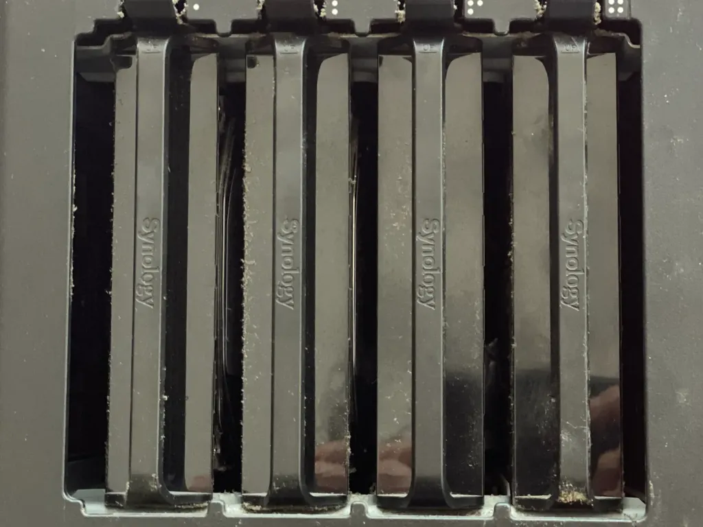

# Où backuper mes données ?

Mon NAS ([Network Attached Storage](https://fr.wikipedia.org/wiki/Serveur_de_stockage_en_r%C3%A9seau)) a lâché il y a quelques jours. Maintenant que j’ai écarté une panne d’alimentation se pose la question de son remplacement, ou pas. Je me suis dis que la réflexion pourrait vous intéresser ou vous amener à me parler de vos solutions.

Ce Synology DS415play, avec ses quatre disques durs en RAID pour 8 To effectivement disponibles, tournait sans broncher depuis l’automne 2014, presque dix ans de bons et loyaux services. Une seule panne : un des disques durs a rendu l’âme en octobre dernier, remplacé par un 4 To pour 110 €.

Ma situation est simple, soit je repars avec un nouveau NAS pour une dizaine d’années, ce qui est tentant puisque je dispose déjà des disques *ad hoc*, soit j’opte pour des sauvegardes 100 % externes dans le cloud. Les deux approches ont des avantages et des inconvénients, et des structures de coût différentes.

Je prends conscience que depuis quelques années j’externalise de plus en plus mes données sensibles, les dupliquant en différents endroits du cloud. Ma stratégie actuelle.

* Sauvegarde des Mac via Time Machine (NAS).

* Sauvegarde des photos (NAS, disques externes, Amazon Photos puisque c’est illimité et gratuit pour les clients premium).

* Sauvegarde de la bibliothèque ebooks (NAS, Mac, disques externes).

* Sauvegarde des vidéos et montages (NAS, disques externes).

* Sauvegarde des textes, des codes, du blog (GitHub, GoogleDrive, DropBox, Amazon AWS, disques externes).

* Hébergement lab.tcrouzet (NAS).

* Hébergement tcrouzet.com (AWS).

* Hébergement sous domaines (NAS quand besoin de PHP ou Python, sinon GitHub).

Mon NAS me sert donc comme système de sauvegarde et comme serveur pour mes bidouilles. Si je reste dans cette configuration, estimation du coût mensuel sur les dix ans à venir :

* Achat d’un DS423 (389 €), modèle d’entrée de gamme qui me suffit amplement.

* Un jour ou l’autre remplacement d’au moins deux des disques durs (200 €).

* Consommation électrique nominale : 32,41 W, mais le plus souvent le serveur bascule en mode hibernation et ne consomme que 4,97 W. Disons que le NAS me coûte au plus 20 €/an d’électricité.

* Soit moins de 7 €/mois sur les dix prochaines années.

Aujourd’hui, je paye environ 2 €/mois pour les services AWS. Dès que j’active une instance serveur pour des bidouilles comme [Genlog](https://genlog.tcrouzet.com/), la facture grimpe à 10 €/mois. Il faut compter en gros [4 €/mois](https://aws.amazon.com/fr/s3/pricing/) supplémentaires par téraoctet de deep archives, j’en aurais besoin à minima de deux, voire de trois ou quatre dans les prochaines années. La facture grimpe vite, et tout aussi vite chez les autres fournisseurs. Si je pars sur une solution cloud , ce sera à minima 20 €/mois, et je ne bénéficierais pas d’un Time Machine efficace. La solution NAS semble donc plus économique, mais elle n’a pas que des avantages.

Le pour et le contre.

* Avec le NAS, je maîtrise mon architecture (ce que j’apprécie beaucoup).

* Les accès sont plus rapides (quand je suis chez moi, sinon je passe par le Net).

* Je dispose à moindre prix de davantage d’espace de stockage.

* J’ai un serveur où je peux faire tourner PHP, Python, MySQL…

* Je peux utiliser Time Machine.

* Je peux remonter mes anciens disques et récupérer toutes mes données archivées.

* Mais je dois m’occuper de la maintenance.

* Mon NAS est vulnérable aux attaques, aux dégâts des eaux ou tout autres désagréments qui pourraient survenir chez moi.

* Le NAS ne peut être mon seul espace de backup (je dois le compléter avec des services cloud, ce que je réussis à faire quasi gratuitement aujourd’hui). J’utilise aussi des disques externes que j’éparpille de droite à gauche (mais je ferais la même chose si je stockais 100 % de ma vie en ligne).

J’en arrive à la conclusion qu’un NAS est la bonne solution pour moi, parce que je suis geek. Si par exemple j’optais pour la solution iCloud d’Apple, ça me coûtait presque [30 €/mois](https://www.apple.com/fr/icloud/) pour 6 To, et je ne pouvais que sauvegarder mes données sans faire joujou avec un serveur. Apple nous fait payer très cher sa prétendue ergonomie.

#cuisine #y2024 #2024-5-23-10h00
