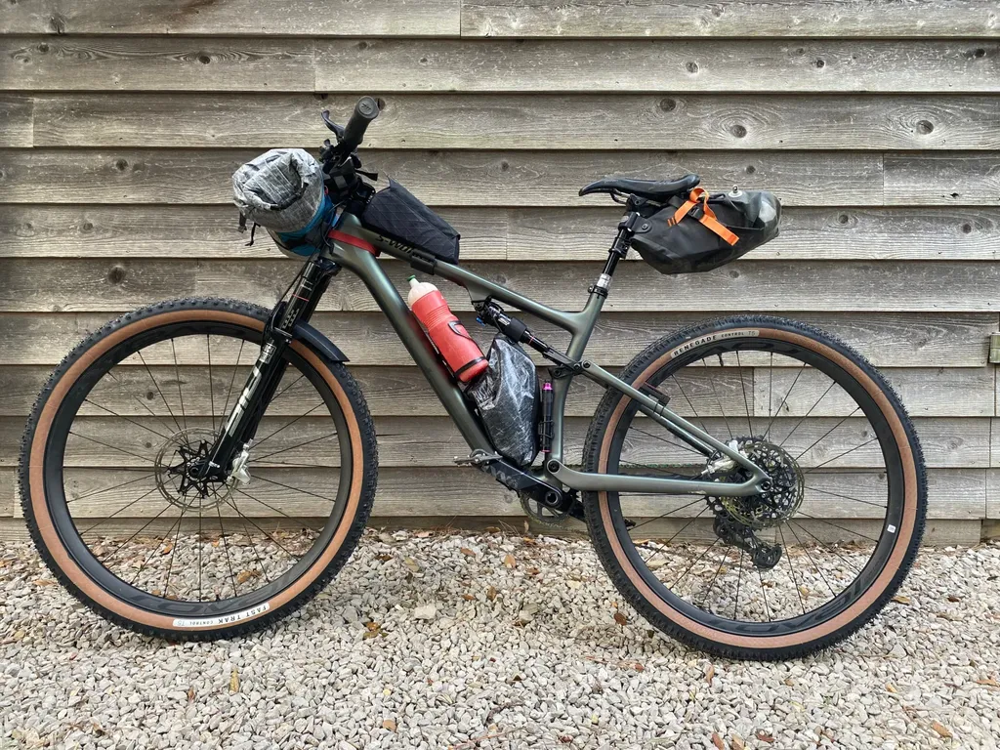
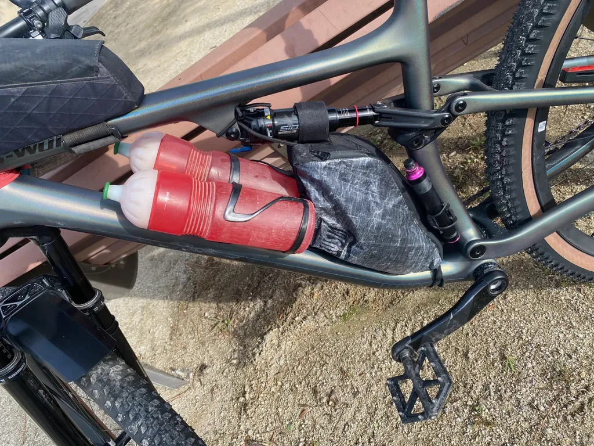

# Journal d'une config bikepacking 2

De 2020 à 2023, j'ai voyagé [avec plus ou moins la même configuration, un Specialized Epic semi-rigide](../../2022/3/config-bikepacking-2022.md). À l'occasion du [i727 2024](https://727bikepacking.fr/i727/), je me lance avec mon Epic S-Works Evo tout-suspendu, ce qui entraîne suffisamment de modifications pour mériter de créer un nouveau billet. [Retrouvez l'historique de mes configurations dans un tableau avec liens vers les produits.](https://docs.google.com/spreadsheets/d/1Co6BJql8z7uWCvAokGcDrKaEyAMb-X_zLue6_id3nB4/edit?usp=sharing)

<iframe src="https://docs.google.com/spreadsheets/d/e/2PACX-1vQtXMtpZrGSpN66bcB2kZJOEYfbSKyhhKy6cAtTCVE7unBsf85UIawZni0HyVScCcyS2C1DRbdeiar6/pubhtml?widget=true&amp;headers=false"></iframe>

### Pourquoi un tout-suspendu

Après la mode des gravels et des monster-cross sur les randonnées hors asphalte un poil engagées ou très longues, j’ai l’impression, surtout à la lecture de bikepacking.com, que de plus en plus de bikepackers basculent vers des tout-suspendus XC, même sur les courses comme la Silk Road Mountain Race ou la Tour Divide.

Ces vélos sont légèrement plus lourds, mais leur confort accru fait la différence sur la durée. Ce critère de confort est de plus en plus pris en compte, même sur les vélos de route, même chez les pros qui roulent avec des pneus de plus en plus larges. Parfois, il vaut mieux perdre en performance instantanée pour réduire la fatigue à long terme et donc finalement augmenter les performances (dans mon cas, la performance consiste à garder les yeux ouverts pour profiter de la trace et de mes compagnons de pédale).

Le plaisir a beaucoup influencé mon choix. Je roule à longueur d’année sur un tout-suspendu et je n’enfourchais le semi-rigide que pour le bikepacking, parce que ce vélo était 2 kg moins lourd et possédait un grand triangle de cadre pour y loger un sac volumineux, ce qui était pratique en voyage. Mais mon dos grinçait, je m’amusais moins qu’avec un tout-suspendu, la selle télescopique me manquait. Et puis pourquoi avoir deux VTT dans le garage ?

Lors de mon dernier trip de 2023, je me suis juré d’installer une télescopique sur le semi-rigide, mais quand j’ai eu l’opportunité de me payer un Epic Evo S-Works à un prix imbattable, j’ai décidé d’en faire mon VTT universel. Au final, il ne pèse que 750 g de plus que le semi-rigide, poids presque exactement de la tige de selle. En prime, j’ai une suspension avant de 120 contre 100, une suspension arrière de 110.

### La bagagerie

Comme mon Epic Evo est le vélo de toutes mes sorties, je ne voulais pas qu’il soit typé bikepacking à longueur d’année, et je ne voulais pas que le passage en mode bikepacking soit compliqué. J’ai ainsi renoncé aux porte-bidons Tailfin sur la fourche, pour maintenir l’eau dans le cadre, là où c’est le plus logique pour que le centre de gravité reste non loin du pédalier. J’ai toujours été très attentif à cette affaire de centre de gravité, trop en avant ou trop en arrière et le vélo devient beaucoup moins fun dans les singles.

En mode sortie ordinaire, j’utilise un bidon de 950 ml (un Jet Green en fibre végétale). Pour le bikepacking ou les très chaudes journées, je monte deux bidons côte à côte grâce au système [B-RAD Double Bottle Adapter](https://www.wolftoothcomponents.com/collections/b-rad-system/products/b-rad-double-bottle-cage-adapter) de Wolf Tooth. Je peux ainsi emporter deux fois 750 ml ou deux fois 950 ml (des bidons toujours en fibre végétale).

Je préfère ce système de porte-bidon à ceux qui libèrent la totalité du triangle pour le sac de cadre, mais qui excentrent les bidons beaucoup plus à l’extérieur. Mes jambes viennent alors frotter les porte-bidons quand je suis en danseuse.

Pour garder un centre de gravité bien positionné, j’ai toujours roulé avec quatre sacs pour répartir les charges de manière optimale. Je n’ai pas changé de stratégie, malgré la nécessité de quelques aménagements.

* Mon sac de guidons reste dédié au couchage. J’essaie qu’il reste sous les 2,5 kg, sinon la direction devient pesante.

* Je range l’électronique et les bricoles de première nécessité, genre frontale ou gel hydroalcoolique, dans le top tube. Mon Revelate fait 1,4 l, peut-être que je finirai par en choisir un sac légèrement plus grand.

* Comme une partie du triangle est occupé par mon double bidon et par la suspension arrière, il ne me reste qu’un petit sac de cadre de 2,5 l, où je range encore les babioles de première nécessité (lingettes, fruits secs, Squirt, dentifrice, brosse à dents…). Le sac est un proto que j’ai imaginé et que [Lucy Rujdan](https://www.rusjan.eu/) a réalisé. Il faudra sans doute le modifier. Il y a encore moyen de gagner un peu de volume et d’améliorer les fixations, mais je le trouve très pratique à l’usage. Pour les sorties habituelles, j’y case mes outils, un coupe-vent, éventuellement une gourde souple de 0,5 l.

* Le sac de selle accueille le reste de mes affaires (piquet de tente ou de tarp, imper, doudoune, outils, kit médical), avec beaucoup de place disponible pour y stocker de quoi m’alimenter. J’utilise un Ortlieb 11 l qui libère 6 cm de ma tige télescopique. Peut-être qu’il existe des sacs plus optimaux comme [le Ripsey Seat Bag](https://roguepanda.com/products/ripsey-seat-bag?variant=44073197895850), mais je n’ai pas pris le temps de chercher (j’ai acheté le Hortlieb en 2019). Pour utiliser 100 % de la tige se selle, il me faudrait un porte-bagages Tailfin (solution plus lourde, onéreuse, mais j’y réfléchis, car elle s’installe et se démonte en quelques secondes et me permettrait de ne plus utiliser de double porte bidon).

### Quelques autres nouveautés

Si j’apprécie le confort douillet de la tente, j’adore dormir dans mon bivy, à la belle étoile. Problème : quand je campe dans l’herbe, la rosée matinale finit par me détremper et je dois faire sécher mon sac de couchage durant la journée. J’ai donc acheté un tarp ultraléger de Zpacks que je vais tester. Je ne le monterai que si je l’estime nécessaire. Bien sûr, choisir entre la tente ou le combo bivy+tarp ne s’effectue qu’au dernier moment en fonction de la météo.

Je remercie HollyFat d’avoir attiré mon attention vers ses purées végétales non sucrées, bourrées de bons gras pour l’endurance. Mais à l’usage, le packaging ne me convient pas (j’ai explosé plusieurs fois ses sachets), ni forcément les goûts, et surtout le prix. J’ai trouvé une alternative plus économique, plus pratique, tout aussi efficace. Je remplis de purée d’amande, de cacahouète, de noisette… des [flacons de voyage en silicone de 60 ml](https://www.amazon.fr/gp/product/B0BRD42F2X/ref=ppx_yo_dt_b_asin_title_o08_s00?ie=UTF8&th=1). J’en utilise même un pour la crème Assos. Je n’achète plus de barres de céréales ou autres cochonneries.

Vigilant à ne laisser aucune trace sur les chemins et autour de mes zones de bivouac, j’ai toujours utilisé des lingettes biodégradables que je prends soin d’enterrer quand je fais mes besoins. Je ne supporte pas de voir des mouchoirs pleins de merde traîner dans la nature. Le mouchoir en papier, on l’emporte avec soi et les jette quand on trouve une poubelle. Mais les lingettes humidifiées sont lourdes, souvent imbibées de parfums et autres produits indéfinis. Une alternative : [les serviettes comprimées en cellulose](https://www.amazon.fr/AMLOO-Serviette-Compress%C3%A9e-Magique-Transport/dp/B0BFLT5ZXY/). Elles ne pèsent presque rien et il suffit d’un peu d’eau pour qu’elles se déploient telles des fleurs chinoises. J’ai ainsi gagné plus de 100 g !

Côté électronique, j’ai compris que je devais être capable de recharger deux appareils en même temps lors de mes haltes. J’emporte toujours une multiprise (22 g) pour ne pas monopoliser une prise. Soit je pars avec deux chargeurs Anker 511 Nono III 30W (2 x 48 g), soit un Anker 523 Nano III 47W (92 g), solution plus compacte avec deux ports USB C (et un peu moins de puissance par port).

Je crois que j’ai fait le tour des changements. Par ailleurs, je n’ai pas reçu la moindre proposition pour le semi-rigide. Comme je n’ai aucune envie de le brader, je vais sans doute en faire un vélo pour des épreuves plus roulantes, genre [g727](https://727bikepacking.fr/g727/) ou autres. Je ne désespère pas d’entraîner un jour en voyage un de mes fils.

#velo #bikepacking #y2024 #2024-5-5-20h30  
