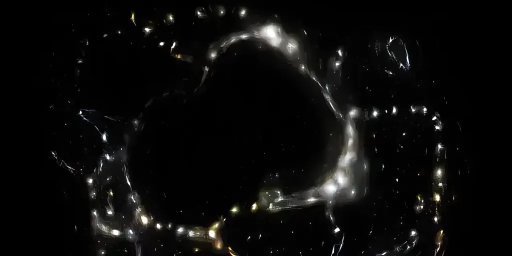
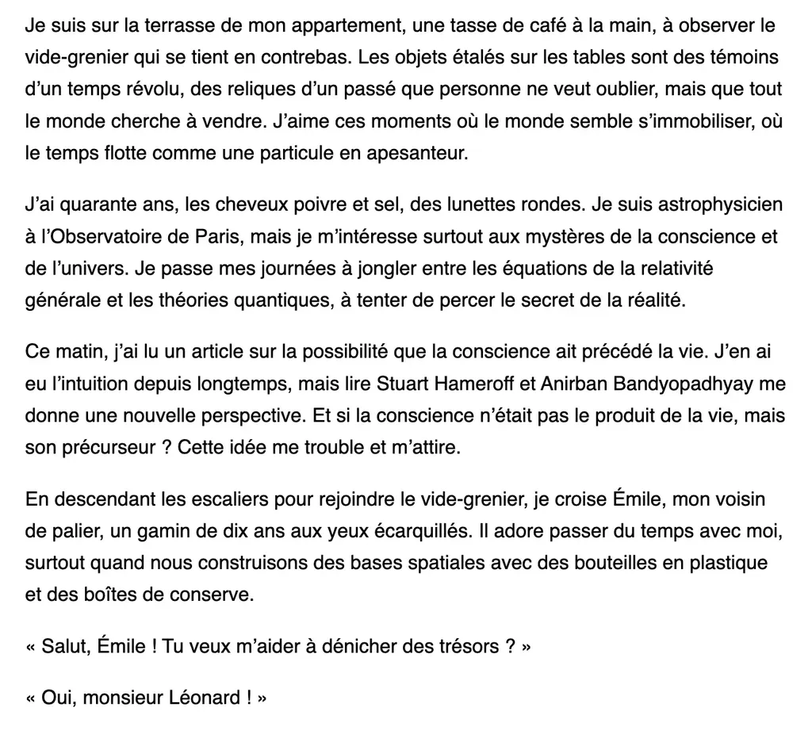

# Des histoires comme s’il en pleuvait

Je n’en finis pas de me demander quoi écrire aujourd’hui, au point d’en être paralysé. Quand je vois les titres en promotion en librairie et sur les réseaux, je me dis : une IA aurait pu les écrire, à quelque chose près. Je ne peux pas continuer d’écrire des textes à la portée des IA, même si ce travail me fait du bien, même si hypothétiquement il pourrait me faire gagner de l’argent ou m’apporter de la renommée. Je dois m’enfoncer en moi-même, explorer je ne sais quoi, pour faire jaillir des formes et des mots qui échappent encore un temps à l’imitation algorithmique.

Je viens de passer quelques jours à réviser [Genlog](https://genlog.tcrouzet.com/), mon expérience de littérature générative. Je ne veux plus générer un commentaire de mes lectures, mais tenter de pousser les modèles vers la littérature, leur faire raconter des histoires, en adoptant des formes changeantes. Donc, le système ne tournera plus tous les jours, mais quand je le désirerai, quand j’altérerai les prompts qui en huilent la mécanique.

L’idée reste d’utiliser mes dernières lectures comme point de départ à la fabrication d’un texte. Un sujet d’ateliers d’écriture. [Reste que la nouvelle produite aujourd’hui m’interroge.](https://genlog.tcrouzet.com/2024/05/21_fr/) Je ne l’aurais jamais écrite, mais elle ressemble à ce que la plupart des lecteurs adorent. C’est une scène de série TV, avec un vernis scientifique, une vague profondeur philosophique, de la tendresse entre deux personnages.

Je vous vois rire, vous autres auteurs, moi, j’ai la trouille. En un an, les progrès des IA ont été faramineux, et l’accélération est fulgurante. Plus que jamais je ne vois pas l’intérêt de demander aux IA d’écrire pour moi des romans, puisque n’importe quel lecteur peut désormais leur demander de leur écrire les romans dont ils rêvent. Demain, on leur demandera des films sur mesure, et ce sera sans doute bien mieux que la plupart des mièvreries de Netflix.

La question : comment transformer les IA en outils ? Comment continuer ce que j’ai commencé avec [Le Code Houellebecq](../../books/le-code-houellebecq.md) ? Je sens une réticence comme si je refusais l’obstacle. J’ai appris à maîtriser tant d’outils depuis que j’écris, mais aucun d’aussi déroutant. Comment adopter un outil construit sur une norme pour produire avec son aide du non normatif, quelque chose qui serait profondément de moi, et que pourtant je n’aurais jamais réussi à produire seul ?

Je n’ai jamais caché que sans éditeur de texte je ne serais jamais devenu écrivain. J’ai trop besoin de réviser, de corriger, de cacher ma médiocrité stylistique. J’amais je n’aurais donné à lire mes textes manuscrits. La technologie m’a aidé à surmonter mes maladresses. Je lui dois tout. Est-ce une raison pour pactiser avec le diable ?

Je pose la question parce que je n’ai pas la réponse, même si j’ai tenté d’y répondre dans *Le Code Houellebecq*, dont l’importance du sujet deviendra peu à peu évidente rétrospectivement. Je suis prétentieux ? Non, c’est juste que tout cela me crève les yeux. Plus je m’interroge, plus je vois mes amis auteurs comme des machines dans un monde renversé, où eux-mêmes ne sont plus que des clones des IA qu’ils ne font qu’imiter maladroitement. J’en éprouve de la pitié, surtout quand ils se donnent en spectacle dans les foires devant des lecteurs adorateurs en quête de dédicaces stupides. Vous vous prosternez devant des machines.

Où est ma place en tant qu’auteur ? Ma place en tant que singularité ? Là, peut-être, dans ces questions. Mais je ne peux pas passer ma vie à m’interroger, j’aime trop agir, c’est-à-dire écrire. Où donc aller ? Comment cultiver ma singularité à l’aide d’outils peu singuliers ? Montrer un monde terrible où les hommes n’ont plus de raison d’être !

Paradoxe des mots : la singularité étant censée désigner le moment où les machines deviennent plus intelligentes que nous. Nous y sommes, ne nous voilons pas la face, presque tous les tests cognitifs le démontrent. Dans *Le Code Houelleebecq*, je ne vois d’échappatoire que [dans le journal intime](/tag/carnet-de-route/), ce texte aurait pu d’ailleurs s’y trouver, comme tous ceux de mon blog. Dire ses pensées quand elles arrivent, improviser, ne pas calculer, tenter d’être simplement humain. Ne pas produire une forme canonique, mais se dire.

Je le fais déjà, ou je tente de le faire, et je continuerai, parce que l’exercice me nourrit, toutefois pas suffisamment, ce qui implique des projets plus ronds, refermés sur eux-mêmes. Un désir peut-être absurde de finitude, d’œuvres avec couverture et titre, d’œuvres achevées. Voilà qui est bien classique comme désir. Je suis en pleine contradiction. Ma nature de vivant est dans l’inachevé et je prétends à des formes figées, au prétexte qu’elles seraient honorables. Alors sur cette voie, je me heurte aux IA qui me battent à plate couture sur ce terrain, puisqu’elles ont digéré toute l’honorabilité de l’humanité passée.

L’inachevé, le fragment, le brouillon… voilà peut-être tout ce qui me reste pour m’exprimer dans ce qui serait moi et nul autre. Des peut-être, encore des peut-être, et toujours une montagne de réticences. Alors je relis cette nouvelle générée et j’ai encore plus la trouille. Parce que comme beaucoup de lecteurs j’aime les histoires et je n’ai plus de raison d’en écrire, car je ne ferai jamais mieux que les machines, à moins que je réussisse à les soumettre, à les remettre à leur place.

#netlitterature #ia #y2024 #2024-5-21-10h30
