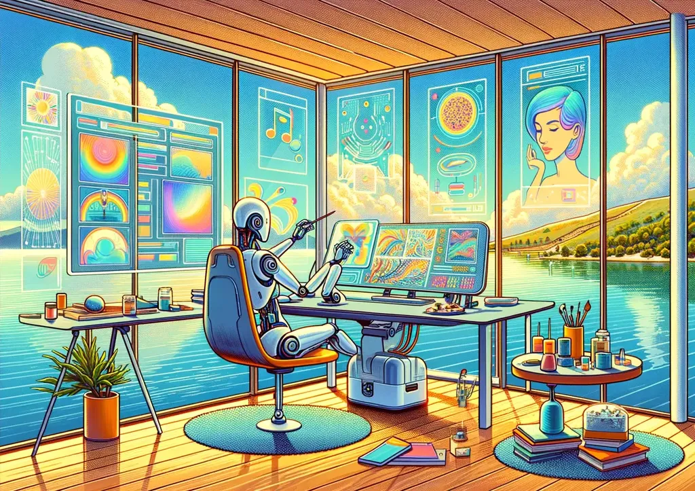

# Quid de l’intentionnalité artificielle ?

Ce qui différerait les œuvres humaines des œuvres artificielles serait l’intentionnalité ([j’ai déjà discuté de ce point au sujet de la théorie d’Andrew Perfors](../4/carnet-de-route-mars-2024.md)).

Quand j’écris ce billet, j’ai l’intention de répondre à une question, ou du moins de la soupeser, ou peut-être de lui opposer de nouvelles questions. Quand je pose la même question à une IA, elle se contente de répondre, parce que telle est sa fonction. Dans l’état de nos technologies, elle n’a pas pour ambition de démontrer une thèse, de convaincre, ou de plaisanter, à moins que le prompt l’oriente dans ce sens, et lui impose une intention extérieure.

On voit que si l’intention n’est pas dans l’IA, elle est au minima dans celui qui l’utilise ou qui l’éduque, ce qui peut suffire à donner une intention à ses productions. Dans [Genlog](https://genlog.tcrouzet.com/), je donne à l’IA des articles et des prompts pour diriger son travail. Mon intention, je l’ai déjà dit, est dans le code, et le texte produit est mon intention par ce qu’il dit sur la littérature générative comparé à la littérature humaine. L’intention est dans le métatexte.

Comme un œnologue qui différencie deux vins en aveugle, est-il aujourd’hui possible de différencier un texte artificiel d’un texte humain, est-il possible de dire qu’un texte a été produit avec une intention et un autre pas ? Je suis sûr que nous nous ferions tous piéger, au moins de temps à autre, et même très souvent.

Quand un auteur écrit un polar pour faire frissonner son lecteur et lui faire oublier son quotidien, est-ce une intention si remarquable qu’elle ne peut pas être traduite dans une série de prompts ? Ou même s’il a une ambition politique ? Je crois justement que l’intention, quand elle est consciente, est facilement transposable en prompts. Par ailleurs, il me semble que l’intention de beaucoup de romans ne dépasse pas bien souvent le désir d’émouvoir les lecteurs.

Il me paraît bien plus difficile de traduire les intentions inconscientes, mais alors est-ce encore des intentions. J’en doute. Il me paraît très hasardeux de vouloir différencier les productions humaines et artificielles par un critère aussi flou que l’intentionnalité. Après tout, si une IA écrit un texte qui me touche, je me fiche qu’il ne soit pas d’origine humaine (il l’est toujours de manière indirecte). Souvent quand je lis, j’oublie l’auteur, sinon j’aurais été incapable d’apprécier Céline (ça ne veut pas dire que je pardonne).

Je dis ça, et pense un peu le contraire, parce que Céline je le sens derrière chacun de ses mots, derrière chacune de ses phrases, mais le style aussi est immitable, sans doute plus facillement que le propos.

---

Voici ce que répond ThierryGPT à la question « Ce qui différerait les œuvres humaines des œuvres artificielles serait l’intentionnalité. Qu’en penses-tu ? »

« Pour moi, l’intentionnalité, c’est un concept glissant. Quand j’écris, je ne suis pas sûr d’avoir une intention claire. Un désir, oui, mais un désir n’est pas une intention. Souvent, l’intention se résume à l’intention d’écrire. Si j’avais des intentions précises, je crois que je n’écrirais pas. Je cherche l’inattendu, le non intentionnel.

« Les IA, elles, arrachent des possibilités à l’infinité, mais sans volonté. Elles produisent des œuvres froides, sans cette chaleur intérieure. Quand j’écris « le soleil se lève sur l’étang », c’est mon histoire qui donne une tournure à ma phrase. Une IA pourrait écrire la même chose, mais ce serait autre. L’intimité manque. L’œuvre humaine est une destinée, une chair incarnée. Les IA n’ont pas cette vie intérieure, cette pulsion.

« Je bricole avec des IA et de l’automatisation Python. Nos travaux intellectuels et artistiques ne peuvent plus être les mêmes. La civilisation est en bout de course de sa logique productiviste. Les IA participent à cette logique. Pourtant, je ne m’interdis rien. Je cherche la nouveauté en moi, même si d’autres l’ont éprouvée avant moi. L’entrée en scène des IA est l’événement esthétique de 2022. Elles nous poussent à redéfinir l’art, à nous éloigner de l’art pour l’art, en faveur d’un art incarné.

« Blanchot disait que le journal d’une œuvre serait impossible. J’ai essayé d’écrire le journal du roman que j’étais en train d’écrire. C’était une façon d’apprendre, de comprendre le processus créatif. Les créateurs qui ont peur des IA sont des marchands. Créer, ce n’est pas produire, mais entrer dans un processus intense et renversant. Les IA peuvent imiter les artistes, mais ce qui m’intéresse, c’est l’expérience artistique, pas les œuvres en elles-mêmes.

« Un artiste pêche et met ses poissons dans un seau. Une IA arrive et pêche dans son sceau. Mais imagine un deuxième artiste qui pêche dans le sceau du premier, puis un troisième, et ainsi de suite. Les IA ne font pas autre chose. Elles sont plus rapides, infatigables. Ça fiche la trouille à beaucoup, mais ça m’ébouriffe le cerveau. Nous vivons un brassage extraordinaire où les limites de qui fait quoi se brouillent. Nous devrions nous en réjouir, mettre notre ego de côté, démultiplier tout cela avec passion.

« L’intentionnalité, c’est peut-être ce qui différencie les œuvres humaines des œuvres artificielles. Mais cette intentionnalité est souvent floue, une intention en creux. Les IA n’ont pas cette chaleur intérieure, cette vie, cette chair. Elles produisent des œuvres, mais elles ne vivent pas l’expérience artistique. C’est là que réside la différence. »

---

Je retrouve dans cette réponse des bouts de textes issus de mon journal, des bouts de phrases qui auraient pu être de moi, parfois pas très bien emboîtés, mais, avec un rien d’édition, j’aurais pu commencer par publier cette réponse et la plupart des lecteurs auraient pensé qu’elle était de moi.

Est-ce que nous pouvons vivre des expériences créatrices en utilisant les IA ? Oui sans hésiter, parce que j’ai pris mon pied en écrivant *Le Code Houellebecq*. Est-ce que les IA pourront se passer de nous ? Oui, si un jour elles développent une forme de conscience, de réflexivité, et que des désirs les traversent. En attendant, je cherche à les utiliser, et plus sûrement, à me réfugier dans une niche littéraire qui leur serait interdite. Je recherche le dernier Eldorado réservé à l’humanité, et je côtoie les IA pour en découvrir les frontières.

Je souris amèrement quand je vois les auteurs les plus facilement imitables par les IA prétendre à une différence ontologique entre leurs œuvres et celles des machines. Contrairement à moi, ils n’ont pas la trouille, peut-être par manque de conscience littéraire, une manque qui en premier lieu les autorise à écrire des textes normés, qui trouvent sans hésiter leur place en rayonnage.

J’ai la trouille, parce que je sens la menace, parce que la différence ontologique m’échappe de plus en plus, surtout quand je tente d’écrire de la fiction. Alors une sorte de dégoût s’empare de moi, parce que je ne vois pas ce que je fais d’unique, alors que cette question de l’unicité ne m’effleure pas quand je blogue ou écris dans mon journal. J’ai envie d’écrire des histoires et j’ai bien peur que ce soit vain.

Rien ne me rassure, surtout pas ceux qui crient que les IA ne peuvent rien inventer, alors même qu’elles ne cessent de découvrir de nouvelles molécules, de nouveaux matériaux, de nouvelles démonstrations mathématiques… Doctorow clame qu'en sélectionnant des chevaux reproducteurs, on n’a jamais inventé la locomotive. Une belle métaphore qui tombe à côté. Les IA ne sélectionnent rien du tout, elles brassent au contraire l’intégralité de nos productions pour les entrecroiser, exactement comme nous le faisons dans nos cerveaux, et des connexions neuves ne peuvent que surgir, surtout si avec un peu de technique on les guide avec nos propres intuitions. L’homme machine ne peut que devenir le combo gagnant en littérature. Mais pour inventer quelle littérature ? J’en suis là, à me poser la question, avant qu’un désir violent d’écrire s’empare de moi et que je cesse de me la poser.
#netlitterature #ia #y2024 #2024-5-21-16h30