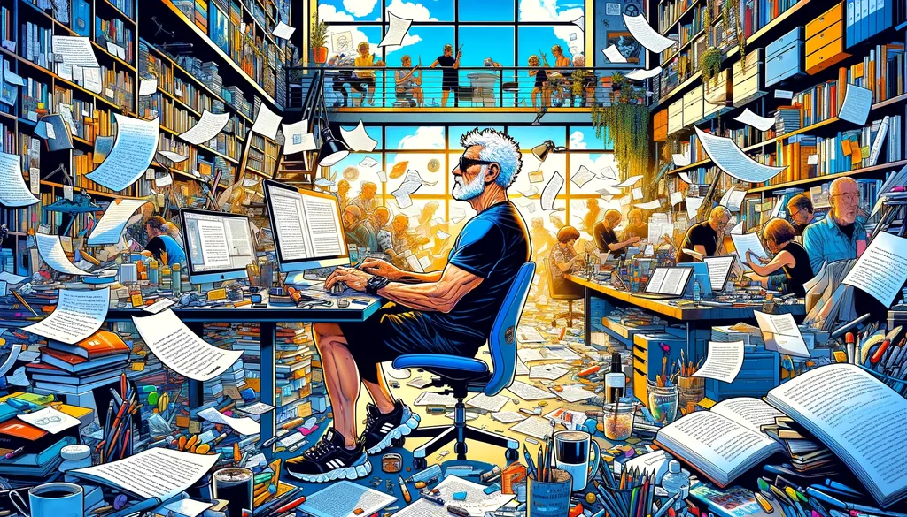
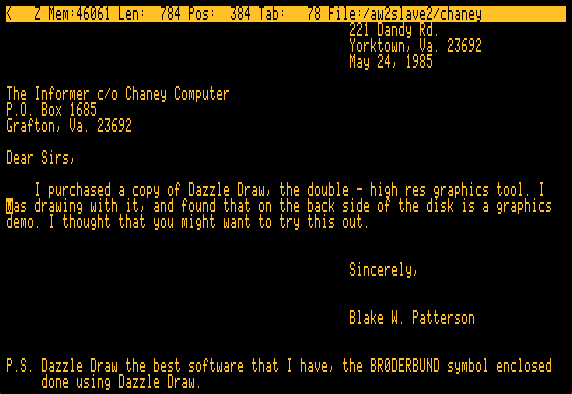
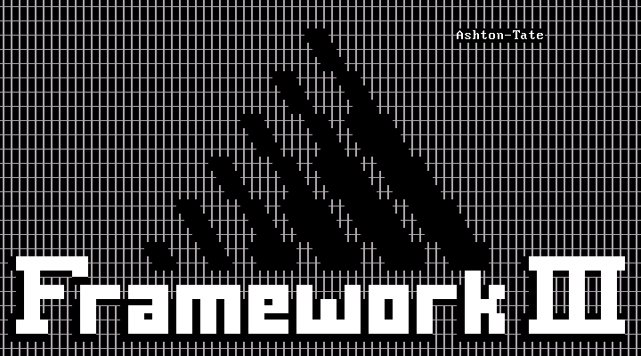

# L’écriture à l’état brut

[En introduction d’une vidéo-fleuve comme il en a l’habitude](https://www.youtube.com/watch?v=kDkrPx_GeIU&t=1002s&ab_channel=fran%C3%A7oisbon%7Clescarnets), François Bon compare le traitement de texte à un instrument de musique qu’il faudrait accorder avant de commencer à jouer. Très belle métaphore, sur laquelle j’aimerais revenir.

J’ai tout de suite pensé aux traitements de texte avec lesquels j’ai joué depuis une quarantaine d’années. Quelques recherches les ont déterrés. Les larmes me viennent devant les captures d’écrans. Les couleurs, les menus, les typos me replongent dans ma jeunesse. Personne ne m’avait dit que j’éprouverais de la nostalgie à l’égard des logiciels, mais après tout les vieilles guitares ont le même effet, et les vieux vélos aussi… simplement, il s’agit cette fois de bouts de code et de leurs représentations, mais qui comme des objets révolus n’existeront plus jamais, même si nous pouvons les réveiller dans des simulations muséales.

Sur mes premiers ordinateurs ZX81, Oric ou Ti99, je n’ai fait que du code, donc me contentais d’un éditeur de texte. Tout a changé avec mon Apple IIe, en 1984, quand j’ai écrit mes premiers scénarios de jeu de rôle grâce à Apple Writer. En 1986, j’ai basculé sur PC où j’ai longtemps utilisé Framework, un logiciel intégré, avec lequel j’ai commencé à écrire mes premiers textes, avant de basculer sous Word MS-DOS, puis Windows, pour ne le lâcher que début 2014 quand je suis passé sur Mac et Ulysses, ce dernier enfin abandonné pour Obsidian il y a quelques mois. J’aurais donc principalement utilisé cinq outils d’écriture en quarante ans, même si j’ai goûté les sonorités de beaucoup d’autres.

C’est dire que nous ne changeons pas facilement d’outil, et que chaque fois il faut les apprivoiser, chacun apportant avec lui son lot d’innovations. Si Apple Writer ne différait guère d’un éditeur de code, peu à peu ses successeurs ont transformé l’expérience d’écriture, basculant bientôt dans le [wysiwyg](https://fr.wikipedia.org/wiki/What_you_see_is_what_you_get). J’ai découvert les feuilles de styles avec Word et j’ai passé des années à expliquer leur utilité aux journalistes, aux écrivains, aux éditeurs, travail que poursuit François dans sa vidéo. Je lui ai glissé en commentaire que je n’en étais plus là, parce que je suis revenu en arrière. Avec Ulysses, puis Obsidian, j’ai abandonné le wysiwyg pour me limiter à la syntaxe Markdown.

Désormais, j’ai un rapport immédiat au texte. Je ne l’envisage pas autrement que sous mes yeux, dans son apparence la plus brute. Pour poursuivre la métaphore, je suis revenu à la guitare sèche. J’ai besoin que les lettres que je tape se transforment en octets avec le moins possible de calcul. Je saisis mes textes dans une police qui me convient à l’écran, du [Menlo](https://en.wikipedia.org/wiki/Menlo_(typeface)), toujours la même, avec toujours la même justification.

Longtemps j’ai écrit avec l’idée du livre, du papier, des pages, j’ai oublié tout cela, je ne m’en occupe plus. Le texte et rien que le texte, c’est ainsi qu’il existe, et ses projections en différents formats ou supports ne me préoccupent plus, et d’une certaine façon ne me concernent plus. La projection n’est qu’une affaire de code et d’automatisation, et cela est possible parce que le Markdown est naturellement structuré, parce qu’on ne peut avec lui faire autre chose qu’écrire.

Je serais incapable de travailler aujourd’hui avec Word, et je n’y touche qu’avec répulsion tant je trouve l’outil daté. Mais il n’éveille aucune nostalgie, parce que bon à tout faire il n’est bon à rien, même quand on en maîtrise les subtilités. [Toutes les critiques que j’ai adressées à WordPress](https://tcrouzet.com/2024/04/30/no-more_wordpress/) peuvent être adressées à Word. C’est une montagne de complexité inutile, une montagne qui me pèse et me répugne, et qui marche à contresens de l’histoire.

Pour le dire franchement, je ne vois pas ce qu’on peut écrire de bien avec cet outil, parce que l’utiliser c’est ne se poser aucune question politique ou philosophique quant à l’époque, c’est faire comme si rien n’avait changé, c’est laisser sa conscience en berne, c’est croire que l’outil n’a aucune importance, c’est être d’une crasse ignorance des dessous du monde, et se laisser abandonner à de belles histoires qui n’ont aucune profondeur contemporaine.

Il faut être geek pour penser comme moi, mais comment ne pas être geek quand on passe sa vie à tapoter des outils numériques ? Il me paraît invraisemblable d’être auteur et consommateur. Deux états pour moi incompatibles. Ça me ramène au texte dans toute son immédiateté, tel que je l’écris, [tel que vous pouvez le lire sous GitHub](https://github.com/tcrouzet/md). Je ne me préoccupe pas d’autre chose parce qu’à partir de cet état une infinité de projections sont envisageables, comme par exemple sur mon blog. Mais avec [PanDoc](https://pandoc.org/), je peux générer tous les formats imaginables, quitte à injecter les textes machinés dans InDesign pour soigner des mises en page.

Je ne néglige pas l’importance des mises en page, mais elles restent des projections, c’est-à-dire des interprétations du texte. Les rééditions ne sont que de nouvelles interprétations pour rester dans la métaphore musicale. Alors je compose, parfois j’interprète, mais je ne suis pas un chef d’orchestre qualifié. J’aurais même tendance à m’enfermer dans des schémas musicaux alors qu’une œuvre vit quand de nombreux interprètes s’en emparent et portent sur elle un regard neuf. J’aimerais qu’il en soit ainsi des textes. Que les auteurs les publient sous la forme la plus brute possible pour que d’autres artistes les mettent en scène.

Je me suis recentré sur le cœur de mon travail, l’écriture, la production du texte brut, voire brutal, sans la moindre fioriture qui pourrait me le rendre plus charmant qu’il ne l’est. Parce qu’un texte correctement mis en page a tout de suite quelque chose de solennel. Je n’ose presque plus y toucher. Je le trouve beau comme un paysage pictural dont je refuserais de trop approcher pour en déceler les approximations.

Dans [*La mécanique du texte*](../../books/la-mecanique-du-texte.md), je raconte que chaque génération de traitement de texte s’appuie sur une métaphore. Jusqu’à Word ont est dans la métaphore du rouleau mise à l’honneur par Kerouac. Le document se déroule à l’infini. Avec Ulysses, nous avons basculé dans la métaphore du bureau, où s’empileraient des tas de feuilles. Avec Obsidian, on navigue dans le texte. Les feuilles sont interconnectées, toutes liées par des tags ou ne serait-ce que par la recherche, d’une puissance redoutable, jamais vue dans un éditeur.

Mon corpus textuel est entré dans un nouvel état. C’est comme s’il était immédiatement disponible, aux aguets, prêt à être invoqué et à me sauter dessus. Je ne me suis pas encore habitué à cette nouvelle fluidité, peut-être pour ça que je n’ai pas encore attaqué un nouveau projet (en vérité, c’est pour une autre raison dont je parlerai bientôt, j’espère). Je suis face à quelque chose de neuf, éloigné par des siècles du livre, et je prends conscience de nouvelles possibilités littéraires, les œuvres devenant des corpus à naviguer, plutôt que des fils linéaires étriqués. C’est comme entrer dans un cerveau, et je pressens que les IA auront un rôle phénoménal dans cette nouvelle métaphore.

Je n’avais jamais ressenti ça avant de réorganiser mes textes et mon blog sous la même bannière, et de coller au-dessus un éditeur de texte navigateur. Penser à la forme livre quand j’écris, c’est désormais un peu comme basculer d’un espace multidimensionnel à la 3D. J’ai l’intuition que la projection serait loin d’être homothétique et que l’essentiel de l’intertextualité disparaîtrait.

Avant d’utiliser Obsidian, je n’avais jamais eu la sensation d’écrire Web, d’écrire entrelacé, d’écrire relié. Voilà pourquoi j’ai dit à François que j’étais loin des feuilles de styles, à des années-lumière même. Les styles ne sont que des verrues surajoutées aux textes, que des pansements sur des jambes de bois. Il faut retarder le plus longtemps possible leur usage, ne se préoccuper d’eux que lors des projections. C’est un job d’interprète, pas de compositeur.

Et ne prenez pas ce texte pour une critique des interprètes. J’ai longtemps cousu moi-même de petits livres pour en faire des objets plastiques plus que littéraires, simplement il s’agit de deux travaux artistiques différents, l’un en amont, l’autre en aval d’un fleuve qui se jette à la mer par un immense delta.

#netlitterature #obsidian #y2024 #2024-5-23-13h30 
