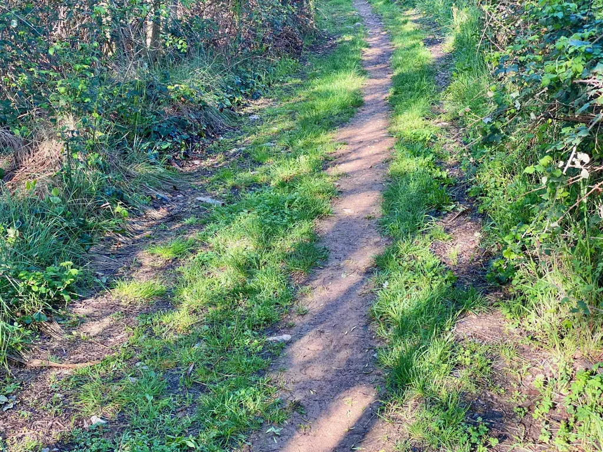
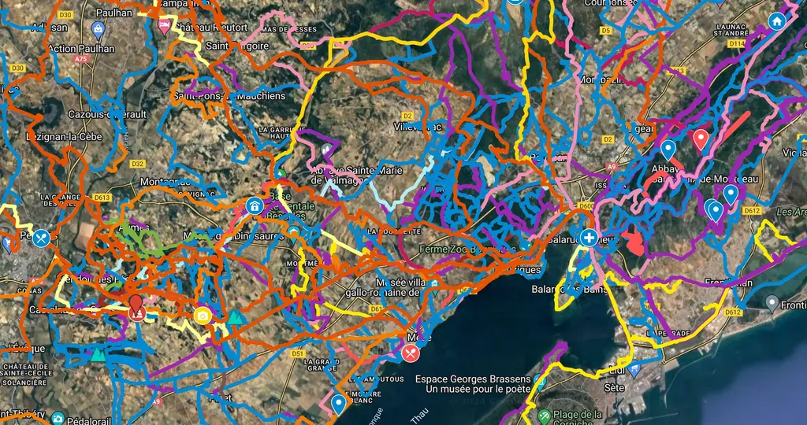

# Mon CV vélo

Pour un projet de mise en valeur du patrimoine cyclable, on m’a demandé de présenter mes compétences en matière de traçage et de communication. Je me suis dit autant le faire ici même, [dans la rubrique vélo de mon blog](/tag/borntobike/), parce que j’y parle de ma passion pour les chemins et les paysages.

Pour commencer, je suis écrivain et ingénieur, et je crois que mes deux compétences se marient à merveille avec la pratique du vélo moderne, qui s’appuie en particulier sur l’usage intensif des GPS, qu’ils soient autonomes comme chez Garmin, ou utilisés depuis les applications mobiles. Les GPS ont changé ma manière de faire du vélo, de m’approprier les paysages, de voyager… Ils m’aident à découvrir des recoins insoupçonnés, mais aussi à imaginer des parcours qui se transforment en aventures mémorables pour ceux qui les empruntent.

Tracer, c’est écrire. Écrire, c’est tracer. Une trace est une œuvre d’art qui peut provoquer des émotions, des rencontres, des questionnements philosophiques et politiques. Une trace est toujours un récit initiatique, surtout quand elle se prolonge sur des dizaines de kilomètres. À l’âge des GPS, une trace n’a pas besoin d’être gravée sur le territoire par des panneaux ou d’autres aménagements ostentatoires. Elle s’appuie sur le travail incessant effectué par les cyclistes et les randonneurs qui arpentent les chemins à longueur d’année et partagent leurs sorties en ligne. Une trace est fluide, susceptible de changer avec les conditions météorologiques, les saisons, une myriade d’aléas.

Une trace est le scénario d’une aventure, qui elle-même peut devenir récit, film, conférence… Une écriture en entraîne une autre, qui en retour peut donner des envies de nouvelles traces et de nouvelles narrations. J’habite cette boucle, ce passage incessant d’une forme d’écriture à une autre, auxquelles s’ajoute le codage informatique, car toutes les données recueillies doivent être mises en forme, interconnectées, enrichies, pour qu’à leur tour elles se mettent à parler et à provoquer des envies de vélo.

### Le volet communication

Je suis écrivain, j’ai été journaliste, je tiens un blog depuis vingt ans. Je communique par réflexe, sans même y penser, mais sans jamais renier mon style.

Quelques exemples.

* J’ai créé la série des aventures 727. [Sur le site dédié](), on retrouve toutes les traces que j’ai créées et bien d’autres informations. Je tente de partager mon amour pour ma région.

* Sur ces traces, des centaines de cyclistes ont roulé, et quand je les ai accompagnés, j’en ai tiré des récits ([Bikepacking tempétueux dans l’Hérault](../../2022/4/bikepacking-tempetueux-dans-lherault.md), [Dans l’automne flamboyant du midi](../../2021/10/bikepacking-dans-lautomne-flamboyant-du-midi.md), [Agrandir l'imaginaire](../../2021/4/tour-de-lherault-bikepacking-agrandir-limaginaire.md)…).

* Mon imaginaire ne se limite pas à L’Hérault. [J’ai tracé une traversée de la France](https://727bikepacking.fr/p27/) que j’ai [aussi racontée](../../2022/7/une-traversee-de-la-france-a-vtt.md). Je travaille au [projet Côte Sud](https://727bikepacking.fr/cote-sud/), un itinéraire VTT/Gravel qui suit la Méditerranée, qui a donné suite [à plusieurs récits](/tag/cotesud/).

* Par ailleurs, je maintiens de nombreuses traces plus locales autour du bassin de Thau. Toujours mes traces s’accompagnent d’une mise en narration, parce qu’une trace qui ne suscite pas chez moi une envie d’écrire ne mérite pas que j’en parle. Exemples : [les lignes de désirs sétoites](../../2020/1/lignes-de-desir-a-sete.md), [le tour de Sète Agglopôle Méditerranée](../../2020/12/gravel-le-tour-de-sete-agglopole-mediterranee.md), [les terres rouges gravel](../../2021/12/prendre-son-temps-a-velo.md)…

* J'ai aussi raconté des itinéraires aux États-Unis ([Bikepacking dans les Smoky Mountains](../../2019/5/bikepacking-dans-les-smoky-mountains.md), [D'une HuRaCan à l'autre](../../2019/3/dune-huracan-a-lautre.md), [Satori à Lake Lindsay](../../2019/2/satori-a-lake-lindsay.md)…).

* Je crée moi-même mes sites web.

### Le volet trace

Tracer exige avant tout un sens narratif, parce qu’une trace qu’elle soit longue ou courte doit toujours ressembler à une aventure, avec une progression vers un climax. Mais pour bien raconter, deux autres dimensions entrent en jeu : la maîtrise des outils cartographiques et le nécessaire arpentage sur le terrain. Connaître un territoire aide, mais n’est pas indispensable, tant les outils se sont perfectionnés ces dernières années. Un regard étranger sur un territoire peut même ouvrir de nouveaux horizons, forcer à sortir des sentiers battus et des habitudes un peu trop ancrées.

[J’ai beaucoup écrit sur l’art du traçage](/tag/gps/), sur ses pôles narratif, technique et terrain. J’aime passer du théorique au terrain, puis revenir au théorique, et ainsi effectuer plusieurs boucles pour peu à peu affiner la trace, et donc la narration qui l’accompagne.

J’ai développé quelques outils informatiques pour m’aider, comme [img2gpx](https://github.com/tcrouzet/img2gpx) qui permet de mettre en valeur les différents types de terrains rencontrés sur une trace, outil indispensable pour qualifier une trace (route, gravel, vtt…). Beaucoup de choses peuvent ainsi être informatisées pour combiner l’expérience de terrain avec les données cartographiques de plus en plus abondantes. Par exemple, [j’ai développé un autre outil pour récupérer automatiquement les points d’intérêts d’une trace](../../2023/10/enrichir-automatiquement-vos-itineraires-avec-des-points-dinteret.md), étape de documentation indispensable.

Tout travail de traçage commence par une cartographie des chemins cyclables sur un territoire. Il est alors important de qualifier ses chemins, de connaître leur sens idéal, leur difficulté… Un premier jet de cette cartographie peut être généré automatiquement à partir des données Heatmap de Strava et d’autres données cartographiques avant d’être affiné par des reconnaissances. À partir de là, on possède les mots avec lesquels on pourra écrire une quasi-infinité de traces.

Je m’appuie sur la technologie pour mieux m’enfoncer dans les recoins du territoire une fois sur le vélo. Je ne suis jamais aussi heureux que quand j’ai l’impression de passer dans des endroits quasi secrets, ou du moins assez loin des grands axes pour qu’ils me procurent un sentiment de liberté et de plénitude. À tout moment, je reste artiste et ingénieur, ce qui pour moi n’a jamais été antinomique. En tout cas, je suis conscient que cette façon d’aborder le vélo l’amène vers des pratiques relativement neuves, ou du moins que nous sommes en train de réinventer.

#velo #gps #y2024 #2024-5-6-12h30 
