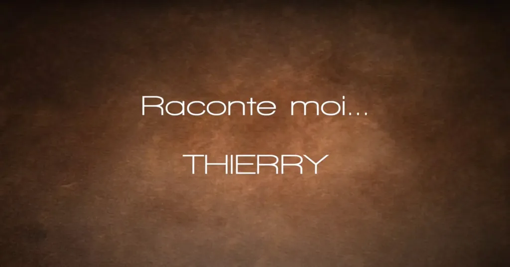

# Parler de soi

Exercice difficile de passer sur le grill des questions de Valérie et Franck pour leur projet [Raconte moi](https://www.youtube.com/@Racontemoi). Je ne suis pas sûr d’avoir été très pertinent, ni très intéressant. Bien plus difficile d’improviser devant la caméra que d’écrire. Je me sens mieux à ma place derrière mon clavier. Heureusement, au montagne, une montagne de banalités a sans doute été coupée. Il me faudrait répéter cet exercice une fois par mois, ou une fois par saison, ou par an, pour donner un autre point de vue que celui du [journal](/tag/carnet-de-route/), mais je ne suis pas un conteur comme [François Bon](https://www.youtube.com/@fbon), qui peut lâcher des impros quotidiennes, qui a toujours un truc à dire. Le plus souvent, je n’ai rien à dire, c’est terrible. Quand j’écris, j’efface le passé et ne laisse devant moi qu’un futur sans mémoire.

<iframe width="560" height="315" src="https://www.youtube.com/embed/FJf3zbvgtUM?si=UHSL_KndsajiMa5W" title="YouTube video player" frameborder="0" allow="accelerometer; autoplay; clipboard-write; encrypted-media; gyroscope; picture-in-picture; web-share" referrerpolicy="strict-origin-when-cross-origin" allowfullscreen></iframe>
#autobiographie #y2024 #2024-5-18-15h50