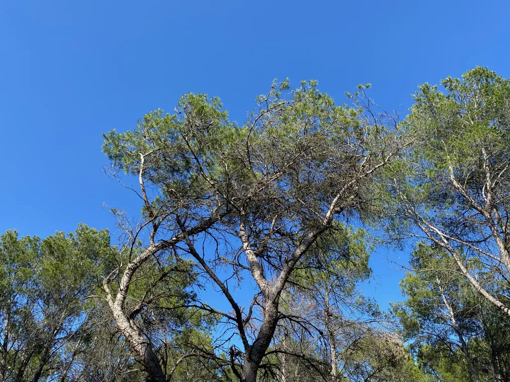
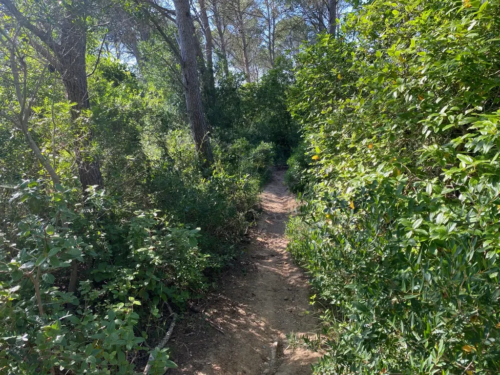
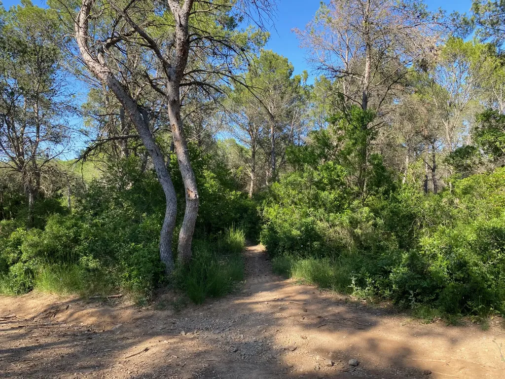
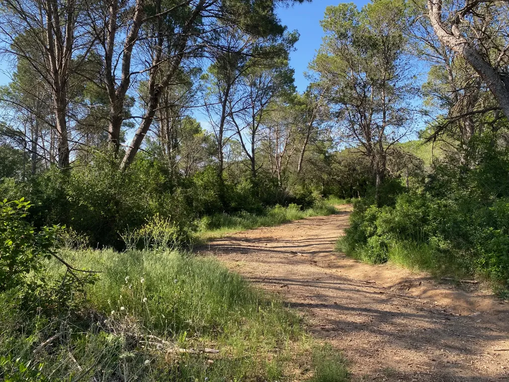
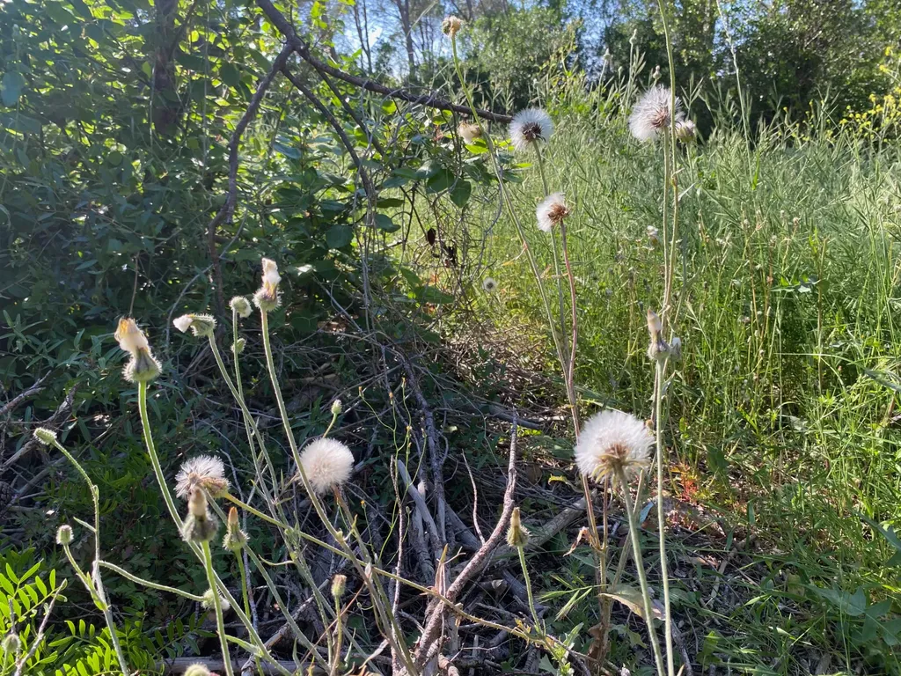
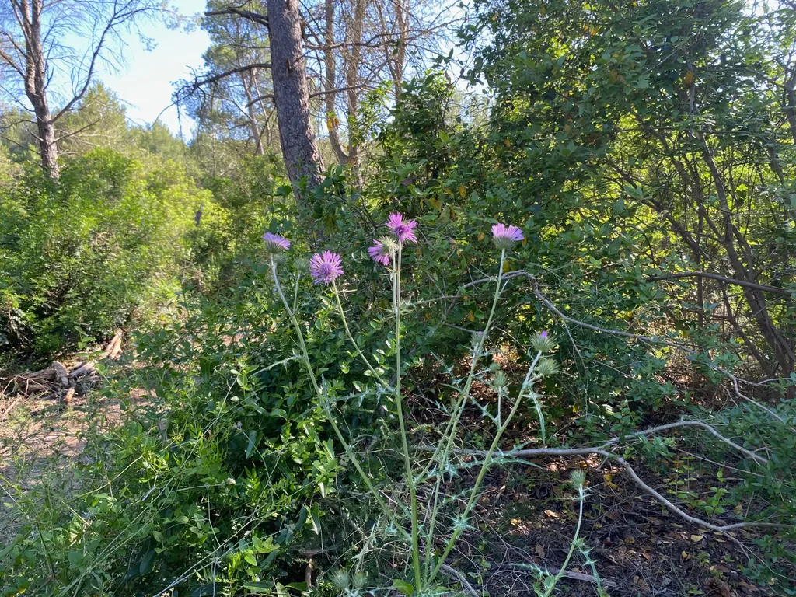
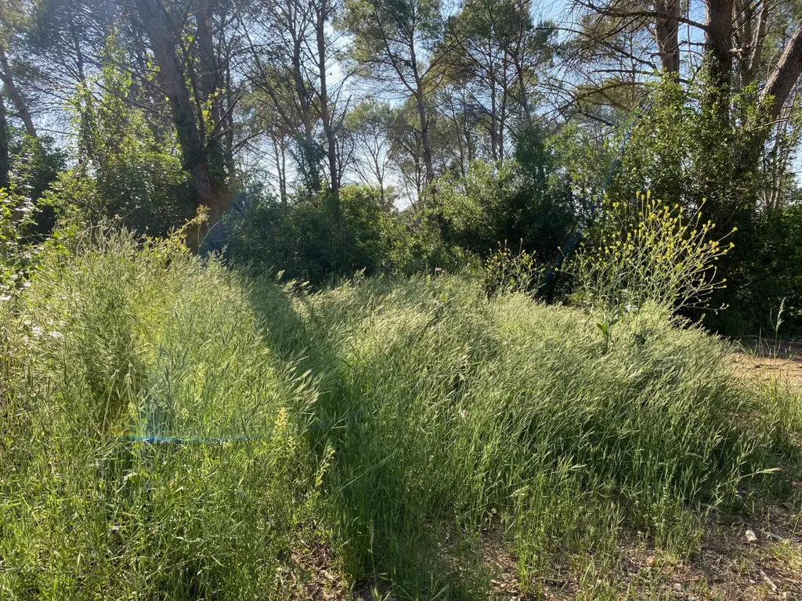
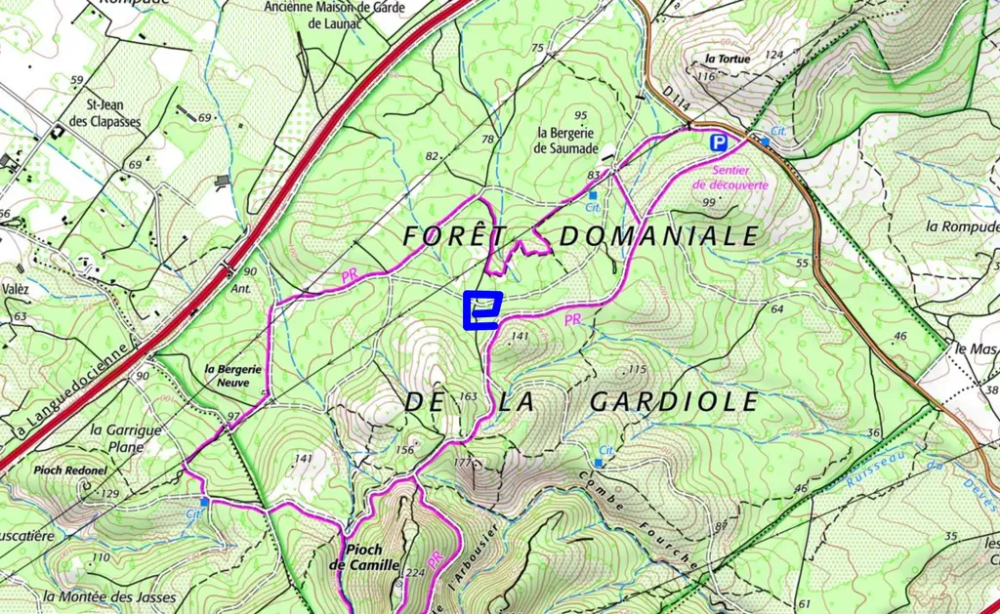

# Endroit 1 - La pinède des Abeilles

La garrigue : une ondulation de buissons brillants d’un bout à l’autre de l’année, traversée de pistes blanches, de sentiers griffus, de lignes calcaires aveuglantes quand le soleil les frappe à la perpendiculaire, laissant derrière la ligne bleu sombre de la Méditerranée. Un pays âpre, qui attend la pluie pour fleurir et qui se recroqueville en été, sans cesse identique à lui-même, pauvre en surprises, et pourtant, au détour d’un chemin carrossable, un sentier plonge entre les chênes verts, se glisse à l’ombre de la pinède des Abeilles où avec les lentisques aux feuillages vifs se multiplient les lauriers-tins, aux feuilles serrées, d’un vert profond à l’abondance généreuse, veloutées au touché, fraîches même par canicule.

<iframe width="560" height="315" src="https://www.youtube.com/embed/_OBfNAL0qgI?si=bBQiK90wFf7d9mLl" title="YouTube video player" frameborder="0" allow="accelerometer; autoplay; clipboard-write; encrypted-media; gyroscope; picture-in-picture; web-share" referrerpolicy="strict-origin-when-cross-origin" allowfullscreen></iframe>

Ce jardin naturel surgit toujours à l’improviste, et provoque chez moi une déflagration sensorielle, comme si au cœur d’une mélodie aride une note incongrue retentissait, hors de toute règle harmonique, pour provoquer une invariable électrisation du corps. J’ai beau savoir, me préparer, la dissonance altère immédiatement mon état de conscience : le temps ralentit, mes sens s’éveillent, je respire plus lentement. S’installe la certitude d’être en un de ces lieux rares où le monde résonne avec tant d’intensité qu’il me submerge.

Cette fois, je me suis arrêté au pied des pins d’Alep, devant les touffes de graminées d’où émergent des fleurs violettes dangereusement attirantes des chardons et les pompons duveteux des [crépides fétides](https://fr.wikipedia.org/wiki/Crepis_foetida), dont je découvre le nom improbable avec un logiciel d’identification. Je me suis arrêté pour mieux voir, pour mieux m’imprégner de ce recoin du monde cher à mon cœur, avec lequel j’entretiens une longue intimité, surtout faite d’indifférence, puisque je n’ai jamais pris le temps de nommer le plantes ou d’écouter les oiseaux s’égosiller au-dessus de moi.

Le sentier se divise en trois branches. L’une plonge dans un tunnel sous les lauriers-tins, l’autre rejoint une piste ombragée, le troisième zigzague entre les pins. L’une me ramène vers chez moi, les deux autres me conduisent plus loin, mais tous trois, très vite, me jettent dans la lumière éblouissante de la garrigue, d’où pour l’instant je suis comme protégé, grisé d’avoir la chance de me cacher dans un repli du monde, insoupçonnable pour qui n’est pas un familier du lieu.

Pourquoi appelons-nous cet endroit la pinède des Abeilles ? Je n’en sais rien. Je n’y ai jamais vu de ruches. La carte IGN est quasi muette. Nous nous trouvons sur le flanc nord du pioch Camille entre la bergerie Neuve et la bergerie de Saumade, toutes deux abandonnées. Une terre battue généreuse, sanguine, nourrie par les aiguilles de pin, recouvre le calcaire crissant des collines environnantes. Par sa chromatique et sa texture, cette terre participe à la dissonance, aussi par son odeur presque musquée, qui fait oublier celle de la poussière souvent soulevée par le mistral.

J’aime ce recoin du monde comme Proust le petit pan de mur jaune sur la vue de Delf de Vermeer. C’est un point de tension esthétique, un nœud où des lignes de forces invisibles s’interconnectent et à partir duquel mes balades entrent dans une dimension ésotérique, comme si traverser la pinède me faisait franchir une porte et entrer dans un autre monde.

J’ouvre les yeux. Enfin, je vois le ciste cotonneux, tout à côté, [un millepertuis perfolié](https://www.tela-botanica.org/bdtfx-nn-35347-synthese) aux pétales d’un jaune éclaboussant, à leur pied à tous deux, une étoile rampante et piquante, un [*onopordum illycrium*](https://fr.wikipedia.org/wiki/Onopordum_illyricum), avant qu’il ne fleurisse. Je ne connaissais pas son nom, mais depuis des années je me bats contre ces variétés de chardon dans mon jardin. J’aperçois un arbousier, et plus j’observe plus mon ignorance me saute aux yeux. Je connaissais la pinède comme on peut connaître un tableau à bonne distance, avant de s’en approcher et d’en découvrir les nuances subtiles.

Quand j’étais journaliste, que j’avais une carte de presse, je m’arrêtais souvent au Louvre pour me planter devant *La Vierge du chancelier Rolin* et je me perdais dans les infinis détails de l’arrière-plan, persuadé que là, dans le paysage lointain de la ville, Van Eyck avait réellement peint son chef-d’œuvre, le premier plan n’étant qu’un subterfuge commercial, susceptible de satisfaire un commanditaire fortuné. 

Et je suis passé à travers la pinède comme un ordinaire visiteur du Louvre devant le Van Eyck. J’ai oublié de la scruter, et maintenant que je me suis arrêté une fois, je sais que, la prochaine fois, je serais attentif, et même attentif aux autres pinèdes qui ailleurs peuvent lui ressembler. Comme le Van Eyck m’a appris à voir la peinture de son époque, et de toutes les époques, la pinède a cette vertu de m’apprendre à voir, et me donne envie de dire ces lieux minuscules qui me parlent, non par nostalgie, mais parce qu’ils véhiculent un message universel, que j’ai encore du mal à déchiffrer, mais dont je perçois la profonde sagesse.

#ecriture #endroits #y2024 #2024-6-13-13h00
