# Le gravel, c’est pas du VTT

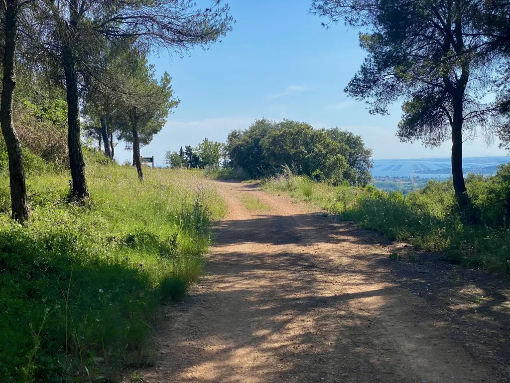

Une fin d’après-midi estivale, un petit tour de vélo en solo pour prendre l’air, regarder au loin, relever la tête des écrans et ne pas penser, ou plutôt laisser passer les pensées comme en méditation, sans leur donner l’occasion de s’ancrer et de tourner en boucle, voilà pourquoi aussi j’aime le vélo, et particulièrement dans la nature, sur les chemins et les sentiers.

Il n’est ni question de performance ou d’entraînement, mais plutôt de communion avec moi-même et le monde, parce que mon quotidien n’est jamais loin, à peine tenu à distance, et depuis les hauteurs je le distingue en bas dans la plaine. Une route bondée d’éclats de carrosserie, un train sur la ligne entre les marais, le chapelet des étangs, les villages, le cordon littoral, la mer, les bateaux, des myriades de points d’activité, je suis seul sans me sentir seul, j’embrasse tout.

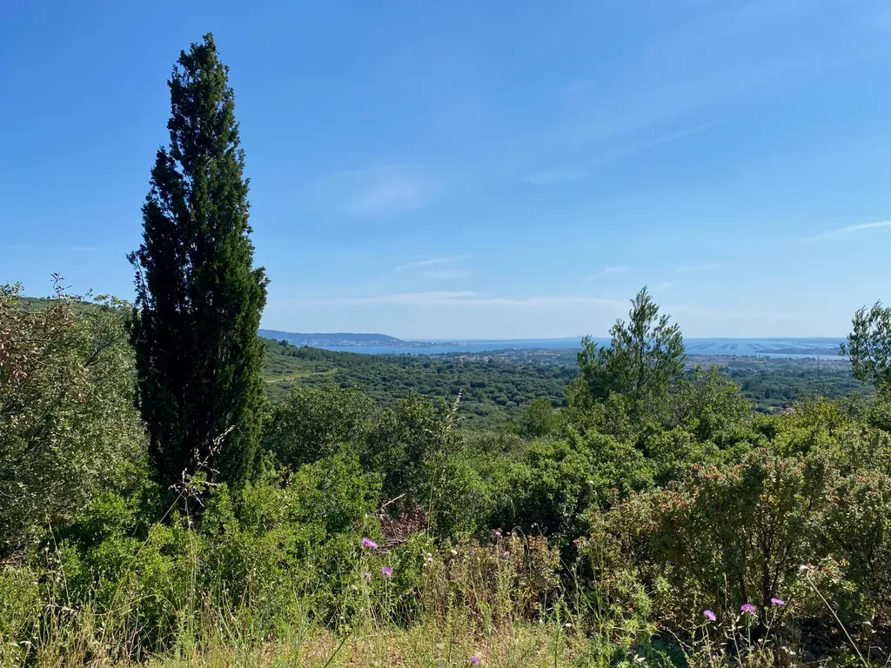

Parfois, et même trop souvent, j’oublie cet art de la déambulation à vélo, mais hier je m’y rassemblais tout entier, peut-être parce que je m’étais donné un petit objectif, reconnaître avec mon gravel les premiers kilomètres du [g727](https://727.tcrouzet.com/g727/) pour partager des photos [avec la communauté](https://www.facebook.com/groups/727tour). Cette simple ambition m’a poussé à prendre mon temps et à ouvrir les yeux sur des paysages que je connais depuis l’enfance et que j’arpente à longueur d’année.

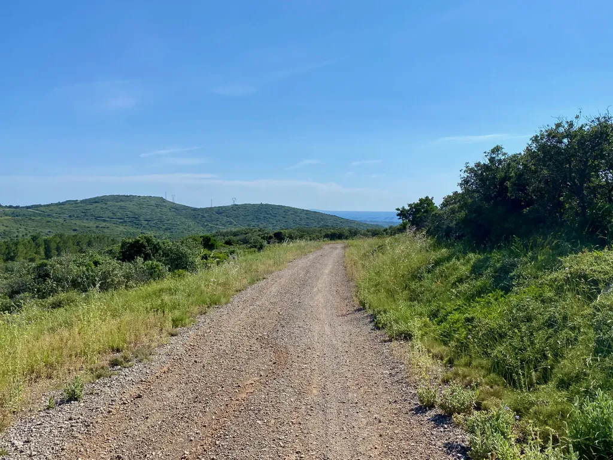

À chaque départ de single, je me disais « Et si je les faisais passer par là ? ». Il m’arrivait de m’engager avec mon gravel, puis très vite de me dire « Non, c’est absurde, tu n’y prends aucun plaisir alors qu’à VTT c’est à fond de train avec des cris de joie. » Alors oui, un gravel passe presque partout où passe un VTT XC, mais à quel prix ?

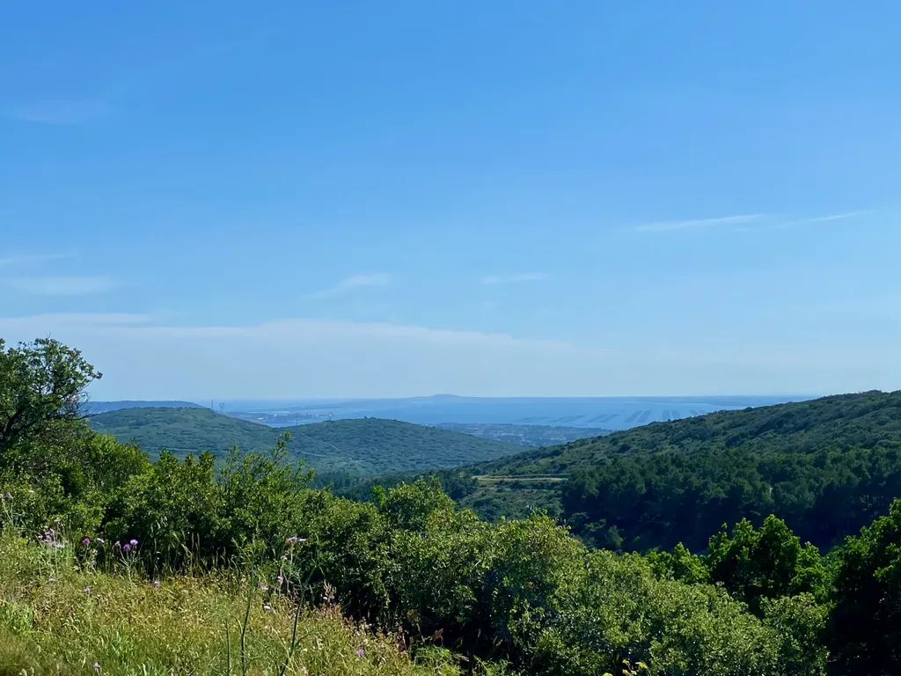

Début mai, nous étions une quarantaine sur le [i727](https://727.tcrouzet.com/i727/), un parcours pour moi XC, et il y avait quelques téméraires à gravel, notamment Seb qui a roulé dans notre groupe. Pour le situer, c’est un enduriste, un des organisateurs de l’[Epic Enduro](https://epicenduro.com/), réputée une des courses les plus copieuses de la discipline. Seb roulait avec un monster en titane à gros pneus. Au-dessus de Mons, depuis le sommet du Naudech, il nous a fait passer par une piste enduro que j’ai terminé à pied, lui avalant les épingles apparemment sans difficulté loin devant moi.

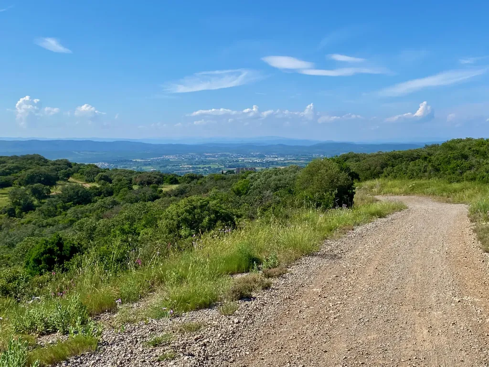

Néanmoins, à la fin des cinq jours de notre périple, il a conclu : « Oui, ça passe à gravel, mais on finit par se faire trop mal au corps et par ne plus prendre le moindre plaisir ». Le plaisir, à vélo comme ailleurs, est un critère de première importance, quand j’ai le privilège de pouvoir le mettre en avant. Notion relative, Seb poussant le plaisir du gravel plus loin que moi sur les singles engagés, mais sur un parcours XC comme le i727 je crois que les vététistes ont engrangé davantage de plaisir d’une manière générale.

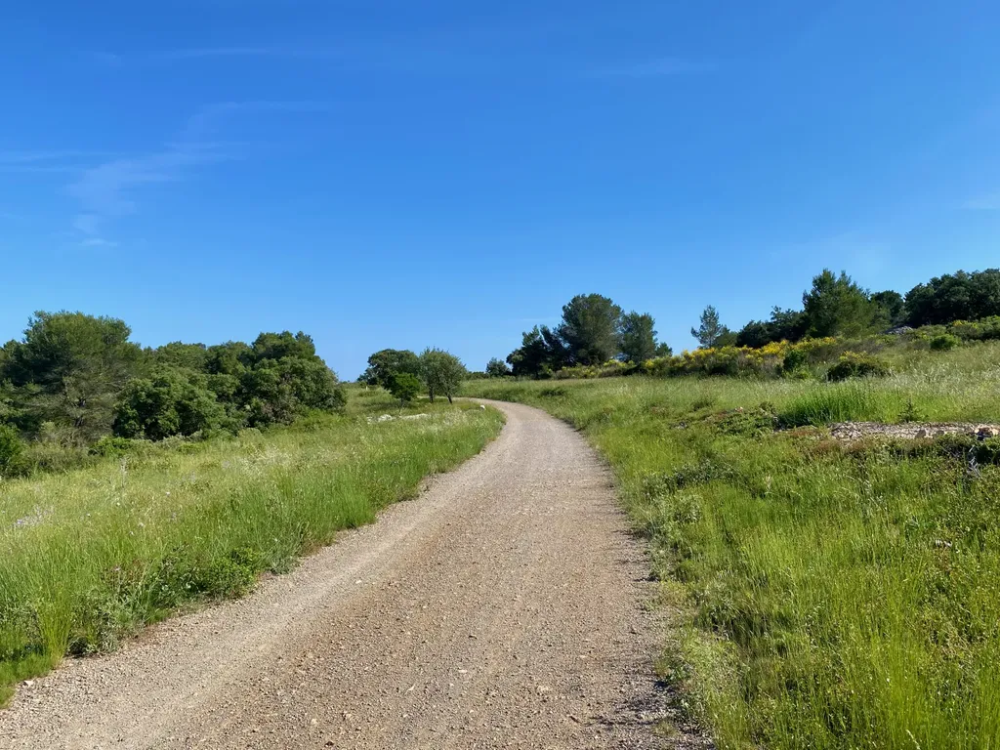

Je suis fatigué d’entendre « Le gravel, ça passe partout », parce que ça n’a aucun sens, ce qui compte c’est que « ça passe avec plaisir », sur trente bornes, sur cent bornes, sur cinq cents et plus ? Si pour passer, il faut se provoquer des tendinites, se défoncer les cervicales et s’abraser les articulations des bras, je ne comprends ce choix que sous une perspective masochiste. Si pour passer il faut faire la grimace dans les descentes pendant que les VTT foncent et bondissent dans tous les sens, c’est doublement masochiste.

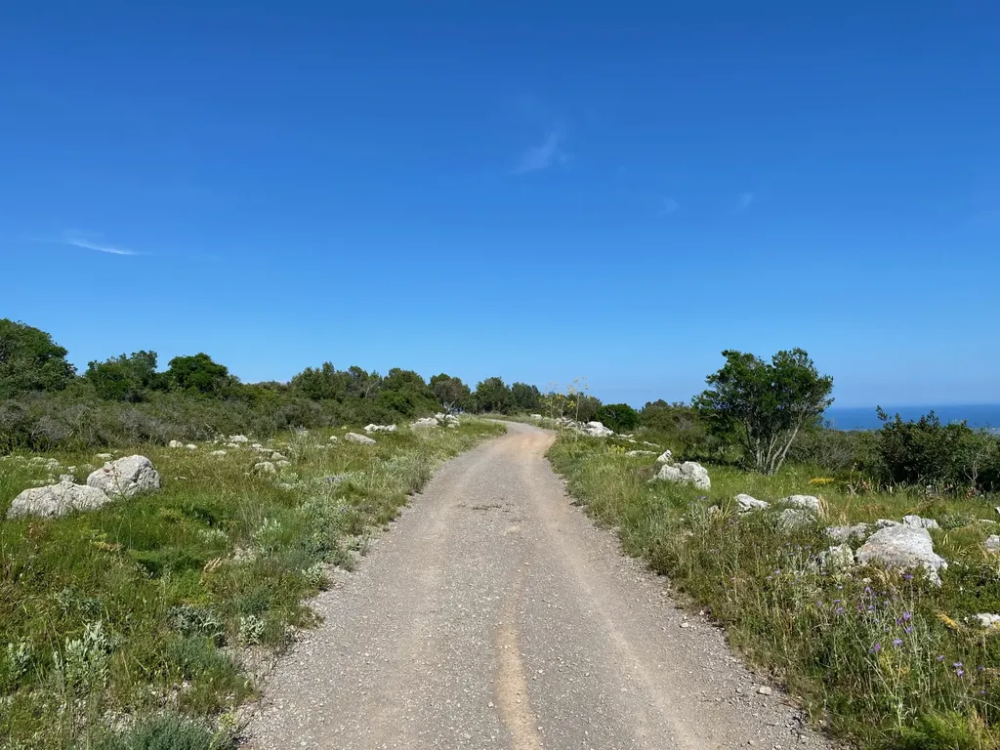

Le gravel est tout simplement à sa place sur les chemins gravel, définition assez floue, mais pour moi facile à qualifier : quand mon plaisir de cycliste est maximal sur mon gravel et que je m’y trouve mieux qu’à VTT. Hier, sur certains singles familiers, j’étais loin du niveau de plaisir maximal, j’étais même à la limite de la souffrance, je n’y étais donc pas à ma place avec mon gravel.

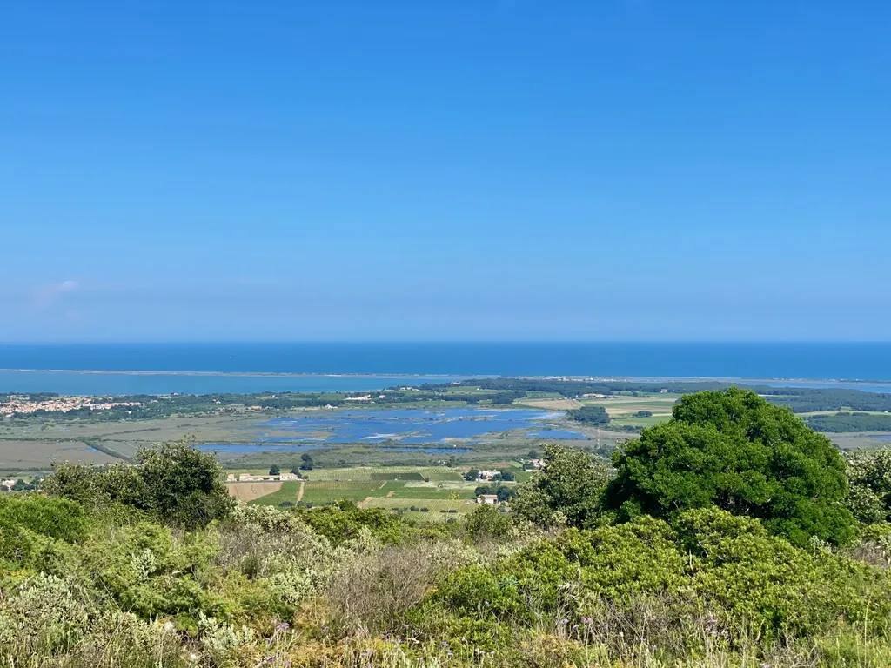

Bien sûr, j’accepte à gravel quelques passages rugueux, quand ils connectent de beaux secteurs, j’accepte des inconforts momentanés, mais le gravel invite à tourner les jambes, à enrouler. Une question de position, de cintre, de dynamique, de roues, de pneus… Il n’y a que les imbéciles qui croient qu’il n’y a aucune différence entre un gravel et un VTT, qui croient que tout cela n’est que du marketing ou une mode. Définition de l’imbécile : celui qui parle de quelque chose qu’il ne connaît pas (ou pire, qu’il croit connaître).

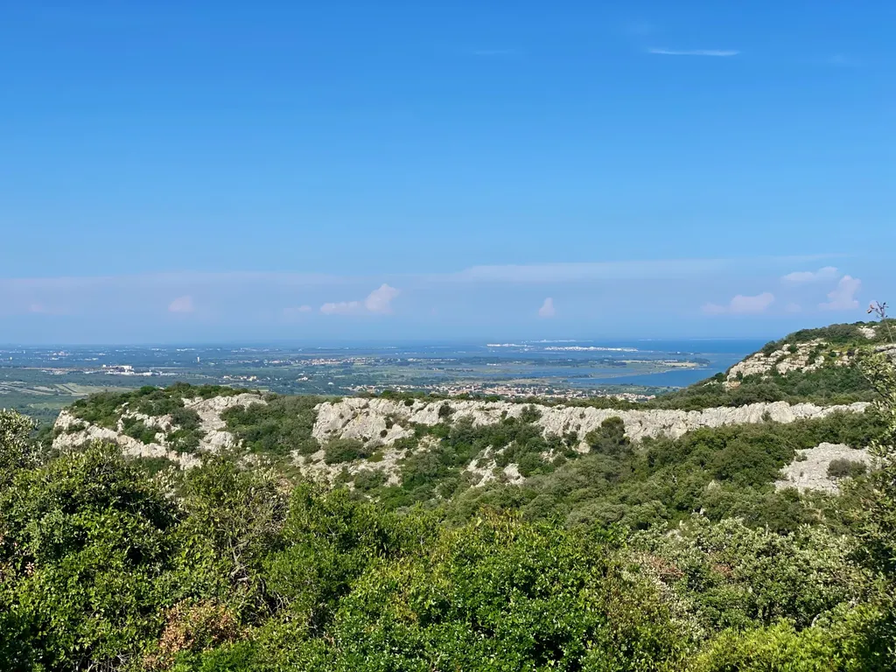

Après avoir vendu mon premier gravel, j’ai écrit que [le VTT semi-rigide était le meilleur gravel](https://tcrouzet.com/2021/12/10/le-meilleur-gravel-cest/), parce qu’il permet d’aller presque partout où va le VTT tout suspendu avec quasiment la même légèreté que le gravel. Je pense toujours qu’un semi-rigide est un bon compromis si on n’a qu’un seul vélo. Reste que je préfère spécialiser mes montures, d’un côté un gravel dynamique, sans que ce soit un truc taillé pour la compétition et le seul rendement, de l’autre un tout suspendu. Entre mes deux bécanes, l’écart de poids est minime, moins de 2 kg, mais la dynamique n’a aucun rapport. C’est une tout autre expérience, des plaisirs différents (et aussi souvent des compagnons de pédale différents, ce qui est un point essentiel). Un parcours est gravel quand j’y prends plus de plaisir qu’avec mon VTT. Il ne faut pas confondre les deux pratiques et les réduire à un entre deux sans saveur.

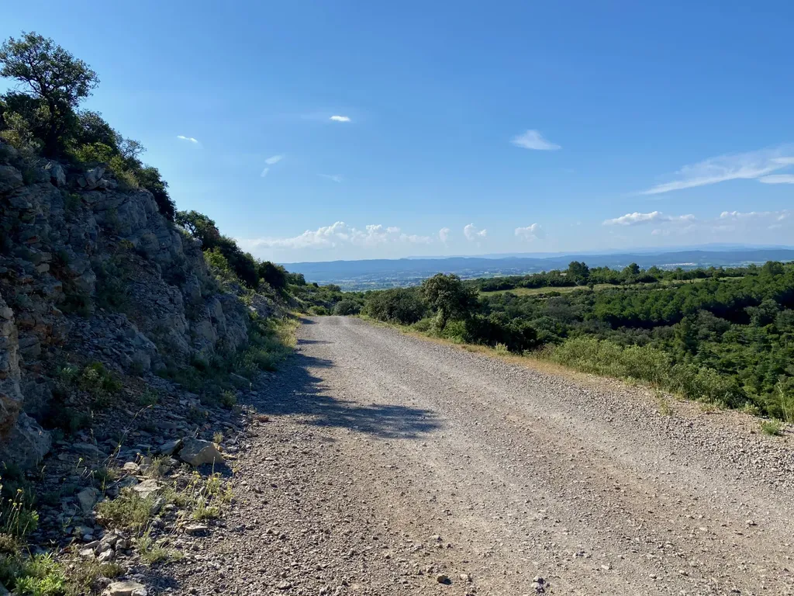

Souvent mes vélos me dictent leur volonté, transforment le cycliste que je suis, et transforment les endroits où je roule, me les présentant sous des visages différents, ce qui revient à les renouveler, et à empiler plusieurs strates de paysages les unes au-dessus des autres. Le VTT, par nature joueur, pousse dans les singles, dans les montées descentes, il invite à quitter les pistes où il n’aime pas s’éterniser, alors que le gravel beaucoup moins téméraire connaît ses limites et m’incite à davantage de contemplation. Deux vélos différents pour changer mon regard sur le monde. Il faudrait que je sois borné pour me contenter d’un seul vélo et refuser d’étendre mon champ de vision.

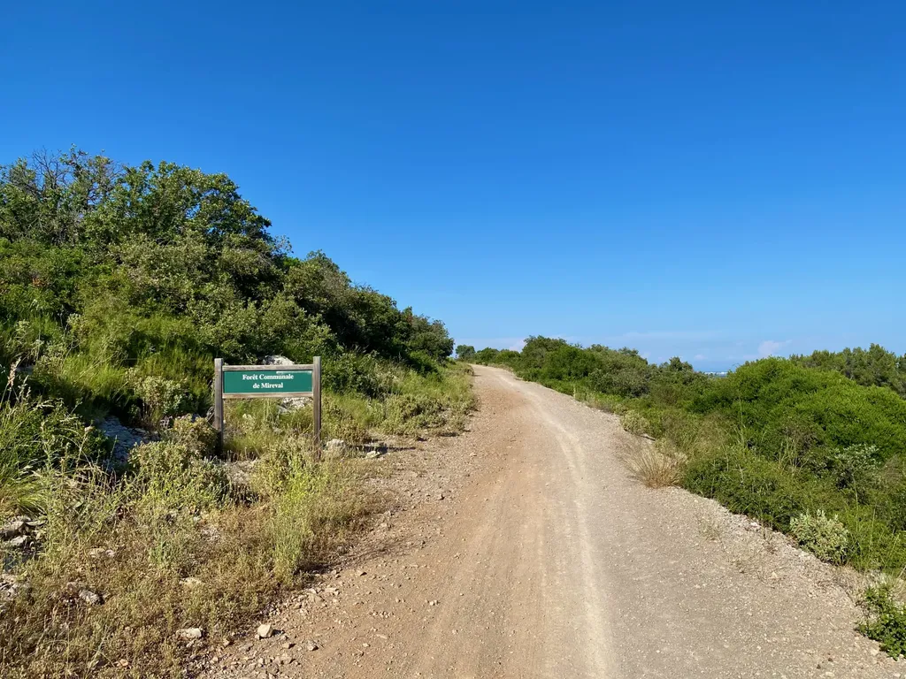

Qui dit plaisir, dit souvent confort. Encore une notion relative, mais qui pour moi se traduit par moins de douleurs, moins de fatigue, une plus grande endurance. Même sur route, l’évidence s’impose peu à peu : plus on augmente la distance, plus il est judicieux d’augmenter la taille des pneus pour augmenter le confort. C’est la même chose à gravel, voilà pourquoi j’ai vendu mon Diverge, qui était limité à 42 mm. Un gravel polyvalent aujourd’hui doit accepter des pneus beaucoup plus gros à minima 50 mm (ce qui de facto élimine, à mes yeux, les gravels de nombreuses marques, Specialized en tête, plus pensés pour les anciens routiers qui se tirent la bourre durant trois ou quatre heures que pour les baroudeurs). [Comme l’a fait remarquer Fabian](https://www.facebook.com/groups/1956177877969720/posts/3704156066505217/), sur les 320 km de l’[Ubound 2024](https://www.unboundgravel.com/) les dix premiers avaient des [pneus de plus de 50 mm](https://gravel.shimano.com/us/stories/bikes-of-unbound-2024). Un gravel moderne, et qui ne veut pas brider l’imaginaire, se doit d’accepter des pneus de taille imposante, que ce soit pour rouler à 35 km/h de moyenne que bien moins vite en maximisant le confort. Voilà pourquoi, pour compléter mon Canyon Grizl idéal pour mes sorties à la journée, je suis en train de monter un monster gravel pour les voyages, avec fourche hydraulique. Trois vélos pour la pratique hors asphalte est un luxe qu’à soixante ans je m’autorise, justement parce que mon corps m’autorise de moins en moins de folie.

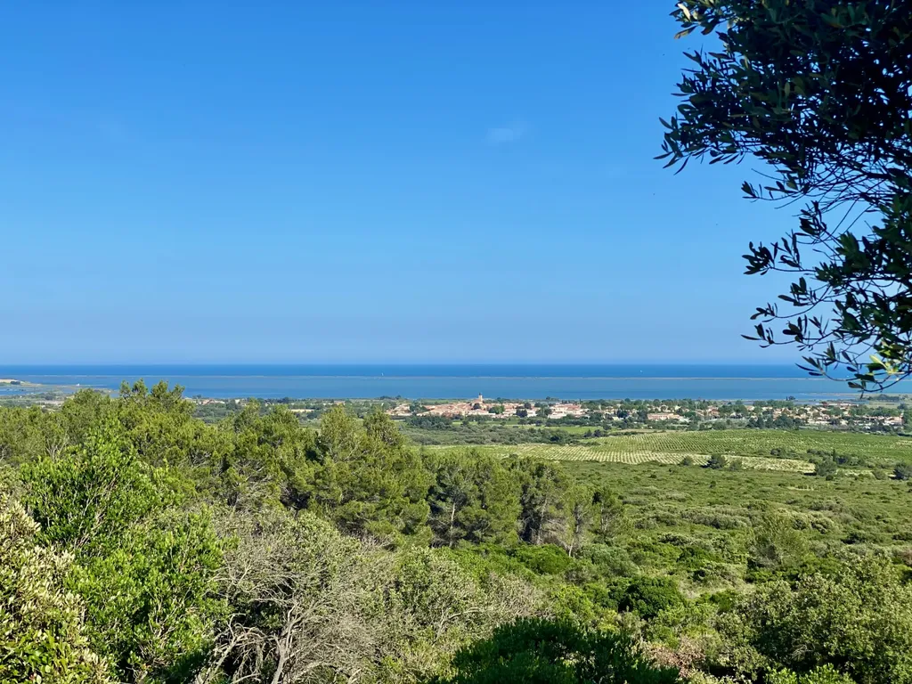

Un vélo qui passe partout sur 80 km ne passe plus partout sur les 320 km de l’Unbound, encore moins sur les 727 km du g727. Quand j’entends dire « Je passe partout avec mes 42 mm », j’ai toujours envie de répondre « Ta notion du partout est bien étriquée. » Je me tais, le plus souvent, ou en vient à écrire un billet pour dire une simple évidence : à vélo, il ne s’agit pas de « pouvoir passer », mais d’y passer avec légèreté et allégresse, et de perdurer dans l’effort jusqu’à la satiété des sens, du lever du jour à la tombée de la nuit, et pourquoi pas loin dans la nuit. Le vélo n’est pas seulement un sport, encore moins seulement un moyen de transport, c’est un art.

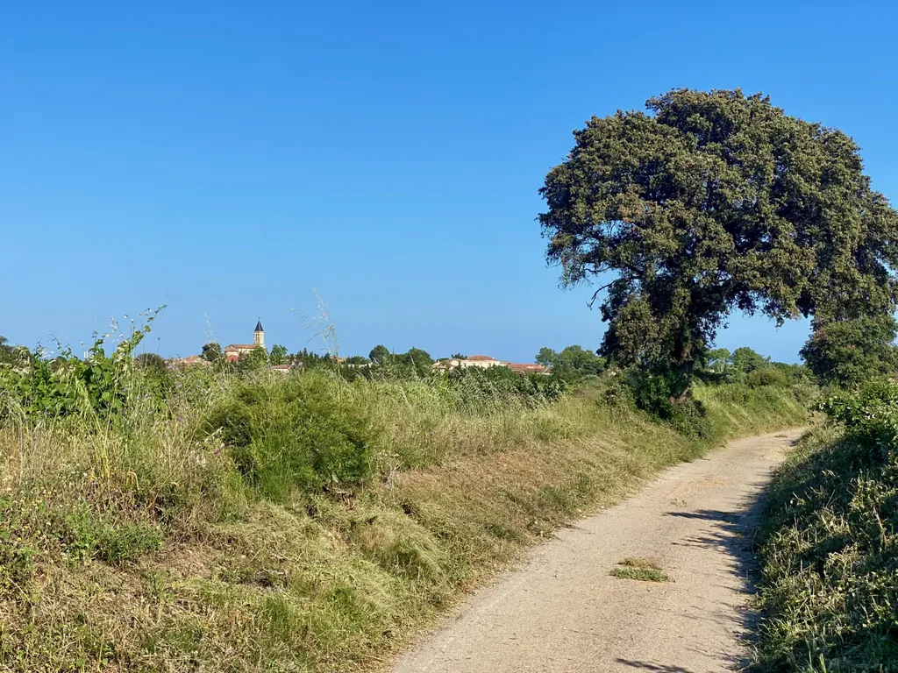

#velo #gravel #y2024 #2024-6-5-10h00
