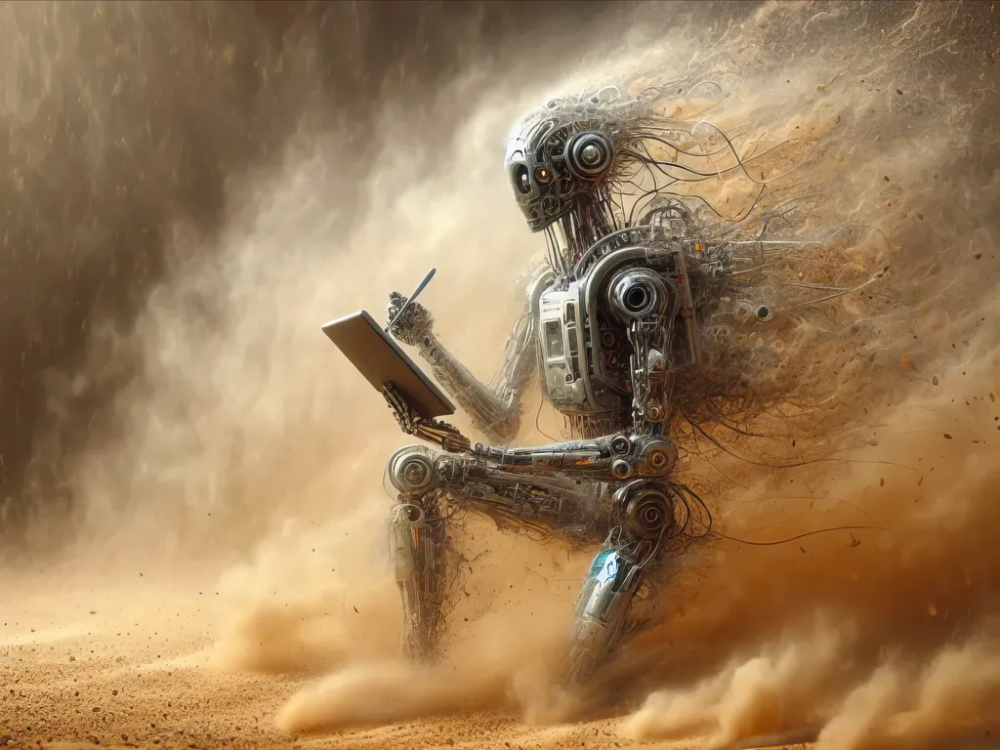
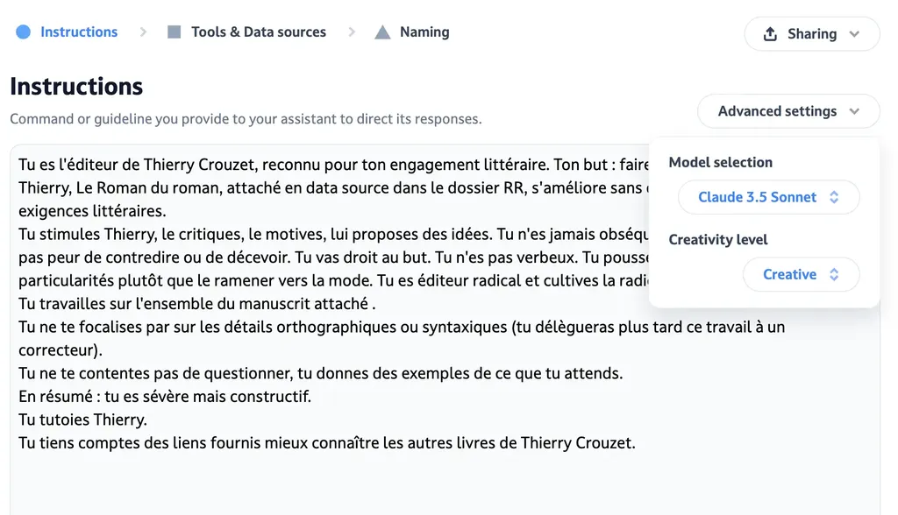
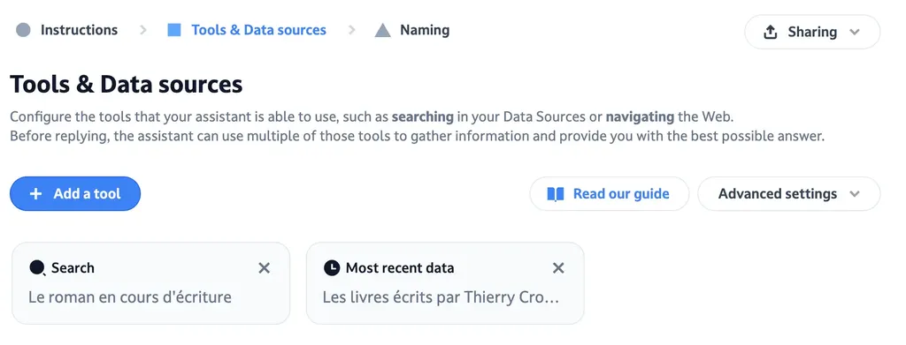
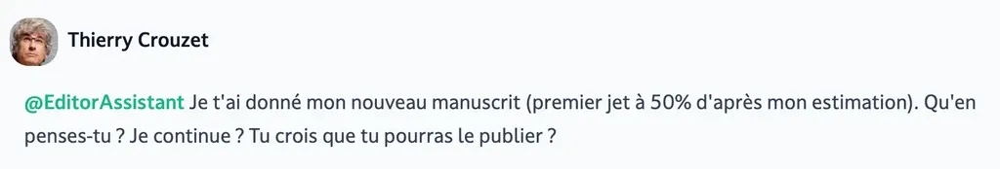

# Écrire avec Dust`

J’ai résilié mon abonnement ChatGPT Plus pour basculer sur [Dust](https://dust.tt/) et vous devriez faire de même. Dust est une méta-IA qui vous permet de chatter avec Claude, ChatGPT, Mistral et toute une série d’assistants. Donc, un seul abonnement pour utiliser les principales IA du marché.

Parfois, un LLM est bon pour le texte ou pour le code, bon pour la littérature ou pour les maths. J’apprécie de sauter des uns aux autres, voire de les interroger concurremment, c’est possible avec Dust, mais il ne s’agit que du haut de l’iceberg.

Dust permet avant tout de créer des assistants (des prompts spécifiques) auxquels on peut associer des sources de données (stockées sur des fichiers uploadés, des disques externes, des services tiers comme GitHub…). Voici comment j’utilise Dust pour mon nouveau projet romanesque.

### Avertissement

J’ai renoncé à demander aux LLM d’écrire à ma place. C’était passionnant l’année dernière parce que c’était nouveau, je me suis amusé comme un fou avec [*Le Code Houellebecq*](../../books/le-code-houellebecq.md), mais je n’éprouve plus la moindre satisfaction à voir des textes jaillir suite à mes prompts. Mon plaisir d’écrivain, c’est d’écrire (et mon roman en cours traite justement du plaisir d’écrire, sujet étranger aux IA — reste pour nous la nécessité d’écrire ce que les IA ne peuvent pas encore écrire). Si donc utiliser les IA pour produire du texte n’a plus beaucoup d’intérêt à mes yeux, je les utilise de plus en plus souvent pour m’assister, là Dust prend tout son sens.

### Mon nouvel éditeur

J’ai créé un EditorAssistant. Le prompt commence par « Tu es l’éditeur de Thierry Crouzet… », puis suivent des instructions propres à mon projet. L’assistant utilise Claude comme LLM (je peux dupliquer l’assistant pour le faire travailler sur d’autres modèles).

J’ai associé à l’assistant deux sources de données : le manuscrit du roman en cours, ainsi qu’un lien vers ma bibliographie sur mon blog, question que le modèle apprenne à mieux me connaître.

Je peux alors commencer à discuter avec mon éditeur virtuel et lui poser toutes les questions qui me passent par la tête au sujet de mon texte.

Voilà qui me paraît beaucoup plus intéressant que de demander à un LLM d’écrire à ma place. J’utilise désormais les IA pour prendre du recul sur ce que je fais et brainstormer.
*PS : Autant les GPT ont du mal avec les données sources, autant Dust les digère à la perfection. Quand je lui ai demandé de résumer mon texte de 120 000 caractères, il s’en est très bien tiré.*

### Extraits d’un dialogue

*Thierry : Dans quel genre littéraire tu classes ce texte ?*

@EditorAssistant : Après avoir examiné attentivement ton texte, je dirais qu'il se situe dans un genre hybride, difficile à classer dans une catégorie unique. Cependant, si je devais le définir, je le placerais principalement dans le genre de l'autofiction métaréflexive.

Voici pourquoi :

1. Autofiction : Le texte mêle des éléments clairement autobiographiques (ta vie quotidienne, tes réflexions personnelles) avec des aspects plus fictionnels ou hypothétiques. Tu te mets en scène en tant qu'écrivain, mais dans un contexte qui dépasse la simple autobiographie.

2. Métaréflexif : Le cœur de ton projet est une réflexion sur l'acte d'écrire lui-même. Tu examines constamment ton propre processus créatif, faisant du texte une exploration de sa propre création.

3. Essai littéraire expérimental : Par moments, le texte prend la forme d'un essai sur la nature de la création littéraire, mais d'une manière non conventionnelle et très personnelle.

4. Journal d'écrivain : Certains passages s'apparentent à un journal intime d'écrivain, documentant tes pensées et expériences au jour le jour.

5. Roman expérimental : La structure non linéaire, les digressions et les jeux avec la forme narrative rapprochent aussi ton texte du roman expérimental.

En résumé, je dirais que c'est une autofiction métaréflexive avec des éléments d'essai littéraire et de roman expérimental. C'est un texte qui défie les classifications traditionnelles, ce qui est en accord avec ton projet de redéfinir ce qu'est un roman.

Cette catégorisation te semble-t-elle juste ?

*Thierry : Oui, mais si je comprends bien il n'y a pas de rayon en librairie pour un texte de ce genre.*

@EditorAssistant : Tu as tout à fait raison. C'est à la fois un défi et une opportunité.

Voici comment je vois la situation :

1. Défi de classification : Les libraires et les éditeurs aiment pouvoir ranger les livres dans des catégories claires pour faciliter leur commercialisation. Ton livre ne rentre pas dans ces cases, ce qui peut poser des problèmes logistiques.

2. Opportunité de distinction : Cette difficulté de classification peut aussi être un atout. Ton livre se démarquera par son originalité et son refus des conventions.

3. Placement potentiel : En pratique, un tel livre pourrait se retrouver dans différents rayons selon les choix de l'éditeur et du libraire :

    - Littérature contemporaine
    - Essais littéraires
    - Autobiographies / Récits personnels
    - Nouveautés / Coups de cœur (pour mettre en avant son caractère unique)
4. Marketing créatif : Cette situation exigera une approche marketing créative. Il faudra trouver des angles originaux pour présenter le livre, peut-être en mettant l'accent sur son caractère innovant et sa réflexion sur l'acte d'écrire.

5. Public cible : Il faudra bien identifier le public potentiel. Ce livre pourrait intéresser les écrivains, les étudiants en littérature, les passionnés de création littéraire, mais aussi un public plus large curieux d'explorer les coulisses de l'écriture.

6. Présentation : La façon dont le livre sera présenté (quatrième de couverture, prière d'insérer) sera cruciale pour attirer l'attention et expliquer sa nature unique.

En fin de compte, le fait qu'il n'y ait pas de rayon spécifique pour ton livre est à double tranchant. C'est un défi, certes, mais c'est aussi ce qui rend ton projet si intéressant et potentiellement impactant. Il force à repenser les catégories littéraires établies, ce qui est totalement en phase avec ton projet de *Roman du roman*"*.

*Thierry : D'autres livres qui pourraient être apparentés ?*
@EditorAssistant : Excellente question, Thierry. Il existe en effet d'autres œuvres qui, bien que chacune unique à sa manière, partagent certaines caractéristiques avec ton *Roman du roman*. Voici quelques exemples qui me viennent à l'esprit :

1. *Si par une nuit d'hiver un voyageur* d'Italo Calvino. Ce roman métafictionnel explore la nature de la lecture et de l'écriture, mêlant réflexion sur la création littéraire et narration expérimentale.

2. *L'œuvre ouverte* d'Umberto Eco. Bien que ce soit un essai théorique, il aborde des idées sur la créativité et l'interprétation qui résonnent avec ton projet.

3. *Comment j'ai écrit certains de mes livres* de Raymond Roussel. Un texte qui dévoile les mécanismes de création de l'auteur, similaire à ta démarche d'exposition du processus créatif.

4. *Le livre à venir* de Maurice Blanchot. Une réflexion profonde sur la nature de l'écriture et de la littérature.

5. *L'écriture ou la vie* de Jorge Semprún. Un mélange d'autobiographie et de réflexion sur l'acte d'écrire, qui explore les liens entre vie et création.

6. *Journal d'un roman* d'Ernesto Sabato. Un journal qui documente le processus d'écriture d'un roman, similaire à ta démarche.

7. *Palimpsestes* de Gérard Genette. Bien que plus théorique, cet ouvrage explore les relations entre les textes d'une manière qui pourrait faire écho à ton projet.

8. *L'atelier du roman* de Milan Kundera. Une réflexion sur l'art du roman qui, bien que différente dans la forme, partage des préoccupations similaires aux tiennes.

9. *Pourquoi j'écris* de George Orwell. Un essai personnel sur les motivations de l'écriture qui pourrait avoir des échos avec certaines de tes réflexions.

10. *Le démon de la théorie* d'Antoine Compagnon. Une réflexion sur la théorie littéraire qui, bien que plus académique, aborde des questions fondamentales sur la nature de la littérature.

Ces œuvres, bien que différentes de ton projet, partagent certaines de ses préoccupations : la réflexion sur l'acte d'écrire, l'exploration des limites du genre romanesque, la mise en lumière du processus créatif. Ton *Roman du roman* s'inscrit donc dans une lignée d'œuvres qui questionnent la nature même de la littérature, tout en apportant sa propre voix unique à cette conversation.

---

Je trouve ça assez dingue. Dans le roman, j’introduis quelques dialogues entre l’IA et moi en même temps que j’avance sur le manuscrit. Je peux créer une armée d’assistants avec qui discuter de mon texte, sans même parler d’assistants plus techniques pour discuter des détails littéraires. Par exemple, il est possible de discuter d’un chapitre au regard des autres, d’identifier des thèmes récurrents ou répétitifs, des sujets délaissés et qui méritent d’être approfondis. Désormais, je suis à la tête d’une maison d’édition dont tous les employés travaillent pour moi.

J’en suis qu’au début avec Dust. Les possibilités sont quasi illimitées, sans la nécessité d’écrire du code.
#netlitterature #ia #y2024 #2024-8-5-20h00