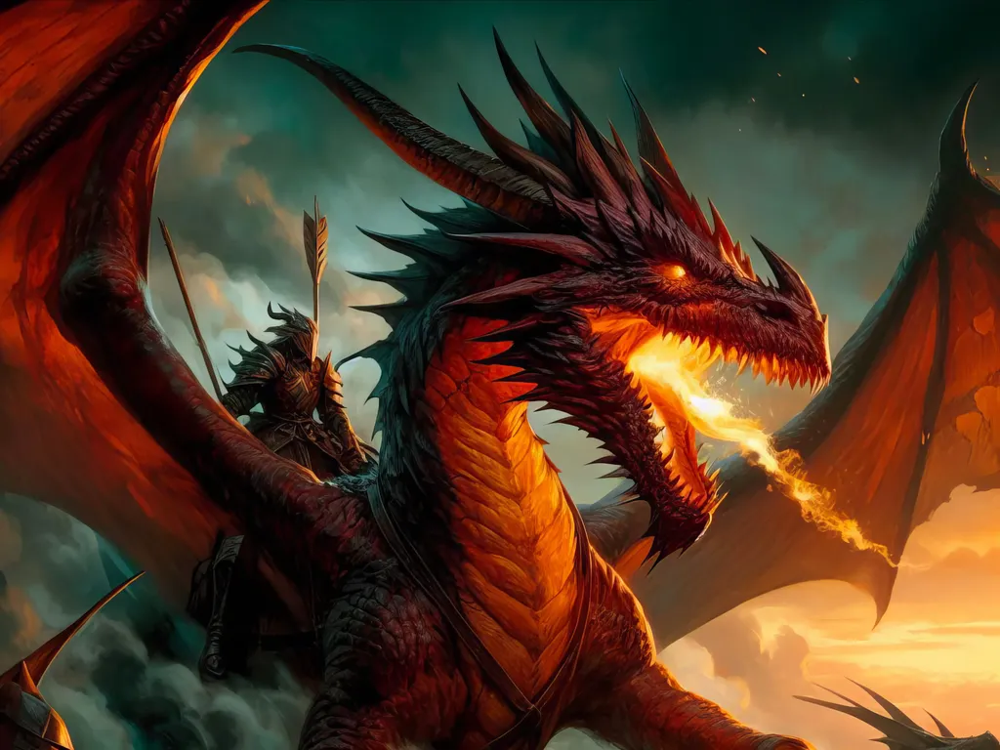

# Jeu de rôle et coïncidence

Mon roman en cours, sur le plaisir d’écrire, un plaisir dont ne peuvent me priver les IA, est aussi un roman jeu, comme a pu l’être *Si par une nuit d’hiver un voyageur* de Calvino. Je suis en train de reboucler ma passion du jeu de rôle et ma passion de la littérature, d’une façon inattendue et qui m’amuse beaucoup. Et quand je prends du plaisir à écrire, j’arrive à surmonter même les pires vacheries de la vie.

De passage sur Facebook pour y discuter de vélo, j’aperçois [un post de Julien Delorme sur l’histoire du jeu de rôle](https://www.facebook.com/julien.tanguy.1293/posts/pfbid0nzsDPcnkLx9Scd21D8U8iTcDqZK5kHptaAY76dNGWxbJT1KJd1g2qdqc4GqTCLH2l), où il effectue un lien avec la littérature. Ce qui d’une certaine façon me conforte dans mon projet et me fait penser que j’ai évoqué moi-même ce lien de nombreuse fois depuis des années, notamment au chapitre 7 du [*Peuple des connecteurs*](../../books/le-peuple/le-peuple-des-connecteurs.md). L’occasion de reprendre ce texte et [de pointer vers d’autres](/tag/jdr).

---

En même temps que les punks agitaient l’Angleterre et que Steve Jobs et Bill Gates bousculaient les businessmen installés, une autre révolution débutait dans le Wisconsin. Discrètement, quelques jeunes Américains nous lancèrent dans une aventure, aussi stupéfiante pour les premiers connecteurs que celle du LSD pour la beat génération : le jeu de rôle.

Cette nouvelle drogue psychotrope d’une puissance explosive, très addictive, sans toutefois présenter d’effets secondaires notables, débuta sa carrière durant les années 1960 à Lake Geneva, à deux heures de route de Chicago. Dans cette petite ville de province, quelques jeunes hommes occupaient leur temps libre en jouant aux soldats de plomb. Ils avaient entre 20 et 30 ans, se passionnaient d’histoire, de stratégie et, avant tout, de batailles dont ils aimaient revivre les épisodes. En imagination, ils entraient dans la mêlée, tremblaient à chaque coup de canon, suffoquaient à cause de la fumée acre ou de l’odeur du sang. Leur rythme cardiaque s’accélérait, ils transpiraient, grimaçaient de douleur, sursautaient lorsqu’un jet de dé leur était défavorable. Le jeu leur donnait l’occasion d’exceller et de vivre en héros tout en buvant une bière avec leurs amis.

Si les simulations guerrières étaient le passe-temps favori de ces jeunes gens, ils n’en étaient pas les inventeurs. Deux cents ans plus tôt, Helvig, maître des pages du duc de Brunswick, nous avait fait entrer dans l’âge de la simulation. En 1780, pour divertir son seigneur, il créa le jeu de guerre ou *wargame*. Près de vingt ans plus tard, Georg Vinturinus s’inspira de ses idées pour concevoir le *Kriegspiel*, jeu qui devint un passage obligé pour les apprentis officiers. L’usage des soldats de plomb se répandit dans toutes les armées, puis au sein des coteries d’amateurs avertis. En 1913, Herbert George Wells publia un livret de règles, donnant un nouvel élan aux jeux de simulation.

En 1953, Charles Roberts innova en remplaçant les soldats de plomb par des bouts de carton qu’il disposa sur des cartes géographiques quadrillées d’hexagones. Il fonda Avalon Hill Game Company et distribua les premiers wargames modernes. En 1958, l’un d’eux, *Gettysburg*, atterrit entre les mains d’Ernest Gary Gygax, un étudiant de 20 ans habitant Lake Geneva. Passionné immédiatement, Gygax rassembla autour de lui un groupe de wargamers. En 1963, il créa l’International Federation of Wargaming, nom ambitieux qui l’unissait à quelque uns de ses amis. Dans le même temps, la littérature d’heroic-fantasy proliférait. Fritz Leiber, Paul Anderson, Jack Vance publiaient leurs premiers romans. En 1965, *Le Seigneur des Anneaux* sortait en livre de poche, les mondes médiévaux fantastiques devenaient populaires. En 1968, Gygax se spécialisa dans les batailles médiévales.

— Nous avons commencé à jouer en nous référant au Moyen Âge parce que j’avais trouvé des figurines appropriées, dit-il[^7]. J’ai écrit des règles selon lesquelles les figurines ne pouvaient utiliser durant le jeu que les équipements qu’elles portaient effectivement. \[…] Un jour où les joueurs s’ennuyaient, j’ai décidé d’introduire une petite variation. J’ai annoncé secrètement à un camp qu’il disposait d’un magicien capable d’envoyer des boules de feu.

Ainsi la magie entra dans le jeu de guerre avec figurines. Gary Gygax et son ami Jeff Perren créèrent un nouveau jeu, *Chainmail*, et le publièrent en 1971 chez Guidon Games.

— Ce fut Dave Arneson qui commença des parties de *Chainmail*, où chacun des joueurs ne dirigeait qu’une figurine, précise Gygax.

En 1967, Dave Wesely, ami de Dave Arneson, avait organisé un wargame où chaque participant, en plus de diriger ses armées, devait tenir un rôle : maire de la ville assiégée, chef de la garde, frondeur incontrôlable… Au petit matin, la bataille n’avait toujours pas commencé tant les joueurs avaient passé de temps à comploter, certains quittant leur poste de commandement pour traverser à la nage une rivière et pénétrer les lignes ennemies, d’autres se disputant et finissant par se battre en duel. Dave Wesely était désespéré, mais les joueurs enchantés voulurent renouveler l’expérience. Après quelques hésitations et atermoiements, Dave Wesely organisa une partie durant laquelle les joueurs devaient fomenter un coup d’État dans une république bananière. Tous les participants furent une nouvelle fois enthousiastes.

Après le départ à l’armée de Dave Wesely, Dave Arneson perfectionna le système et le transposa dans l’univers de *Chainmail*. Gary Gygax prit conscience qu’un nouveau mode de jeu était en train de naître, le jeu de rôle. Dans le monde décrit par un maître du jeu, « divinité » de la simulation, les joueurs rassemblés autour d’une table couverte de dés et de figurines incarnent des personnages dont les actes obéissent à la physique de la simulation, des jets de dés décidant de la réussite ou de l’échec de leurs entreprises, tout se passant en fait comme dans la réalité, mais une réalité fictive, régie par des probabilités. Le jeu de rôle, comparé à tort au théâtre, est avant tout une simulation. Comme les cellules dans le *Jeu de la vie*, les joueurs ne répètent pas une pièce, ils ne l’improvisent même pas, ils vivent dans un autre monde et doivent obéir à ses règles, qui leur sont imposées par les dés aussi certainement que la gravitation s’impose à nous[^8].

Pris de frénésie, Gary Gygax rédigea en quelques mois les règles du premier jeu de rôle de l’histoire : *Donjons & Dragons*. Il y mêla l’univers guerrier de *Chainmail*, l’ambiance moyenâgeuse empreinte de magie des romans d’heroic-fantasy, y ajouta du rêve, beaucoup de rêve. Les joueurs devenaient des aventuriers, errant de ville en ville et traversant des contrées sauvages peuplées de monstres mythiques. Ils rencontraient d’autres aventuriers, discutaient avec eux, échangeaient des informations, partaient explorer des catacombes ou des palais pour délivrer des princesses et tuer des méchants. Le wargame des origines n’était plus qu’un lointain souvenir. Parfois des combats épisodiques éclataient, mais des parties entières pouvaient se dérouler sans la moindre violence. Tout dépendait du scénario concocté par le maître du jeu.

En 1973, Gary Gygax créa la société TSR et, l’année suivante, commercialisa *Donjons & Dragons*, qui allait devenir un phénomène de société dont, trente ans plus tard, personne n’a encore mesuré la portée. En même temps qu’Apple commercialisait ses premières machines, Microsoft ses premiers logiciels et les punks leurs premiers albums, le jeu se répandit aux quatre coins du monde. Son développement suivit celui de la micro-informatique dont il exprimait, de manière métaphorique, l’une des potentialités les plus extraordinaires, celle de simuler des univers. Pour toute une génération, Gygax reste sinon l’inventeur du jeu de rôle, son promoteur, chantre de la simulation humaine où chacun de nous peut, pendant quelques heures, être quelqu’un d’autre et explorer des univers virtuels.

À partir de ce moment, nous ne pouvions plus prendre le travail avec autant de sérieux que par le passé. Dans l’esprit de tous, une redistribution des cartes restait toujours possible. La secrétaire pouvait prendre les commandes de la partie. Un ordre, considéré comme une règle du jeu, n’émanait jamais d’une autorité sanctifiée, mais d’un boss provisoire, le temps de quelques jets de dés. Steve Jobs comprit peut-être le premier ce nouvel état d’esprit. Avant lui, les ordinateurs étaient des outils de travail ordinaires et, surtout, austères. Après lui, ils devinrent ludiques et stimulèrent la créativité de leurs utilisateurs.

Le jeu de rôle aurait-il pu naître à une autre époque ? Sans doute pas. Il doit son existence, de manière plus ou moins consciente, aux travaux de John von Neumann et de John Horton Conway. Plus tard, il inspira tous les développeurs de jeux vidéo. De *Wizardry* au *World of Warcraft[^9]*, il s’incarna numériquement sous diverses formes qui, aujourd’hui, font interagir simultanément des dizaines de milliers de joueurs. Les frères Wachowski n’ont pas pu l’ignorer lorsqu’ils réalisèrent *Matrix*. De nombreux joueurs, ou leurs amis, sont depuis devenus écrivains. La marque du jeu de rôle se retrouve aussi bien dans le monde de Harry Potter que dans les romans d’aventures tels le *Da Vinci Code* ; même les romans de Michel Houellebecq sentent le soufre caractéristique des sortilèges de *Donjons & Dragons*. L’esthétique des connecteurs peut paraître puérile, mais elle renoue avec celle des premiers hommes confrontés à un monde inconnu. Les artistes ne s’interrogent plus sur eux-mêmes, car ils doivent à nouveau défricher des territoires vierges. Leurs véritables chefs-d’œuvre n’ont pas encore été écrits.

— Le seront-ils jamais ?

— Les connecteurs, en tout cas, en sont persuadés. Si nous vivons comme nous le pensons une nouvelle époque, un art original ne manquera pas de naître avec elle, même si personne ne l’a encore remarqué.

Rétrospectivement, je considère mes premières soirées de *Donjons & Dragons*, au début des années 1980, comme des expériences cruciales. J’avoue sans honte qu’elles rivalisent avec mes premières amours. Elles se confondent avec les épisodes de ma vraie vie, d’autant plus que mes amis et moi partageons les mêmes souvenirs. Nous pouvons parler d’un scénario comme de vieux combattants d’une de leurs campagnes. Mais pour nous, il n’y a que du bonheur, aucune souffrance, sinon parfois celle de s’être fait blouser par un voleur. Aucun roman, aucun film, ne nous a jamais laissé d’impression aussi prégnante : nous les avons toujours considérés avec plus de distance. Le jeu de rôle nous a donné la chance d’avoir plusieurs vies, mais aussi l’idée de vivre notre vie comme un jeu.

#netlitterature #jdr #y2024 #2024-8-16-13h30
