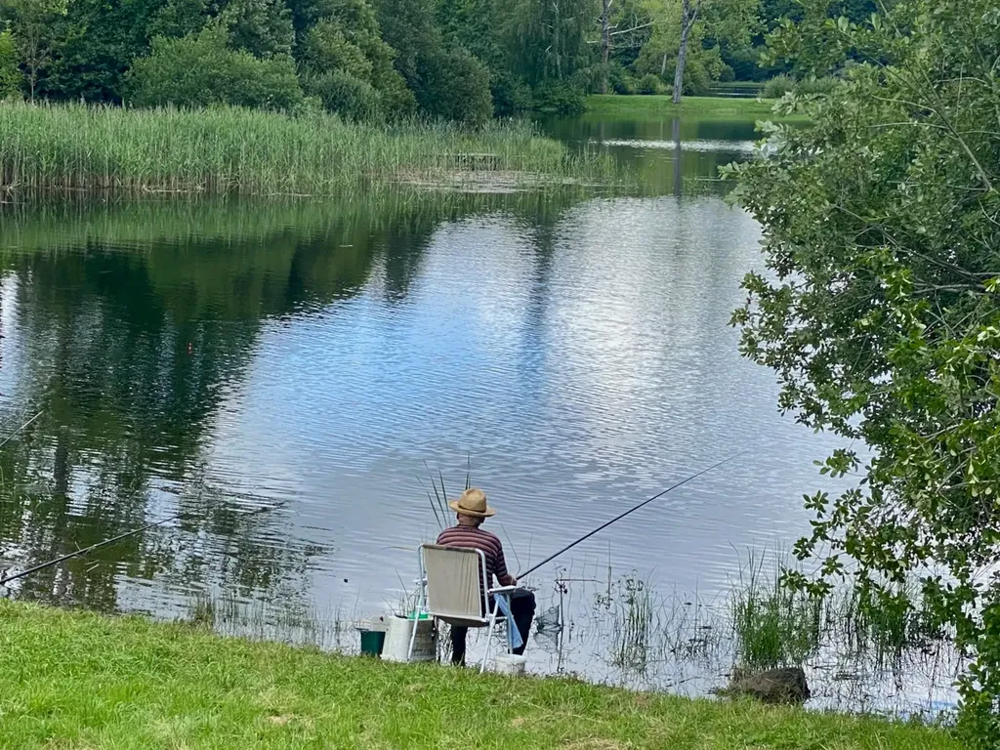
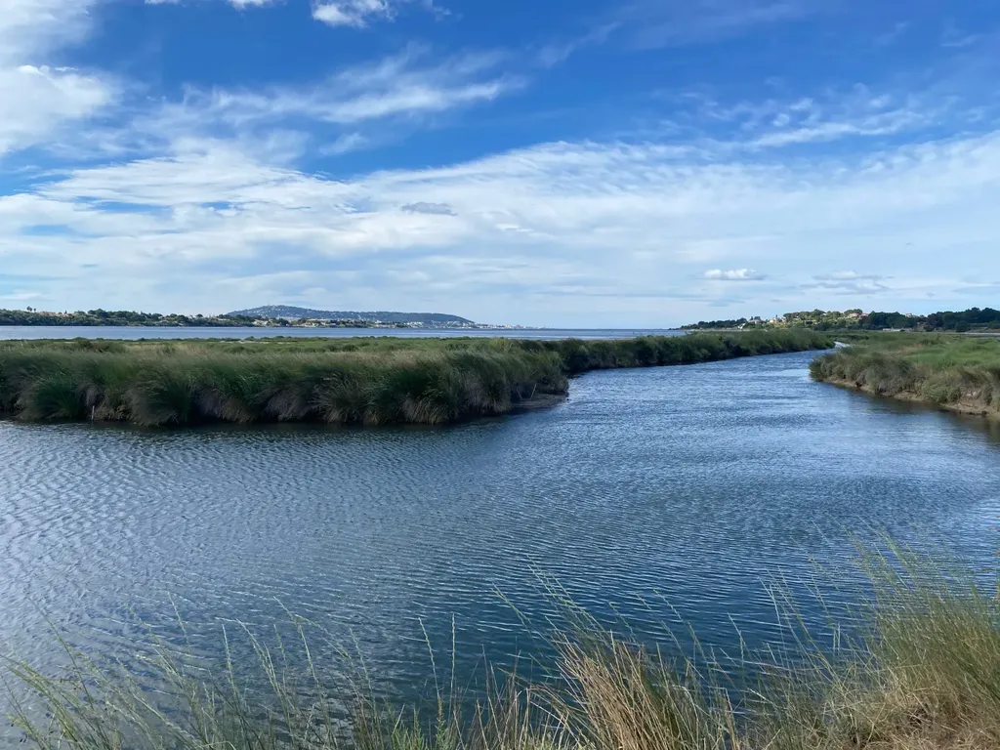
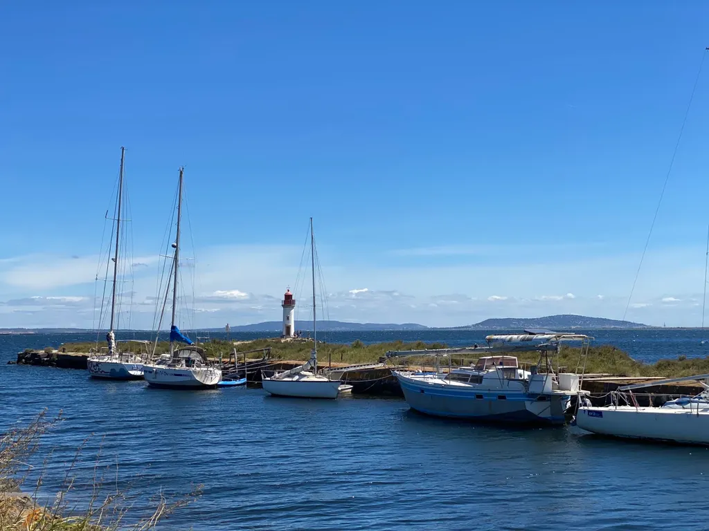
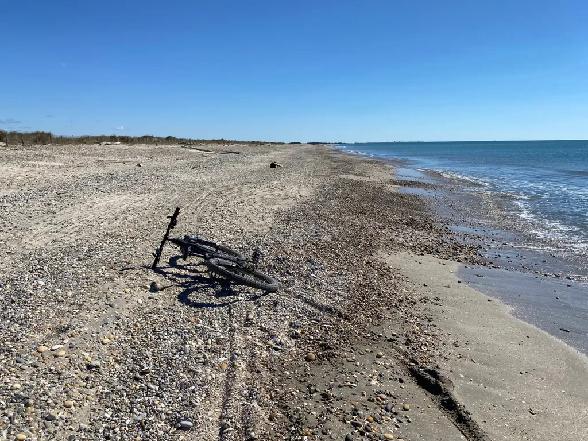
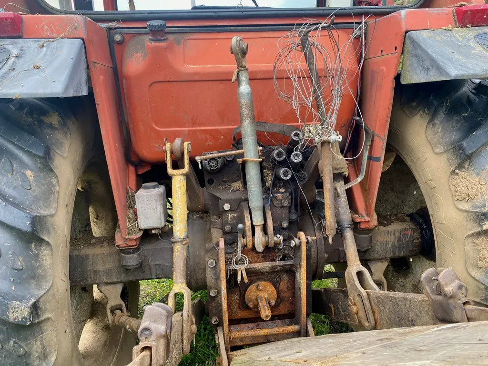
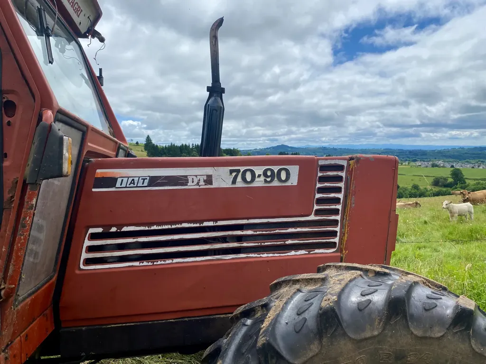

# Juillet 2024

### Lundi 1er, Balaruc

L’universalité du cancer me saute aux yeux quand je patiente dans le hall de l’hôpital Val d’Aurelle.

---

En face de la salle d’attente, une porte avec écrit « Diététicienne ». Elle s’ouvre. En sort une énorme femme en blouse blanche, la diététicienne.

### Mardi 2, Balaruc

« Le fascisme naît toujours d’un esprit provincial, d’un manque de connaissance des vrais problèmes et du rejet des gens, que ce soit par paresse, préjugés, cupidité ou ignorance, pour donner un sens plus profond à leur vie. Pire encore, ils se vantent de leur ignorance et cherchent le succès pour eux-mêmes ou pour leur groupe à travers une présomption, des affirmations sans fondement et une fausse démonstration de bonnes qualités, plutôt que de faire appel à la véritable capacité, à l’expérience ou à la réflexion culturelle. Le fascisme ne peut être combattu si nous ne reconnaissons pas qu’il est simplement le côté stupide, pathétique et frustré de nous-mêmes dont nous devons avoir honte. » Federico Fellini : En conversation avec Natalia Ginzburg.

---

Je découvre qu’Isa a un crâne aussi joli que celui de Sinéad O’Connor.

### Mercredi 3, Balaruc

### Jeudi 4, Balaruc

### Vendredi 5, Balaruc

Je suis épuisé, mentalement épuisé. Ce n’est pas moi qui suis une chimiothérapie, mais elle me dévaste le cerveau.

### Samedi 6, Balaruc

Guillaume Vissac, [journal de mai 2024](https://www.fuirestunepulsion.net/spip.php?rubrique1) : « Mon problème avec le roman, c’est que c’est une forme ronde, fermée, où tout est à sa place, où il n’est pas concevable de laisser des pans verts, ou crénelés, ou des échafaudages où que ce soit. Il faut que ce soit _fini_ et qu’une fois arrivé au bout l’on puisse repartir pour un tour. Alors que moi, ce qui m’intéresse, c’est de ne finir pas, c’est de laisser les choses en morceaux, comme dans la vie nos vies sont en morceaux. »

---

Les chimios, c’est comme te mettre aux portes de la mort pour te donner une chance de vivre.

---

Ne pas écrire vite me laisse tout le temps de me retourner sur ce qui est déjà écrit et de corriger. Et j’écris encore moins vite.

---

Je pourrais me contenter d’écrire avec des citations, et ce serait encore écrire.

---

Je suppose que le code postal de mon village est aussi utilisé dans d’autres pays. Alors chercher des liens entre les lieux qui portent le même matricule. ChatGPT explore [WorldPostalCodes](https://www.worldpostalcodes.org) et trouve que [Çatalca](https://en.wikipedia.org/wiki/%C3%87atalca) en Turquie et [Dong-gu](https://en.wikipedia.org/wiki/Dong_District,_Daejeon) en Corée du Sud ont le même code que Balaruc.

### Dimanche, 7 Balaruc

Merveilleux résultat des législatives où aucun parti n’a de majorité absolue. J’adore, la logique voullant qu’une collation se forme, que la coopération l’emporte, mais les butés ne voudront rien entendre au prétexte de respecter la volonté des Français. De quels Français, la minorité qui a voté pour eux ? Je regarde durant deux heures les débats, où peu de clairvoyants se dessinent, trois ou quatre entre la gauche modérée et le centre, tous les autres obtus ne rêvent que d’absolutisme. Je me sens de plus en plus proche des hommes et des femmes raisonnables. Le comble pour un anarchiste.

### Lundi, 8 Sète

À Toulouse, j’ai commencé une sorte de roman, et je n’arrive pas à l’avancer chez moi. Je profite d’un rendez-vous à Sète où je vais à vélo pour chercher un endroit où écrire. C’est l’heure du déjeuner. Terrasses envahies par les touristes.

Sète est une ville étroite, coincée entre l’eau et la colline, une ville qui ne m’a jamais inspiré, et qui ne m’a guère procuré de joie. Je comprends qu’elle puisse plaire. Elle ne me déplaît pas, mais ne m’enchante pas davantage. Je n’aime que ses escaliers, qui ouvrent des perspectives sur les bateaux, le port et la mer. J’aime m’installer au milieu des marches et attendre dans la brise estivale.

---

J’ai commencé *Le livre des illusions* d’Auster, par rapport à mon projet romanesque, et la même impression qu’avec chacun de ses livres, c’est fastidieux. Je ne comprends pas pourquoi il a eu autant de succès. Une épaisse narration sans surprise, ripolinée.

### Mardi, 9 Balaruc

[Mary Helen Immordino-Yang](https://bigthink.com/the-well/rewire-your-brain-with-transcendental-thinking/) : « Our education system focuses too much on memorizing facts and procedures, neglecting autobiographical memory—the personal story we tell ourselves about who we are and what we stand for. This type of memory is crucial for growth, development, and well-being. » Et je suppose tout au long de la vie, d’où l’importance des journaux intimes, qui permettent de se reconstruire sans cesse et de se positionner dans le monde.

### Jeudi 11, Balaruc

C’est comme si pour la première fois depuis 35 ans, j’avais un job à plein temps à côté de l’écriture.

---

Message de Philippe :  « Tu écris : « Sensation de me décentrer quand je tente d’écrire un livre, comme si ma place était dans ce carnet et sur le blog, et nulle part ailleurs, et comme si ailleurs n’avait même aucun sens. », et chez moi, c’est l’inverse : je ne me sens centré que quand je me plonge dans l’écriture d’une fiction. Pourtant, je rame, je sue, j’ai du mal à en être satisfait, mais je sais qu’alors je suis pleinement « en moi », je ne sais pas comment le dire autrement. Et mon journal, que je tiens avec plus ou moins de régularité, me semble à l’inverse comme un pas de côté, le travail d’un moi plus en surface, plus factuel, peut-être même moins sincère. »

Cette affaire de centrage est fondamentale. En fait, c’est quand je suis centré que j’écris, sinon je ne suis pas à mon affaire. J’avais écrit cette note après des expériences de fiction décevantes, des textes avortés, où je ne réussissais pas à me centrer. Mais j’ai retrouvé le rythme. J’écris peu, mais du plus profond de moi-même, et alors je me fiche de tout, surtout ce que les autres penseront.

### Vendredi 12, Balaruc

Mon journal est un livre écrit pas tout à fait.

### Samedi 13, Balaruc

Je résume mon idée de roman à [Perplexity](https://www.perplexity.ai/) et il me liste des livres qui pourraient traiter du sujet. En attendant, je relis *Si par une nuit d’hiver un voyageur*, dont j’avais tout oublié sauf la mécanique.

### Dimanche 14, Balaruc

[Les IA stimuleraient la créativité,](https://phys.org/news/2024-07-ai-easier-stories-alike.html) mais uniformiseraient les créations, tendant à un appauvrissement collectif des productions.

---

Superbe lecture de [*La mort d’Olivier Bécaille*](https://www.youtube.com/watch?v=7ALsJfuY5j0&ab_channel=ThomasCousseau), une nouvelle de Zola dont je n’avais jamais entendu parler. Je serais incapable de la lire moi-même, trop lente, trop irrémédiable, comme si elle ne pouvait que s’écouler d’elle-même sans surprise, mais de l’entendre jouer par un acteur de talent me fait accepter son irrémédiable.

### Lundi 15, Balaruc

Passé à travers l’Histoire. Vivre et mourir et voilà.

### Mardi 16, Balaruc

[Il serait bon de tenir un journal de productivité](https://lifehacker.com/work/you-need-a-productivity-journal), où noter ce qui doit être fait aiderait à le faire. J’ai tellement de trucs à faire qu’il me faudrait la journée pour les noter.

---

Je n’y pensais pas avant d’écrire la date en haut de cette entrée, mais c’est l’anniversaire de mon père. Je ressens le vide de son absence.

### Mardi 23, Auvergne

### Mercredi 24, Balaruc

Retour de [six jours de bikepacking en Auvergne](https://tcrouzet.com/2024/07/26/vulcania-bikepacking/).

### Vendredi 26, Balaruc

Crève. Journée de chimio 3 pour Isa. Retour à la maison. Je m’avachis devant la cérémonie d’ouverture des Jeux olympiques, aussi kitsch que je m’y attendais, à l’image des célébrations de 1989, du grandiloquent d’un bout à l’autre, qui traîne en longueur, avec par intermittences quelques moments joyeux. Impossible pour moi de ne pas penser à la décadence alexandrine du IIIe siècle av. J.-C. quand des parades géantes étaient organisées, prélude à l’écroulement.

Plus on élevait haut les cathédrales, moins on croyait en Dieu. Plus on clame fort sa joie, moins on est joyeux. Le sage n’a pas à montrer sa sagesse. D’un bout à l’autre, j’ai eu l’impression qu’on avait envie de se prouver quelque chose et de se prouver quelque chose au monde. Quoi ? Que nous sommes les plus beaux, les plus forts, les plus originaux, les plus créatifs ? Le spectacle n’était qu’un effort désespéré pour montrer et non pour être. J’avais sous les yeux un comique qui ne cessait de nous promettre une histoire drôle. Un magicien dont j’attendais le tour de magie, que seuls les sportifs seront finalement capables d’offrir.

Sur les bateaux qui défilaient sur la Seine, une bonne idée, j’en conviens, la plupart des sportifs se filmaient avec leur portable, filmaient Paris, filmaient le public qui les filmait. Mise en abîme vertigineuse d’une époque qui se regarde vivre, qui fait de son regard son objet, incapable de cesser d’être voyeuse pour être pleinement dans l’existence. J’étais triste pour eux. Plutôt que de vivre le moment, ils s’en faisaient les témoins, comme s’ils étaient déjà morts, pour que d’autres plus tard aient une chance de vivre ce qu’ils n’ont pas réussi à vivre. Et mes fils de se détourner de ce spectacle, non sans railleries, pour lui préférer leurs jeux vidéo, réaction saine, en elle-même rassurante.

Quant à la volonté d’inclusion affichée d’un bout à l’autre avec emphase, je l’ai surtout perçue comme une provocation à l’égard des plus obtus conservateurs de l’extrême droite mondiale. C’était comme si la cérémonie d’ouverture des JO avait été transformée en gay pride géante et confisquée par une communauté à ses propres fins existentielles, dans un but identitaire plus que réunificateur, le tout dans un style *Cage aux folles* des plus daté. J’avoue, j’ai aimé la provocation, surtout la référence à Dionysos, même si elle ne fera que renforcer les durs de droites dans leur position imbécile (et enfoncer le clou de mon analogie alexandrine). 

Par chance, à l’arrière-plan, Paris donnait l’illusion d’une tenue, pour nous qui connaissons la ville, peut-être davantage pour les étrangers qui un instant ont imaginé être au château de Versailles lors d’une fête royale. Tout ça, finalement, était baroque, et en rien contemporain, malgré l’usage à gogo des lasers. À moins que le contemporain soit devenu hyperbaroque. Voilà pourquoi je m’y sens de moins en moins à ma place, et préfère m’en éloigner sur les chemins de traverse de la discrétion. 

Des jeux durables ? Après une telle débauche ? Pauvres nous. Avez-vous compris que nous avions besoin de sobriété ? Quel spectacle avez-vous donné à l’avenir, à part celui du mal qui nous consume ? J’entends… pour une fois on peut se faire plaisir. Mais non, ce une fois ne cesse de se répéter jour après jour, les gens de prendre l’avion, de se projeter d’un bout à l’autre de la planète, de continuer à se comporter comme si elle était inépuisable. Les JO sont devenus un non-sens écologique, en l’état de nos technologies. Continuer de les organiser, c’est nier notre réalité. Ils prônent la concorde, mais aussi la compétition quand nous avons besoin de coopération et de rien d’autre. Ils parlent d’une voix d’un autre temps.

Je me demande combien de téléspectateurs se sont pris en photo en train de regarder la cérémonie ? Ou ont effectué des captures d’écran ? Rien ne ressort de très bon de mon analyse sinon la volonté constante d’attirer l’attention, d’en mettre plein les yeux, de provoquer le buzz et des clivages. Et ça continue, parce que les réseaux sociaux débordent d’avis, chacun destiné à son tour à capter l’attention, alors je garde le mien au chaud dans un recoin de mon journal pour ne pas participer à ce que je considère comme un des maux chroniques de notre temps.

### Samedi 27, Balaruc

La flamme olympique ne brûle pas, mais simule des flammes au nom de la durabilité. Quelle farce !

---

Des spectateurs interviewés hier durant la cérémonie parlent de leur émotion en même temps qu’ils la vivent. S’ils étaient vraiment émus, ils seraient incapables de parler.

### Mercredi 31, Balaruc

Je ne peux m’empêcher de regarder les JO, parce que le sport offre davantage de surprises et d’émotions que la plupart des œuvres d’art contemporaines.

#carnets #y2024 #2024-8-10-18h00 
