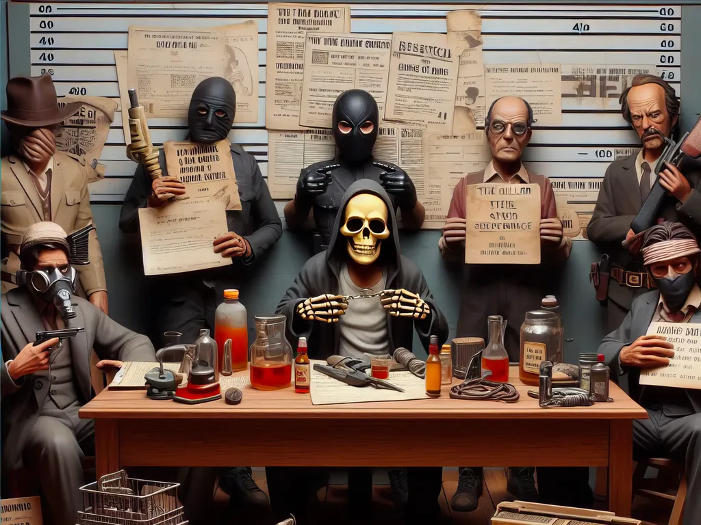

# La phrase qui tue

Il y a des phrases qui font mal, qui peuvent ruiner une vie, briser une vocation, un couple, un rêve. Des phrases criminelles, malhonnêtes, méchantes, tueuses… J’ai décidé d’en faire un inventaire, pour tourner deux fois ma langue la prochaine fois que je serai tenté d’en prononcer une.

Comme Sébastien Bailly a repris [la même idée](https://www.sebastien-bailly.com/254-bienveillance-et-empathie/7637), je publie ce projet initialisé en 2017 sur [Whatpadd](https://www.wattpad.com/416763306-la-phrase-qui-tue-une-fille-%C3%A0-un-gar%C3%A7on) et vite abandonné (10 000 lectures tout de même).

### Une fille à un garçon

Tu as trop de boutons.

### Un éditeur à un jeune auteur (1)

Tu écris avec les pieds.

### Un patron à ses employés

Vous êtes tous virés.

### Un prof à ses élèves

Vous avez la pire moyenne que j’ai jamais vue, pas un pour sauver l’autre.

### Un père à son fils

Tu es bon à rien.

### Une mère à sa fille

Tu ressembles à ta tante.

### Un homme sur son lit de mort à sa femme

Désolé, j’ai passé ma vie à te tromper, mais je t’ai toujours aimée. 

### Un soldat à un prisonnier

Voici un pistolet, voici une balle, tu sais ce qu'il te reste à faire, adieu.

### Un éditeur à un jeune auteur (2)

Tu ferais mieux d’aller voir les filles plutôt que d’user tes fesses sur une chaise devant ton ordinateur.

### Un gynécologue à une femme

Vous n'aurez jamais d'enfant.

### Un homme à une femme qu'il juge un trop grosse

Tu es à nouveau enceinte ?

### Un oncologue à un patient

Vous êtes fichu.

### Un enfant à sa mère dans une ville de province

Maman, regarde cet homme, il est tout noir, tu crois qu’il est malade.

### Un éditeur à un de ses auteurs (3)

Depuis qu'on t’a dit que tu étais génial, tu passes ton temps à te demander en quoi.

### Un juif à un non-juif

Tu n'appartiens pas au peuple élu.

### Un athée à un croyant

Tu as besoin de Dieu parce que tu as peur de la mort.

### Un père à son fils (2)

Tu finiras en prison.

### Un médecin à une mère

Votre bébé est trisomique.

### Un grand-père à son petit-fils

À ton âge, ton père avait déjà une copine, et moi j’en avais une dizaine.

### Une pute à son client

Tu as la plus petite que je n’ai jamais vue.

### Un homme à son chien devant sa femme

Je t’aime plus que tout au monde.

### Un gynécologue à une femme

Vous vous lavez parfois ?

### Un condamné à mort à son voisin de cellule alors qu'il part vers la chaise électrique

À bientôt.

### Un prof à ses élèves à la veille du Bac

À l’année prochaine.

### Un écrivain à un autre écrivain moins célèbre qui lui propose de boire un verre

On n’a pas élevé les cochons ensemble.

### Une éditrice à un auteur

Ton livre est génial, mais je ne le publierai pas.

### Une prof de français à un de ses élèves

Je t’enlève cinq points parce que tu en as trop dit.

### Le technicien d'un fournisseur Internet à un abonné mécontent

Vous avez bien branché votre box ?

### Un homme à sa femme

Tu es aussi conne que ton chien.

#ecriture #y2024 #2024-8-6-19h30
