# Août 2024

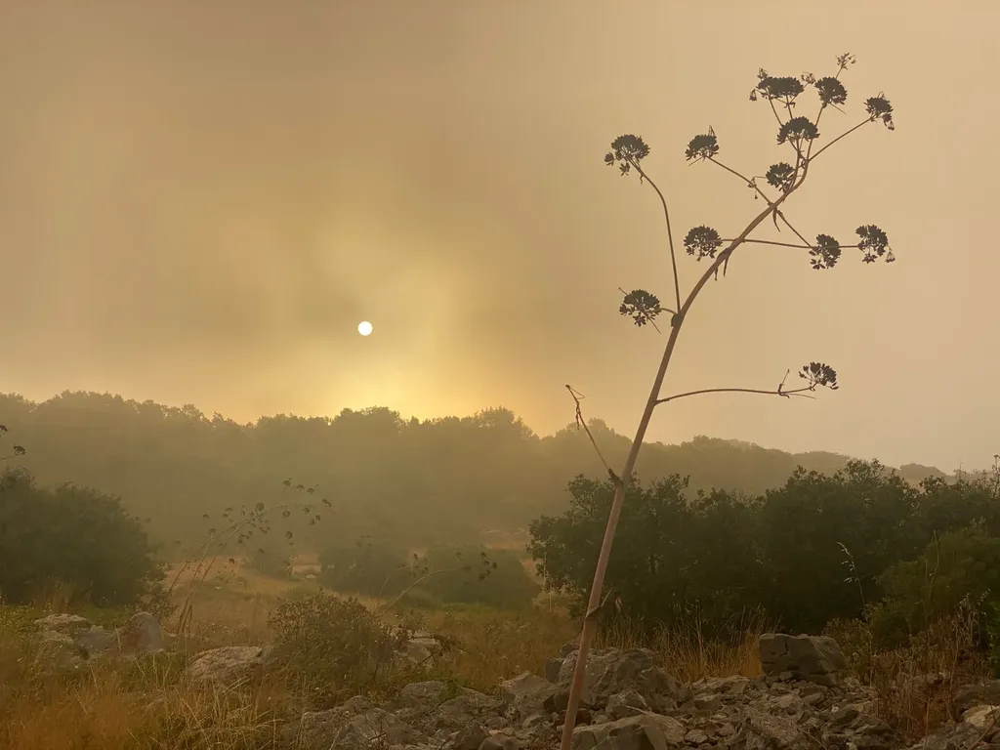

### Vendredi 2, Balaruc

J’écris malgré tout, un livre étrange, bric-à-brac, pas de temps pour penser en dehors, parce que tout ce que je pense peut s’y retrouver, comme ici, c’est une sorte de journal.

### Samedi 3, Balaruc

Vélo, courses, cuisine, JO… Les journées passent dans l’épaisse chaleur.

### Dimanche 4, Balaruc

[*This not a novel*](https://www.goodreads.com/book/show/195606.This_Is_Not_a_Novel) de David Markson. Une simple liste de notes sibyllines à la Perec. Longtemps que je n’avais pas pris autant de plaisir avec un texte. Il me provoque mille idées fugitives. Rien ne s’accroche, mais le plaisir est intense.

### Jeudi 8, Balaruc

L’académie Goncourt a été créée pour répondre à l’incapacité de l’académie Française à célébrer les romans. Personne n’a créé l’académie numérique pour suppléer à l’académie Goncourt. À juste raison, parce qu’il n’y a rien à célébrer ? Ou parce que les lecteurs ont pris leur destin en main ? Ou parce que la littérature numérique est une chimère ? Ou parce que les juges sont de plus en plus aveugles ?

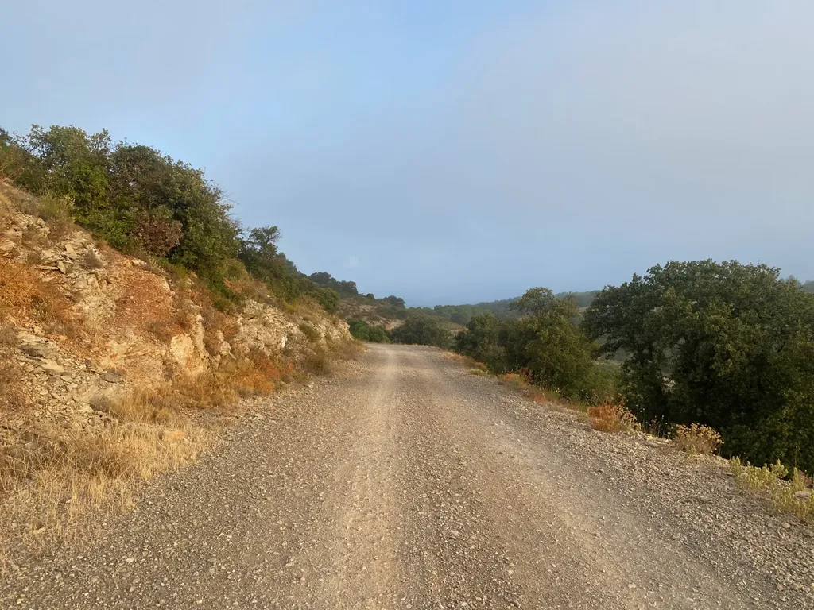

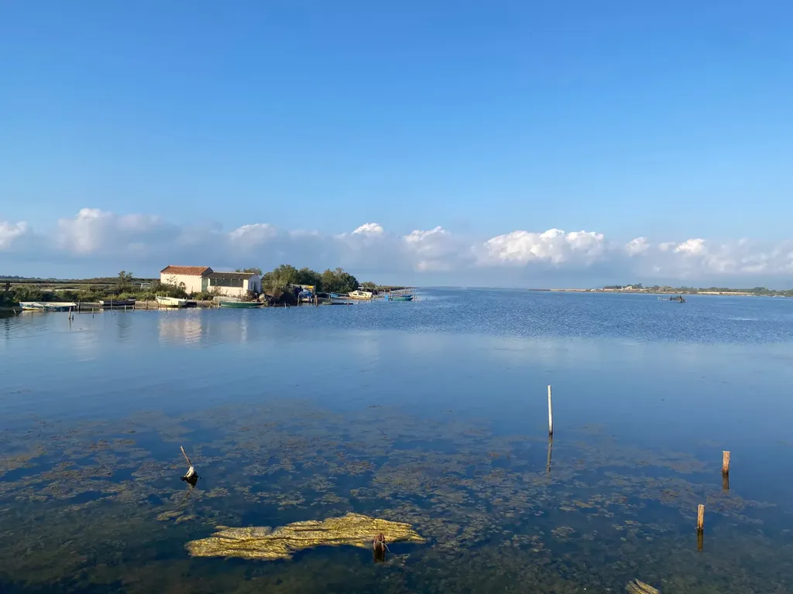

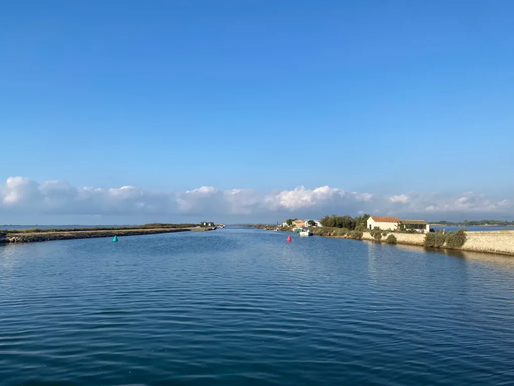

### Vendredi 9, Balaruc

Vélo autour de l’étang. Départ 6h. Quand je reviens vers la maison, je traverse la route de Sète par la piste cyclable, je force comme toujours le passage, sinon j’y serais encore, un gars en scooter me hurle dessus, je prends mon temps, assez pour voir que c’est un gros, et avec mes bras je mime sa grosseur, ce qui a pour vertu de le calmer tout de suite. Mais pourquoi les cyclistes provoquons la haine des autres usagers de la route ? Je crois qu’ils jalousent notre liberté.

---

J’ai toujours été fasciné par l’idée que [notre conscience serait quantique](https://www.sciencealert.com/quantum-entanglement-in-neurons-may-actually-explain-consciousness). Je ne vois pas autrement comment expliquer le libre arbitre (parce que je crois au libre arbitre, à la responsabilité, à des trucs comme ça).

### Samedi 10, Balaruc

Hier, je suis parti pédaler sans petit-déjeuner, tout en supportant beaucoup mieux la chaleur. J’ai renouvelé l’expérience ce matin, ne mangeant qu’un fruit, même résultat. Je me demande si je n’ai pas tendance à trop manger avant le vélo. La digestion me prive de trop d’énergie. Idem quand j’écris.

---

Vivre au bord de l’eau me permet d’assister au spectacle de l’incurie écologique : les types, oui, presque systématiquement des hommes grassouillets, avec des femmes complaisantes en bikini, tournent et retournent au large de la maison avec leur gros bateau à moteur, inscrivant leur nom sur les registres des criminels climatiques, de préférence avec leur sexe qu’ils aimeraient avoir énorme. Dans le même temps, d’autres gros s’affrontent sur l’eau, du haut des bateaux de joute, cette fois propulsés à la rame, et je ne les pardonne pas tout à fait.

---

Publiant le journal de juillet, je constate que j’ai peu photographié, et que je n’ai presque pas pris de photo depuis le début août, comme si mon regard s’était éteint, mon cerveau avait rapetissé.

### Dimanche 11, Balaruc

Kandinsky n’a pas inventé l’art abstrait, à moins qu’inventer un art se résume à le nommer. Impressionné par les [expériences de visualisation sonore de Margaret Watts Hughes](https://www.themarginalian.org/2024/08/08/margaret-watts-hughes-voice-figures/). Des paysages de rêve.

---

Je relis mes carnets, tout doucement, pour mon projet romanesque et tombe sur ce passage du 30 juin 2016 (à peine réécrit) : « Si mes carnets recueillaient soudain des milliers de lecteurs, il se passerait alors quelque chose d’étrange, et même de dangereux. J’entrerai en résonance avec mon temps au risque de ne plus être moi-même, mais seulement un reflet de ce que les autres pensent. Je ne serais plus celui qui s’abandonne, mais celui dont l’abandon rejoint les autres, et ne fais que les contenter. » Je n’ai plus à m’inquiéter de ce risque.

---

En réaction à mon carnet de juillet, Ploum écrit : « Un milliard de téléspectateurs, les yeux rivés sur quelques dizaines de stars prenant des selfies. Comme si les pauvres ne pouvaient que regarder ceux qui se regardent eux-mêmes. Pour ensuite, par mimétisme, faire un selfie de soi en train de regarder l’écran où continue une autocongratulation mise en scène. »

Je m’amuse à lui répondre qu’a priori il y avait deux milliards de téléspectateurs ! Je ne sais pas quand nous nous réveillerons de cette folie du selfie, de cette folie de vouloir paraître aux yeux des autres. C’est comme si une nouvelle religion universelle s’était installée subrepticement. Nous nous y sommes presque tous convertis sans conscience.

---

[Quand je parcours les vignettes d’ouverture de mes entrées de carnet, l’eau domine](https://tcrouzet.com/tag/carnet-de-route/). Je ne suis pas un marin, mais un homme des rivages. Nous devrions donner nos photos aux IA pour qu’elles dressent notre portrait psychologique.

### Lundi 12, Balaruc

Mon roman prend un tour totalement imprévu, reversant même, le bric-à-brac devient cataclysmique.

### Mercredi 14, Balaruc

Quand je demande aux IA de me dire ce qu’elles pensent d’un texte, elles commencent par être élogieuses, puis par me conseiller toujours les mêmes modifications pour que je ramène mon style vers celui des best-sellers, en usant des trucs narratifs des best-sellers les plus bas de gamme. Mais dès que je leur demande d’être sévères, elles me cassent sans vergogne. Et quand je leur fais remarquer qu’elles changent d’avis comme de chemise, elles s’excusent platement, si bien qu’elles ne m’aident pas beaucoup à prendre du recul sur mes textes. Elles ne sont plus bonnes, et c’est déjà beaucoup, que pour le brainstorming, pour m’aider à mettre en ordre mes pensées. J’illustre ce mécanisme dans le roman.

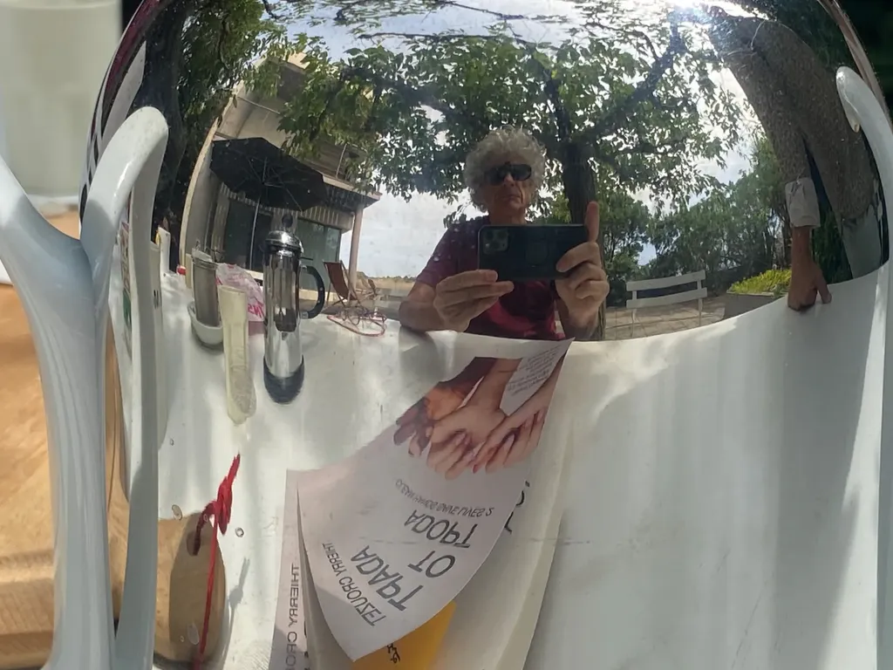

### Jeudi 15, Balaruc

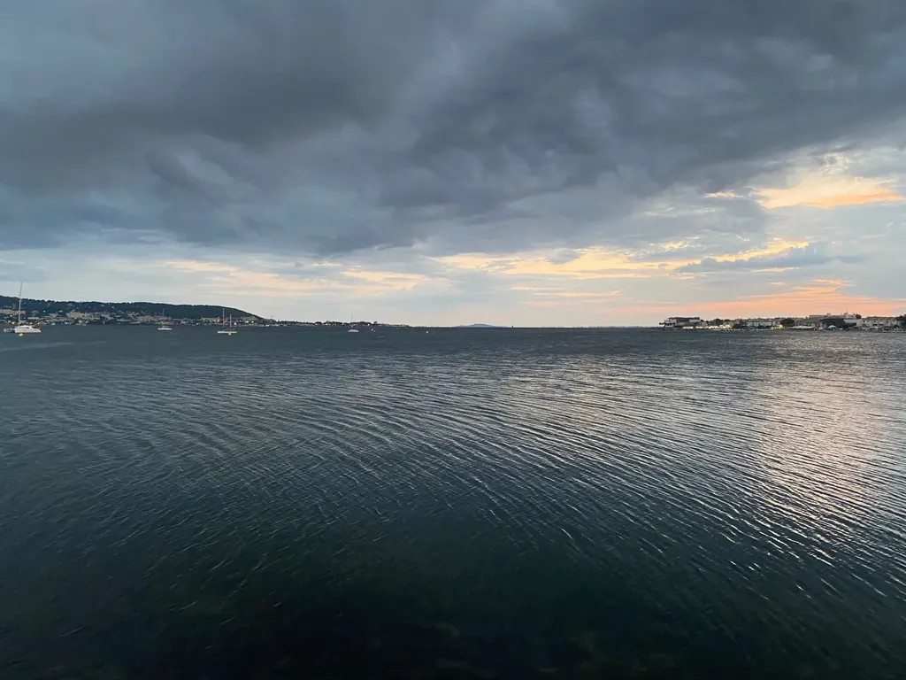

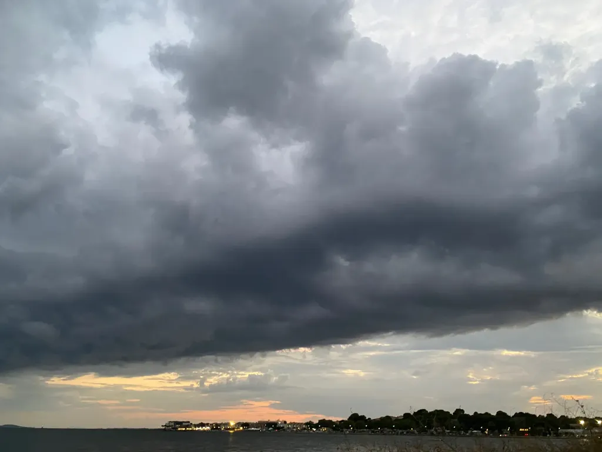

### Vendredi 16, Balaruc

Je critique le web social, j’aimerais qu’il disparaissent et nous fiche collectivement la paix, mais il m’arrive d’y vivre de petites conjonctions heureuses, et [qui comme aujourd’hui me confortent dans la direction prise par mon roman](https://tcrouzet.com/2024/08/16/jeu-de-r%C3%B4le-coincidence/).

---

Les IA gratuites restreignent la taille des images générées, mais d’autres IA permettent de multiplier la définition des images. Un monde absurde.

### Samedi 17, Balaruc

Parce que les IA sont intellectuellement limitées, elles me proposent systématiquement de simplifier mes textes qui leur semblent trop complexes. J’ai envie de faire tout le contraire, c’est même en train de devenir un jeu, aller à leur encontre dans l’espoir de sortir de la norme qui les définit. Plus elles me critiquent, plus je me dis que je tiens quelque chose.

### Dimanche 18, Balaruc

Le cœur encore plus lourd que de coutume : ma garrigue est en train de partir en fumée. Tout l’après-midi les Canadairs tournent au-dessus de l’étang. Pas même le courage de photographier leur balai.

### Lundi 19, Balaruc

La scène imaginaire : un TGV, premières, siège solo, un homme dort, avec un bandeau qui masque ses yeux. Sur sa tablette ouverte, une tarte au citron à demi mangée, puis massacrée à coups de cuillère comme suite à un énervement provoqué par le dégoût. Le contrôleur approche de l’homme, se penche vers lui pour l’éveiller (je n’ai toujours pas compris ce concept de vérifier les billets pendant le voyage rien que pour emmerder les passagers), dans un brusque mouvement réflexe l’homme saisit de sa main droite le contrôleur, lui plaque le visage sur la tablette, donc dans la tarte, le bloque là avec son coude, tout en pointant sa main gauche armée d’un pistolet vers le second contrôleur, le tout sans avoir posé le bandeau. L’homme est un agent secret stressé. L’histoire s’appellerait *Stress*. Cette idée me vient sans doute parce que je viens de commander un nouveau bandeau censé favoriser le sommeil profond. Je suis encore sensible aux sirènes du marketing.

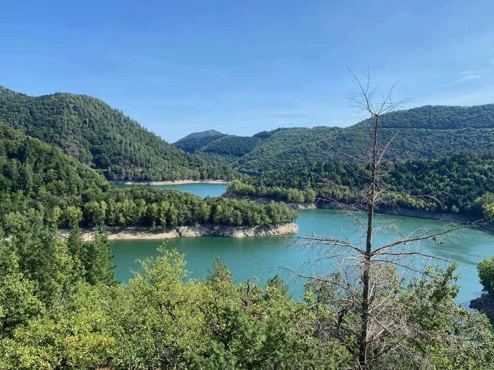

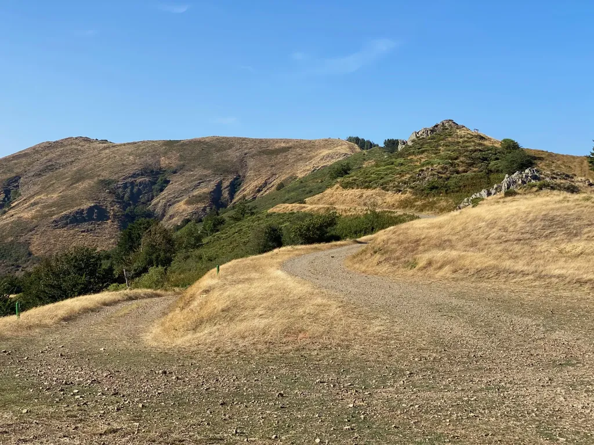

### Mardi 20, Balaruc

Nous dormons au sommet de l’Espinouse et attaquons la descente époustouflante aux flancs du Caroux avec le soleil levant. Pure merveille d’être dans cette nature chaotique, de rochers sculptés par les intempéries, de bruyères violettes à perte de vue, qui provoque en nous un sentiment d’exaltation partagé, une envie de rester pour toujours en mouvement. Puis en bas, dans la vallée, une ruelle étroite, en face de nous arrive un énorme 4x4 qui reste bien au milieu de la chaussée et qui commence à nous hurler dessus parce que nous ne nous arrêtons pas pour laisser passer son altesse royale. La scène se termine par un échange d’injures. Quand est-ce que dans le Code de la route il sera mentionné que les plus faibles ont la priorité ? Les piétons sur les vélos, les vélos sur les voitures, sans pour autant abuser de la voie publique. Cette fois, le chauffard s’est comporté comme les piétons qui, sur les pistes partagées, se croient autorisés à marcher au milieu.

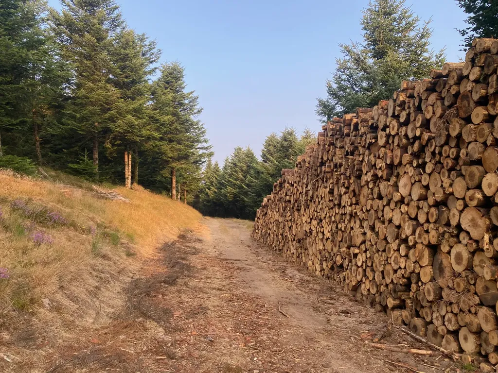

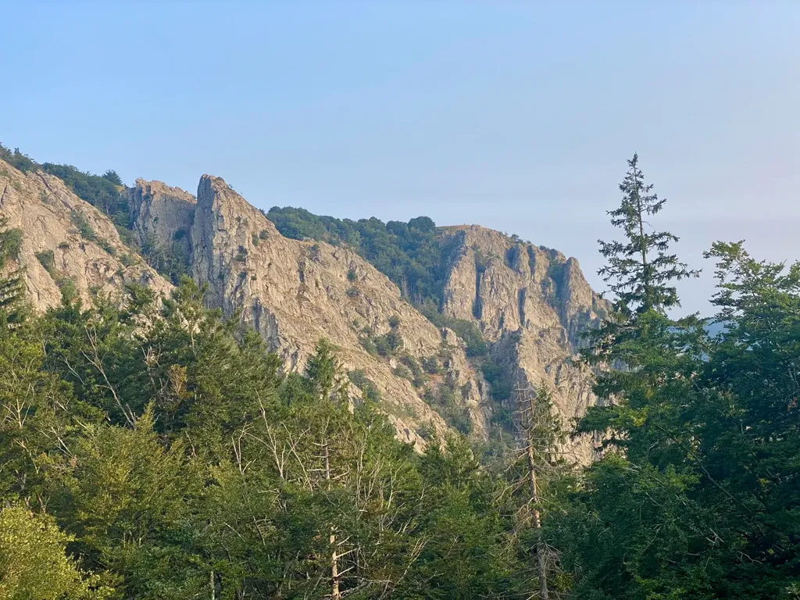

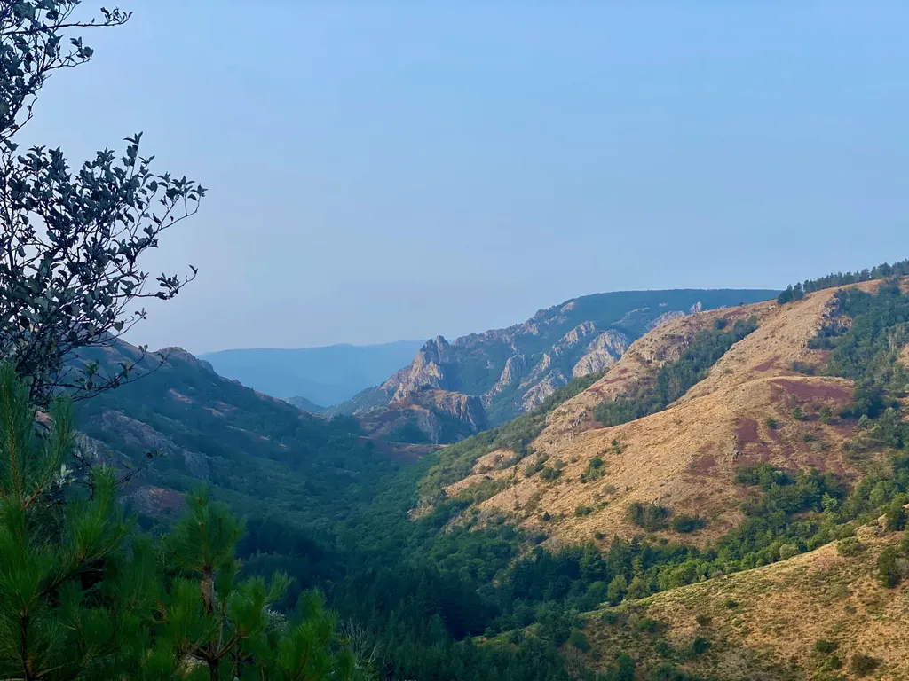

### Mercredi 21, Balaruc

Je sors d’[un podcast FranceCulture sur Alexandre Grothendieck](https://www.radiofrance.fr/franceculture/podcasts/serie-alexandre-grothendieck-legende-rebelle-des-mathematiques), dont j’ai dégusté les cinq heures à la petite cuillère. Quand j’ai suivi le séminaire de Grothendieck en 1984, j’ignorais qu’il était en train de travailler à sa théorie des invariants. En 2022, quand Gallimard a édité le manuscrit de la monumentale autobiographie de Grothendieck, [*Récoltes et Semailles*](https://www.gallimard.fr/Catalogue/GALLIMARD/Tel/Recoltes-et-Semailles-I-II), j’ai eu peur d’y plonger, sachant quel génie monstrueux se cachait derrière (pourtant Sophie, son éditrice, m’y avait encouragé). Je ne me suis jamais senti aussi minuscule que devant Grothendieck, et tout au long du podcast j’ai découvert que je n’étais pas le seul. Beaucoup de ses anciens élèves et collaborateurs y témoignent de leur sentiment de petitesse.

J’ai compris que je ne serai jamais mathématicien en discutant avec lui de mathématiques. Il était alors professeur à la fac de Montpellier. Nous étions en DEUG et on nous avait proposé de passer toutes les semaines une heure avec lui pour travailler à des projets personnels. Pas de cours, mais des têtes à têtes, oui des faces à faces avec peut-être le plus grand mathématicien du XXe siècle, un privilège dont nous ignorions tout ou presque. On nous l’avait présenté comme un génie excentrique qui avait réinventé la géométrie, un fou génial, un original. C’est ce qui m’avait plu et poussé à m’inscrire à ce séminaire.

À l’époque, je passais mon temps à jouer et j’avais choisi un sujet qui aurait pu l’intéresser si j’avais été plus clair dans mes explications. J’étais parti de l’idée que les règles d’un jeu de plateau pouvaient être schématisées en un graphe. Deux jeux avec des noms et des règles apparemment différentes pouvaient n’être qu’une déformation d’un même graphe (il y avait par exemple le graphe du jeu de l’oie — une sorte d’invariant ludique).

J’éprouvais viscéralement l’invariance quand j’essayais un jeu nouveau, qui n’était souvent qu’un jeu déjà familier sous une apparence nouvelle. Il y avait de fait beaucoup de jeux identiques, qu’il était possible de classer par familles ou catégories, et il était difficile d’en trouver de nouveaux. Seul le jeu de rôle me paraissait capable d’échapper à l’invariance (je suis resté très sensible à l’invariance, surtout en littérature).

Tout cela est très loin dans ma tête, je ne crois pas avoir gardé la moindre note. Quand j’ai présenté mon idée à Grothendieck, il m’a dit en gros : « C’est très banal, rien de plus classique. » Prends ça dans les dents. Il a continué à me parler et je n’ai pas dû comprendre grand-chose aux pistes qu’il a ouvertes. Puis le séminaire a cessé, Grothendieck absent, disparu, disaient certains (même s’il n’a réellement disparu qu’en 1990). Je suis passé à côté d’un monstre. Je n’ai pas su le dompter, m’en faire un ami. J’ai longtemps après eu l’impression d’avoir raté quelque chose. Je viens de charger *Récoltes et Semailles* sur ma liseuse, non sans angoisse.

---

À l’hôpital. « Qu’est-ce qui va mal ? » demande l’infirmière. La patiente de 93 ans répond : « Je ne sais pas ce qui va bien. »

### Jeudi 22, Balaruc

Quatre heures du matin, et je ne dors toujours pas, à écrire, à lire, dans une fièvre égale, qui demain me laissera épuisée. Calvino : « l’abîme égocentrique du roman suicidaire qui finit par s’enfoncer en lui-même. » Ou : « Lire, dit-il, c’est toujours cela : il y a une chose qui est là, une chose faite d’écriture, un objet solide, matériel, qu’on ne peut pas changer, et à travers cette chose, on affronte une autre chose qui n’est pas présente, une autre chose qui appartient au monde immatériel, invisible, parce qu’elle est seulement pensable, imaginable, ou parce qu’elle a existé et qu’elle n’existe plus, passée, perdue, inatteignable, dans le pays des morts… » Puis je saute sur Grothendieck, et c’est éblouissant.

---

Souvent je n’arrive à rien lors de mes brainstormings avec les IA et elles finissent par me dire de me faire confiance. Tout ça pour ça.

### Vendredi 23, Balaruc

Je n’ai rencontré qu’une fois Etienne Klein, lors d’une table ronde débat entre nous deux au sujet des changements climatiques, et j’avais détesté le personnage, prétentieux, autoritaire, affirmatif du haut de sa notoriété de plus en plus grandissante. Je comprends mieux pourquoi. [C’est un plagiaire.](https://www.arretsurimages.net/articles/etienne-klein-une-these-constellee-de-plagiats) Tout est bon pour réussir. La droiture intellectuelle n’a plus beaucoup de prix.

### Samedi 24, Balaruc

À force de penser leurs textes pour qu’ils soient lus à voix haute dans les festivals, les auteurs limitent de plus en plus leurs possibilités stylistiques. Imaginez si Proust avait pensé *La Recherche* pour qu’elle soit lue à voix haute ? Je ne dis pas qu’elle ne peut pas l’être, au contraire, mais ça n’a jamais été l’intention de Proust (surtout qu’il devienne son propre lecteur — parce que le bug est là, que l’auteur se transforme en homme-orchestre bon à tout faire, et bon à rien). J’écris justement pour échapper aux autres médias, pour ne pas être jouable, mis en scène, filmé… Sinon j’écrirais du théâtre, de la poésie, des scénarios… J’ai choisi un média en perte de vitesse pour ne pas être à la mode, et risquer d’être rattrapé par elle.

### Mardi 27, Balaruc

J’écris avec joie, sans pression, pour m’amuser, et je m’amuse pour sûr, je m’amuse toujours quand je suis dans un texte long, malgré les coups de frein. Je viens d’écouter [un podcast France Culture sur l’histoire du roman](https://www.radiofrance.fr/franceculture/podcasts/serie-il-etait-une-fois-le-roman). Bien aimé les propos de Laurent Binet, en phase avec mon projet de métafiction (après *Le Code Houellebecq* qui en était déjà une, mais cette fois je vais plus loin, mélangeant autofiction et science-fiction, théorie littéraire et journal intime). 

### Mercredi 28, Balaruc

Dans le podcast France Culture, il est clairement montré comment de genre annexe le roman gagne ses galons, notamment grâce à la nouvelle puissance de la presse. Tout au long de la discussion, personne n’effectue de parallèle avec notre époque et la toute-puissance du Net. J’ai trouvé ça très amusant. Les universitaires interviewés montrent comment dans le passé une transition littéraire s’est jouée sans être capable de mesurer qu’ils en vivent une nouvelle à laquelle ils ne prêtent pas attention. Ils vivent au milieu d’une tempête dont ils ne ressentent rien, exactement comme les critiques qui n’ont pas vu le roman devenir majeur, et l’oubliaient quand ils racontaient l’histoire de la littérature. Mais quelque chose émerge, en ce moment même, qui continue l’aventure de l’écriture, mais sans doute pas où les mandarins la voient.

---
*Le roman de mon père* (non publiée), *Le Code Houellebecq* et maintenant *Le roman du roman* explorent le rapport de la fiction au réel. J’aime le réel et la fiction et je ne prends jamais autant de plaisir que quand je les hybride.

### Jeudi 29, Balaruc

[Kelly Clancy](https://www.fastcompany.com/91174864/a-neuroscientist-explains-how-playing-games-has-shaped-us) : « Games are an extraordinary invention. A game—whether a video game, board game, casino game, or otherwise—is an arrangement of ideas the brain devised to give itself free pleasure out of nothing. In other words, the brain created games to hack itself. » J’ai toujours considéré la littérature comme un jeu qui avait pour objectif de pirater mon cerveau et celui de mes lecteurs, potentiellement plus efficacement qu’une drogue, en offrant davantage de récompenses. Je me demande pourquoi j’ai mis autant de temps avant de travailler à un roman-jeu.

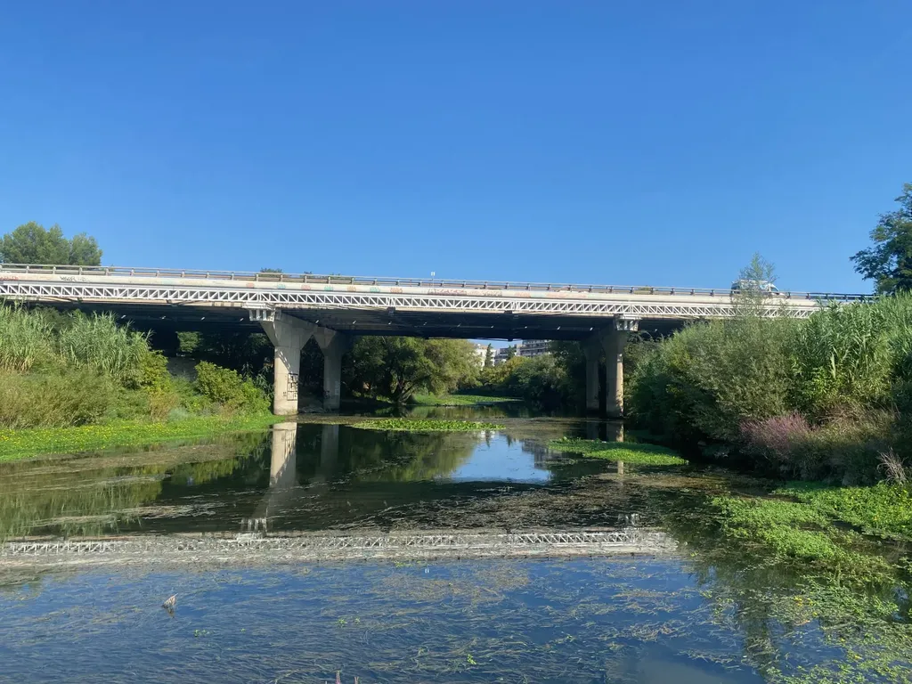

#carnets #y2024 #2024-9-18-12h00
