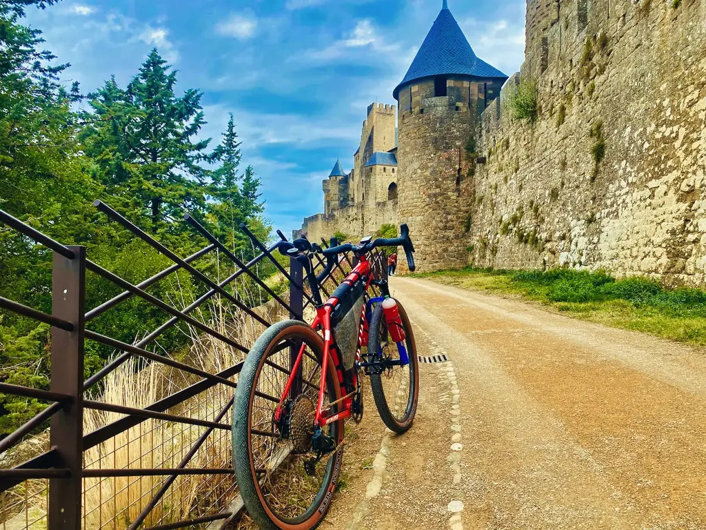
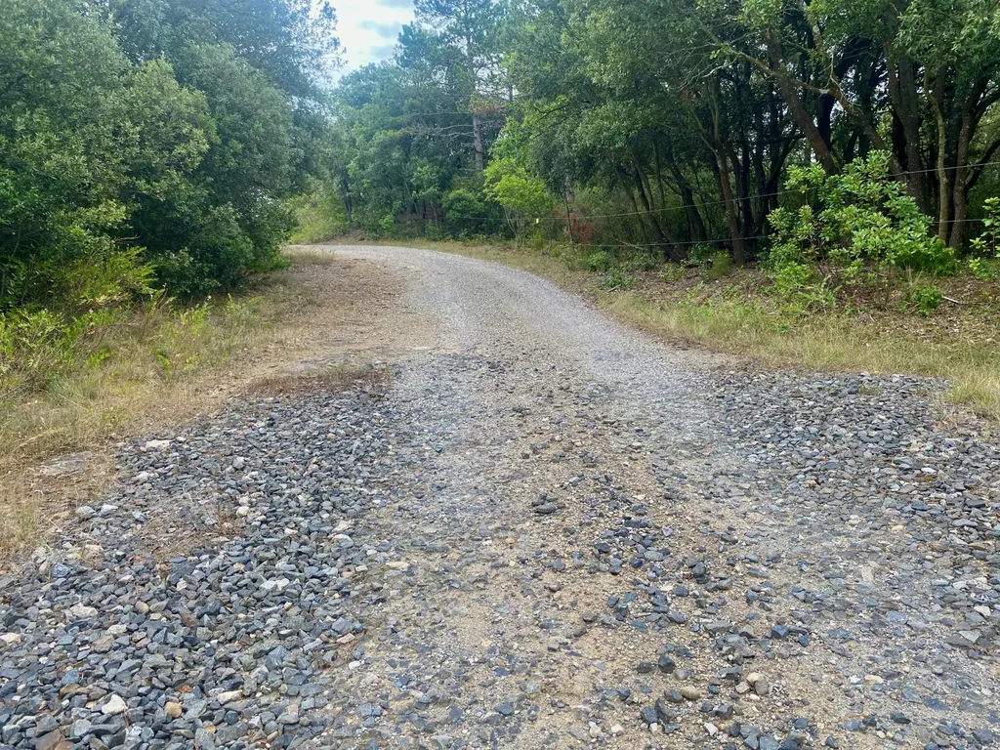
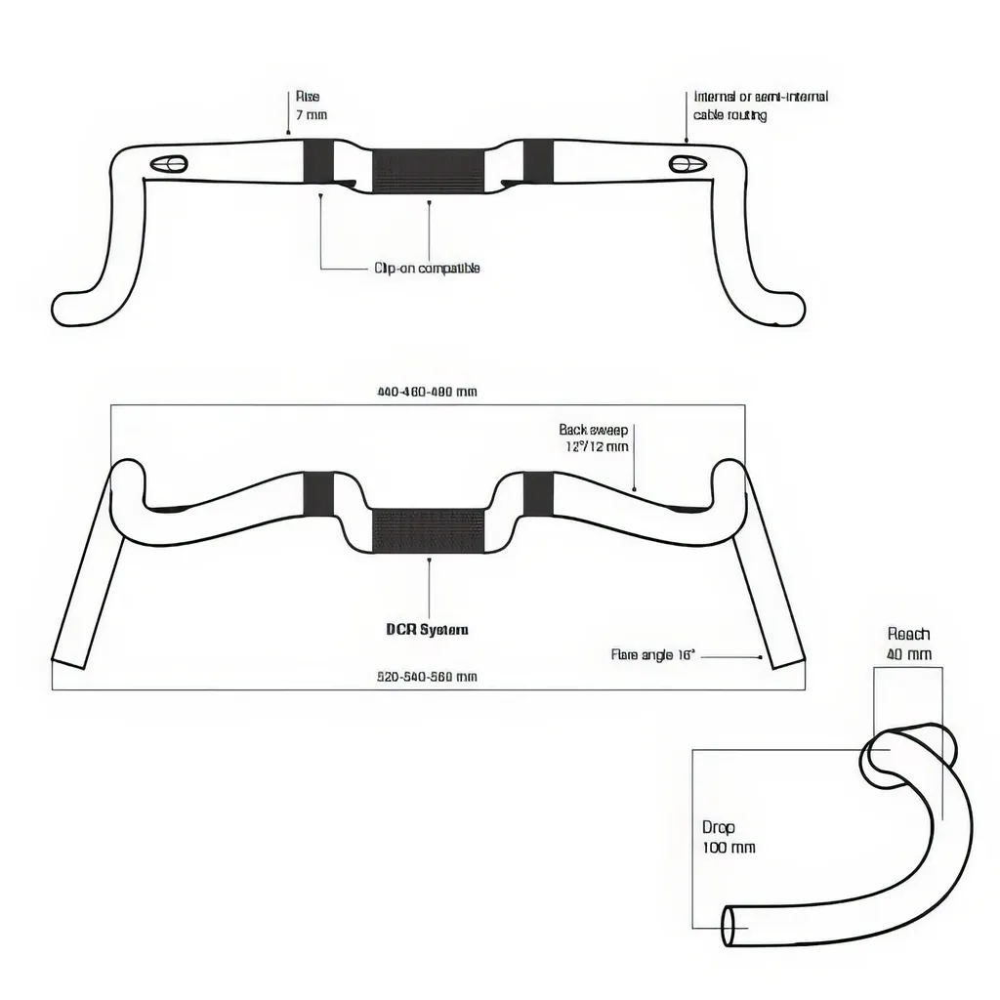
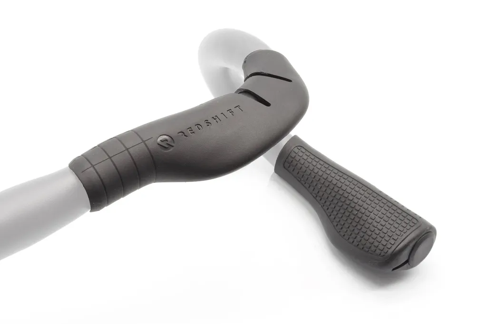
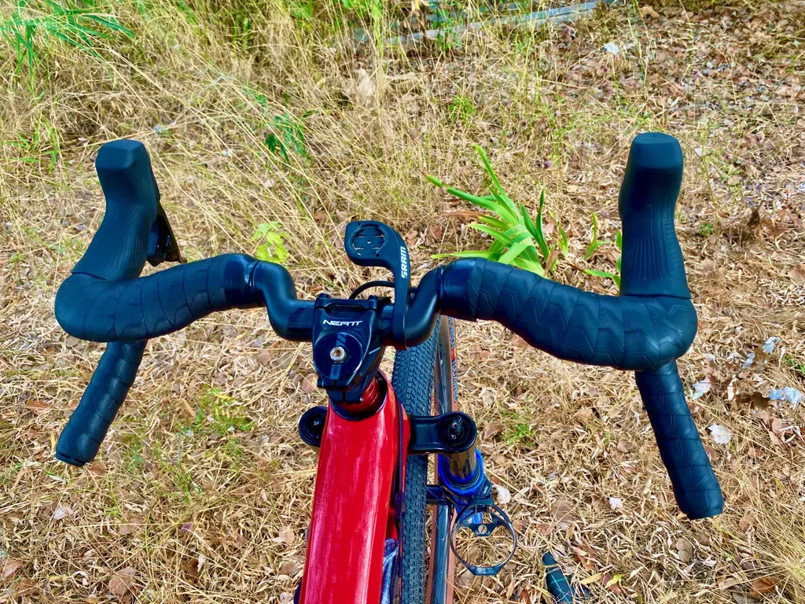
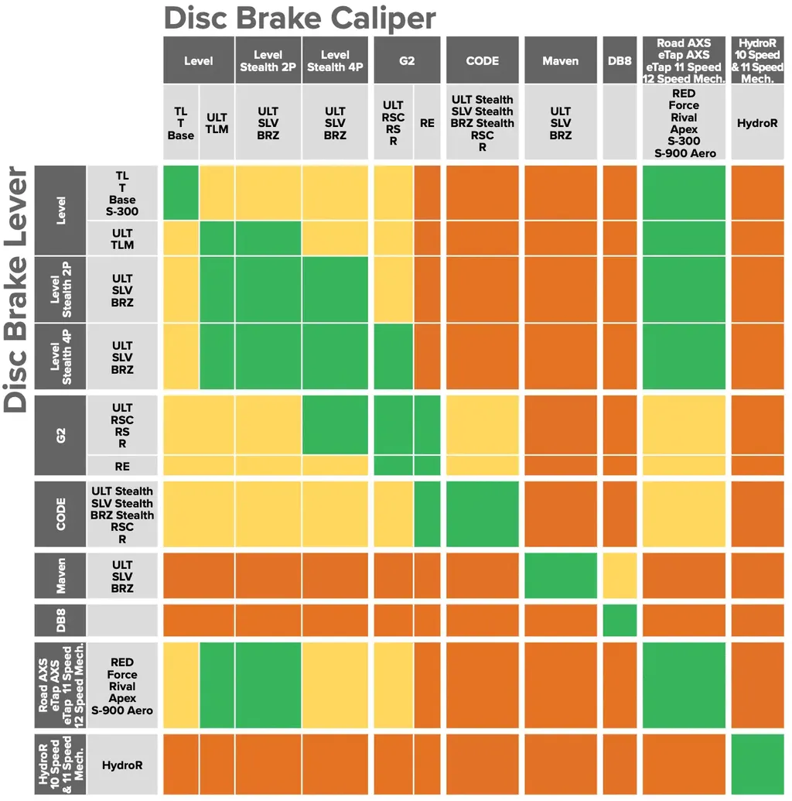
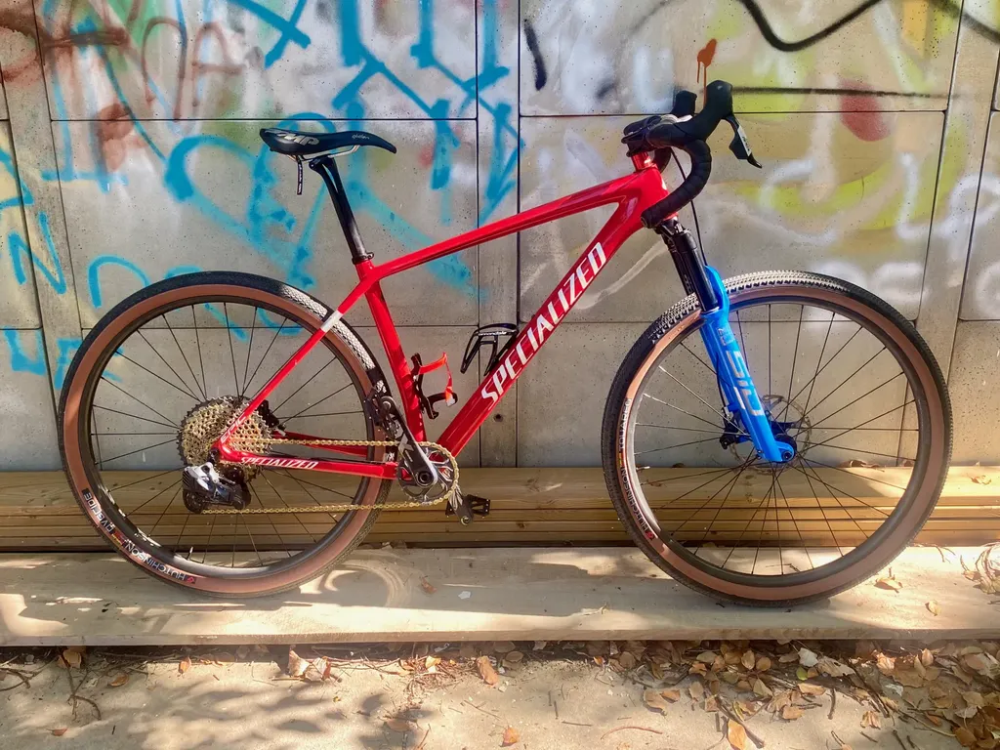

# Transformer un VTT en monster gravel

Certains vivent pour gagner, amasser, dominer, paraître, briller, flamber, je vis pour partager mes émotions, mes trouvailles, mes techniques, mes codes, mes textes, mes traces… Toujours pour partager une expérience, qui donc est mienne et ne peut être considérée comme universelle (et encore moins dogmatique — le dogmatisme étant très répandu, et particulièrement dans le monde du vélo — certains vivant pour imposer leurs dogmes — ça semble même faire jouir ces putains de pervers).

La couleur annoncée, je peux passer à mon sujet. Au quotidien en 2024, je roule soit avec un tout-suspendu (Specialized Epic Evo), soit avec un gravel (Canyon Grizl), deux vélos qui procurent des expériences totalement différentes, même quand j’emprunte les mêmes chemins, ce qui est une façon de les renouveler, de les voir sous des angles différents, et qui revient à démultiplier la taille de mon terrain de jeu (en plus je roule souvent avec des copains différents en fonction du vélo que je choisis).

Quand j’allonge les distances, le gravel finit par être inconfortable et me provoque des douleurs aux épaules, ce qui ne m’arrive pas avec le VTT, même quand j’enchaîne les journées de bikepacking. C’est mon problème, je sais. Le dogmatisme va surgir et dire que c’est une question de position (oui, je relève de façon étrange mon cintre, mais c’est ce qui me va encore le mieux). Ceux qui me connaissent savent que je suis un maniaque des réglages (mon côté ingénieur). Arrive un moment dans la vie où tous les réglages du monde ne font pas partir les douleurs (mais bon, j’ai rien contre les miracles).

En 2020, je me suis monté un [monster cross](https://tcrouzet.com/2020/10/02/pourquoi-je-vends-mon-velo-bikepacking-tout-rigide/), un VTT tout-rigide (Specialized Epic HT avec pneux 2,6") et déjà j’ai eu mal aux épaules sur le long, alors que j’étais exactement positionné comme sur mon tout-suspendu. À la longue, même sur le roulant, les imperfections des chemins, les vibrations, les secousses répétées finissaient par m’être nuisible, et aussi par me fatiguer inutilement, même avec de gros pneus à basse pression.

Mes descentes devenaient de plus en plus laborieuses (et peu joueuses). Je les passais bloqué sur les freins, ce qui était plus que frustrant. J’en ai conclu qu’en endurance je ne roulerai plus jamais sans fourche hydraulique (au prix d’un malus de seulement 600 ou 700 g et d’une petite perte de rendement).

La messe aurait pu être dite une fois pour toutes : le gravel réservé pour les sorties à la journée. Mais ce n’est pas si simple. J’organise [le g727](https://727bikepacking.fr/g727-Grand-Depart/), une randonnée gravel de 727 km à laquelle je tiens à participer. En 2023, je l’ai effectué avec mon Epic HT avec une fourche de 100 mm et des pneus VTT de 2,1", tout en sentant que j’étais plus à la peine que les gravels. Le problème n’était pas d’aller moins vite, mais de dépenser plus de forces que nécessaire sur les nombreux secteurs très roulants. J’ai compris à mes dépens que l’excès de confort peut-être nuisible et qu’il faut trouver le bon compromis. Il n’existe pas de vélo idéal, seulement un vélo idéal pour un cycliste donné sur un parcours donné.

Pour l’édition 2024 du g727, j’ai décidé de gravéliser mon semi-rigide (que je n’ai pas réussi à vendre à un prix décent). Mais plutôt qu’en refaire un monster cross, j’en ai fait un monster gravel. C’est quoi un monster gravel ? Traditionnellement : un gravel avec de gros pneus type VTT.

Suis pas fan de cette approche. Pour moi, le gravel, c’est un cintre moustache avec des pneumatiques peu cramponnés de taille mesurée, deux éléments qui contribuent en grande partie à la dynamique et au rendement du vélo (bien sûr la géométrie du cadre est aussi importante). Si je veux des gros pneus, je prends mon VTT. J’ai donc construit ma version du monster gravel : un gravel avec des pneus qui restent de type gravel, mais avec une fourche hydraulique (une SID Ultimate en 120 mm — je l’avais en stock).

### Le cintre

Les cadres VTT sont plus longs que les cadres gravel. En prime j’utilise des cadres VTT un poil grand pour moi, de façon à minimiser le drop (sinon j’ai mal aux cervicales, et encore une fois aux épaules). Il me fallait donc raccourcir au maximum la potence (j’ai utilisé une 35 mm) et trouver [un cintre gravel avec un reach très court](https://bikepacking.com/index/gravel-bars/) pour ne pas me retrouver trop allongé sur le monster. J’ai fini par opter pour le [Deda Gera Carbon](https://dedaelementi.com/gera-carbon-handlebar), avec un reach de seulement 40 mm.

Je suis alors tombé sur un os. Toujours pour minimiser le drop, je monte mes leviers très haut sur les cintres, ce qui en prime me permet de créer une plateforme en amont, de façon à y poser les mains de diverses façons, voire les avant-bras quand je saisis les cocottes à pleine main. Mais avec un reach de 40 mmm, c’était impossible. J’ai été sauvé par les [Cruise control top grip de Red Shift](https://redshiftsports.com/products/cruise-control-drop-bar-grips?variant=32534054797391). En plus de créer une position hyperconfortable de prise centrale, ils m’ont permis de gagner 15 mm de reach, mais en arrière. J’avais ma plateforme. Je l’ai recouverte [de gel et de grip Ergon](https://www.ergonbike.com/en/product/?categories%5B0%5D=bartapes&categories%5B1%5D=arm%20pads&w=road). Finalement, je suis sur le vélo quasiment de la même position que sur le Grizl, à cela prêt que j’ai opté pour un cintre de 46 cm plutôt que de 42 cm.

### Les leviers

Mon semi-ridige était équipé d’un dérailleur Sram AXS et de freins Shimano, mais en réserve je disposais des freins d’origine de mon Epic Evo : des Sram G2 Ultimate. Sur le site de Sram, j’ai découvert [un tableau de compatibilité entre les leviers et les étriers](https://www.sram.com/globalassets/document-hierarchy/compatibility-map/mtb-and-road-hydraulic-disc-brake-lever-and-caliper-compatibility.pdf). Je pouvais commander les G2 avec des leviers gravel AXS (j’ai pris les moins chers, des Apex). L’appairage avec le dérailleur n’a posé aucune difficulté. J’ai un peu plus galéré pour trouver la bonne technique de purge pour les freins (finissant par adopter celle classiquement utilisée pour les VTT).

### Les pneumatiques

Pas question de monter des pneus VTT, et de me retrouver collé à l’asphalte. D’un autre côté, je me sentais un peu juste avec les Continental Terra Speed en 45 mm du Grizl. Je voulais un entre deux. J’ai fini par me décider pour le combo [Hutchinson Tundra à l’avant et Overide à l’arrière](https://cycling.hutchinson.com/fr/pneus/gravel/), tous les deux en 50 mm.

### Les premiers kilomètres

Quel pied ! Le vélo est super réactif, super joueur, hypermaniable. J’ai été bleufé dès les premiers chemins. Le vélo engage superbement les virages. Les pneus font le job. Le cintre moustache facilite les relances et en lui-même crée de la dynamique parce qu’il impose une position du corps différente du cintre plat.

La première sortie avec les copains, près de 90 km, c’est terminée par des bouts de droit sur les pistes à plus de 35 km/h. J’étais au rupteur, quasiment au bout de mon 32x10 (et de mon cœur), mais je n’aurais pas fait mieux avec mon Grizl. Il faut dire que le monster possède des roues carbone haut de gamme alors que le Grizl a des roues alu pas terribles, et ça fait une grande différence.

La seconde sortie, plus montagneuse, ma dernière reco g727 autour de Carcassonne, le vélo s’est avéré également agréable sur tous les terrains. Aucune douleur aux épaules et beaucoup de plaisir. J’ai bien fait de ne pas vendre ce vélo. En prime, mes fils ont bien l’intention de l’utiliser. Comme il sont beaucoup plus grands que moi, il me suffira de changer la potence, et ce sera parfait pour eux.

### Le coût

La conversion m’a coûté en gros 650 € (200 € cintre, 350 € leviers, 100 € guidoline, le gel, support Redshift). Ce n’est pas négligeable. À ce prix, j’aurais pu améliorer le Grizl en changea de cintre et lui ajoutant [une fourche](https://www.sram.com/en/rockshox/collections/xplr). Mais cette transformation m’aurait privé d’un pur gravel et des rapports VTT pour affronter les pourcentages les plus sevères. Et je n’aurais toujours pas eu de roues carbone. Je suis un cycliste en recherche perpétuelle. Finalement, c’est expériementer qui m’amuse. Demain, je dirai le contraire d’aujourd’hui et remonterai peut-être un cintre plat sur le semi-rigide.

*PS : Transformer un VTT en monster gravel est une tendance dans les épreuves d’endurance : en 2024, [Keegan Swenson a remporté la Leadville 100](https://www.bicycling.com/news/a61898212/keegan-swenson-won-leadville-mtb-100-on-drop-bars/), Joe Nation a [gagné la Silk Road](https://bikepacking.com/news/joe-nation-wins-2024-silk-road-mountain-race), Ulrich Bartholmoes a terminé second [du Tour Divide](https://bikepacking.com/plan/ulrich-bartholmoes-2024-tour-divide-packlist/) mais abandonné [sur le Colorado Trail](https://bikepacking.com/news/ulrich-bartholmoes-2024-colorado-trail-race-interview/). Autant sur des courses réputées très roulantes, le monster est potentiellement judicieux, autant il est plus risqué sur le Colorado Trail, réputé beaucoup plus technique. À noter que [Justinas Leveika a gagné le Tour Divide 2024](https://bikepacking.com/news/justinas-leveika-wins-2024-tour-divide/), et battu le vieux record de Mike Hall, sur un tout suspendu. Le monster n’est pas la panacée comme les gravels et autres [Cutthroat](https://www.salsacycles.com/bikes/road/Cutthroat) ne l’ont jamais été. Plus une épreuve est longue, plus le confort compte.*

#velo #gravel #y2024 #2024-9-4-11h00
