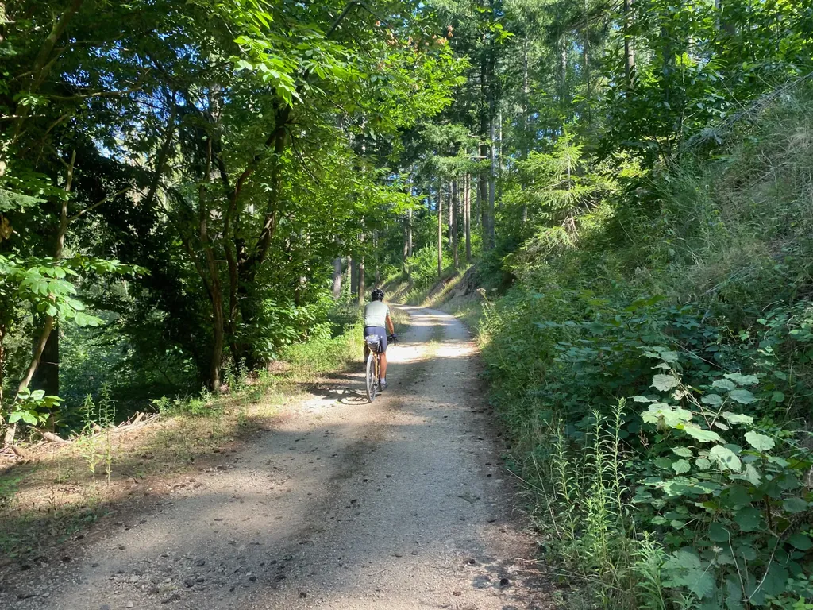
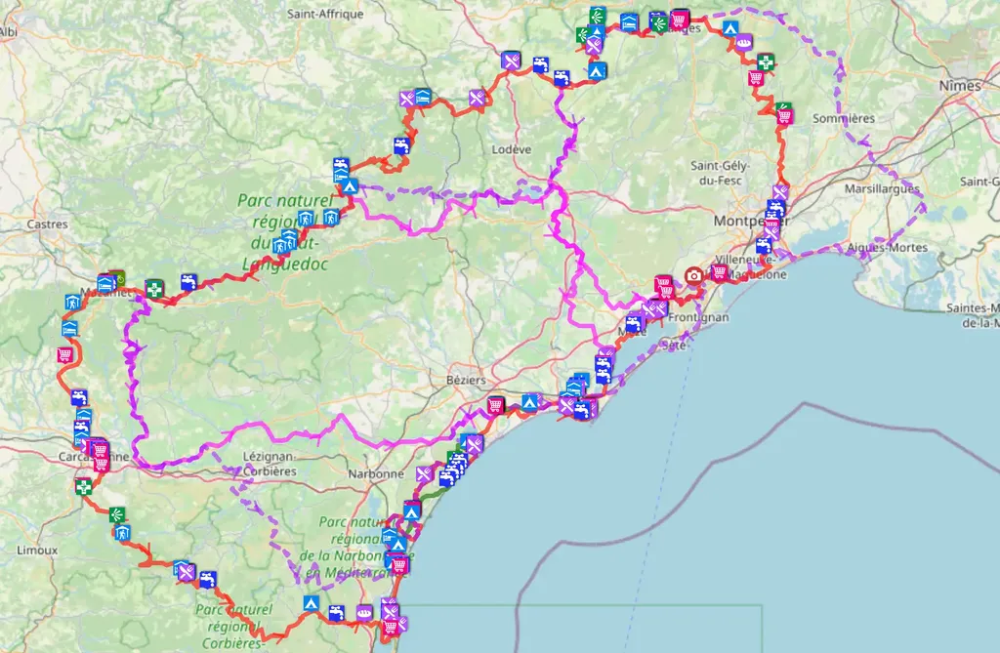
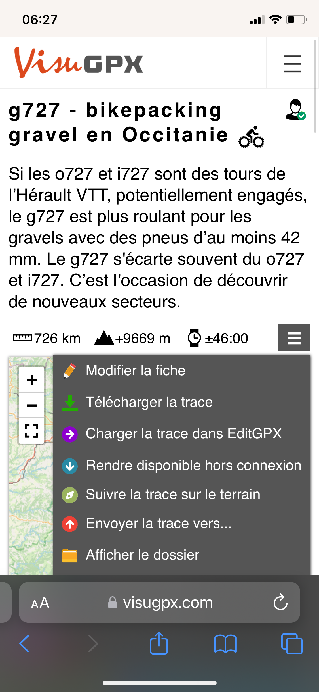
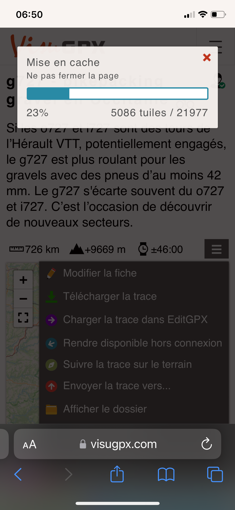
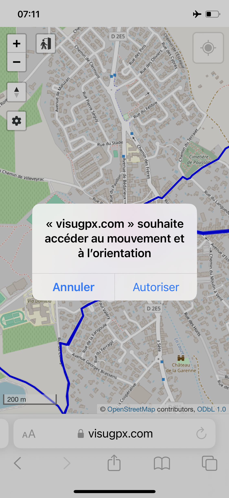
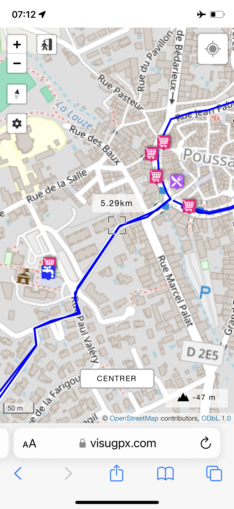
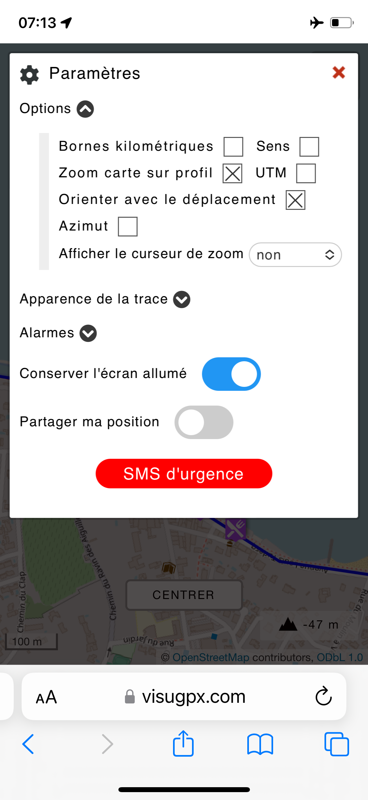

# Traces et POI hors ligne en bikepacking

Je prépare aussi soigneusement que possible [les traces des 727](https://727bikepacking.fr/), et les enrichis de nombreux POI (point d’intérêt), repérés soit sur cartographie, soit lors de mes reconnaissances. C’est particulièrement important pour les points d’eau quand on roule dans des coins isolés. Mais faut-il encore pouvoir accéder à ces informations même dans les zones blanches et sans vider la batterie du mobile, ce qui implique un mode de navigation hors ligne.

Depuis quelques années, je construis mes traces et les publie sur [VisuGPX](https://www.visugpx.com/), parce que je considère le service comme les plus puissants, même si cette puissance avec d’innombrables options en fait parfois un service difficile à prendre en main (c’est le prix à payer — et je vous jure que ça en vaut la peine — laissez tomber les services à l’opposé du spectre de la puissance et de la difficulté — je n’utilise Komout qu’en cas d’urgence, pour générer des traces à la volée, et il y a quelques jours il m’a encore envoyé sur une rocade où j’ai cru mourir).

Les traces VisuGPX peuvent bien sûr être transférées vers les GPS, ce qui est indispensable pour un suivi confortable. Je transfère aussi les POI eau sur mon GPS ([via l’application BaseCamp](https://tcrouzet.com/2023/02/10/comment-installer-une-trace-sur-garmin/)), mais je ne transfère pas les autres POI pour trois raisons :

* Mon Garmin ne gère pas plus de 200 POI ([la trace g727](https://727bikepacking.fr/g727/) comporte près de 400).
* Quand il y a trop de POI sur mon GPS, l’écran devient illisible.
* Je préfère consulter les POI sur mon téléphone, bien plus ergonomique que mon GPS.

Pour la navigation hors ligne, j’utilise souvent [MapOut](https://mapout.app/) sur iOS, une app très performante, rapide, simple. J’exporte mes cartes depuis GoogleMap (mon service de backup) et les envoie à MapOut au format KML en les attachant à un mail (la même procédure depuis les fichiers VisuGPX ne fonctionne pas).

Mais il existe une autre solution, plus directe. Rester sur VisuGPX !

1/ Depuis le menu associé à une trace, la rendre disponible hors connexion.

 

 2/ Choisir un fond de caste (OSM, IGN…) et patienter durant le téléchargement qui peut prendre pas mal de temps pour une trace bikepacking.

3/ Basculer en mode avion pour vérifier que tout fonctionne. Accepter que VisuGPX accède à la géolocalisation.

4/ On peut se promener sur la carte, visualiser les POI, se géolocaliser en cliquant sur le bouton cible en haut à droite. Au centre de l’écran, on a la distance par rapport à sa géolocalisation. 

5/ Pour peut utiliser le service pour naviguer et régler la navigation avec les options. On peut même activer des alarmes pour être alerté à proximité de certains POI, les points d’eau par exemple.

Quand je pars en voyage, je veille toujours à rendre ma trace disponible sur VisuGPX avant le départ. J’aime savoir quand je trouverai un café, un restaurant ou une épicerie sur la trace, parce que je déteste me surcharger.

#velo #bikepacking #y2024 #2024-9-10-10h00
