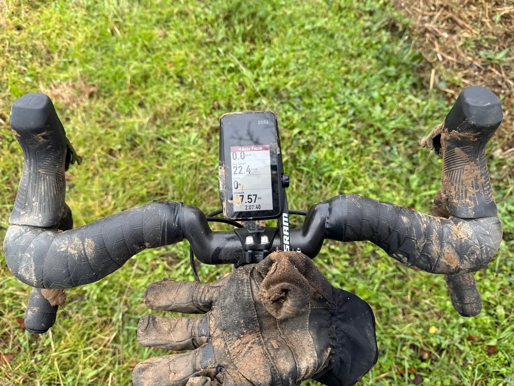
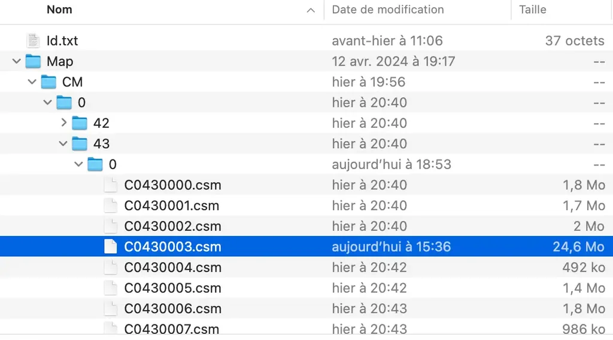
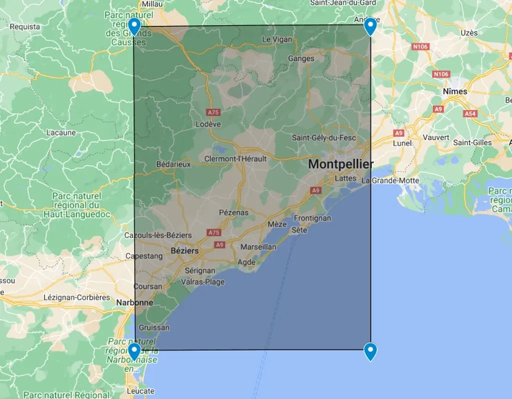
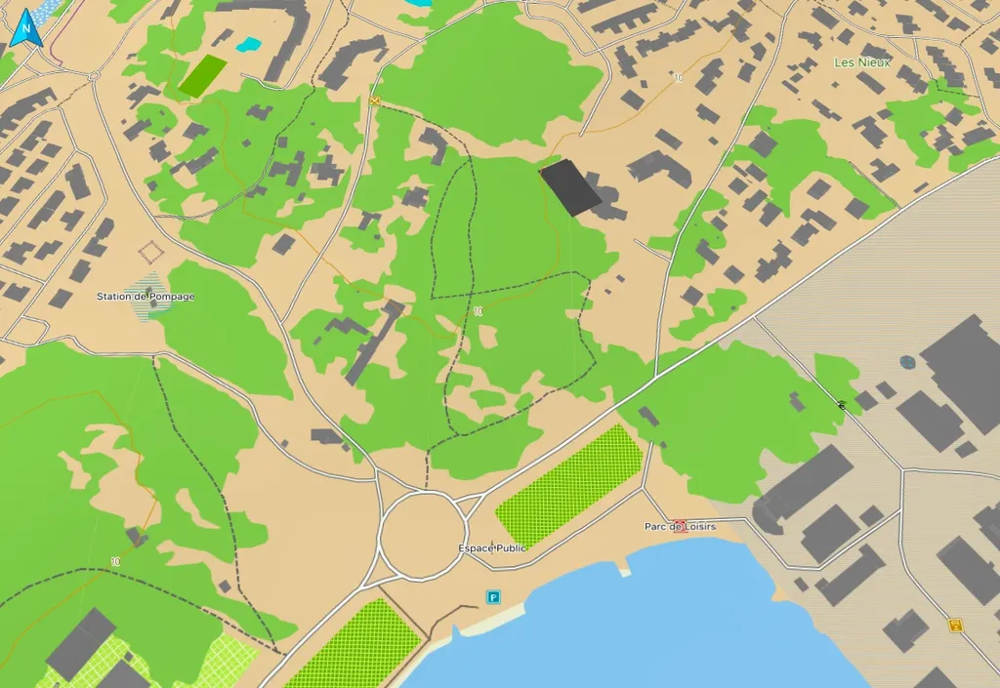
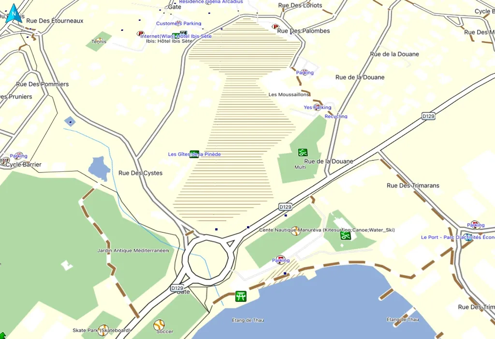
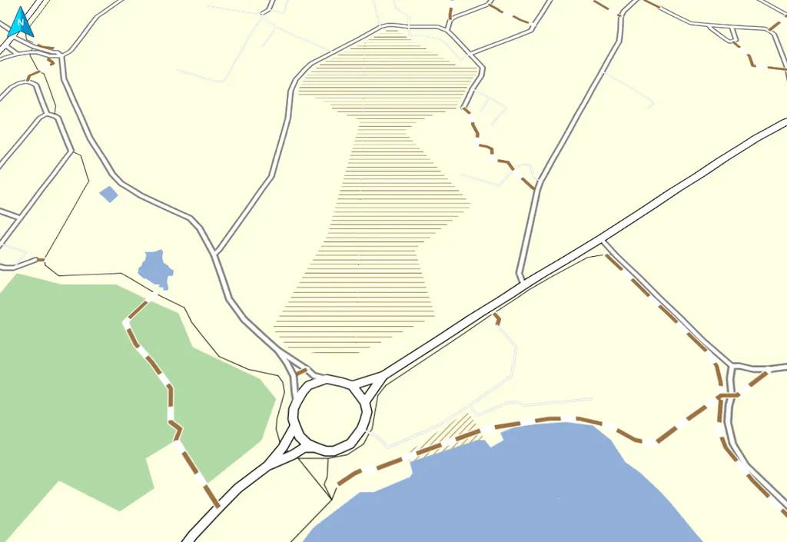
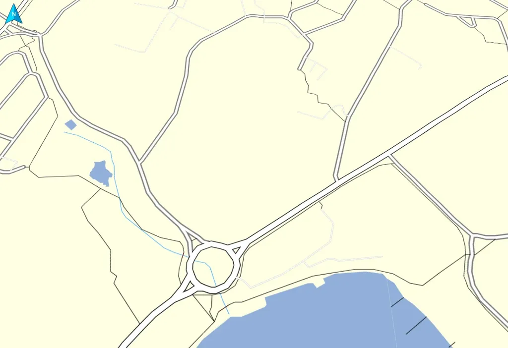

# GPS Coros Dura ou pas ?

Tout ce que je demande à un GPS pour l’aventure, c’est une autonomie la plus longue possible et un écran lisible pour suivre une trace GPX hors asphalte. Le reste ne m’intéresse pas, c’est dire combien les innovations des derniers Garmin me concernent peu (pour des tarifs de plus en plus délirants).

Garmin a choisi de mettre de l’intelligence dans le GPS quand à côté un mobile regorge de puissance. C’est une solution guère rationnelle pour justifier des tarifs prohibitifs (ce qui a été compris par [Wahoo](https://eu.wahoofitness.com/) depuis longtemps — mais sans que les performances ou les prix ne soient attractifs à mes yeux).

Comme mon 530 arrive en fin de vie [après plus de quatre années d’usage intensif](https://tcrouzet.com/2020/10/16/pourquoi-jai-rachete-gps-garmin/) (et une panne sèche en bikepacking), je viens de faire le grand saut vers le [Coros Dura](https://fr.coros.com/dura), dont on parle beaucoup depuis quelques mois et dont un copain m’a dit beaucoup de bien : « Quand il fait soleil, il ne se décharge quasiment pas. » Depuis le mois d’août, il n’a jamais branché son Dura ! Voilà qui en fait le GPS idéal pour le bikepacking, d’autant plus qu’il est vendu pour moins de 300 €. Après avoir roulé avec lors d’une sortie, j’en ai commandé un, non sans réticences. J’ai tout de suite noté trois problèmes :

1. Écran nettement moins piqué que sur les Garmin de dernière génération, mais équivalent à celui du 530 dont, après tout, je me contente depuis des années.
2. Une trace GPX trop épaisse qui cache la carte, ce qui rend très difficile le suivi des singles. Quand deux chemins se suivent en parallèle, impossible de savoir sur lequel on se trouve. De même la trace du chemin parcouru est inutilement épaisse, un simple ligne comme sur les Garmin est largement suffisante.
3. Une cartographie trop imprécise de par son traitement graphique (il s’agit d’une OSM classique avec autant de détails en théorie qu’une carte Garmin). Aucune différence de rendu entre les petites routes, les voies communales, les chemins, les singles. Très difficile de se repérer. En zoom à 50 m, les voies proches se superposent (le 50 m de Coros me paraît équivalent au 80 m de Garmin — donc il manque la possibilité de grossir jusqu’à 30 m, souvent utile à VTT). C’est franchement illisible. Il reste un gros travail à effectuer sur le rendu.

Ces quelques défauts, plutôt logiciels, ne m’ont pas empêché de commander le Dura et j’écris cet article comme une lettre adressée à Coros pour leur demander quatre améliorations, à mes yeux prioritaires (et urgentes).

1. Il faudrait pouvoir choisir la taille de la trace, voire sa couleur. En l’état, le suivi GPX à VTT est très délicat (d’autant que le GPS manque un poil de réactivité lors des changements de direction… ce qui me rappelle de très anciennes générations de Garmin). Il faut de même réduire drastiquement la taille du tracé effectué (quand on revient sur ses pas, la carte est totalement masquée).
2. La configuration des divers écrans est très simple, tout se joue sur le mobile, un jeu d’enfant par rapport à Garmin, sauf qu’il n’existe aucune option pour disposer d’une carte en plein écran. On trouve à minima un pied de page, qu’il serait bon de pouvoir supprimer pour maximiser le suivi cartographique.
3. La molette pour changer d’écran est beaucoup trop sensible quand on porte des gants et roule hors asphalte (faudrait pouvoir régler la sensibilité).
4. Il est urgent de différencier le rendu des différents types de voies. Il faudrait disposer de style de rendu, avec des traits beaucoup plus fins pour commencer. Tout est trop grossier, même en zoom à 50 m. Pourquoi pas un simple fichier de configuration que nous pourrions configurer, voire échanger (comme les fichiers TYP pour les cartes Garmin).

Le produit est bon, l’autonomie remarquable, la compatibilité avec les supports Garmin parfaite. Il reste à fournir un gros effort sur la cartographie pour que le Dura deviennent le GPS de choix des bikepackers.

### Côté bidouille

Sur Gamin, j’apprécie la possibilité de se configurer des cartes sur mesure, tant côté rendu que côté des données représentées. [La manip est un poil technique](https://tcrouzet.com/2020/10/23/optimiser-les-cartes-des-gps-garmin/), mais il est très facile d’installer des cartes créées par d’autres. On n’en est pas encore là avec le Dura, mais j’espère que Coros nous donnera vite les billes pour aller plus loin ([je n’ai trouvé qu’un article où il est question de personnalisation cartographique pour une montre Coros](https://panaetius.github.io/swiss-topo-maps-on-coros/)).

J’ai commencé une première exploitation (pour le moment infructueuse). [Mon code Python est sur GitHub.](https://github.com/tcrouzet/CorosDura)

1/ Pour réussir à monter le disque du Dura sur mon Mac, j’ai dû installer [OpenMTP](https://openmtp.ganeshrvel.com/) (ça serait bien que le disque monte naturellement).

2/ J’ai alors découvert sur le Dura un dossier MAP contenant trois sous-dossiers, l’un intitulé CM (pour Custom Map a priori) et un autre OSM (Open Street Map). Rien d’étonnant, presque tous les GPS utilisent des cartes OSM.

3/ Les IA n’ont mis qu’un instant à décoder l’architecture, identique dans CM et OSM. Le premier sous-dossier est à 0 pour les longitudes positives, à 1 pour les négatives. Le deuxième indique la latitude (43 par exemple), le troisième est à 0 pour les latitudes positives, à 1 pour les négatives. On y trouve les fichiers cartographiques d’extension CMS qui couvrent des secteurs de 1°x1°.

4/ Les fichiers CMS ne sont que des fichiers Garmin IMG dont l’extension a été changée. Garmin travaille avec d’énormes cartes souvent de plusieurs Go, alors que Coros a choisi des cartes fragmentées et beaucoup plus petites, donc qui nécessitent moins de mémoire et de puissance de calcul (et qui aussi sont moins détaillées, pas de nom de route, de localité, pas de représentation des maisons, peu de terrains identifiés… tout cela ne facilite pas le suivi de traces hors asphalte).

5/ Pour tenter une personnalisation, j’ai téléchargé [une carte OSM](https://extract.bbbike.org/) au format PBF compressé qui inclut le pavé 1°x1° autour de chez moi.

6/ Je l’ai décompressé en OSM avec [Osmosis](https://wiki.openstreetmap.org/wiki/Osmosis).

7/ J’ai programmé un script Python, pour convertir cette carte en une série de fichiers IMG de 1°x 1°, en suite renommés en CMS (C0430003.csm pour CM ou S0430003V04.csm pour OSM). J’ai évité de conserver les noms des routes et des lieux. Mon script s’appuie sur l’utilitaire Mkgmap auquel je passe une description des styles.

8/ J’ai comparé le rendu de différentes cartes sur Garmin BaseCamp. L’IGN est bien sûr beaucoup plus détaillée. Elle montre des singles invisibles sur les OSM. L’OSM standard possède de nombreux POI. L’OSM du Dura est quant à elle minimaliste, tout comme ma version sur mesure (avec plus de détail sur les cours d’eau et une taille quatre fois supérieure).

9/ Quand je copie le fichier généré dans CM, je ne vois aucune différence de rendu sur le Dura (je vois mal l’utilité de ce dossier, qui n’était pas présent sur le Dura lors de mes premières manipulation). Quand je copie dans OSM, j’ai un fond de carte totalement vide (je suis alors forcé d’écraser le fichier par l’original). J’en déduis que c’est dans OSM qu’il faut copier les nouveaux secteurs, mais je n’ai pas encore trouver les styles adéquats pour que ça marche.

10/ J’arrête là mon exploration, en espérant que d’autres bricoleurs avanceront plus loin ou que Coros éclairera nos lanternes. J’avoue que c’est un peu frustrant à ce stade. Je continue de rouler pour l’instant avec mon Garmin.

### On me dit

[« Lorsqu’il fait froid/très froid, l’autonomie dégringole en quelques minutes jusqu’à 0 %. Il s’éteint. »](https://www.facebook.com/groups/1956177877969720/posts/3897577167163105/?comment_id=3897765893810899)

[Aussi que le hard est le même que les montres Coros, ce qui expliquerait le rendu médiocre, le logiciel n’ayant pas été pensé pour un écran plus grand.](https://www.facebook.com/groups/1956177877969720/posts/3897577167163105/?comment_id=3897587670495388&reply_comment_id=3897656693821819)

#velo #GPS #bikepacking #y2025 #2025-1-24-14h00
