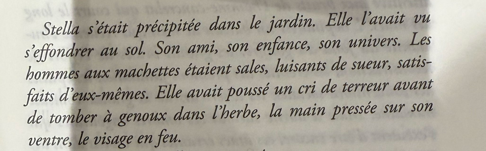

# Décembre 2024

### Dimanche 1er, Balaruc

[Brian Doyle](https://www.themarginalian.org/2024/11/24/brian-doyle-humility-love/) : « We are all largely solitary, and spend whole lifetimes digging tunnels toward each other, do we not? » Puissant résumé de notre vie : nous sommes des vers de terre solitaires creusant des tunnels vers d’autres vers solitaires.

---

Flippant de vérité cette note de Guillaume dans son journal : « Et le temps est meublé dans les groupes de travail, et ensuite au cours de la restitution desdits groupes de travail. Et durant les temps de convivialité ou, _sic_, _d’épaisseur humaine_, nous meublons aussi, mais en plus petits commités. Avant que vienne ensuite le temps de la soirée durant laquelle plusieurs dizaines de personnes meublent en s’ambiançant sur Ophélie Winter. Ensuite, libre à toi de meubler devant un film français qui n’a pas assez de matière pour tenir 90 minutes, ou devant un roman qui meuble lui aussi pour toucher à la bonne volumétrie du format, quand dans les faits l’épaisseur et de l’intrigue et de la langue tient en quelques pages. Fort heureusement, l’issue à tous nos problèmes est trouvée, et plutôt que de meubler nous-mêmes au sein du temps qui nous reste imparti sur cette terre, nous déléguons à des machines ce temps meublé (_il faut avoir des gens qui sont bien cortexés_, dixit la masterclass IA prévue au programme), de cette façon il est possible de paramétrer à l’avance la quantité de propos à générer, et donc le temps à meubler pour le lire à l’autre bout (sauf qu’à l’autre bout, c’est aussi une machine qui lit, ne soyons pas dupe). » Je meuble trop souvent, j’espère pas ici, ni dans mes textes.

### Lundi 2, Balaruc

Une pièce dont le programme serait la pièce elle-même. Idée venue en lisant le journal de Kafka.

---

Les mots sur mon écran ou sur le papier ne bougent pas, comme les photos. Les mots sont des photos, les photos des mots. On peut raconter des histoires dans les deux cas, ou être poétique, et tant d’autre choses.

---

Tous les matins mon téléphone estime pmon temps pour aller au travail. Il ne comprends pas que j’accompagne Émile au lycée, puis rentre à la maison. Ça me fait rire.

---

Parce ce que j’ai passé une paire d’heures à réfléchir à la composition photographique, je me suis surpris aujourd’hui à faire des photos respectant certaines des règles. Quelle étrange chose que notre cerveau. J’aime le sentir encore capable d’apprendre, et de me surprendre.

### Mercredi 4, Balaruc

Je corrige, je détruis encore un chapitre, pour le reprendre, puis je jardine, et c’est un peu la même chose.

### Jeudi 5, Balaruc

Rapidement, un adverbe pas rapide. Lentement, un adverbe dans le bon rythme.

---

Depuis deux ans, j’affine mon prompt de correction ortho-typo. Si je l’applique dix fois à un même texte, il trouve toujours des choses à modifier, exactement comme les correcteurs humains. On dirait que les IA aussi ont besoin de justifier leur travail.

### Vendredi 6, Balaruc

Hier soir, je retrouve des copains et copines auteurs à [La librairie nomade](https://www.facebook.com/p/La-librairie-nomade-100067427163808/). J’ouvre par hasard le Renaudot 2024. Je lis les deux premières phrases et m’arrête. « Stella s’était précipitée dans le jardin. Elle l’avait vu s’effondrer au sol. » J’ai pensé « une histoire de tremblement de terre ». Mais ça voulait dire quoi un jardin qui s’effondre au sol ? Rien.

La confusion est levée à la phrase suivante (j’espère volontairement). Il s’agirait d’une figure de rhétorique, un [zeugma](https://fr.wikipedia.org/wiki/Zeugma_(stylistique)). Perso, je me bats pour ne pas tomber dans ce piège. Parce que c’est très facile d’y tomber et très difficile d’en sortir en français, contrairement à l’anglais où le « it » sauve souvent la mise. C’est parce que c’est plus facile à faire qu’à défaire que je vois ça comme une faute. Je dois être trop scientifique. Je n’utilise une variable dans une phrase que si elle est d’abord instanciée.

Voilà ce que me dit Claude « Il y a un problème de cohérence dans la narration. Le "l’" est ambigu - on ne sait pas qui s’effondre. Il faudrait soit nommer clairement le personnage à la deuxième phrase pour éviter toute confusion, soit trouver une autre construction. »

Reste que je doute de la volonté de l’auteur : à la fin du paragraphe, il y a un « son ventre » encore une fois flottant (à cause du doute initial). La répétition du « son » tout au long du texte étant très désagréable à mes oreilles. En gros, rien ne va.

---

J’ai envie de dire à beaucoup de gens : « Le jours où vous comprendrez de quoi son capables les IA vous commencerez à avoir une petite chance de leur résister. Tant que vous les mépriserez, les concidérerez de haut, vous serez leurs esclaves. Ne jamais sous estimer son ennemi. »

### Samedi 7, Balaruc

Nous avons le don de justifier l’injustifiable.

---

Je me souviens d’une époque où j’entrais dans Notre-Dame pour méditer, comme dans n’importe quelle autre église, sans faire la queue. 

---

Hubert a toujours le regard vers le négatif quand il s’agit de technologie et moi plutôt vers le positif. On se complète. Petite réponse à son article [IA, réducteur culturel](https://danslesalgorithmes.net/2024/12/03/ia-reducteur-culturel-vers-un-monde-de-similitudes/).

« Farrell se livre alors à une expérience en générant un podcast en utilisant [NotebookLM de Google](https://notebooklm.google/). Mais le bavardage généré n’arrive pas à saisir les arguments à discuter. Au final, le système génère des conversations creuses, en utilisant des arguments surprenants pour les tirer vers la banalité. Pour Farrell, cela montre que ces systèmes savent bien plus être efficaces pour évoquer ce qui est courant que ce qui est rare. »

Comme toujours, quand on ne sait pas utiliser une technologie, quand soit même on ne cherche pas quelque chose de différent, on n’obtient rien d’original. C’est vrai avec un LMM comme avec un traitement de texte ou un stylo. Rien de neuf sous le soleil. On ne demande pas aux LLM d’être géniaux, mais de nous-même être géniaux avec leur aide. C’est très différent. (C’est pas le stylo qui nous rend génial mais éventuellement ce que nous écrivons avec.)

La [« malédiction de la récursivité »](https://arxiv.org/pdf/2305.17493) est une malédiction humaine pour commencer. Je suis bien placé pour le savoir quand je vois ce que les éditeurs publient majoritairement, ce que les lecteurs plébicitent majoritairement (je ne veux surtout pas généraliser). Comment une de nos technologies pourrait-elle être meilleure que nous ? C’est à nous de nous améliorer, alors nos technologies s’amélioreront avec nous.

Je constate que les avancées en médecines et dans tous les champs de la recherche ont été démultipliées grâce aux LLM. Pour ceux qui le veulent, ces outils peuvent engendrer des corrélations neuves. Mes expériences avec NotebookLM me l’ont montré. Elles ont généré de nombreuses pistes nouvelles pour mon texte et m’ont poussé à le radicaliser plus qu’à le normaliser.

---

Aujourd’hui, *Le Roman du roman* est devenu *Rush* (*Le Roman du roman reste le livre dans le livre, l’histoire de la découverte du rush).

### Dimanche 8, Balaruc

Pas question de m’arrêter sur le premier paragraphe du Renaudot. On m’a dit que je comprenais rien à la littérature contemporaine, qu’il s’agissait d’une prose moderne (genre, toi tu es ringard). J’ai donc commencé à lire *Jacaranda*, sans grand intérêt, ne voyant qu’une prose dynamique, sans plus la moindre imprécision logique (ce qui confirme mon impression de maldresse initiale), une prose au plus proche du parlé, sans être orale, une prose sommes toute simple, qui ne me provoque rien de particulier comme si je l’avais lu déjà cent fois. Je ne parle pas de ce qui est dit, raconté, de la situation, juste de l’écriture.

### Mardi 10, Balaruc

J’ai honte quand je vois les lourdeurs que les IA trouvent dans mon roman, plus honte que quand c’est un correcteur humain, parce que voir la machine me prendre à défaut me ramène à moins que rien. Je protège mon carnet de cette scrutation.

### Mercredi 11, Balaruc

Dans *Jacaranda*, les dialogues sont le point faible, ils sonnent faux, comme quand moi-même j’écris des dialogues, ça sonne souvent faux un dialogue, l’écrit ce n’est pas la parole, c’est un défit de traduire une forme dans une autre, mais c’est la mission de la littérature. Je trouve plus vrai les dialogues non dialogués que ceux explicitement formattés avec des guillements ou des tirets. Dans mon roman, j’ai viré les marques typographiques, pour fondre le dialogue dans la prose.

### Jeudi 12, Balaruc

Passage de *Rush* : « Toutes les histoires s’affrontent pour façonner le monde. C’est une compétition narrative. »

### Vendredi 13, Balaruc

Je suis moins enthousiaste pour NotebookLM. Plus je peaufine mon roman, moins NotebookLM réussit à en dire des choses intéressantes. Il s’embrouille, mélange les époques, les perspectives, et sutout ne m’aide plus à prendre du recul sur mon propre texte. Il rabache des évidences (mêlées à beaucoup d’erreurs). C’est soit mon regard qui est devenu plus critique, soit la technologie qui s’est dégradée, soit mon texte qui a atteint son but : dépasser les possibilités des IA contemporaines.

---

[Le phare de Þrídrangaviti](https://en.wikipedia.org/wiki/Thridrangaviti_Lighthouse) en Islande, le genre de chef-d’œuvre qui me donne confiance en nous. Je viens de passer trente minutes à lire sur l’incroyable construction du phare et regarder des vidéos.

---

Pour la première fois, j’ai le numéros du Premier ministre dans mon portable. Faudrait que je raconte pourquoi. Ça nous ramène à 2006 et à l’écriture du *Cinquième Pouvoir*. J’ai revu Bayrou une fois, en 2019, à Pau.

### Samedi 14, Balaruc

Certains translantés témoignent de souvenirs qui ne leur appartiennent pas. Idée de polar : un homme âgé à qui ont transplante le cœur d’un homme jeune commence à se souvenir d’évènements qui ne lui appartiennent pas. Il prends conscience qu’il a reçu le cœur d’un monstre.

---

Ce qui m’intéresse dans les IA, c’est leurs erreurs, leurs hallucinations, c’est là que je trouve des sources d’inspirations. J’aime quand elles disent un truc de mon texte qui n’y est pas, mais qui aurait pu y être, et qu’alors j’introduis, comme si l’idée était venue de moi. J’ai toujours concidéré les idées comme des bugs dans une machine logique, et je m’appuie sur les bugs des IA pour externaliser une partie de mon travail créatif.

---

Rush serait de la *frankenscience*, une science-fiction qui ferait référence à une science devenue incontrôlable ou dangereuse. C’est un peu ça, mais vraiment juste un peu.

### Lundi 16, Balaruc

François se démène avec Balzac, projet dingue, mais pas le temps de le suivre, juste de le picorer, car trop plongé dans mes propres affaires, je peux pas être un autre en ce moment.

### Mardi 17, Balaruc

Voici ce que m’écris Lionel, l’étieur de One Minute, sur Mastodon, [suite à mon billet où je demande à Claude d’écrire une stratégie de publication](https://tcrouzet.com/2024/12/16/strategie-editoriale/) : « L’impression que j’ai est que tu es totalement déconnecté du monde éditorial et de ton public. Tu as des éditeurs fans de ONE MINUTE (en plus de moi) qui seraient heureux de te lire. Entre éditeurs, on parle d’IA et on voit très bien les mutations. Tu le saurais bien mieux si tu prenais part à des événements littéraires. Plutôt que de faire des monologues avec ton IA, tu pourrais de temps en temps partager avec tes semblables tes réflexions. Tu le fais sur ton blog, mais n’est-ce pas encore un autre monologue ? Tu ne semble plus chercher vraiment l’échange, le débat. C’est l’impression que j’ai depuis un certain temps sur tes publications. Le partage, ce n’est pas juste donner, c’est aussi recevoir (en bien ou en mal). C’est une empathie réelle que seuls des semblables peuvent partager. Les lecteurs aiment l’échange avec leurs auteurs. C’est ça l’humanité, celle que l’IA est incapable de remplacer. »

Lionel n’a pas tout à fait tors, mais à ma connaissance je n’ai jamais refusé de participer à un évènement littéraire organisé dans le respect de [la charte des auteurs](https://www.la-charte.fr/inviter-chartiste/recommandations-tarifaires/). Je suis toujours disponible pour des Zoom. Il me semble que je suis facile à trouver, ou à contacter, même si depuis le cancer d’Isa, je suis moins mobile (mais rien n’est impossible).

« Les lecteurs aiment l’échange avec leurs auteurs. » C’est une généralisation, moi, en tant que lecteur, j’aime avant tout échanger avec les œuvres, et seulement après, éventuellement avec avec ceux qui les font (malheureusement ils sont souvent morts). Alors oui je ne suis pas fan des salons littéraires où je dois passer des journées derrières une table en attendant que le temps passe (mais ça devient génial quand je suis en bonne compagnie, ce qui est souvent le cas). Je préfère de loin le format conférences/débat/table ronde… grand foutoir ou tout le monde peut parler à tout le monde, de manière non hiérarchique de préférence. J’ai sans doute le défaut de croire que c’est à mes textes d’entretenir une relation avec mes lecteurs, c’est d’ailleurs ce qu’ils devront faire quand je ne serai plus là.

Dans « monologue avec IA », je note un petit mépris vis-à-vis des IA. Si c’est un monologue, il est putain de nécessaire pour comprendre ces bestioles qui s’appêtent à réjenter nos vies. Passer du temps à torturer ces machines ne m’empêche pas de passer du temps avec mes semblables (OK, souvent davantage cyclistes que lecteurs, mais je fais avec ceux que j’ai sous la main).

### Jeudi 19, Balaruc

[Jancovici](https://podcast.ausha.co/greenletterclub/dialogue-avec-jean-marc-jancovici-sur-le-climat-et-l-audiovisuel-hors-serie) : « L’IA peut-elle être une aide substantielle dans la création ? l’IA n’a pas de déclic ! Je ne sais pas comment vous vous fonctionnez, mais moi les quelques idées que je peux considérer comme pas trop connes que j’ai eues dans ma vie, je les eues à un moment où je ne m’y attendais pas nécessairement. Pendant une randonnée… dans le métro… ça vous tombe dessus à un moment où vous ne vous y attendez pas. Je ne pense pas qu’un logiciel puisse fonctionner comme ça. » Voilà le sujet de *Rush*, d’où viennent les idées, comment les provoquer, quelle est leur histoire. Mais qui peut dire ce qui se passe à l’intérieur d’une IA ? Je discute avec elles, parce qu’elles me provoquent parfois des idées, parce que parfois même je les vois générés des trucs assez dingues, qui souvent je le sens tienne de l’erreur ou de l’hallucination, mais dont je peux m’emparer. Si les IA peuvent éventuellement avoir des déclics, elles ne s’en rendent jamais compte (j’ose pas dire prendre conscience).

---

Je viens d’apprendre que mon copain Yvon est tombé, comme ça, soudainement, durant l’apéro. Le Lot-et-Garonne me paraîtra bien vide sans lui. J’avais fait d’Yvon un des personnages de *La Quatrième Théorie*.

« Yvon était le menuisier du coin, un personnage haut en couleur, une grande gueule, un grand ventre, une grande barbe, le cœur sur la main.

(…)

– C’est quoi ce pétard ? Pute borgne ! râla Yvon, surgissant en pyjama sur le seuil de sa porte. Que se passe-t-il, con de Dieu ? »

### Vendredi 20, Balaruc

Chacun fait ce qu’il veut. Ben non. Si chacun fait ce qu’il veut c’est l’anarchie. On peut faire ce qu’on veut que dans la limite de contraintes (environementales, économiques, liberté d’autrui…). Le pire, c’est que je suis anarchiste, mais tout bon anarchiste sait que la liberté absolue est une chimère.

Dans le vélo, je vois des gens organiser des évènements qui me paraissent hors de prix. Alors il m’arrive de le dire et les organisateurs me tombent dessus, me disant qu’ils sont libres de faire comme ils veulent du moment qu’il y a des gens pour payer, sauf qu’ils ne semblent pas mesurer qu’ils provoquent une dérive tarrifaire, qui s’est produite dans le trail, qui engendre des comportements compétitifs, des organisations de moins en moins respectueuses de l’environnement…

Parce que je suis conscient de la dérive, je ne peux pas faire ce que je veux. Non, je ne le peux pas. Le bikepacking était pour moi une pratique minimaliste du vélo de voyage. C’est en train de devenir un truc de tour opérator, avec petit repas à chaque coin de rue, et bientôt il y aura les massages. Je prône une pratique totalement différente, pour laisser une chance au hasard.

### Samedi 21, Balaruc

[Bruce Taj](https://www.facebook.com/brucetaj/posts/pfbid025EsjBThanGd8KQnnuNMgyXmsx6WrnirvG53Lykpb9Kruu9nfaiw8D4GrKmp53r8Pl) : « Le symptôme de la terre plate : c’est une symbolique portant l’essentialisation du mensonge structurel de nos sociétés. » L’idée : nous vivons le plus souvent la terre plate (ou vallonée, voire montagneuse). La terre sphérique est alors perçue comme une narration. Être platiste, c’est donc remettre en question la narration dominante plus que réellement croire que la terre est plate. « Il devient, alors plus aisé de comprendre pourquoi tant de personnes crient à la terre plate, c’est pas la structure de la terre qui est en jeu, c’est le mensonge transcendantal de nos sociétés. » Voilà le sujet de fond de *Rush*.

### Dimanche 22, Balaruc

[Satya Nadella](https://www.youtube.com/watch?v=9NtsnzRFJ_o&ab_channel=Bg2Pod) annonce la fin des applications. Plus je passe du temps avec les IA, plus je sais qu’à minima elles seront capables de faire ce que font la plupart de nos logiciels. Est-ce que ma vie d’écrivain se terminera sans éditeur de texte ? Est-ce que bientôt j’écrirai en parlant ? Ou seulement à l’aide de prompt ? Ça me fiche ma trouille, parce que j’aime penser avec mes doigts.

L’écriture est physique, une physique de la main depuis tant de siècle ; à cela les claviers ont apporté des changements mais pas de révolution. Faudra-t-il renoncer à la main, aux deux mains ? Et quelles œuvres alors écrirons-nous ? Certains croient écrire avec des vidéos, ils parlent devant leur caméra, mais, non, ce n’est pas de la littérature, je regète, ça n’a rien à voir, c’est une autre dimension, qui implique un flux de conscience plus lent — quand il ne s’accompagne pas d’une haute exigence esthétique, il m’est insupportable.

L’écriture s’adapte à la vitesse de chacun alors que la vidéo nous impose son rythme (même si souvent je les écoute en mode accéléré parce que sinon je m’emmerde… et c’est encore trop lent). J’ai besoin d’une médiation beaucoup plus intime, qui libère mon imagination, et je connais pas mieux que les mots, pas mieux que le texte. Écrire par la voix, ça ne fait aucun sens pour moi — peut-être parce que je n’ai jamais été un auteur de théâtre (et même encore, je crois que j’aimerais faire jaillir les paroles depuis le cliquetis des touches de mon clavier — j’aime cette musique à tel point que parfois j’allonge les phrases rien que pour l’entre encore un peu).

Certains ont tenté d’écrire rien qu’en parlant à une IA. Je devrais essayer. Pour savoir l’effet que ça produira sur moi, sur mon processus créatif, mais peut-être que j’arrive aux limites de ma curiosité. Si demain les IA remplacent nos applications, la ittérature ne s’en remettra peut-être pas, comme d’autres arts anciens aujourd’hui disparus. L’éditeur de texte a remplacé le papier par l’écran, comme la machine à écrire avait remplacé le stylo. Il s’est agi de translation. Là, on parle de quelque chose de plus radical. Plus de papier. Des textes conçus dans le ventre des machines en réponse à nos demandes, ce qui entraînera une disjonction entre l’acte d’écrire et de lire.

Les textes écrits par les IA nous sont désagréables parce qu’ils impliquent une rupture ontologique : jusqu’à aujourd’hui, il y avait une grande similitude entre l’acte d’écrire et de lire, une proximité quasi physique entre l’auteur et le lecteur, alors que désormais un gouffre s’ouvre. Plus je pense à toutes ces évolution, plus je ressens la nécessité de poursuivre mon journal. J’y suis au plus proche, au plus immédiat, je réduis au maximum la distance entre vous et moi, sans aucun des artifices propre à la fiction.

Il est possible de paraître plus réaliste, plus vrai, plus direct dans un roman, mais il ne s’agit toujours que d’une construction, que d’un tour de magie pour engendrer une vérité criante alors qu’elle n’est qu’une illusion. Dans le carnet, des non dits, parfois de petits mensonges, des exagériations, mais la distance reste ultracourte, et la maintenir comme telle dans une époque où au contraire les technologies nous éloignent. Dans *Rush*, j’ai appuyé sur cette dichotomie entre la fiction et le carnet.

---

Dans les productions des IA, je m’intréesse à l’inhumain et non à ce que nous aurions pu faire. J’attends qu’elles me surprennent, et elles le font souvent, comme les paréidolies dans les nuages. Je m’intéresse à leurs erreurs, à leurs dérèglements, à leurs mensonges.

---

Hervé Prudon : « plus tard nous irons loin / nulle part » Les deux derniers vers du dernier poème. Magnifiquement terrifiant. Deux semaines plus tard Prudon succombait d’un cancer. J’avais jamais lu Prudon que je découvre grâce aux travaux de Jeremy Bouquin.

### Lundi 23, Balaruc

[Lire exigerait une vitesse de traitement d’environ 50 bits/seconde, tandis qu’un jeu vidéo ne demande que 10 bits/seconde.](https://www.sciencealert.com/scientists-quantified-the-speed-of-human-thought-and-its-a-big-surprise) Voilà pourquoi je m’endors assez vite quand je lis. Mon cerveau ne supporte pas longtemps cet effort.

### Mardi 24, Balaruc

Au détour [d’une conversation initiée par Jérôme Leroy](https://www.facebook.com/cornelius.rouge/posts/pfbid0387RQEFL8UMJiHw9TdP7pUHRquQRDQ2F8XHqbasSrorvQSDvanUndiegT25b4wjGrl), j’entends parler de [Claude Klotz](https://fr.wikipedia.org/wiki/Patrick_Cauvin) pour la première fois. Je lis *Iaroslav*, roman noir terminal, parfois brouillon — impression que le livre a été écrit très vite, c’est son charme —, avec trop de flash-back guère passionnant, mais qui déborde de fulgurance. « (La Volga) C’était un fleuve d’aluminium. » « La nuit dehors est nue comme la main. » « Les nuages violaçaient, de la couleur des ecchymoses sur les genoux d’enfants… » « Les lourds monuments aux sombres colonnes pleuraient de toutes leurs gouttières. » « Le sang de septembre coulerait bientôt et ce serait de l’or partout, du toit jusqu’aux collines. » Me donne envie d’écrire un roman qu’avec de l’action. Pousser à bout la technique de Manchette, de Hemingway, de Hammett. Écrire un roman behavioriste ou comportementaliste.

### Mercredi 25, Balaruc

J’ai honte, je me sens mal, stupide, de m’être fait prendre comme un demeuré. Je suis un demeuré. Ça aurait pu être dramatique, à devenir fou. Lundi soir, je fais les courses avec les enfants. Un appel de ma banque N26 me disant que quelqu’un a tenté de prélever 1500 € sur mon compte. Suite au piratage de Free. Le mec très pro. Me dit qu’il me faut changer d’IBAN. Et tout en faisant les courses, j’effectue la procédure. Effectuant un virement sur ce nouvel IBAN. Par change il n’y avait que 500 € sur ce compte. Mais j’aurais pu en perdre 5 000, 50 000. J’ai prix conscience de ma bévue hier soir. Une belle leçon. Un beau cadeau de Noël. Je ne regrette pas d’avoir perdu 500 €. Le prix d’une belle leçon. Nous vivons dans un monde de crapule. Ne faire confiance à personne. J’ai toujours fait confiance. Et ces misérables vont me forcer à me méfier, à mettre en doute, à détester l’autre au prétexte qu’il est potentiellement malhonnête. Si je vois quelqu’un allonger sur la route, je ne m’arrêterai pas de peur que ce soit un piège. La délinquance gangrène la société. ET me gangrène le cerveau. J’ai même du mal à raconter calmement. Je suis écœuré de moi même. De ma naïveté.

---

La plupart des textes de l’antiquié ont été perdus. Ne pas croire que les nôtre échaperont à ce destin tragique. Sur papier, sur disque, sur cristal… rien ne garantit qu’ils traverseront le temps.
