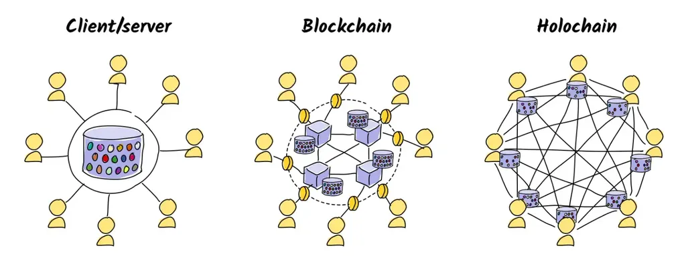
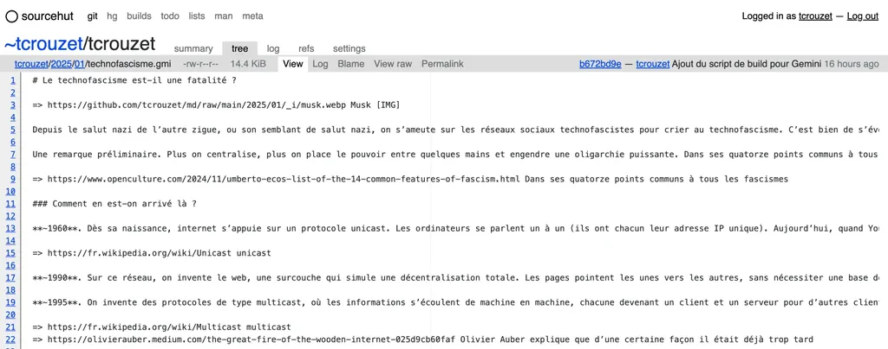
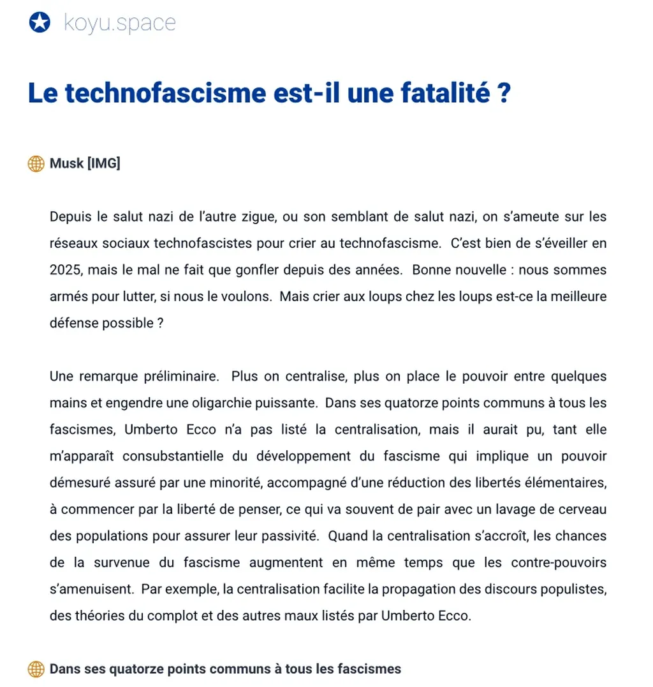

# Can low-tech coexist with high-tech ?

I live with a low-tech enthusiast who has cancer that’s being treated with the most sophisticated high-tech. This raises questions and sparks debates between us.

Here’s what [Low-tech Lab](https ://lowtechlab.org/fr/la-low-tech) states : "We use the term low-tech to describe objects, systems, techniques, services, know-how, practices, lifestyles, and even schools of thought that incorporate technology according to three main principles : useful, accessible, sustainable."

### An Almost Survivalist Approach

In an absolute crisis situation, we’ll have no choice but to use low-tech. It’s therefore important to have low-tech solutions within reach. We need to develop them, learn them, and pass them on so that one day, we won’t be caught off guard (and I’m not talking about myself, on my existential scale, but on humanity’s scale).

For example, we need to imagine an ultra-light internet capable of running on very simple, energy-efficient computers requiring low-bandwidth connections. With this in mind and to minimize my carbon footprint, I switched my website to static two years ago and only use [webp images](https://fr.wikipedia.org/wiki/WebP) which are often half the size of jpegs at equivalent quality (I’ll switch to [AVIF](https://fr.wikipedia.org/wiki/AVIF) as soon as browsers are compatible). It’s not much, but I gain in other ways.

* Hosting costs me less.

* My site is faster than with WordPress.

* I have less risk of being hacked.

* I no longer have a server to maintain, updates to perform, plugins or templates to tinker with (benefit : less mental load).

* I control my content from production to distribution.

The switch to low-tech, relative in this case and more radical in my experience with Gemini (see below), thus has advantages. We often tend to complicate things unnecessarily. The web suffers from an obesity crisis (with mountains of scripts behind every page, most often to track our habits for advertising purposes).

As I’ve experienced with my website, low-tech can be more robust, more powerful, more optimal. It doesn’t imply something worse, sacrifices, or giving things up. On the contrary, it can open up possibilities. For example, writing in Markdown (the low-tech of writing) rather than in [WYSIWYG](https://fr.wikipedia.org/wiki/What_you_see_is_what_you_get) in Word (the high-tech of writing) has liberated me as an author.

### The Crisis is Now

For some, we’re already beyond the wall and using low-tech is no longer optional. I’m less radical, even though I travel by bicycle (but bikes have become high-tech objects — I would need to ride steel bikes without derailleurs). And I’m even less radical because Isa needs high-tech to heal.

In an ideal world, we would develop high-tech in certain vital areas and not in other less critical ones. For example, we wouldn’t spend so much time developing social networks that lead us straight to [hypnocracy](https://legrandcontinent.eu/fr/2025/01/26/trump-musk-lhypnocratie-ou-lempire-des-fantasmes/) while we’re overheating the planet without much reaction. But how can we prevent certain technologies except by banning them ?

Developing high-tech only in privileged directions would only be possible under state dirigisme. I don’t want this because I don’t want to live in a dictatorship. I’m counting on a slow awakening, but even my most eco-friendly friends take planes. It’s not a done deal.

# Can low-tech coexist with high-tech ?

Awareness is too slow compared to the speed of climate change. It won’t win this race. I reached this conclusion about fifteen years ago, which explains why I’ve written fewer and fewer "political" texts. I haven’t become a techno-solutionist, but techno-solutionism imposes itself by default since we are unable to change our behavior. Whether we reject or adopt techno-solutionism, we’ll have it. That’s a fact.

On a global scale, technology is an ecosystem, with interactions between fields of application that are difficult to measure. AI, deemed recreational and useless by some, simultaneously facilitates medical research (and helps me with my web tinkering that I wouldn’t dare attempt without it). Researchers have had ideas or met collaborators on brain-washing social networks. Homosexuals have found support there for their coming out. I’ve met fellow authors and cycling friends there. You can even find low-tech advocates there.

I don’t believe in the possibility of medical high-tech without other seemingly unrelated high-tech alongside it. I only believe in individual responsibility, which comes through education. We must talk about low-tech, implement it as much as possible, without making it mandatory, because only a dictatorship or catastrophe will impose it. It’s absurd, but that’s how we are. No one will stop us from watching cat videos (or in my case, mountain bikers descending vertiginous trails).

Warning eventually becomes pointless. And smokers smoke, alcoholics drink, drug addicts use drugs, gamblers gamble… Nothing else to do but explain again and again, until exhaustion. Explaining isn’t warning, it’s trying to awaken to other possibilities.

### Low-tech as Decentralization

**Whenever possible, don’t lock yourself into one solution, maintain control of your tools. That’s the principle of low-tech. Do it yourself when you can. At home, in your community, with your tools, and not rely on industrial third parties who offer turnkey solutions, supposedly better and simpler. Low-tech is always about decentralizing.**

[When Jack Dorsey, the founder of Twitter and BlueSky, left BlueSky](https ://www.piratewires.com/p/interview-with-jack-dorsey-mike-solana), he stated : "This is not a protocol that’s truly decentralized. It’s another app. It’s another app that’s just kind of following in Twitter’s footsteps, but for a different part of the population." He was essentially saying "BlueSky isn’t low-tech enough," and therefore not resilient enough to any form of control and algorithmic subversion, which is what I expect from a worthy social network.

My question, can low-tech coexist with high-tech ?, then becomes about asking whether decentralization can coexist with centralization ? In 2009, when I wrote [*The Fourth Theory*](https ://tcrouzet.com/books/la-quatrieme-theorie/la-quatrieme-theorie/) on Twitter, I imagined these two forces clashing, and in a way the fight continues, except that centralized forces are more powerful than ever and the need to counterbalance them with decentralized forces becomes increasingly urgent. There is therefore an urgent need for low-tech. A necessity to balance decentralization and centralization. Solutions exist, like [Holochain](https ://developer.holochain.org/concepts/1_the_basics/).

### Digital Low-tech in Practice

To better prepare myself for a low-tech world and rebalance my often schizophrenic usage habits, far from any paranoia but with a desire to learn, I’ve followed [Ploum’s](https ://ploum.net/) example and created a [Gemini](https://fr.wikipedia.org/wiki/Gemini_(protocole)) version of my site. Gemini is both a communication protocol simpler than HTTP and a hypertext document description language, very similar to [Markdown](https://fr.wikipedia.org/wiki/Markdown). Converting my site to Gemini only required about a hundred lines of Python (written with help from [DeepSeek, the Chinese OpenSource AI](https ://github.com/deepseek-ai)).

1/ With my [NoMoreWordPress](https://github.com/tcrouzet/NoMoreWordPress) combined with the [md2gemini](https ://github.com/makew0rld/md2gemini) library, I converted my Markdown texts to Gemini.

2/ I synchronized these texts to a git hosted by [Sourcehut](https://git.sr.ht/~tcrouzet/tcrouzet/tree).

3/ [Leonie Ain](https ://github.com/koyuawsmbrtn) synchronized my git with their Gemini capsule server, making my site accessible at : [gemini ://koyu.space/tcrouzet/](gemini ://koyu.space/tcrouzet/). You can only read it with a Gemini browser. I use [Lagrange](https://github.com/skyjake/lagrange).

Complicated ? Not for someone aspiring to low-tech. Relevant ? In my view, this project is a learning experience for both its creators and users. It’s vital. Criticizable, yes. I didn’t understand the benefit of Gemini’s text formatting, with its less rich and less compact syntax than Markdown (my [December 2024 journal](https://tcrouzet.com/2025/01/02/decembre-2024/) is 8% larger in Gemini than in Markdown). My conclusion : Gemini is less low-tech than Markdown.

Ploum tells me that everyone makes the same criticism of Gemini and that I shouldn’t fall into the same trap, since my [*Mechanics of Text*](https ://tcrouzet.com/books/la-mecanique-du-texte/) explains that the writing tool influences what we write. I haven’t changed my mind, but we should know if we’re seeking a low-tech solution with Gemini or not.

For literary text, Gemini or Markdown, it’s all the same. The difference only jumps out at me when writing for the web : when you want to insert links, you have to place them outside the text, as annotations of sorts (either at the end of paragraphs or at the bottom of the page). So yes, this nuance implies thinking about text differently, structuring it differently, and I notice this evolution in Ploum’s web texts since he started publishing in Gemini (but you can impose the same rule in Markdown just as you can impose versification).

Low-tech doesn’t imply reducing possibilities, but reducing costs (text file size, for example). When Gemini prevents me from using italics, and thus from respecting typographic code, it’s not doing so in the name of optimization, but rather from an aesthetic ideology that claims italics serve no purpose. Why not, but perhaps typographic conventions weren’t invented for nothing. They help us understand each other better.

Still, I’m practicing. Gemini is one of the best solutions just in case. A good approach to digital low-tech for a high-tech ultra-consumer. I now dream of a Gemini based on Holochain principles. Experimenting in this field raises my level of awareness.

#us #y2025 #2025-1-29-12h00
