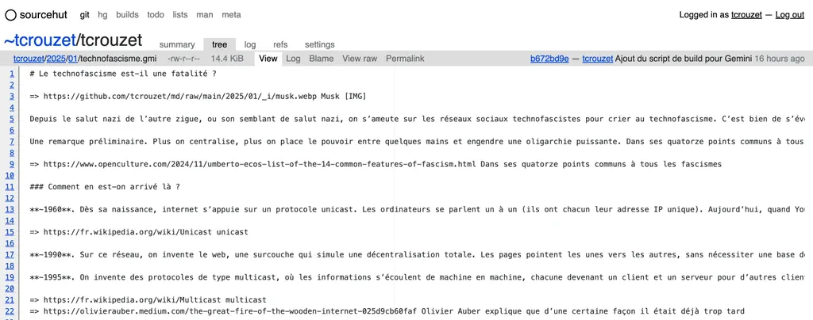
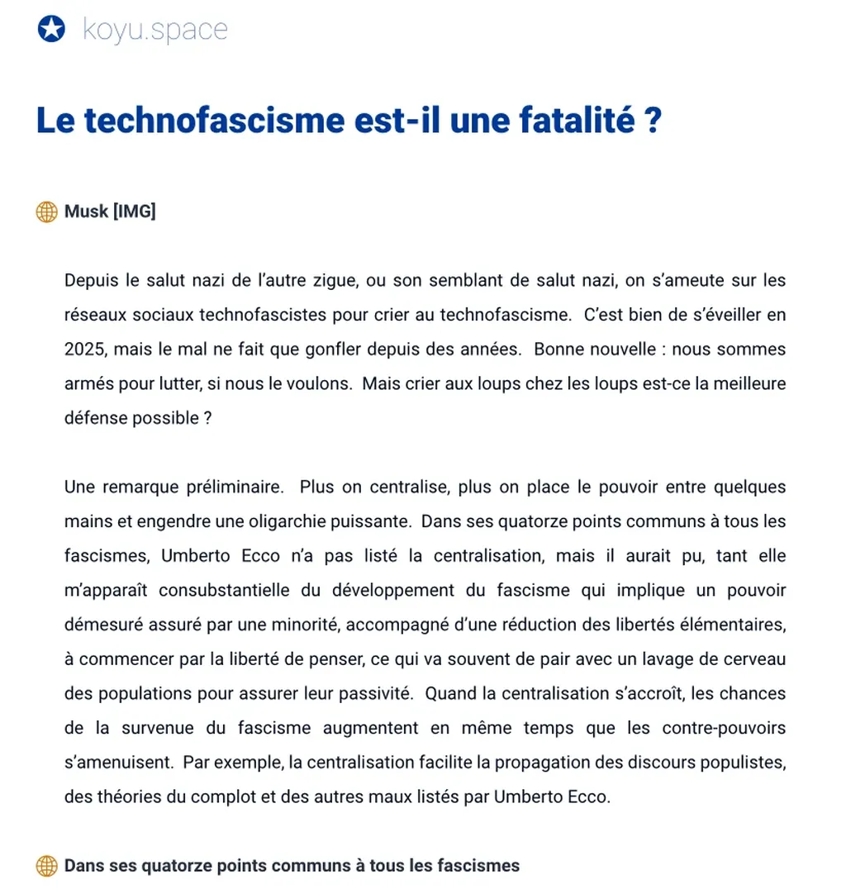

# La low-tech peut-elle coexister avec la high-tech ?

Je vis avec une fan de low-tech qui souffre d’un cancer soigné avec la plus sophistiquée des high-tech. Ça interroge et provoque des débats entre nous.

Voici ce que déclare [Low-tech Lab](https://lowtechlab.org/fr/la-low-tech) : « Nous employons le terme low-tech pour qualifier des objets, des systèmes, des techniques, des services, des savoir-faire, des pratiques, des modes de vie et même des courants de pensée, qui intègrent la technologie selon trois grands principes : utile, accessible, durable. »

### Une approche quasi survivaliste

Dans une situation de crise absolue, nous n’aurons pas d’autre choix que la low-tech. Il est donc important d’avoir à portée de main des solutions low-tech. Il faut les développer, les apprendre, les transmettre pour un jour, éventuellement, ne pas être pris au dépourvu (et je ne parle pas pour moi, à mon échelle existentielle, mais à celle de l’humanité).

Par exemple, nous devons imaginer un internet ultra-light capable de tourner avec des ordinateurs très simples, peu énergivores, nécessitant des connexions à faible débit. Dans cette optique et pour minimiser mon empreinte carbone, j’ai basculé depuis deux ans mon site en statique et n’utilise que des [images webp](https://fr.wikipedia.org/wiki/WebP) qui sont souvent deux fois moins lourdes que des jpeg à qualité équivalente (je passerai à [AVIF](https://fr.wikipedia.org/wiki/AVIF) dès que les navigateurs seront compatibles). Ce n’est pas grand-chose, mais j’y gagne sur d’autres plans.

* L’hébergement me coûte moins cher.
* Mon site est plus rapide qu’avec WordPress.
* J’ai moins de risques d’être piraté.
* Je n’ai plus de serveur à maintenir, de mises à jour à effectuer, de plugin ou de template à bidouiller (bénéfice : moins de charge mentale).
* Je maîtrise mon contenu de la production à la diffusion.

Le passage à une low-tech, relative dans ce cas et plus radicale dans mon expérience avec Gemini (voir plus loin), a donc des avantages. Nous avons souvent tendance à complexifier pour rien. Le web souffre ainsi d’une crise d’obésité (avec les montagnes de scripts derrière la moindre page, le plus souvent pour traquer nos habitudes à des fins publicitaires).

Comme je l’ai expérimenté avec mon site, la low-tech peut être plus robuste, plus puissante, plus optimale. Elle n’implique pas un moins bien, des sacrifices, des renoncements. Au contraire, elle peut ouvrir des possibilités. Par exemple, écrire en Markdown (la low-tech de l’écriture) plutôt qu’en [WYSIWYG](https://fr.wikipedia.org/wiki/What_you_see_is_what_you_get) sous Word (la high-tech de l’écriture) m’a libéré en tant qu’auteur.

### La crise, c’est maintenant

Pour certains, nous sommes déjà au-delà du mur et utiliser la low-tech n’est plus une option. Je suis moins radical, même si je voyage à vélo (mais le vélo est devenu un objet high-tech — il me faudrait rouler avec des vélos en acier sans dérailleur). Et je suis d’autant moins radical qu’Isa a besoin de high-tech pour guérir.

Dans le meilleur des mondes, on développerait les high-tech dans certains domaines vitaux et pas dans d’autres moins critiques. Par exemple, on passerait pas autant de temps à développer des réseaux sociaux qui nous mènent droit à l’[hynocratie](https://legrandcontinent.eu/fr/2025/01/26/trump-musk-lhypnocratie-ou-lempire-des-fantasmes/) alors que nous surchauffons la planète sans trop réagir. Mais comment empêcher certaines technos sinon en les interdisant ?

Développer la high-tech uniquement dans des directions privilégiées ne serait possible que sous le joug d’un dirigisme étatique. Je ne le souhaite pas parce que je ne veux pas vivre dans une dictature. Je compte sur une lente prise de conscience, mais même mes amis les plus écolos prennent l’avion. Ce n’est pas gagné.

La prise de conscience est trop lente au regard de la vitesse des changements climatiques. Elle ne gagnera pas cette course. Je suis arrivé à cette conclusion il y a une quinzaine d’années, ce qui explique pourquoi j’ai écrit de moins en moins de textes « politiques ». Je ne suis pas devenu technosolutionniste, mais le technosolutionnisme s’impose par défaut puisque nous sommes incapables de changer de comportement. Qu’on rejette le technosolutionnisme ou l’adopte, on l’aura. C’est un constat. 

À l’échelle globale, la technologie est un écosystème, avec des interactions difficiles à mesurer entre les champs d’application. L’IA, jugée récréative et inutile par certains, facilite la recherche médicale dans le même temps (et m’aide dans mes bidouilles web que je n’oserais pas sans elle). Des chercheurs ont eu des idées ou rencontré des collaborateurs sur les réseaux sociaux laveurs de cerveaux. Des homosexuels y ont rencontré du soutien dans leur coming out. J’y ai rencontré des copains auteurs et des copains cyclistes. On y trouve même des adeptes de la low-tech.

Je ne crois pas à la possibilité d’une high-tech médicale sans à côté d’autres high-tech apparemment décorrélés. Je ne crois qu’à la responsabilisation de chacun, ce qui passe par l’éducation. Nous devons parler de low-tech, la mettre en œuvre autant que possible, sans en faire une obligation, parce que seules une dictature ou une catastrophe l’imposeront. C’est absurde, mais nous sommes faits ainsi. On ne nous empêchera pas de regarder des vidéos de chat (et moi de vététistes qui descendent des chemins vertigineux).

Alerter finit par ne servir à rien. Et les fumeurs fument, les alcooliques boivent, les drogués se droguent, les parieurs jouent… Rien d’autre à faire qu’expliquer encore et encore, jusqu’à l’épuisement. Expliquer n’est pas alerter, c’est tenter d’éveiller à d’autres possibilités. 

### La low-tech comme décentralisation

**Dès que c’est possible, ne pas s’enfermer dans une solution, garder la maîtrise des outils. C’est le principe de la low-tech. Faire soi-même quand on peut. Chez soi, dans sa communauté, avec ses outils, et non s’en remettre à des tiers industriels qui offrent des solutions clés en mains, prétendument meilleures et plus simples. La low-tech, c’est toujours décentraliser.**

[Quand Jack Dorsey, le fondateur de Twitter et de BlueSky, a quitté BlueSky](https://www.piratewires.com/p/interview-with-jack-dorsey-mike-solana), il a déclaré : « This is not a protocol that's truly decentralized. It’s another app. It's another app that's just kind of following in Twitter's footsteps, but for a different part of the population. » Il n’a pas dit autre chose que « BlueSky n’est pas assez low-tech. », et donc pas assez résilient à toute forme de contrôle et de subversion algorithmique, ce que j’attends d’un réseau social digne de ce nom.

Ma question, la low-tech peut-elle coexister avec la high-tech ?, revient alors à se demander si la décentralisation peut coexister avec la centralisation ? En 2009, quand j’écris sur Twitter [*La quatrième Théorie*](https://tcrouzet.com/books/la-quatrieme-theorie/la-quatrieme-theorie/), j’imagine que ces deux forces s’affrontent, et d’une certaine façon le combat continue, à cela près que les forces centralisées sont plus puissantes que jamais et que la nécessité de les contrebalancer par des forces décentralisées devient de plus en plus urgente. Il y a donc un urgent besoin de low-tech. Une nécessité d’équilibrer décentralisation et centralisation. Des solutions existent, comme [Holochain](https://developer.holochain.org/concepts/1_the_basics/).

### La low-tech numérique en pratique

Pour mieux me préparer à un monde low-tech et rééquilibrer mes usages souvent schizophréniques, loin de toute parano mais par souci d’apprendre, je viens d’imiter [Ploum](https://ploum.net/) et de créer une version [Gemini](https://fr.wikipedia.org/wiki/Gemini_(protocole)) de mon site. Gemini est à la fois un protocole de communication plus simple que HTTP et un langage de description de documents hypertextes, très proche de [Markdown](https://fr.wikipedia.org/wiki/Markdown). Basculer mon site en Gemini ne m’a demandé qu’une centaine de lignes de Python (écrit avec l’aide de [DeepSeek l’IA chinoise OpenSource](https://github.com/deepseek-ai)).

1/ Avec mon [NoMoreWordPress](https://github.com/tcrouzet/NoMoreWordPress) associé à la librairie [md2gemini](https://github.com/makew0rld/md2gemini), j’ai converti mes textes Markdown en Gemini.

2/ J’ai synchronisé ces textes sur un git hébergé par [Sourcehut](https://git.sr.ht/~tcrouzet/tcrouzet/tree).

3/ [Leonie Ain](https://github.com/koyuawsmbrtn) a synchronisé mon git avec son serveur de capsules Gemini, rendant ainsi mon site accessible à l’adresse : [gemini://koyu.space/tcrouzet/](gemini://koyu.space/tcrouzet/). Vous ne le lirez qu’avec un navigateur Gemini. J’utilise [Lagrange](https://github.com/skyjake/lagrange).

Compliqué ? Pas pour qui prétend à la low-tech. Pertinent ? À mes yeux, ce projet est un apprentissage pour ses concepteurs comme ses utilisateurs. C’est vital. Critiquable, oui. Je n’ai pas compris l’intérêt de la mise en forme des textes au format Gemini, à la syntaxe moins riche et moins compacte que Markdown (mon [journal de décembre 2024](https://tcrouzet.com/2025/01/02/decembre-2024/) est 8 % plus lourd en Gemini qu’en Markdown). Ma conclusion : Gemini est moins low-tech que Markdown.

Ploum me dit que tout le monde oppose la même critique à Gemini et que je ne devrais pas tomber dans le même piège, puisque ma [*Mécanique du texte*](https://tcrouzet.com/books/la-mecanique-du-texte/) explique que l’outil d’écriture influence ce que nous écrivons. Je n’ai pas changé d’avis, mais il faudrait savoir si avec Gemini on recherche une solution low-tech ou non.

Pour un texte littéraire, Gemini ou Markdown, c’est du pareil au même. La différence ne me saute aux yeux que lors de l’écriture web : quand on veut introduire des liens, il faut les disposer hors du texte, en annotation en quelque sorte (soit en fin de paragraphe, soit en bas de page). Alors, oui, cette nuance implique de penser autrement le texte, de le structurer autrement, et je perçois cette évolution dans les textes web de Ploum depuis qu’il publie en Gemini (mais on peut s’imposer la même règle en Markdown comme on peut s’imposer la versification).

Low-tech n’implique pas de réduire les possibilités, mais réduire les coûts (la taille des fichiers texte, par exemple). Quand Gemini m’empêche de mettre des textes en italique, et donc de respecter le code typographique, il ne le fait pas au nom de l’optimisation, mais plutôt d’une idéologie esthétique, qui prétendrait que l’italique ne sert à rien. Pourquoi pas, mais on n’a peut-être pas inventé les conventions typographiques pour rien. Elles nous aident à mieux nous comprendre.

Reste que je m’entraîne. Gemini est l’une des meilleures solutions au cas où. Une bonne approche de low-tech numérique pour un ultraconsommateur de high-tech. Je rêve maintenant d’un Gemini sur un principe de Holochain. Expérimenter dans ce domaine élève mon niveau de conscience.

#politique #y2025 #2025-1-29-11h00
