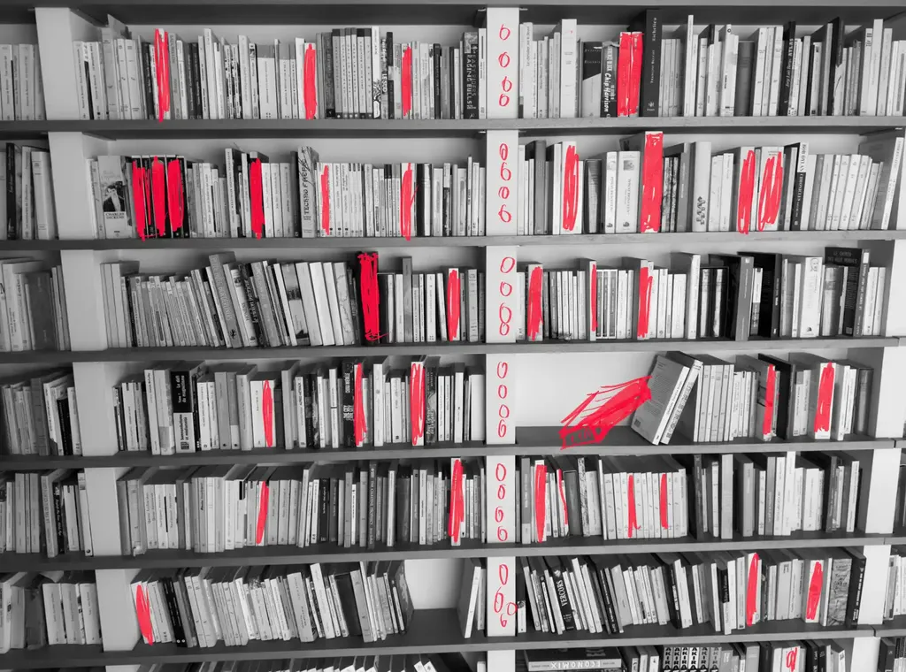
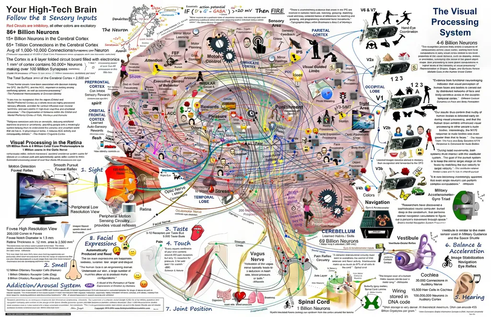
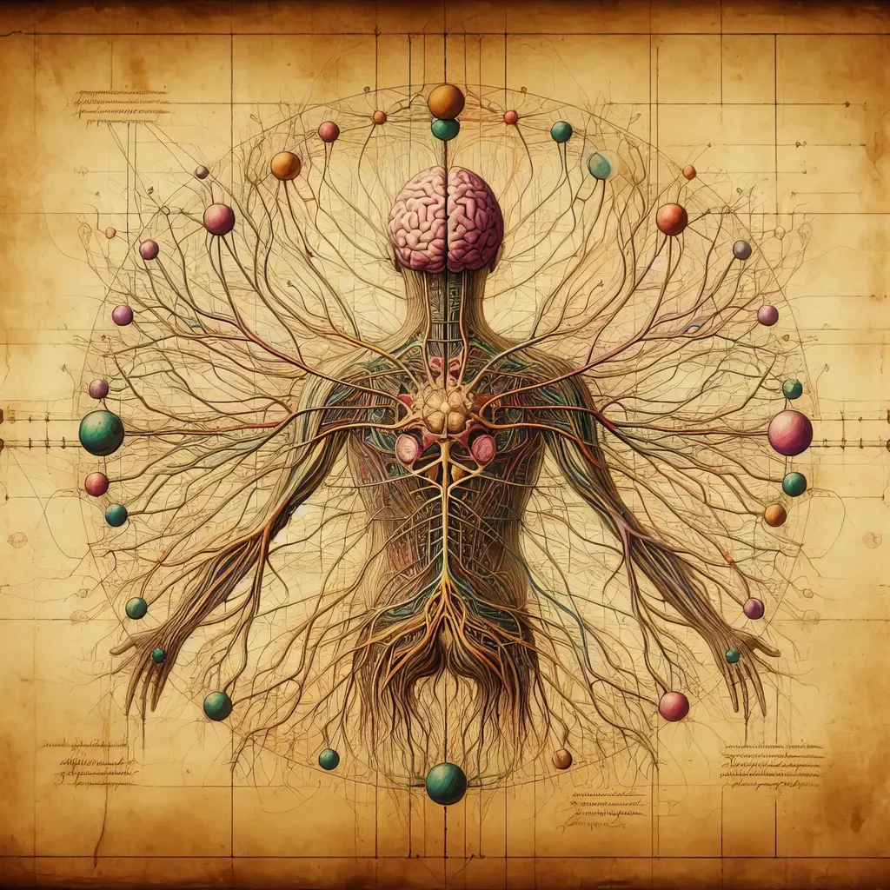

# Le livre total de Mallarmé est-il enfin possible ?

Je commence à comprendre ce que je construis depuis que j’ai commencé à écrire, et qui me devient de plus en plus conscient, décidé, volontaire. Je suis loin d’être le seul à travailler à cette chose, nous sommes nombreux sur le web à y travailler (et vous verrez que c’est sans doute impossible ailleurs). Je vais me servir de mon exemple parce que je suis l’auteur contemporain que je connais le mieux.

Dans *La Préparation du roman*, saison 2, Barthes classe les Livres avec un grand L en trois catégories :

* Le livre total selon Mallarmé (jamais écrit par Mallarmé). Barthes n’a pas réussi à le décrire, sinon en disant qu’il était architectural et prémédité, puis en citant Mallarmé : « Mon œuvre est si bien préparé et hiérarchisé, représentant comme il peut, l’Univers, que je n’aurais su, sans endommager quelqu’une de mes impressions étagées, rien en enlever. »
* Le livre somme, le livre qui contiendrait tout de la vie de l’auteur, de la vie en général, du monde (*La divine Comédie* de Dante, *Les Essais* de Montaigne, *Les Mémoires d’outre-tombe* de Chateaubriand…). J’avais ce projet assez dingue avec *Ératosthène*, écrire le présent et même l’avenir à travers le passé. J’ai échoué après quatorze ans de boulot.
* Le livre pur, un petit texte, qui tient d’un bloc, qui se suffit à lui-même. *Pierre Ménard, auteur du Quichotte* de Borges. *Siddhartha* de Hesse. *La Frontière* de Quignard. Mon rêve. Peut-être que je l’ai approché avec *Épicènes* qui sortira avant l’été. Cette histoire d’amour fusionnel m’a pris par surprise, mais je me trompe sûrement.

Barthes oppose les Livres aux Albums, qui seraient des accumulations, des émiettements, un journal par exemple, ou un blog désormais. Les premiers seraient construits, architecturés, les seconds dépendraient des circonstances. En filigrane, je devine l’opposition entre centralisation, hiérarchisation, et décentralisation, mise en réseau. Le Livre serait centralisé, l’Album réticulaire. Le Livre nous plongerait en lui, en son cœur, l’Album nous en éjecterait. Et s’installe une dialectique entre les deux formes, tension schizophrénique, à laquelle je n’échappe pas, et qui me semble énergisante. Barthes explique que Mallarmé, en voulant écrire son Livre total, n’a réussi qu’à produire un Album, forme dont Nietzsche fait l’éloge : « Il faut émietter l’univers, perdre le respect du tout. »

Et Barthes de conclure : « Bref, vous ne pouvez choisir la forme de l’œuvre (et donc vous ne pouvez écrire) sans décider de votre propre philosophie : l’idée de Livre implique une philosophie moniste (structure, hiérarchie, ratio, science, foi, histoire) ; l’idée d’Album implique une philosophie pluraliste, relativiste, sceptique, taoïste, etc. « À quoi est-ce que je crois ? » Vouloir écrire vous renvoie brutalement d’emblée à cette question ; et cette brutalité est une épreuve qu’il vous faut surmonter ! »

Mais Barthes avoue qu’il cherche une voie médiane, voie dont il a rêvé, mais qu’il n’a pas eu le temps de trouver, à cause de sa mort prématurée. Réunir les inconciliables en quelque sorte, allier Proust et Nietzsche, n’être ni l’un ni l’autre, sans renoncer à l’un et à l’autre.

Au sujet de l’Album, Barthes dit : « La notation est *déjà* de l’écriture mais elle est encore de la *parole*, et c’est un statut très fragile. » Il dit aussi : « Le Journal intime est un genre facile, sauf à en faire après-coup une œuvre retorse. »

Il me semble que Gombrowicz dans son *Journal* nous a montré comment pratiquer autrement la notation, une notation avec repentirs, une notation éditée puis publiée, qui échappe de plus en plus à la parole (et donc devient une œuvre retorse — œuvre achevée bien avant que Barthes ne parle du roman et c’est comme s’il était passé à côté de Gombrowicz — aucune relation entre eux découverte par Perplexity). Œuvre retorse, c’est ce que nous faisons sur nos sites, par opposition à ce qui se fait sur les réseaux sociaux, où l’écrit n’a jamais été autant parole.

Mon [*Carnet*](https://tcrouzet.com/tag/carnet-de-route/), que j’ai très tôt imaginé comme l’histoire de la pensée d’un homme, cet homme étant moi-même, possède une structure en ce sens que c’est un projet global, au même titre qu’un Livre. Je m’autorise à y dire certaines choses et pas d’autres qui ne seraient pas en accord avec le projet. Ce n’est pas une chronologie quotidienne des évènements de ma vie, mais un texte sur lequel je reviens, que je reprends, auquel je coupe et ajoute dans toute son étendue. Je le fais parce que je dispose des outils techniques pour le faire, ce que Barthes ne pouvait encore imaginer, encore moins Mallarmé.

Il est essentiel que ce corpus ne soit pas édité, figé dans le papier du Livre, mais qu’il reste vivant, même s’il se donne déjà à lire en ligne. Cette publication n’entrave pas mon travail de repentir ou d’ajout. Il en va de même avec chacun des textes que j’ai publiés sur mon site.

Plutôt que d’un site, j’ai envie de parler d’un dépôt, au sens GitHub, un endroit où je dépose des textes pour les rendre publics, et où se construit l’historique de leurs modifications. Les repentirs et les retours en arrière racontent à eux seuls une histoire, inaccessible à la perspicacité humaine mais pas à celle des machines qui pourront la raconter. L’œuvre dépôt gagne une profondeur temporelle. Un livre était un objet à une dimension là où le dépôt devient 3D : beaucoup de livres et d’articles étalés sur une table, chacun au sommet de la pile de leurs différentes versions et métamorphoses, chacun relié aux autres. Le site n’est qu’une mise en forme provisoire du dépôt, une impression en quelque sorte où on a choisi la couleur, la typographie, la mise en page.

Toute cette masse textuelle reste malléable et c’est une différence majeure par rapport à ce qui était possible jusque là dans l’histoire de la littérature. Barthes parle d’une règle absolue de l’œuvre en train de se faire : la clandestinité. Mais ça n’a plus de sens. L’œuvre a acquis un statut organique, au-delà même de la vie de l’auteur. Je crois que tous ceux qui publient en ligne, du moins sur un « lieu maison », un « lieu racine » comprennent ce dont je parle, et le ressentent. Mes amis, « simples » auteurs de livres, passent à côté de cette chose d’aujourd’hui, de cette ivresse du texte vivant, qui s’apparente à une sculpture sans cesse remodelée.

Pour décrire ces textes interconnectés, une image s’impose à moi, répugnante, excessive, débordante. Un centipède. Le corps de cette bestiole serait mon carnet, chaque patte un livre ou un article.

Puis j’ai pensé à la moelle épinière, connectée aux organes et au cerveau. Je suis tombé sur une [image](https://www.thehighestofthemountains.com/brainmaps.php), qui pourrait décrire l’œuvre totale.

Ce n’était toutefois pas encore ça. J’ai interrogé les IA.

Le résultat est dégoûtant à souhait, mais c’est ce que j’ai en tête. Nous construisons des formes monstrueuses, des œuvres monstrueuses, et c’est peut-être d’elles dont rêvait Mallarmé : il imaginait lire tous les soirs son roman total dans un théâtre, mais en le réorganisant, car ses parties pourraient être permutées à l’infini. Le livre total serait la totalité d’un corpus interconnecté.

Pour Mallarmé, toutes les parties devaient être indispensables, sinon l’édifice se serait écroulé. Un fantasme. *La Divine Comédie* sans un de ses vers reste *La Divine Comédie*. La capacité pour une œuvre de perdre certains de ses bouts, ou qu’ils soient ignorés par les lecteurs, me semble une qualité indispensable pour résister à l’entropie, qui inévitablement émiette. Barthes le reconnaît.

Dans mon cas, le *Carnet* est l’axe duquel partent des textes, plus ou moins longs, plus ou moins structurés. Je n’ai même plus envie de les appeler livres. Cette chose est une base de données [holochain](https://www.holochain.org/), tout étant connecté avec tout. Il y a un axe, mais pas de centre. Et je n’en veux pas. L’illustration reste trop anthropocentrique. Cette chose est un code duquel extraire des contenus, quitte à les réorganiser, les reprendre, les restructurer pour gérer des variantes, et ce sera le job des IA.

Nous écrivons des œuvres matricielles (ou du moins nous en avons la possibilité, et ça me donne le vertige, si bien que je me sens à l’étroit dès que j’écris un livre — et j’ai tendance à en déborder, à y faire pousser des excroissances qui ne devraient pas y être, ce qui répugne souvent au monde de l’édition et peut-être même aux lecteurs).

Barthes : « Il y a toujours cette mécanique de la déception dans la parole (parce que je ne peux revenir en arrière). » Plus maintenant. La notation numérique autorise les retours en arrière. Elle ne fige rien. J’ai parlé en un temps du [troisième état de l’information](https://tcrouzet.com/2009/09/10/le-flux-troisieme-etat-de-linformation/), le liquide, alors que Barthes n’en connaissait encore que deux : le solide des livres ou le gazeux de la parole.

J’en éprouve parfois de la douleur. J’ai du mal à me reconnaître comme un auteur liquide et je rêve encore parfois d’être un auteur solide. Je suis nostalgique de ce que je ne peux plus être parce que j’ai choisi d’écrire des textes liquides. Même mes livres deviennent liquides.

Ce texte a commencé comme une note dans mon *Carnet* avant que je l’en arrache, pour illustrer ce dont je viens de parler, et je pourrais l’y remettre, ou une machine pourra l’y remettre, ou quelqu’un qui voudrait illustrer tel ou tel point d’une histoire. Tout se floute, s’entrelace, s’embrasse. Je suis habité par d’anciens rêves. Ils me disent que j’échoue, alors que, peut-être, je travaille, et que nous travaillons, à quelque chose qu’ils ne peuvent comprendre. J’aimerais me ranger dans une case, y être confortable, et elle n’existe pas encore, mais nous l’inventons, après Mallarmé, après Barthes, après le Livre, après l’Album.

#netlitterature #y2025 #2025-2-18-18h00
