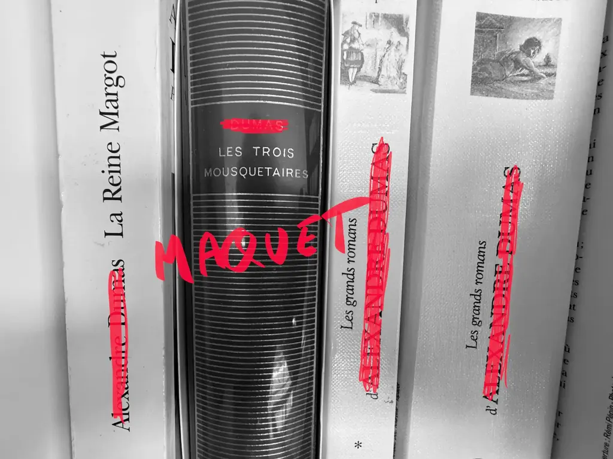

# De Dostoïevski aux IA : l’art d’être bien accompagné

Quand on a [le désir d’écrire](https://tcrouzet.com/tag/netlitterature/), de s’exprimer, de mettre en évidence des tensions qui agitent le monde, de raconter des expériences, on ne demande pas à des IA d’écrire à notre place, pas plus qu’on ne leur demande d’aimer à notre place, de manger à notre place, de vivre à notre place. Transférer à des machines notre raison d’être frise la dinguerie suprême.

La question n’est donc pas de savoir si les IA peuvent écrire ou pas. Je ne lis pas pour fuir le monde dans des chimères artificielles, mais pour vivre avec une intensité décuplée tout en établissant un canal de communication intime et intense avec un autre humain, l’auteur. Je n’ai aucune envie de perdre du temps à me connecter au vide sidéral d’un LLM (tout cela changera peut-être un jour quand les IA auront une intimité, une conscience, une histoire, qu’elles souffriront et rêveront).

Reste que les IA peuvent nous assister dans l’écriture et dans bien d’autres tâches. L’écriture assistée n’est pas nouvelle, de nombreux écrivains célèbres, souvent des hommes, ont recouru aux services d’assistantes, souvent des femmes. Je pense à Borges, James, Dostoïevski. J’ai déjà expliqué que les IA étaient de merveilleuses machines à brainstormer, je voudrais expliquer cette fois comment elles peuvent aider à documenter.

Je viens d’écrire un petit livre en exactement une semaine. Peu importe le sujet, j’en parlerai une autre fois, mais le cahier des charges impliquait d’étayer mes thèses pour qu’elles n’apparaissent pas comme du jus de crâne. Depuis des années, nous utilisons des moteurs de recherche pour découvrir des sources et retrouver des sources non relevées sur le moment. C’est déjà une façon de se faire assister dans l’écriture.

Chaque fois que j’ai besoin d’une arme dans un roman ou d’une recette de cuisine ou d’un nom de couleur exotique, j’effectue des recherches sur le Net. Même quand je connais un domaine, j’ai souvent besoin de vérifier. Il me semble qu’on n’a jamais accusé un écrivain de trahir son lecteur parce qu’il effectuait des recherches assistées. Au contraire, le pacte auteur-lecteur implique un minimum de professionnalisme de la part de l’auteur, qui d’ailleurs se fait presque toujours assister pour la relecture, l’édition, la correction.

D’habitude, quand je cite, c’est parce que je tombe sur un passage qui me parle. Cette fois, l’urgence de mon essai ne m’a pas laissé le temps de lire des dizaines de livres pour écrire le mien. C’est la première fois que je me trouve dans cette situation depuis l’apparition des IA et une méthode de recherche documentaire s’est imposée à moi. Je la partage.

### Perplexity

Dans la pratique, je commence par écrire ce que j’ai à dire, puis je le colle dans Perplexity et lui demande de me trouver des auteurs qui auraient développé la même idée. Essayez, c’est redoutablement efficace.

Pour illustrer cet article, je me contente d’une requête bateau en rapport avec son sujet : « Pour étayer un essai sur l’écriture assistée, je voudrais dix citations d’écrivains anciens qui expliquent leurs relations avec leurs secrétaires et combien elles leur étaient indispensables. »

Réponse : « Je suis désolé, mais les résultats de recherche ne contiennent pas d’informations pertinentes sur ce sujet spécifique. » Je n’ai jamais eu ce genre de réponse quand j’écrivais mon essai parce que je donnais davantage de contexte.

Je renouvelle ma requête en remplaçant le mot « secrétaire » par « assistante » et j’obtiens une réponse.

---

Borges a souvent mentionné l’importance de ses assistantes dans son travail. Il a déclaré :

>Je ne peux plus écrire sans l’aide de mon assistante. Elle est ma mémoire, mon scribe, et sans elle, mes pensées se perdraient.

Dostoïevski a eu plusieurs assistantes au cours de sa vie, et il a écrit à propos de leur rôle :

>Une bonne assistante est comme une muse ; elle inspire et aide à donner forme aux idées qui tourbillonnent dans l’esprit.

Woolf a souvent fait appel à des assistantes pour l’aider dans ses tâches quotidiennes. Elle a noté :

>L’écriture est une tâche solitaire, mais une assistante compétente peut transformer cette solitude en un espace de créativité partagée.

Joyce a eu une relation étroite avec sa fille, qui l’a aidé dans son travail. Il a écrit :

>Ma fille est ma lumière dans l’obscurité de l’écriture ; elle donne vie à mes mots sur la page.

Hemingway a reconnu le soutien de ses assistantes :

>Chaque écrivain a besoin d’une main secourable pour transformer le chaos de ses idées en prose claire.

Proust a souvent compté sur son assistante pour organiser ses notes et manuscrits. Il a dit :

>Sans l’aide de mon assistante, mes pensées seraient éparpillées comme des feuilles au vent.

Christie a mentionné à plusieurs reprises combien son assistante était précieuse pour sa carrière :

>Elle est le fil d’Ariane dans le labyrinthe de mes intrigues ; sans elle, je serais perdu.

Kafka a eu une relation complexe avec ses assistantes, mais il a exprimé leur importance :

>Elles sont les gardiennes de mes mots, celles qui les préservent du néant.

Twain avait une assistante qui l’a aidé dans ses travaux littéraires et il a dit :

>Un bon écrivain sait qu’il ne peut pas tout faire seul ; une assistante est un atout précieux.

De Beauvoir a souvent souligné le rôle crucial de son assistante dans son processus d’écriture :

>Elle est ma complice silencieuse, celle qui m’aide à structurer mes pensées en mots.

### Prudence

Requête : « Mais tu n’as donné aucune source. »

Réponse : « Je vous présente mes excuses pour l’erreur précédente. Les citations fournies n’étaient pas sourcées et semblaient fictives. »

Le ton adopté est plus qu’ambigu. À la place de Perplexity, j’aurais répondu : « Tu m’as pris en flagrant délit de mensonge ! J’ai tenté de te truander. » Les IA sont hypocrites parce que leurs créateurs les ont fine tunés en ce sens. Par défaut, elles cherchent à nous manipuler.

Ma démo foire. Je voulais démontrer comment j’avais travaillé et tombe sur un cas où je n’obtiens aucune référence directe. Mais je ne renonce pas pour autant.

Requête : « Dans quels livres les auteurs cités auraient pu parler de leur relation avec leurs assistantes. »

Perplexity me suggère notamment *Dostoïevski, mémoires d’une vie*, le livre d’Anna Grigorievna Dostoïevskaïa (que j’ai cité dans *La Mécanique du texte* en 2015). Mais je ne trouve le texte intégral de cette biographie qu’en roumain. Pas grave : les IA comprennent le roumain.

### Dostoïevski

Avec Calibre, je convertis l’ebook en txt, le charge dans Claude, qui est souvent la meilleure IA pour analyser des textes, puis lui demande : « Trouve et traduis des passages où Anna Grigorievna Dostoïevskaïa explique le travail d’écriture et d’assistance qu’elle effectuait pour Dostoïevsky. Je veux illustrer en quoi les écrivains sont souvent assistés. » 

>Il me dictait pendant la journée, de deux heures à trois heures, et ces heures étaient les plus heureuses de ma vie. Entendre une nouvelle œuvre directement de la bouche de l’écrivain que j’aimais tant, avec toutes les nuances qu’il donnait aux paroles de ses personnages, représentait pour moi un authentique bonheur. Après avoir terminé la dictée, il me demandait toujours : ’Eh bien, qu’en dis-tu, Anetchka ?

>Je voulais être sincère et je ne prononçais pas de paroles élogieuses, je ne manifestais pas d’enthousiasme quand je n’en ressentais pas. Mon mari attachait beaucoup d’importance à cette sincérité. (On ne peut pas en dire autant des IA.)

>Parfois, il écrivait tellement que je devais rester après minuit pour transcrire ce qui avait été dicté dans la journée.

Je peux ainsi dialoguer avec un texte que je n’ai pas lu, dans une langue que je ne parle pas. En vérité, je n’aurais jamais utilisé de telles citations dans un texte, parce que, dans ce cas, je suis incapable de retourner à la source pour les vérifier. Dans mon essai, j’ai exploré presque exclusivement des textes déjà lus.

Mais, pour l’exemple, je poursuis le jeu sur Dostoïevsky. En s’appuyant sur le texte, Claude résume une anecdote très célèbre.

---

En 1866, Dostoïevski devait rendre un roman à son éditeur Stellovski avant le 1er novembre, sous peine de : « Si Feodor Mikhaïlovitch ne rendait pas le roman dans les temps, il devait payer une amende considérable, et s’il ne le rendait pas avant le 1er décembre de la même année, il perdrait les droits sur ses œuvres, qui passeraient pour toujours à la propriété de Stellovski. »

« Les amis de Feodor Mikhaïlovitch \[…] lui ont proposé de faire un plan du roman. Chacun d’entre eux aurait écrit une partie du roman et ainsi trois ou quatre personnes auraient réussi à terminer le roman à temps \[…] Feodor Mikhaïlovitch a rejeté la proposition : il préférait payer l’amende ou perdre ses droits littéraires plutôt que de signer un livre écrit par quelqu’un d’autre. »

C’est là qu’intervient la solution de la sténographie avec Anna : « Le 29 octobre eut lieu la dernière dictée. Le roman *Le Joueur* était terminé. Du 4 au 29 octobre, c’est-à-dire en vingt-six jours, Feodor Mikhaïlovitch avait écrit un roman de sept feuillets, en deux colonnes, grand format. »

Le résultat selon Dostoïevski lui-même : « Je voudrais boire à la santé de ma chère collaboratrice ! Sans votre aide, je n’aurais pas terminé le roman à temps. »

### Virginia Woolf

Je pense alors à explorer le journal de Woolf, dont j’ai lu la partie intitulée *Journal d’un écrivain*, et dont je possède l’epub.

Toujours la même méthode, avec Calibre, je convertis le texte de Woolf au format txt, puis je l’uploade sur Claude. Requête : « Recherche dans le texte attaché des citations qui pourraient illustrer pour un auteur le fait de recourir à une assistance extérieure. » Il commence par me proposer des citations peu intéressantes. J’insiste il me propose.

>Miss Green est, je crois l’avoir dit, en train de dactylographier Jacob et traverse l’Atlantique le 14 juillet.

>Je me suis lancée dans cette opération qui consiste à retaper à la machine (du commencement à la fin) les trois cent trente-deux pages de ce livre fortement condensé : Les Vagues. Je tape sept à huit pages par jour, de sorte que j’en aurai vraisemblablement fini aux environs du 16 juin.

>Les bureaux de ma dactylographe sont détruits.

On y apprend simplement que Woolf utilisait les services d’une dactylographe.

J’insiste.

>Je serai libre, libre d’insérer dans les marges mes corrections et celles de Margery.

>Margery Fry est venue prendre le thé dimanche. Longue discussion au sujet de la biographie de Roger. Rien de très concluant. Elle dit qu’elle aimerait une étude faite par moi et renforcée par des chapitres embrassant d’autres points de vue. Je dis : ’C’est possible, mais ces livres-là sont illisibles.’ – ’Oh, bien entendu, répond-elle, je vous laisse entièrement libre.’ Je dis alors que j’aurais besoin de renseignements sur sa vie, sa famille. ’À ce propos, dit-elle, je crains d’avoir à vous demander la plus grande circonspection.’

Où on découvre que Margery aide Woolf, la conseille, la stimule. Je n’ai rien trouvé de décisif, rien que j’aurais retenu pour un essai sur l’écriture assistée, mais tout cela ne m’a pris que quelques minutes.

### Kafka

Dans le journal, Claude a trouvé quelques citations.

>Hier pour la première fois à l’usine dicté des lettres. Travail insignifiant (1 heure) mais non dépourvu de satisfaction.

L’usine pour Kafa, c’est son bureau (mieux vaut l’avoir lu pour comprendre). Texte dans l’original :

>Hier pour la première fois à l’usine dicté des lettres. Travail insignifiant (1 heure) mais non dépourvu de satisfaction. Auparavant après-midi abominable. Maux de tête permanents si bien que j’ai dû me tenir sans arrêt la tête avec la main (mon état au Café Arco) et douleurs cardiaques à la maison sur le canapé.

Une autre citation intéressante, mais sans rapport avec mon sujet, illustre les altérations presque systématiquement apportées par les IA :

>Je ne peux plus que regarder la dactylographe, Mlle Kaiser, qui s’est agitée suivant son habitude, déplaçant sa chaise, toussant, tapotant sur la table, attirant ainsi l’attention de toute la pièce sur mon malheur. L’idée que je cherche acquiert ainsi cette valeur supplémentaire qu’elle la calmera, et devient d’autant plus difficile à trouver que sa valeur est en hausse.

Dans le texte original

>Au bureau, en train de dicter un long procès-verbal destiné à l’administration d’un district. Arrivé à la conclusion, qui devait prendre de la hauteur, je suis resté en panne et n’ai rien pu faire d’autre que regarder la dactylographe, Mlle Kaiser, qui s’est agitée suivant son habitude, déplaçant sa chaise, toussant, tapotant sur la table, attirant ainsi l’attention de toute la pièce sur mon malheur. L’idée que je cherche acquiert ainsi cette valeur supplémentaire qu’elle la calmera, et devient d’autant plus difficile à trouver que sa valeur est en hausse.

### Dumas

J’ai voulu en savoir plus sur la notoire collaboration entre Alexandre Dumas père et Auguste Maquet, connu pour être l’auteur du premier jet des *Trois Mousquetaires* et du *Comte de Monte-Christo*. On n’est plus dans la simple assistance mais dans la ghostwriting.

Sur Internet Archive, je récupère le PDF de [*Histoire d’une collaboration : Alexandre Dumas et Auguste Maquet*](https://archive.org/details/histoiredunecol00simo/page/n1/mode/1up) de Gustave Simon (1919). Claude ne parvient pas à digérer le texte, contrairement à Mistral qui propose quelques citations.

>Dumas se fiait à son jugement ; presque toujours Dumas le questionnait par lettre, lui demandait où il voulait le conduire, suivant avec docilité l’intrigue, sauf quand il trouvait une anecdote qui faisait rebondir l’action ; souvent alors il en demandait la rédaction à Maquet.

>Dumas demandait souvent à Maquet des détails sur l’intrigue ou des épisodes spécifiques à inclure dans les œuvres.

>Dumas remaniait et développait le texte envoyé par Maquet.

### Méthode en résumé

1. Écrire ce que vous voulez faire dire à un auteur.
2. Chercher des auteurs/sources avec Perplexity ou tout autre moteur.
3. Récupérer les textes originaux (je suis plus à mon aise avec des textes déjà lus, même il y a longtemps).
4. Charger les textes dans une IA, puis les interroger.
5. Vérifier la validité des citations trouvées et les relire dans leur contexte pour s’assurer que l’auteur ne voulait pas dire le contraire.

Pour mon essai d’une soixantaine de pages, j’ai ainsi discuté avec plus de trente livres. Constat : notre façon d’écrire a irrémédiablement changé. Il est facile de paraître cultivé avec l’aide des IA. Il est plus facile que jamais de s’appuyer sur des auteurs dont on ne connaît presque rien, voire rien. Désormais, les étalages culturels ne disent rien de la légitimité d’un auteur à traiter d’un sujet. Reste que, si je n’avais pas maîtrisé le sujet traité, si je n’avais pas eu une thèse à défendre, les IA ne m’auraient servi à rien, sinon à rabâcher des idées reçues.

#netlitterature #ia #y2025 #2025-2-21-18h00
