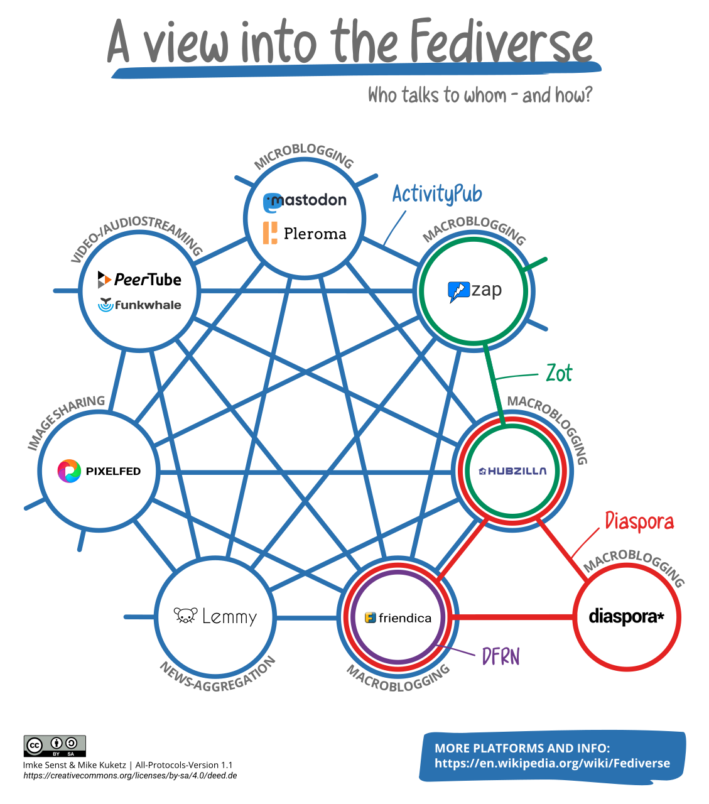

# Inquiétude : l’édition francophone trop peu sur Mastodon

Face à [la montée du technofascisme](https://tcrouzet.com/2025/01/24/technofascisme/), nous sommes en 1940, et tout le monde continue sa vie comme si de rien n’était ou presque. Ça me fiche la trouille. Surtout quand je vois la plupart des auteurs, éditeurs, libraires, bibliothécaires loin de prendre leur destin en main.

**Pour s’opposer au technofascisme qui ne cesse de gagner du terrain (et qui est, de facto, l’ennemi de la chaîne du livre), on ne peut se contenter de s’en offusquer sur les plateformes technofascistes comme Facebook, X, TikTok et consorts.** Durant la Seconde Guerre mondiale, beaucoup d’intellectuels qui n’étaient ni collabos ni pro nazis ont continué d’écrire dans les titres collabos comme *Le Matin* ou à publier des livres en toute innocence.

[Exemple](https://books.openedition.org/pul/40992) : « Grâce à des révisions soignées et au placement judicieux de ses textes dans des périodiques associés à la Résistance, Gide crée l’impression que sa pensée a suivi une trajectoire sans détour, depuis l’inévitable **défaitisme** jusqu’à un patriotisme convenable. Cependant, la comparaison des écrits publiés pendant et après la guerre avec le _Journal_ de Gide révèle l’ambivalence politique persistante de l’auteur. »

Un temps, Gide a continué sa vie comme si de rien n’était durant l’occupation, alors que beaucoup d’auteurs basculaient dans la résistance. J’évoque Gide parce qu’il était le grand écrivain de la période et parce que ça me chagrine de savoir qu’un auteur que j’ai beaucoup aimé n’a pas toujours été lucide.

Nous n’en sommes pas encore au même point. Mais la montée du technofascisme est [de mieux en mieux documentée](https://www.newyorker.com/culture/infinite-scroll/techno-fascism-comes-to-america-elon-musk) (je viens d’écrire un petit essai sur le sujet). Quand nous publions sur les réseaux sociaux technofascistes, nous alimentons leur machinerie, en plus de subir leur idéologie.

Juste un exemple : en amont des élections législatives allemandes du 23 février, l’[ONG Global Witness](https://www.linkedin.com/posts/global-witness_globalwitnessinvestigationgermanelections2025-activity-7298642978800058368-cXjf/) a découvert que 64 % des contenus politiques recommandés par l’algorithme de X et 78 % de ceux de TikTok étaient liés à l’extrême droite. Les technofascistes usent de leurs outils pour imposer leurs vues. Quand nous publions chez eux, c’est un peu comme si durant la Seconde Guerre mondiale nous étions auteurs du *Matin*.

Si fuir les réseaux sociaux technofascistes comme Facebook, X, YouTube, TikTok… ne me paraît pas une nécessité absolue tant qu’il reste possible d’y poster des liens vers les sites indépendants, il me paraît en revanche vital d’avoir un pied du côté de la résistance, c’est-à-dire des services décentralisés, non unilatéralement supervisés par des technofascistes. On les retrouve dans le [Fediverse](https://fr.wikipedia.org/wiki/Fediverse). Toute autre attitude équivaut à du défaitisme.

J’ai pour ma part décidé de passer l’essentiel de mon temps social en ligne sur [Mastodon](https://mamot.fr/@tcrouzet). J’y ai ouvert un compte dès 2017, mais je n’y suis réellement actif que depuis quelques semaines, parce que la situation politique me paraît plus que préoccupante depuis le signe nazi de Musk, renouvelé par [Steve Bannon](https://www.nbcnews.com/politics/politics-news/french-far-right-jordan-bardella-steve-bannon-nazi-ideology-gesture-rcna193195).

Pourquoi Mastodon et pas BlueSky, parce que BlueSky n’est qu’une énième itération de Twitter, tout aussi centralisé. [Quand Jack Dorsey, le fondateur de Twitter et de BlueSky, a quitté BlueSky](https://www.piratewires.com/p/interview-with-jack-dorsey-mike-solana), il a déclaré : « Ce n’est pas un protocole véritablement décentralisé. C’est juste une autre application. C’est une autre application qui suit simplement les traces de Twitter, mais pour une partie différente de la population. » En résumé : BlueSky n’est pas la solution.

Ouvrez un compte Mastodon, publiez vos messages là en priorité, délaissez les officines centralisées dans lesquelles vous ne maîtrisez rien.

Pour faciliter votre migration, voici quelques liens.

1. [Choisir une instance Mastodon](https://joinmastodon.org/fr/servers) (c’est un peu comme choisir une adresse email). Mastodon étant décentralisé, il existe des dizaines d’instances qui communiquent entre elles. Il est toujours possible de migrer d’une instance à une autre en emportant ses contacts. Les différentes instances proposent des règles d’usage qui leur sont propres. Certaines limitent les messages à 500 caractères d’autres à 5 000.
2. Une fois une instance choisie et un compte créé, suivez d’autres comptes. Vous pouvez d’un clic suivre tous les membres d’un pack. [Il en existe des dizaines.](https://fedidevs.com/starter-packs/) J’ai créé [le pack de l’édition francophone](https://fedidevs.com/s/NDQ2/), et c’est à cette occasion que j’ai découvert seulement une centaine de comptes liés au monde de l’édition. Même si je n’ai pas été exhaustif, il y a un grand vide, alors que l’édition devrait être vent debout contre le technofascisme. Autres groupes : [Poètes](https://fedidevs.com/s/MzYz/), [Littérature jeunesse](https://fedidevs.com/s/MzU5/), [Écrivain·e·s de l’imaginaire](https://fedidevs.com/s/NDU/)…
3. Vous pouvez également suivre des listes, c’est-à-dire voir tous les messages échangés par les membres de la liste même si vous n’êtes pas abonné à chacun d’eux. J’ai créé [la liste de l’édition francophone](https://lite.framacalc.org/zwzwtidmiv-ad33) (enregistrez le tableau au format CSV, puis importez-le dans votre instance, la liste Edition sera automatiquement créée). Pour faciliter la gestion des listes, vous pouvez utiliser [Mastodon List Manager](https://www.mastodonlistmanager.org/).
4. Pour aller plus loin, il existe beaucoup de tutos. Voici celui de [Grégory Gutierez](https://gregorygutierez.com/doku.php/linux/lesmastotutos).

Si vous trouvez tout ça encore trop compliqué, je vous renvoie à mon article sur [le prix de la liberté numérique](https://tcrouzet.com/2025/02/09/le-prix-de-la-liberte/). Bougez ! N’attendez pas qu’il soit trop tard. Mieux vaut se préparer au pire et qu’il ne survienne pas que ne rien faire et qu’il nous tombe dessus.

*PS : je complète le pack et la liste de l’édition francophone au fur et à mesure qu’on me signale de nouveaux comptes.*

#politique #y2025 #2025-2-27-18h00
