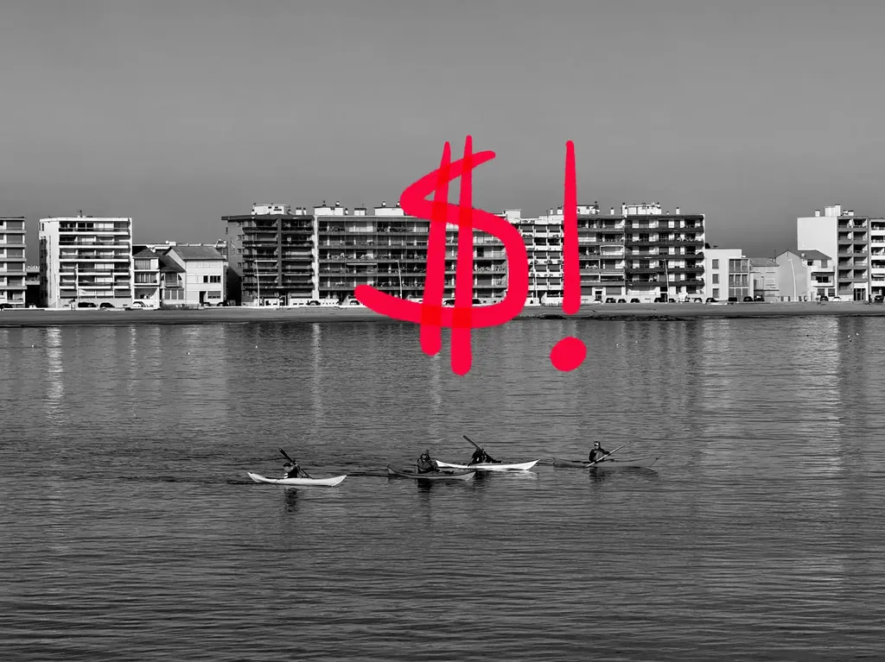
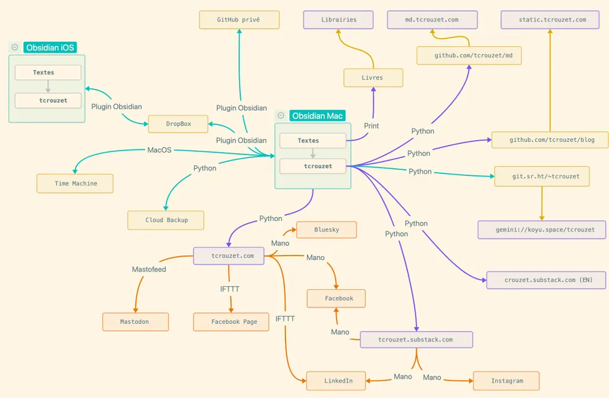
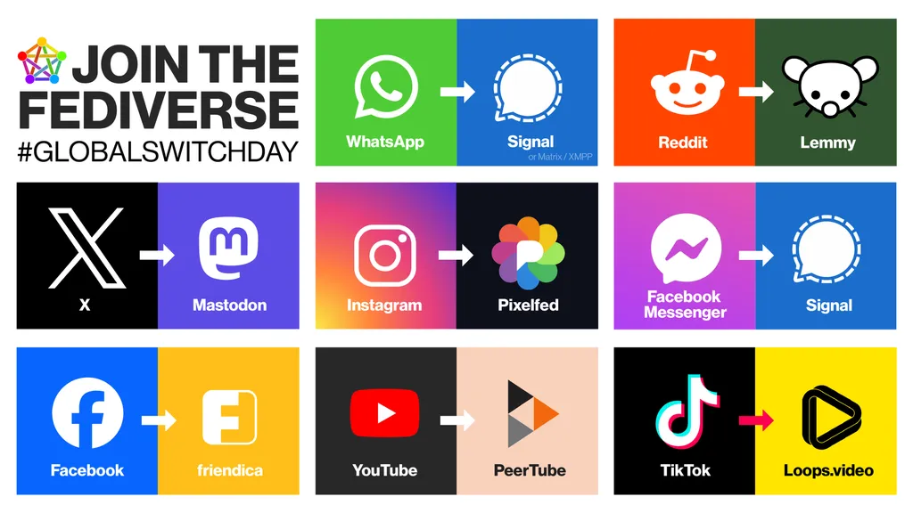

# The price of (digital) freedom

Small clash with my younger son: he wants a Spotify subscription on the grounds that it's practical and simple. I spend the fifteen-minute drive to high school explaining to him that simplicity sometimes, and even often in the digital world, hides a loss of freedom (starting with that of the artists that Spotify exploits).

Why do we publish our comments on social networks rather than on our personal websites? For convenience and in the hope of finding our "friends." We end up swallowing a mountain of unwanted content placed before our eyes by algorithms to keep us on the platform and consume advertisements.

This unwanted content alters our imagination, our philosophy, our conception of the world, especially since it supposedly comes from our "friends." An algorithmic social network is not social at all: it's a machine designed to imprison us. One can only venture there fully aware of the dangers involved.

Spotify has no interest in making us listen to an obscure, difficult musical genre that we probably won't like (just as Amazon has no interest in pushing us toward challenging books). Algorithms are cautious: they expand our cultural/political/technical field without taking risks (they're only interested in our consumption space).

When I was my son's age, I would randomly dig through record store bins and sometimes come out with Rock, Jazz, Classical music. Spotify never insistently suggests dodecaphonic music to a punk rock fan. That's what the bins at record stores and bookshops I frequented used to do. Quantum leaps would sometimes occur.

But nothing has changed as long as we escape the technofascist algorithms](https://static.tcrouzet.com/2025/01/24/technofascisme/), implemented by entrepreneurs with little ethics. This liberation comes at a price: sometimes giving up some conveniences. I'd like to illustrate how I try to manage this personally. Rather than publishing posts on Facebook like many of my author friends do (simple solution — too simple when claiming to be politically aware), I adopt a much less direct strategy (or let's say much more tortuous). A mindmap to summarize.

All this might seem complicated to you, even crazy, yet it's my way of decentralizing myself, of fighting against the growing centralization of the web. I fight with my adversaries' weapons on all fronts.

### Is it effective?

I'm not sure. An example. I announced [my article on technofascism](https://static.tcrouzet.com/2025/01/24/technofascisme/) on three platforms, posting two announcements on each:

* [On Facebook](https://www.facebook.com/tcrouzet) where I have nearly 5,000 "friends," I received [19 likes and 4 shares](https://www.facebook.com/tcrouzet/posts/pfbid02MhwaAxgLPbh282Ldk5xfdnwLBshaQcczvy9936jLTNbkajpXLxUgwuJksiuv7rcWl) (0.5% yield).
* [On Bluesky](https://bsky.app/profile/crouzet.bsky.social) where I have just over 200 "friends," I received [9 likes and 4 shares](https://bsky.app/profile/crouzet.bsky.social/post/3lgiobvnevk2i) (6.5% yield).
* [On Mastodon](https://mamot.fr/@tcrouzet) where I have a little over 600 "friends," I received [80 likes and 90 shares](https://mamot.fr/deck/@tcrouzet/113888759221893550) (28% yield).

Not hard to understand that something's wrong on Facebook. My "friends" there no longer belong to me. They're not my audience, but Facebook's, which does what it wants with them. My article was only seen by close contacts interested in the subject matter. At the same time, I published a more consensual text about cycling that was widely shared and commented on. Facebook is a social network with variable geometry.

If I had published my cycling article in its entirety rather than just announcing it, it would have been even more widely read: readers would have stayed in contact with Facebook and its click machine.

The performance of my article on Mastodon can be explained by a political alignment between Mastodon users and my subject. But this community effect alone doesn't explain the gap in the number of reactions. The only explanation: it's algorithmic bias, the hijacking of my audience. Facebook exploits the community I've built over the years for its own purposes.

### My digital pollination

To escape algorithmic manipulation, I attempt to bridge the gap between my texts distributed in minimalist versions on [Gemini](gemini://koyu.space/tcrouzet/) or [Markdown](md.tcrouzet.com), my [HTML/JS website](https://tcrouzet.com/) and [Substack](https://tcrouzet.substack.com/). Everyone can choose their preferred access channel.

This distribution logic helps me experiment with available possibilities. I'm too much of a geek to ignore the most popular channels, even if I dislike some aspects of them. Using them remains a learning experience, both about the audience that uses them and the pitfalls that spread there.

For those interested, here are some details. I write my books, articles, and journal with [Obsidian](https://tcrouzet.com/2024/12/25/un-an-avec-obsidian/). My Obsidian on MacOS and iOS are both synchronized with a DropBox archive (I often proofread and correct on my iPhone). I also have other archives (yellow boxes), some private, others public on GitHub repositories: a [blog mirror](https://github.com/tcrouzet/blog) ([web access](https://static.tcrouzet.com/)), a [Markdown version](https://github.com/tcrouzet/md) ([web access](https://md.tcrouzet.com/)), a [Gemini version](https://git.sr.ht/~tcrouzet/tcrouzet/tree) ([Gemini access](gemini://koyu.space/tcrouzet/)). On social networks (orange boxes), I only publish announcements. I automate the pollination with [NoMoreWordPress](https://github.com/tcrouzet/NoMoreWordPress). I could go even further with automation, but I don't want to dehumanize the process (for example via a solution like [8n8](https://github.com/n8n-io/n8n)).

### Freedom has a cost

In the end, my son won't get his Spotify subscription (he'll be of legal age in three months and can do what he wants with his pocket money). I offered him an alternative: building his own music library, discovering artists by himself, experimenting, sometimes making mistakes. It's not the easy path, but it's the path to autonomy.

This approach summarizes my digital philosophy: prioritizing independence over the comfort imposed by platforms. If I wasn't a coder (and AI makes us all somewhat coders), I would adopt a less complicated strategy, but I would do my best not to lock myself into a single solution.

True simplicity isn't what they're selling us. It comes from mastering our tools, understanding how they work, and our ability to adapt them to our needs rather than the other way around. It's constant learning, sometimes frustrating, but always enriching.

Does pollination feed the centralizing and appropriating beast? Yes, since I publish content there, but no since I'm a small grain of sand that makes the gears grind. I have one foot in the machine, one foot out, which gives me two perspectives on the digital world (multiplying perspectives always seems to me the best way to stay awake). For now, I find pollination preferable to definitive migration to the [Fediverse](https://fr.wikipedia.org/wiki/Fediverse).

From an energy perspective, my approach is far from rational. However, it's only about duplicating lightweight content. Any YouTuber uses far more resources than I do. Saying that others do worse than me doesn't absolve me, I know that. The most important thing is to prioritize open source. No one can appropriate my content since I declare it free from the moment of creation.

#us #y2025 #2025-2-9-17h30
