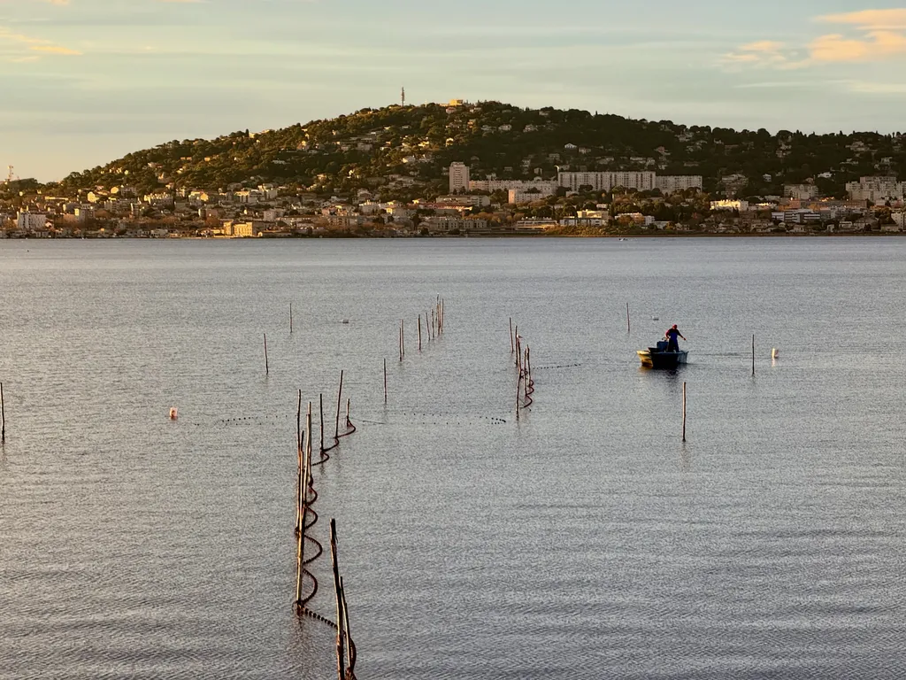
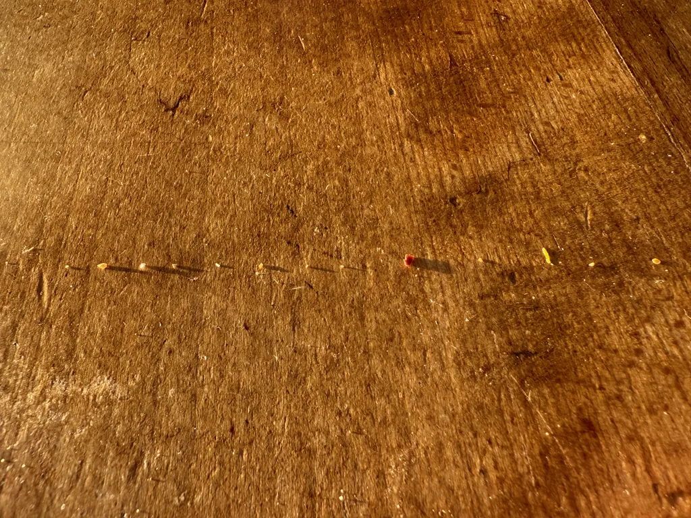

# Janvier 2025

### Mercredi 1er, Balaruc

Après une fin d’année éblouissante, ce matin temps gris, pesant, glacial, comme si une année lugubre débutait. Je n’aime pas écrire de telles phrases, de peur des prophéties autoréalisatrices. Je me retiens de les effacer. Moi le rationnel extrémiste suis parfois superstitieux.

---

J’avais peur de relire [*Un tour en Thaery*](https://en.wikipedia.org/wiki/Maske:_Thaery) de Jack Vance, d’être déçu après plus de 40 ans par ce [bildungsroman](https://en.wikipedia.org/wiki/Bildungsroman "Bildungsroman") qui m’avait enthousiasmé ado au point de me prendre pour le héros, Jubal. J’avais raison de me méfier. Il y a des textes qui ne parlent qu’à certaines époques de la vie et ne vieillissent pas avec nous. Narration répétitive. Chaque nouveau personnage décrit systématiquement en préambule, mécaniquement, avec des phrases toutes faites. Même approche avec les lieux. Une surabondance de qualificatifs de couleur digne d’une IA.

Je finis par sauter des paragraphes, des pages. Au début, on ne sait plus si Jubal est encore là. L’histoire se tient, du moins jusqu’au voyage vers le monde extérieur où l’enquête policière frise le ridicule, sans parler de ce futur interstellaire imaginé dans les années 1970 et qui me apparaît poussiéreux. Jubal lit des prospectus, téléphone depuis des cabines, se déplace avec des valises de billets. C’est de la SF de papier dans notre monde qui abandonne le papier.

La lecture devient éprouvante. La forme ne tient pas. La vision ne tient pas. Des mots détestables traînent. « Races » pour désigner les humanités. La femme en objet potiche. De la difficulté d’écrire de la SF durable. Je n’ai pu me passionner pour ce texte que dans ma jeunesse à peu d’années de son écriture. Mais, paradoxe, je vais au bout, parce qu’un enthousiasme l’habite, une imagination foisonnante malgré la piètre qualité littéraire. Au final, j’éprouve un plaisir de lire qui ne m’est plus commun aujourd’hui. Durastanti m’a dit qu’il me payait un verre si j’étais déçu par le livre. C’est entre deux. Ce roman est dépassé, ma nostalgie le sauve. C’est moi qui paierai un verre à Durastanti.

---

La lumière revient, une couronne royale au-dessus du phare. Ça me redonne le moral, même si je tombe sur une phrase terrible de Barthes : « Il y a peut-être un moment de la vie, où on ne perçoit plus l’aventure, c’est-à-dire l’exaltation du sujet comme possible, et où on se sent donc condamné à la répétition. » Après chacun de mes livres, j’éprouve cette sensation, jusqu’à ce qu’une idée me surprenne.

### Jeudi 2, Balaruc

### Vendredi 3, Balaruc

Barthes discute de la nécessité de changer pour ne pas succomber à l’acédie, sorte d’épuisement de la curiosité, du pouvoir d’aimer, de s’émerveiller. Ai-je encore ce pouvoir ? Je vis des épreuves douloureuses, révoltantes, qui témoignent de la présence en moi d’une réserve folle d’énergie. « Pour celui qui écrit il ne peut y avoir de *Vita Nova* (me semble-t-il) que dans la découverte d’une nouvelle pratique d’écriture. » C’est comme ça que je me suis mis à l’écriture cartographique pour nos balades à vélo. C’est pour ça que je torture les IA.

Dans sa dernière newsletter, [Philippe Castelneau](https://castelneau.substack.com/p/rien-que-du-bruit-84-005) parle des lettres, à l’ancienne, de leur imaginaire. Pourquoi ne pas écrire des lettres à des amis, des connaissances, pour parler d’aujourd’hui, mais le faire d’une façon nouvelle ? Envoyer une véritable lettre à ceux qui veulent la recevoir, accepter de lire leurs réponses, leur répondre collectivement. C’était un peu ça le blog, mais j’aimerais jouer le jeu dans une relative intimité. Presque dans le secret. En tout cas sans aucune publicité d’aucune sorte. Envoyer une première lettre à quelques copains. Leur laisser le loisir d’y répondre, de la faire lire à d’autres, mais avec la condition de ne jamais en parler sur les réseaux et le net visible.

« Ce qui peut être nouveau, ce n’est pas de renoncer à l’écriture, c’est d’en changer, de changer son écriture. »

---

Je vois des copains, parfois un peu plus âgés que moi, publier sur Facebook des photos de leur jeunesse de façon répétitive, comme s’ils en étaient à la fin de leur vie et qu’il ne leur restait plus qu’à faire le point. Si cette tentation de la nostalgie s’empare de moi, j’espère me l’interdire avant qu’il ne soit trop tard.

Tandis que j’écris cette note, le soleil entre dans ma chambre. J’en photographie. En cherchant à mieux la cadrer, une enceinte Bose posée sur le meuble chinois au pied du lit me dérange. Je me lève pour la décaler, puis me dis « à quoi bon la garder ». Avec son double elles m’accompagnent depuis mon premier appartement à Paris (et mon premier achat avec mon premier salaire d’ingénieur). Je les ai transportées à Londres, puis à la maison, où j’ai remis la chaîne hi-fi dans le meuble pour ne plus l’utiliser.

Je viens de les démonter. Je sens un vide, une présence rassurante s’est effacée. La nostalgie est puissante, insidieuse. Je crois que je gardais ces enceintes par habitude, sans questionner leur nécessité. Combien d’autres choses, d’autres pensées, d’autres habitudes m’encombrent ? Une maison de vieux, c’est une maison remplie de souvenirs, peut-être nécessaires pour stimuler la mémoire. Est-il possible de vieillir dans le minimalisme ? La vieillesse s’accompagne-t-elle d’une ribambelle d’objets poussiéreux ? Les intérieurs des vieux me mettent mal à l’aise.

Je regarde la bibliothèque et me demande pourquoi conserver tous ces livres d’art que je ne consulte plus mais qui ont formé mon regard ? Au cas où ? Même pas. Ils s’imposent par leur pesanteur et parce que la bibliothèque sans livres serait triste. Vestiges d’une époque d’avant internet.

---

[Effrayante animation de la Nasa qui montre la vitesse du réchauffement climatique.](https://svs.gsfc.nasa.gov/5190)

### Samedi 4, Balaruc

J’aime refaire les mêmes photos pour me prouver que je reste attentif au monde. Je ne cherche pas La photo, mais le moment qu’elle représente. L’image n’a guère d’importance. Mes images racontent une histoire, à minima celle de l’évolution technologique de mes téléphones portables (il y a bien longtemps que j’ai renoncé aux boîtiers, leur taille et leur spécialisation ne me les rendant pas très sympathiques). J’ai avant tout besoin de simplicité. Mon Leica, c’est mon iPhone.

---

Barthes parle du fantasme d’écriture, fantasme de roman par exemple. Ça ne me traverse pas l’esprit. Quand j’ai un désir d’écriture, j’écris. Je n’ai pas pour habitude de rêver ou de fantasmer à ce que je pourrais écrire. Je sens chez Barthes l’emprise de la psychanalyse forte à son époque, et qui le reste encore en France, alors qu’ailleurs cette pseudo science a été en grande partie discréditée.

Si j’ai éprouvé un fantasme d’écriture, c’est uniquement avant de me lancer la première fois, quand je me l’interdisais. Puis j’ai osé pour ne plus arrêter. Il n’était plus question de transgresser un interdit, je m’étais donné le droit d’écrire, tout simplement.

  ---

Barthes : « Écrire a besoin de clandestinité. » Nous avons démontré le contraire avec la littérature numérique, notamment quand nous l’avons tendue sur le fil du rasoir (je pense pour ma part à *La Quatrième Théorie*, mais surtout à *One Minute*).

---

Blanchot, *L’entretien infini* (1969) : « Quoi que nous fassions, quoi que nous écrivions — et la magnifique expérience surréaliste nous l’a montré —, la littérature s’en empare et nous sommes encore dans la civilisation du livre. » Qui oserait encore parler d’une civilisation du livre ? Nous tentons de nous emparer littérairement du monde et de ses changements, mais sans plus la moindre influence sur lui. Au mieux, nous distrayons, pour les plus populaires d’entre nous.

---

Je découvre en ligne une photo de moi prise à Pau en 2019 dans le funiculaire. Je ressemble à un curé en chaire. J’étais dans mon fauteuil roulant après ma fracture du col du fémur.

### Dimanche 5, Balaruc

Je ne savais pas que je partageais avec Proust une hypersensibilité aux odeurs. Je suis hypersensible aussi aux couleurs, à beaucoup d’autres choses, en particulier à la connerie, ce qui ne m’empêche pas moi-même d’être très con (souvent à cause de mon hypersensibilité qui me rend beaucoup de comportements insupportables).

Je découvre aussi que je partage avec Barthes un défaut de mémoire - pas de souvenirs torrentiels, pas de perpétuelles réminiscences, je dois faire des efforts pour recoller le passé, presque je dois le réinventer, et c’est peut-être pourquoi je tiens un journal, pour ne pas perdre le fil. Le journal m’ancre dans le présent, dans le faire tout de suite, il rend la mémoire non nécessaire, puisqu’il la seconde.

---

Suis en train de lire [*2666*](https://fr.wikipedia.org/wiki/2666_(roman)), forte puissance narrative, celle d’une grande œuvre classique, en crue, en même temps familière, guère surprenante, dans la lignée du XXe siècle, rien qui me chavire. Un grand livre peu déroutant.

### Lundi 6, Balaruc

Barthes aime les romans *anamnésiques* (qui ne perdent pas la mémoire, qui la cultivent au contraire), comme *La Recherche* ou *Guerre et Paix*, moi aussi je les ai beaucoup aimés, mais je pratique le roman amnésique, un roman tendu vers demain, et c’est un grand danger de se tendre vers demain, car demain sera autre, et le roman sera bon à jeter, comme la plupart des romans amnésiques. Tout au moins capturer le présent, le dire comme s’il était déjà passé, pour qu’il devienne anamnésique pour demain.

Je comprends que *2666* est un roman anamnésique, d’où cette sensation d’épaisseur, de poussière accumulée depuis longtemps, que je ressens dans beaucoup de romans, et qui, sans m’être désagréable, semble vouloir m’arracher à la vie, m’emporter dans une autre dimension, un nom temps immobile, qui m’enveloppe, m’empêche d’être moi-même, de penser, de me débattre, d’exister, jusqu’à m’étouffer.

---

Les références répétées de Barthes à la psychanalyse, à la castration ou des notions du même type me prêtent même à sourire, tant elles datent le texte et le salissent.

---

Comment « passer du fragment au non-fragment » se demande Barthes, postulant que des romans fragmentaires comme *One Minute* ne peuvent exister (même s’il ne les pense pas impossibles et même les fantasme). Dans *Rush*, j’oppose le fragment au non-fragment, j’essaie de provoquer un choc entre les deux formes.

---

En appliquant mon script de correction ortho typo sur des textes d’autres auteurs, je découvre qu’il permet d’évaluer leur qualité : plus il les réduit, plus c’est signe d’un laisser-aller stylistique.

### Mardi 7, Balaruc

Idée d’un huis clos : [un homme prisonnier durant deux mois dans sa voiture ensevelie sous la neige](https://mymodernmet.com/igloo-effect-snowed-in-car-sweden/).

### Mercredi 8, Balaruc

J’aime lire dans la nuit sur ma liseuse. Sous mes yeux, le halo des mots, avec lesquels j’entretiens une intense intimité.

---

Lionel me dit vouloir publier *Rush*. On réfléchit. Il parle d’une méta-édition pour une métafiction.

### Jeudi 9, Balaruc

### Vendredi 10, Balaruc

Troisième version de *Rush* terminée. D’une version à l’autre, je fais gonfler le texte de 10 %, puis les corrections le ramènent à sa taille initiale, comme si elle était consubstantielle du projet.

### Samedi 11, Balaruc

Nuit interrompue par le surgissement de nouvelles idées pour *Rush*, je croyais en avoir fini pour quelque temps, mais le texte ne me lâche pas.

### Lundi 13, Balaruc

### Mardi 14, Balaruc

V3 de *Rush* définitive, déjà des idées pour une V4, mais il est temps de laisser le projet dormir.

### Mercredi 15, Balaruc

Dans chacun des douze chapitres fictifs de *Rush*, il faut trouver le chapitre suivant du carnet. C’est une sorte d’épreuve initiatique. Mon roman est donc initiatique. Il n’a rien de dramatique ou de comique ou de théâtral.

---

Barthes définit la métalittérature : « les écrits où un auteur confie ses plans, ses projets, ses soucis quant à l’œuvre à faire. » Je n’ai jamais écrit que de la métalittérature jusqu’à ce qu’elle devienne mon seul sujet dans *Rush*.

---

Je découvre la couverture d’*Épicènes* qui sortira au printemps. Le graphiste s’en est très bien tiré : il n’était pas simple d’illustrer ce court roman sur l’amour fusionnel à la frontière du noir et du fantastique. Ma version du *Horla*, et la couverture a un côté XIXe, un rien baroque, qui convient à ce texte qui ne me ressemble pas, et qui m’a pris par surprise durant l’été 2022.

### Jeudi 16, Balaruc

Je ne suis pas low-tech parce que, dans un monde de low-tech, il n’y aurait pas de solution pour soigner Isa. J’aspire à une tech consciente. Pendant ce temps la planète étouffe et l’essentiel du trafic internet concerne des échanges de vidéo souvent porno.

---

J’ai le désir de créer plus que d’écrire. Mon désir de créer ne fait que s’exprimer par l’écriture, mais parfois par la photo, le code, le bricolage, le traçage cartographique… jadis le dessin.

### Vendredi 17, Balaruc

Je n’ai pas écrit *Rush* avec les IA, mais je ne l’aurais pas écrit sans avoir écrit avec elles *Le Code Houellebecq*. Dans *Rush*, je pars à la recherche du propre de l’humain créatif, une quête qui n’a de sens que parce que les IA existent et que je me frotte à elles depuis deux ans. Je n’écris pas avec les IA mais travaille avec elles. Je leur soumets mes textes, leur demande de les corriger, de les analyser, de les commenter. J’en parle beaucoup avec elles : mes premières lectrices. Parfois leurs réponses me laissent sur le cul.

### Samedi 18, Balaruc

Le plaisir de lire peut finir par provoquer le désir d’écrire, qui exaucé provoque le plaisir/souffrance d’écrire, qui bientôt provoque un besoin d’écrire, et puis une nécessité d’écrire. Il s’agit en quelque sorte d’une perversion comme une autre. Le plaisir/souffrance de pédaler finit par transformer le vélo en besoin. Peut-être qu’il n’y a jamais plaisir sans souffrance, parce que la souffrance redouble le plaisir par contraste. Je dois paraître naïf pour ceux qui étudient ces questions depuis toujours et qui ne me traversent que parce que je lis Barthes.

« Et peut-être ce grand drame du Vouloir-Écrire (qui est vraiment le récit mis en scène par Proust) ne pouvait-il être écrit qu’au début d’une période de recul et de dépérissement de la littérature, parce que « l’essence » des choses (ça veut dire ici l’essence de la littérature) n’apparaît que quand elles vont mourir. Et c’est parce que la littérature va peut-être mourir que Proust a fait du Désir d’écrire le sujet de son récit. »

Je me répète : il n’existe pas une essence de la littérature, chacun voyant midi à sa porte. Certains écrivent par nécessité de dire quelque chose, ou de dénoncer, et non par désir de textes. Ils écrivent par corvée, ou par métier, ou par habitude prise durant l’enfance, ou par automatisme, comme les IA. Mais je relève la note de Barthes parce qu’il y est question de la fin supposée de la littérature du temps de Proust, alors que rétrospectivement elle connaît un âge d’or.

Quand on vit des crises, et nous en vivons une, d’abord initiée par la TV, puis les réseaux sociaux, maintenant amplifiée par les IA, nous avons tendance à dramatiser, à croire que nous ne nous en relèverons pas, que la littérature ne s’en relèvera pas. Et nous tentons de noter tant que c’est encore possible, nous disant que peut-être c’est pour la dernière fois. En vérité, toute cette écriture, tout ce jaillissement de mots, dit que la littérature, peu importe ce qu’elle est, continue de vivre, et continuera de vivre d’une façon ou d’une autre, au moins quelque temps. La crise fait de nous des écrivains notables. Et ceux qui ne perçoivent pas la crise naviguent heureux hors de la littérature. La littérature n’est peut-être qu’une succession de crises.

---

Barthes : « Il y a donc une poussée à l’indifférenciation des écrits, et cette poussée, actuellement, je dirais qu’elle est freinée (elle ne s’accomplit pas parce qu’elle est freinée) par les catégories éditoriales. Au fond ce sont les éditeurs et les libraires qui ont besoin de catégories, ne serait-ce que pour classer les livres dans une librairie, et c’est cela qui freine l’indifférenciation des genres littéraires. »

Et peut-être qu’internet et la libre publication nous ont permis de vivre cette poussée vers l’indifférenciation jusqu’au bout. Pierre me disait, en lisant *Rush*, qu’il devait oublier sa casquette d’éditeur pour accepter le roman, trop transgenre pour le marché.

Barthes cite Novalis : « _Art du Roman :_ le Roman ne devrait-il pas embrasser toutes les espèces de styles dans une succession diversement liée à l’esprit commun ? » « L’art du roman exclut toute continuité. Le roman doit être un édifice articulé dans chacune de ses périodes. Chaque petit morceau doit être quelque chose de coupé – de limité –, un tout valant par lui-même. » Et ceci : « Prose proprement romantique – au plus haut point changeante –, merveilleuses tournures étranges – sauts brusques – tout à fait dramatiques. Même pour de brefs exposés. »

Suis-je un néo-romantique ? Encore à rêver du roman total, ou plutôt du roman qui ne s’interdit rien. Du roman de l’écrire comme dit Barthes, du roman comme Texte. Je ne rêve pas, je fais. Ce carnet n’est aussi qu’un roman.

### Dimanche 19, Balaruc

Lionel me signale [une vidéo](https://mamot.fr/@ludomire@tooting.ch/113855329312124352) sur les lost media : quand l’enquête pour les retrouver devient plus importante que l’objet recherché, quand elle devient œuvre d’art, peut-être parce qu’elle laisse planer des questions sur l’œuvre recherchée, qui peut dès lors être plus sublime que toutes œuvres existantes. Dans *Rush*, *Le Roman du roman* est un lost media, à la recherche duquel partent les héros, et leur recherche devient *Le Roman du roman* lui-même.

### Lundi 20, Balaruc

[La SGDL appelle les auteurs à signer une pétition pour protéger la propriété intellectuelle.](https://sommetiatribuneauteursartistes.questionnaireweb.com/f/237021/4pa4u6BFND7Qs3gHLzBwvE) Je ne signerai pas parce que je suis pour la libre circulation des œuvres, leurs accouplements en tout genre, même les plus odieux. Je suis pour que la création respire, dépasse les frontières du marché. On ne résistera à l’emprise des oligarques qu’en construisant un monde de liberté à côté de leurs empires monopolistiques. Défendre le droit d’auteur, c’est défendre un monopole et la plus mauvaise façon de s’opposer à des monopoles.

### Mardi 21, Balaruc

Sur France Info, le président de l’Arcom dit préférer rester sur Twitter, parce que quitter le terrain revient à refuser le combat. Sauf que, sur ce terrain, les règles varient selon les utilisateurs et le bon vouloir d’un oligarque. J’ai quitté Twitter en 2023, parce qu’il était toxique pour moi. Tous les réseaux sociaux sont par nature toxiques, parce que nous pouvons y dire n’importe quoi, sans le moindre scrupule. Le problème n’est pas telle ou telle plateforme, mais leur existence. Le seul lieu numérique qui me convienne est mon site. Dès que nous nous donnons rendez-vous au même endroit, ça ne peut que dégénérer en course à l’attention.

### Mercredi 22, Balaruc

Écrire pour sa propre satisfaction, plutôt que pour défendre une cause ou une communauté, serait le propre du romantisme selon Barthes. Il fait remonter la pratique à Montaigne : « Je suis un homme plume. Je sens par elle ; à cause d’elle, par rapport à elle et beaucoup plus avec elle. » J’ai souvent répété la même chose, parce que je l’éprouve au plus profond, parce que je suis de l’espèce de ceux qui voient plus clair quand ils écrivent, qui éprouvent davantage de plaisir, qui pensent plus loin.

J’ai des copains qui écrivent pour leurs lecteurs, pour partager avec eux des émotions, pour moi il ne s’agit que d’effets collatéraux de mon désir d’écrire et sa satisfaction première. J’ai le plus grand mal à lire ceux qui ont des ambitions extérieures à eux-mêmes. Je n’ai jamais supporté Zola.

Barthes glisse entre la forme active « le vent agite les fleurs sur le balcon » et la forme passive « les fleurs agitées par le vent sur le balcon », la forme moyenne qu’on retrouve dans le sanscrit, une forme verbale qui concerne le sujet lui-même : j’écris pour moi, je m’écris, j’écris… C’est ce que je fais, et de le voir exprimé là, clairement, quelques années avant que je commence à écrire, me fait me dire que j’aurais dû le savoir avant. Je me serais senti moins seul, moins isolé, mais membre d’une longue famille, à laquelle je me rattache peu à peu.

J’en arrive à cette conclusion que ce pan de la littérature ne s’éteindra pas, parce que pour ceux de notre espèce il y aura toujours écrire, même quand les IA écriront « pour », « avec l’ambition de », « dans le but de ». Même quand il n’y aura presque plus de lecteurs, il restera cette possibilité de s’augmenter par l’écriture, qui sera peut-être alors une sorte de bouddhisme, un art ésotérique, et ceux qui le pratiqueront seront des espèces de moines ou d’adeptes.

Je me suis toujours voulu dans l’ultracontemporain et me retrouve relégué à une forme née quelques siècles avant ma naissance, et donc finalement, je suis peut-être un des derniers pratiquants spontanés, avant que cette voie devienne si ténue qu’elle nécessitera une initiation consciente (bon, j’ai souvent pensé que j’étais aussi un méditant naturel, même si le yoga est encore plus ancien).

---

Je remarque que *One Minute* n’est pas dans ma fiche Wikipédia, je le dis sur Mastodon, quelqu’un effectue immédiatement la correction. Ça me donne de l’espoir quand je vois le monde libre réagir aussi vite.

### Jeudi 23, Balaruc

Il n’existe guère d’activité plus écologique qu’écrire, dessiner, photographier, rêver : s’amplifier les sens pour saisir des lumières fugaces et en jouir pour soi, avant de les partager, mais alors on quitte l’écologie, on entre dans la grande bataille de l’attention, avec toutes ses absurdités, ses dépenses excessives, ce grand vent contre la mort.

### Vendredi 24, Balaruc

Je publie deux articles, [l’un sur le vélo qui provoque des commentaires](https://tcrouzet.com/2025/01/24/coros-dura-bikepaxking/), [un autre politique](https://tcrouzet.com/2025/01/24/technofascisme/), qui suscite peu de réactions. Un hasard ? Un filtrage des algorithmes ? Mon second article est très mauvais ?

---

De temps en temps, je visionne les vidéos d’un gars qui parle IA et écriture. [La dernière est édifiante](https://www.youtube.com/watch?v=Iy92G7RxZP8&ab_channel=TheNerdyNovelist) : pour lui, un livre est un objet manufacturé comme un autre. Impression de ne pas vivre sur la même planète. Impression aussi que la plupart des éditeurs recherchent ce genre de textes, écrits dans un but précis, alors que moi je m’intéresse aux textes issus du désir d’écrire.

### Samedi 25, Balaruc

Barthes : « Le type d’écrivain auquel je pense écrit pour être aimé, mais précisons : pour être aimé de quelques-uns et pour être aimé _de loin_, sinon il n’écrirait pas. » Si je voulais juste être aimé, il me suffirait de me contenter de l’amour de mes proches. Voilà pourquoi j’apprécie peu les salons où les lecteurs viennent dire leur amour. La meilleure preuve d’amour qu’on peut me faire est d’acheter mes bouquins et d’en parler, ce qui donne envie aux éditeurs de me publier, et démultiplie mon désir d’écrire. J’aime par-dessus tout cet amour lointain, mais néanmoins authentique. Je n’ai pas besoin qu’il se retrouve sous mes yeux.

---

Résumé de la théorie de Barthes : quand je termine un texte, il meurt pour moi et moi avec, alors je n’ai d’autre choix que d’en commencer un autre pour continuer à vivre. Il note que très peu d’auteurs se sont sabordés dans l’histoire ; Rimbaud comme exception.

Intéressante classification du rapport au je selon Barthes :

1. Le *je* est haïssable → les classiques
2. Le *je* est adorable → les romantiques
3. Le *je* est démodé → les « modernes »
4. et moi j’imagine un « Classique moderne » → dont le *je* serait triché, incertain et triché.

J’en suis là. Je doute de moi-même, parfois je me fais dire des choses que je ne pense pas, ou je raconte des rêves comme des faits, ou j’affabule. Je ne m’interdis rien avec mon je, à la fois moi et personnage que je ne cesse de construire. Quand j’écris, je suis dans un rapport de détachement avec ce je. J’aimerais que les carnets et mes romans se fondent, se confondent. De plus en plus envie d’écrire un roman-carnet.

### Dimanche 26, Balaruc

Barthes : « Il y a des cas où certaines œuvres mettent en scène leur propre fabrication. » C’est le projet de *Rush*, raconter le roman derrière le roman. Et je le continue ici, parce que ce roman n’a pas cessé, il avait même commencé avant que je le projette. *Rush* n’est qu’une extension du carnet.

### Mardi 28, Balaruc

### Jeudi 30, Balaruc

L’arroseur arrosé : OpenAI pille le web pour créer ChatGPT, puis accuse DeepSeek de piller ChatGPT. De qui on se moque ?

---

Il n’y a plus de mérite à écrire un livre. Il y a trop de livres. Alors écrire ce qui ne peut plus entrer dans un livre, ce qui les dépasse, les déborde, accepter la polyphonie la plus extrême, accepter le carnet, le carnet augmenté de tous les autres textes, le carnet comme colonne vertébrale, d’où s’échappent des milliers de pattes, ou de neurones, une sorte de forme foisonnante, cérébrale, végétale, cancéreuse, incontrôlable. Ne plus tenter de contenir, de réduire, de borner, laisser les dendrites se déployer, sans souci de les faire aboutir, juste accepter leur écoulement. Sauter dans la vastitude.

### Vendredi 31, Balaruc

Bricolage du jour : je bascule mon système de gestion de newsletters vers [Substack](https://tcrouzet.substack.com/).

#carnets #y2025 #2025-2-12-18h00
