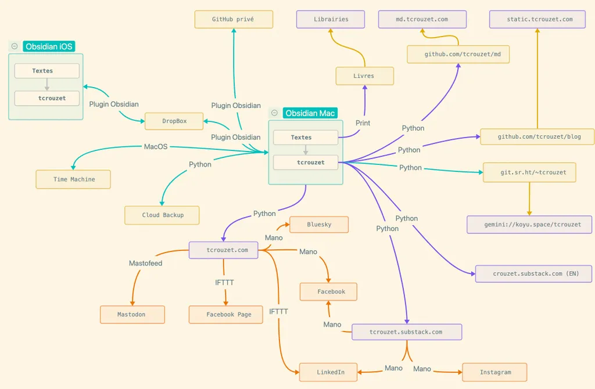

# Le prix de la liberté (numérique)

Petit accrochage avec mon fils puîné : il désire un abonnement Spotify au prétexte que c’est pratique et simple. Je passe les quinze minutes du trajet au lycée à lui expliquer que la simplicité cache parfois, et même souvent dans le monde numérique, une perte de liberté (à commencer par celle des artistes que Spotify exploite).

Pourquoi publions-nous nos commentaires sur des réseaux sociaux plutôt que sur nos sites personnels ? Par commodité et dans l’espoir de retrouver nos « amis ». Nous finissons par avaler une montagne de contenus indésirables placés sous nos yeux par des algorithmes pour nous maintenir sur la plateforme et consommer des publicités.

Ces contenus indésirables altèrent notre imaginaire, notre philosophie, notre conception du monde, d’autant plus qu’ils proviennent prétendument de nos « amis ». Un réseau social algorithmique n’a rien de social : c’est une machine à nous emprisonner. On ne peut s’y aventurer qu’en pleine conscience des dangers encourus.

Spotify n’a aucun intérêt à nous faire écouter un genre musical obscur, difficile, qu’a priori nous n’aimerons pas (comme Amazon n’a aucun intérêt à nous pousser vers des livres exigeants). Les algorithmes sont prudents : ils étendent notre champ culturel/politique/technique sans prise de risque (seul notre espace de consommation les intéresse).

Quand j’avais l’âge de mon fils, je fouillais au hasard dans les bacs des discaires et parfois sortait du Rock, du Jazz, du Classique. Spotify ne propose jamais de la musique dodécaphonique avec insistance à un adepte de punk rock. C’est ce que faisaient les bacs des discaires et des libraires que je fréquentais. Il se produisait parfois des sauts quantiques.

Mais rien n’a changé pour peu que nous échappions aux [algorithmes technofascistes](https://static.tcrouzet.com/2025/01/24/technofascisme/), mis en œuvre par des entrepreneurs de peu d’éthique. Cette libération a un prix : parfois renoncer à quelques simplicités. Je voudrais illustrer comment je tente de m’en sortir, à titre personnel. Plutôt que publier des tribunes sur Facebook comme le font beaucoup de mes amis auteurs (solution simple — trop simple quand on se prétend politiquement éveillé), j’adopte une stratégie beaucoup moins directe (ou disons beaucoup plus tortueuse). Une mindmap pour résumer.

Tout ça vous paraît peut-être compliqué, voire délirant, pourtant c’est ma façon de me décentraliser, de lutter contre la centralisation croissante du web. Je me bats avec les armes de mes adversaires sur tous les terrains.

### Est-ce efficace ?

Je n’en suis pas sûr. Un exemple. J’ai annoncé [mon article sur le technofascisme](https://static.tcrouzet.com/2025/01/24/technofascisme/) sur trois plateformes, postant deux annonces sur chacune :

* [Sur Facebook](https://www.facebook.com/tcrouzet) où j’ai près de 5 000 « amis », j’ai reçu [19 likes et 4 partages](https://www.facebook.com/tcrouzet/posts/pfbid02MhwaAxgLPbh282Ldk5xfdnwLBshaQcczvy9936jLTNbkajpXLxUgwuJksiuv7rcWl) (rendement 0,5 %).
* [Sur Bluesky](https://bsky.app/profile/crouzet.bsky.social) où j’ai à peine plus de 200 « amis », j’ai reçu [9 likes et 4 partages](https://bsky.app/profile/crouzet.bsky.social/post/3lgiobvnevk2i) (rendement 6,5 %).
* [Sur Mastodon](https://mamot.fr/@tcrouzet) où j’ai un peu plus de 600 « amis », j’ai reçu [80 likes et 90 partages](https://mamot.fr/deck/@tcrouzet/113888759221893550) (rendement 28 %).

Pas difficile de comprendre que quelque chose cloche sur Facebook. Mes « amis » ne m’y appartiennent plus. Ils ne sont pas mon audience, mais celle de Facebook qui en fait ce qu’il veut. Mon article n’y a été vu que par des proches intéressés par le sujet traité. Dans le même temps, j’ai publié un texte plus consensuel sur le vélo qui a été abondamment partagé et commenté. Facebook est un réseau social à géométrie variable.

Si j’y avais publié mon article sur le vélo en intégralité plutôt que sa simple annonce, il aurait été encore plus lu : les lecteurs seraient restés au contact de Facebook et de sa machine à clics.

Le rendement de mon article sur Mastodon s’explique par une proximité politique entre les utilisateurs Mastodon et mon sujet. Mais cet effet communautaire n’explique pas à lui seul l’écart dans le nombre de réactions. La seule explication : c’est le biais algorithmique, la prise en otage de mon audience. Facebook exploite la communauté que j’ai construite au fil des années à ses propres fins.

### Ma pollinisation numérique

Pour échapper aux manipulations algorithmiques, je tente un grand écart entre mes textes distribués en version minimaliste en [Gemini](gemini://koyu.space/tcrouzet/) ou [Markdown](md.tcrouzet.com), mon [site en HTML/JS](https://tcrouzet.com/) et [Substack](https://tcrouzet.substack.com/). À chacun de choisir son canal d’accès.

Cette logique de diffusion m’aide à expériementer avec les possibilités disponibles. Je suis trop geek pour ignorer les voies les plus populaires, même si certains de leurs aspects me déplaisent. Les utiliser reste un apprentissage, tant de l’audience qui les utilise que des travers qui s’y propagent.

Pour les intéressés, voici quelques précisions. J’écris avec [Obsidian](https://tcrouzet.com/2024/12/25/un-an-avec-obsidian/) mes livres, mes articles, mon journal. Mes Obsidian sur MacOS et iOS sont tous deux synchronisés avec une archive DropBox (je me relis et corrige souvent sur mon iPhone). Je dispose par ailleurs d’autres archives (boîtes jaunes), certaines privées, d’autres publiques sur des dépôts GitHub : un [miroir du blog](https://github.com/tcrouzet/blog) ([accès web](https://static.tcrouzet.com/)), une [version Markdown](https://github.com/tcrouzet/md) ([accès web](https://md.tcrouzet.com/)), une [version Gemini](https://git.sr.ht/~tcrouzet/tcrouzet/tree) ([accès Gemini](gemini://koyu.space/tcrouzet/)). Sur les réseaux sociaux (boîtes orange), je ne publie que des annonces. J’automatise la pollinisation avec [NoMoreWordPress](https://github.com/tcrouzet/NoMoreWordPress). Je pourrais aller plus loin encore dans l’automatisation, mais je ne veux pas déshumaniser le processus (par exemple via une solution comme [8n8](https://github.com/n8n-io/n8n)).

### La liberté a un coût

En fin de compte, mon fils n’aura pas son abonnement Spotify (il sera majeur dans trois mois et fera ce qu’il voudra avec son argent de poche). Je lui ai proposé une alternative : constituer sa propre bibliothèque musicale, découvrir des artistes par lui-même, expérimenter, se tromper parfois. Ce n’est pas la voie de la facilité, mais celle de l’autonomie.

Cette approche résume ma philosophie numérique : privilégier l’indépendance plutôt que le confort imposé par les plateformes. Si je n’étais pas codeur (et les IA nous rendent tous un peu codeurs), j’adopterais une stratégie moins compliquée, mais je ferais mon possible pour ne pas m’enfermer dans une seule solution. 

La vraie simplicité n’est pas celle qu’on nous vend. Elle naît de la maîtrise de nos outils, de la compréhension de leur fonctionnement, de notre capacité à les adapter à nos besoins plutôt que l’inverse. C’est un apprentissage constant, parfois frustrant, mais toujours enrichissant.

La pollinisation nourrit-elle la bête centralisatrice et appropriatrice ? Oui, puisque j’y publie des contenus, mais non puisque je suis un petit grain de sable qui fait grincer les rouages. J’ai un pied dans la machine, un pied dehors, ce qui me donne deux points de vue sur le monde numérique (multiplier les points de vue me paraît toujours le meilleur moyen de rester éveillé). Pour le moment, je trouve la pollinisation préférable à la migration définitive vers le [Fediverse](https://fr.wikipedia.org/wiki/Fediverse).

Sur le plan énergétique, ma démarche est loin d’être rationnelle. Il ne s’agit toutefois que de dupliquer des contenus peu lourds. Le moindre Youtuber m’écrase. Dire que certains font pire que moi ne m’exonère en rien, je le sais. Le plus important est de privilégier l’open source. Personne ne peut s’approprier mes contenus puisque je les déclare libres dès leur création.

#netculture #y2025 #2025-2-9-16h30
