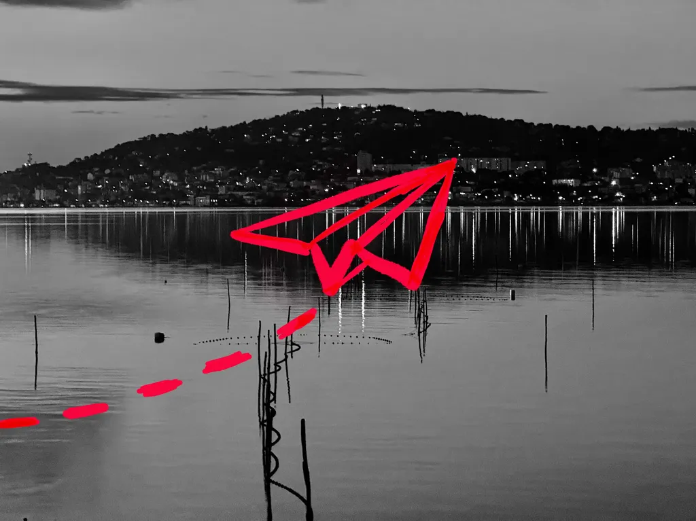
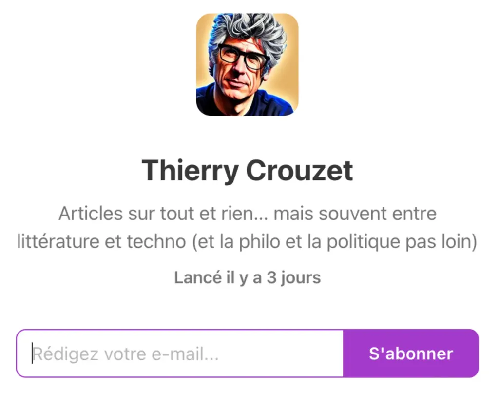

# Déménagement de mes newsletters

Dans un web de [plus en plus centralisé](https://tcrouzet.com/2025/01/24/technofascisme/), notre adresse email définit notre identité numérique et reste une porte vers notre intimité. Quand nous recevons des messages non sollicités, nous nous sentons agressés comme quand des IA marketing nous appellent au téléphone (c’est désormais quotidien).

J’aime mon adresse email. Elle définit le cœur de ma maison numérique. Quand j’envoie ou reçois des messages, c’est un échange de personnes à personne, c’est en théorie pas contrôlable : un algorithme ne me filtre pas comme le font la plupart des réseaux sociaux qui décident ce qui est bon pour nous, et surtout bon pour eux.

Quand je m’abonne à une newsletter, je la reçois, qu’elle soit politiquement correcte ou non. J’apprécie cette non-censure, cette idée presque rare de liberté d’expression non supervisée.

La newsletter est donc un outil de décentralisation, en ce sens que la liste des abonnés appartient à l’expéditeur et non à la plateforme qui permet l’envoi des newsletters (en théorie). Vu mon goût pour la décentralisation, je devrais éviter de passer par une plateforme d’envoi, mais je n’ai guère le choix, car les envois d’emails en nombre sont vite assimilés à des spams quand ils ne proviennent pas d’acteurs authentifiés.

### Le plaisir de lire

J’ai toujours aimé recevoir des newsletters des [auteurs et médias que je suis](https://tcrouzet.com/page/lectures/). Je les ouvre toujours avec l’espoir d’y découvrir des informations surprenantes, des confidences, des histoires passionnantes, que sinon je manquerais sur le web. La newsletter implique un temps de lecture long, une sorte de tranquillité.

J’ai créé une newsletter dès le lancement de mon blog en 2005. Au début, je faisais confiance à Google pour les envois, puis j’ai basculé sur MailChimp (perdant au passage tous mes abonnées). Il est temps aujourd’hui de changer de service postal. J’ai choisi [Substack](https://tcrouzet.substack.com/), plutôt que [Beehiiv](https://www.beehiiv.com/) ou [Buttondown](https://buttondown.com/) plus proches de MailChimp et vite payant.

### Avantages de Substack

1. Vous avez le choix de recevoir les newsletters dans votre boîte mail, dans l’app Substack sur mobile ou dans les deux en même temps.
2. Vous pouvez commenter les articles et discuter avec moi et entre vous dans un [canal dédié](https://tcrouzet.substack.com/chat).
3. Vous découvrez des newsletters qui abordent des thèmes connectés.

### Désavantages

Je ne suis pas naïf. [Comme l’explique Curtis Machale](https://curtismchale.ca/2024/12/14/is-substack-so-bad-3-threads/), Substack n’est qu’un autre réseau social centralisé qui tente de s’emparer de nos contenus. Je n’accepte d’être sur Substack que parce que j’ai une existence numérique en dehors : [tcrouzet.com](https://tcrouzet.com/) reste ma maison et j’en possède les clés. Le jour où Substack me déplaira, je déménagerai et vous emporterai avec moi.

### Comment ça va marcher

J’utiliserai la newsletter principale à laquelle on s’abonne par défaut de manière exceptionnelle, pour m’adresser à vous tous en même temps. Par exemple avec un article comme celui-ci ou l’annonce d’un nouveau livre. Cette newsletter mère comprend quatre sous newsletters auxquelles on s’abonne par défaut, mais dont on peut [se désabonner](https://tcrouzet.substack.com/account).

* [**Digressions**](https://tcrouzet.substack.com/s/digressions) Mes articles sur la technologie, la littérature, la politique…
* [**Carnet**](https://tcrouzet.substack.com/s/carnet) Mon journal mensuel.
* [**Born to Bike**](https://tcrouzet.substack.com/s/born-to-bike) Mes articles sur vélo, et surtout le voyage à vélo.
* [**Écriture**](https://tcrouzet.substack.com/s/ecriture) Mes projets d’écriture partagés (rien en cours pour le moment — j’écris dans mon coin).

Lors du transfert de MailChimp à Substack, j’ai dû tous vous abonner aux sous-newsletters. [Vous pouvez choisir ce que vous souhaitez recevoir en créant un compte Substack.](https://tcrouzet.substack.com/account) Désolé pour ce désagrément.

Comme j’ai croisé mes différentes bases de données, je vous ai peut-être abonné par erreur. Vous pouvez vous désabonner avec le lien au pied de la newsletter.

Si vous êtes allergiques à Substack, mes textes seront toujours publiés en priorité sur mon site et [accessibles par flux RSS comme au bon vieux temps](https://tcrouzet.com/page/abonnement-par-mail/).

Je passe à Substack pour tenter de relancer les conversations et les interactions. Même les réseaux sociaux sont devenus unidirectionnels, tout le monde cherchant avant tout à capter l’attention. Substack offre un semblant d’intimité pour les conversations. C’est loin d’être idéal, mais je ne connais pas mieux pour l’instant.

#cuisine #y2025 #2025-2-7-15h00
