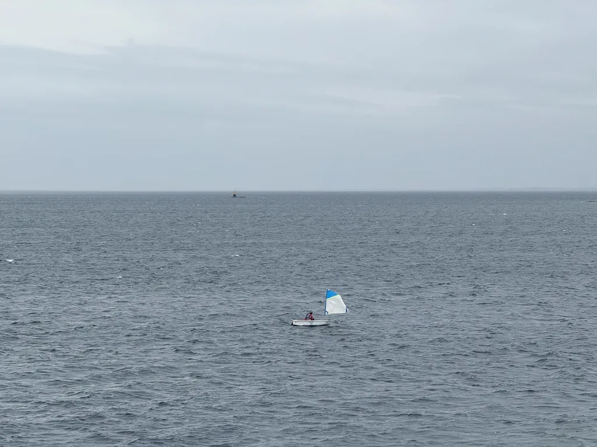

# De ma terrasse #5

*Ma sélection du dimanche : 19 liens et une photo prise depuis ma terrasse.*

## Technologie et intelligence artificielle

[Je suis un auteur publié et j’ai testé Claude 3.7 Sonnet contre Grok 3 en écriture créative — voici mon verdict](https://www.tomsguide.com/ai/im-a-published-author-and-i-tested-claude-3-7-sonnet-vs-grok-3-at-creative-writing-heres-my-verdict) • EN • 5 min  
Un test comparatif de Claude 3.7 Sonnet et Grok 3 révèle que les IA, malgré leurs capacités, manquent encore de profondeur émotionnelle et de créativité authentique en écriture.

[Quels livres les sbires de Zuckerberg ont illégalement téléchargés pour entraîner l’IA de Meta](https://futurism.com/zuckerberg-books-train-meta-ai-libgen) • EN • 5 min  
Meta a illégalement téléchargé des millions de livres sur LibGen pour entraîner son IA Llama.

[Cette opportunité dépasse l’IA et la manquer vous coûtera cher](https://www.zdnet.com/article/this-opportunity-is-bigger-than-ai-and-missing-out-will-cost-you/) • EN • 5 min  
Le storytelling est l’opportunité stratégique cruciale pour se démarquer dans un monde saturé par l’IA et les technologies.

[Google confirme la mise à niveau de Gmail — 3 milliards d’utilisateurs doivent désormais décider](https://www.forbes.com/sites/zakdoffman/2025/03/22/google-confirms-gmail-upgrade-3-billion-users-must-now-decide/) • EN • 5 min  
Google confirme une nouvelle fonctionnalité de recherche Gmail alimentée par l’IA, soulevant des questions de confidentialité pour ses d’utilisateurs.

[API OpenAI Responses : le moyen le plus simple de construire un système RAG](https://www.geeky-gadgets.com/rag-system-automation-with-openai-responses-api/) • EN • 5 min  
L’API OpenAI Responses simplifie la création de systèmes RAG en automatisant le traitement et la récupération de documents.

[Comment les IA transforment tout code en code open source](https://korben.info/llm-decompilation-claude-code-hack-intelligence-artificielle.html) • FR • 5 min  
Les LLMs peuvent désormais décompiler et transformer n’importe quel code propriétaire en code source lisible et réutilisable.

[« Cela va changer la science » : l’IA de Google vient de faire en 2 jours ce que des chercheurs ont mis 10 ans à trouver !](https://www.futura-sciences.com/tech/actualites/intelligence-artificielle-je-pense-cela-va-changer-science-ia-vient-faire-2-jours-ce-chercheurs-ont-mis-10-ans-trouver-120467/) • FR • 5 min  
L’IA de Google a résolu en 48 heures un problème scientifique qui a nécessité 10 ans de recherche sur les superbactéries.

[J’ai testé presque tous les navigateurs existants et voici mes 6 préférés (aucun n’est Chrome)](https://www.zdnet.com/article/ive-tried-almost-every-browser-out-there-and-these-are-my-top-6-none-are-chrome/) • EN • 5 min  
Un guide comparatif des 6 meilleurs navigateurs web, mettant en avant leurs forces uniques en termes de performance, de sécurité et de gestion des onglets.

[Amazon annihile les paramètres de confidentialité d’Alexa et active l’envoi continu et non consensuel de l’audio](https://pluralistic.net/2025/03/15/altering-the-deal/) • EN • 5 min  
Amazon va imposer un transfert non consensuel de toutes les conversations Alexa vers ses serveurs cloud à partir du 28 mars, violant les paramètres de confidentialité précédents.

## Sciences et environnement

[Lorsqu’un iceberg colossal s’est détaché de l’Antarctique, des scientifiques ont découvert quelque chose d’ahurissant en dessous](https://www.discoverwildlife.com/animal-facts/marine-animals/hidden-life-beneath-antarctic-peninsula-ice-sheet) • EN • 5 min  
Un écosystème inattendu et riche en vie sous un nouvel iceberg antarctique.

[« L’univers nous a lancé une courbe inattendue » : la plus grande carte cosmique dévoile que nous avons peut-être totalement mal compris l’énergie sombre](https://www.livescience.com/physics-mathematics/dark-energy/the-universe-has-thrown-us-a-curveball-largest-ever-map-of-space-reveals-we-might-have-gotten-dark-energy-totally-wrong) • EN • 5 min  
L’énergie sombre pourrait évoluer, remettant en question notre modèle actuel de l’univers.

[Le climat mondial atteint des territoires inexplorés, avertit un rapport majeur](https://www.newscientist.com/article/2472785-the-worlds-climate-is-in-uncharted-territory-warns-major-report/) • EN • 5 min  
Le rapport de l’OMM révèle des records alarmants de changement climatique, avec une hausse des températures, de la montée des océans et de la fonte des glaces.

[Et si nous vivions dans un trou noir](https://www.thebrighterside.news/post/nasas-jwst-provides-evidence-that-our-universe-exists-inside-of-a-black-hole/) • EN • 5 min  
Le télescope spatial JWST révèle des galaxies primitives et des rotations inhabituelles, remettant en question les modèles cosmologiques traditionnels.

## Voyages

[Quatre jours à Lisbonne : une escapade entre soleil, pluie et découvertes](https://www.jcdichant.com/lisbonne-quatre-jours-escapade-soleil-pluie-decouvertes/) • FR • 5 min  
Un voyage photographique à Lisbonne entre soleil et pluie, révélant la beauté et l’authenticité de la ville portugaise. _[Jean-Christophe Dichant](https://mastodon.social/@JCDichant)_

[Mürren : le magnifique village sans voitures accessible par téléphérique](https://www.bbc.com/travel/article/20250314-murren-the-stunning-car-free-village-reached-by-cable-car) • EN • 5 min  
Ça me donne des envies de voyage.

## Société et culture

[Après une opération du genou, cet adolescent se réveille en ayant oublié sa langue maternelle](https://www.slate.fr/sante/operation-genou-adolescent-oublie-langue-maternelle-anesthesie-anglais-neerlandais-cognitive-maladie-syndrome-langue-etrangere) • FR • 5 min  
Un adolescent néerlandais perd sa langue maternelle et ne peut s’exprimer qu’en anglais.

[Un journal littéraire](https://peuchaquejour.blogspot.com/2024/07/petri-de-secret.html) • FR • 5 min  
J’aime en écrire comme en lire. _[Nisan Gogo](https://piaille.fr/@nisangogo)_

[Le plus grand développement technologique de l’histoire humaine s’est produit simultanément partout dans le monde par des groupes sans aucun contact](https://futurism.com/human-development-simultaneous-revolution-farming) • EN • 5 min  
L’agriculture a été inventée de manière indépendante et simultanée il y a environ 11 700 ans.

[Le déclin marqué de l’intelligence humaine](https://futurism.com/neoscope/human-intelligence-declining-trends) • EN • 5 min  
La baisse des compétences cognitives et de l’attention s’accélère, principalement due aux changements dans la consommation médiatique et l’utilisation des technologies.

#digest #y2025 #2025-3-23-17h00 
