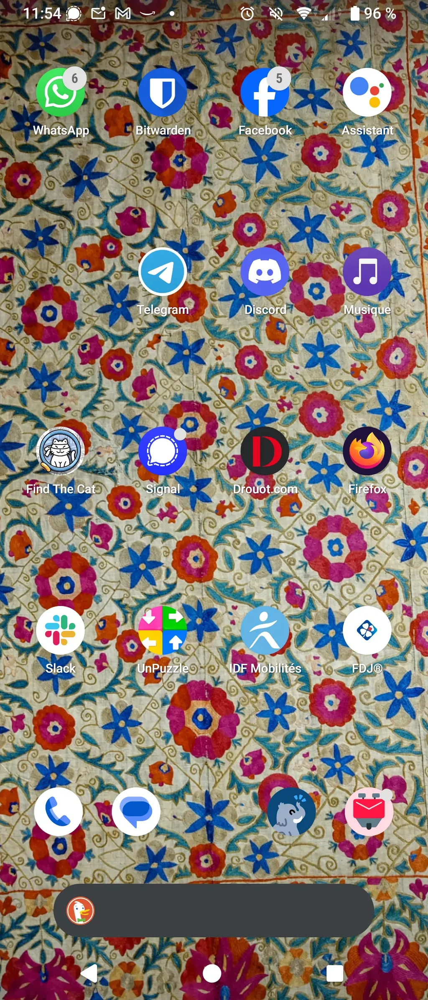

# Divination 1

[Présentation du projet…](https://tcrouzet.com/2025/03/20/mythologies-de-poche/)

Les icônes enfouies dans le motif floral comme si la propriétaire du téléphone, une Francilienne, jeune employée, se voulait à la fois visible et discrète, une esthète sans doute.

Le motif pourrait être de Matisse. Un tissu resté longtemps plié, peut-être, avant d’être tendu, marouflé, peut-être. Ancien, chargé d’une valeur sentimentale indéfectible, dont le rappel à longueur de journée rassure et conforte des choix de vie.

Une chineuse ou collectionneuse d’art, ou d’antiquités, avec un penchant pour les jeux, même d’argent, dans l’espoir de tout plaquer pour changer de vie. Déjà, elle ne fait rien comme tout le monde. Elle désire que ça se sache même si elle ne le crie pas encore. Les opinions des autres l’indiffèrent. Elle se construit contre le monde et ses agressions. Elle souffre de cette nostalgie de l’enfance propre aux jeunes adultes pour qui la vie reste indécise.

*PS : « Tu as fait le meilleur compliment qu’on peut faire à une femme, tu m’as considérablement rajeunie ! Le tissu est un [Suzani ouzbèk](https://fr.wikipedia.org/wiki/Suzani) ancien, photographié à la volée dans un musée. » Je découvre que la propriétaire est une psy, qui n’a aucune hésitation sur sa vie, qui pratique un métier difficile mais passionnant. Elle est bien Francilienne et joueuse, même au casino.*

#divination #ecriture #y2025 #2025-3-20-13h00
