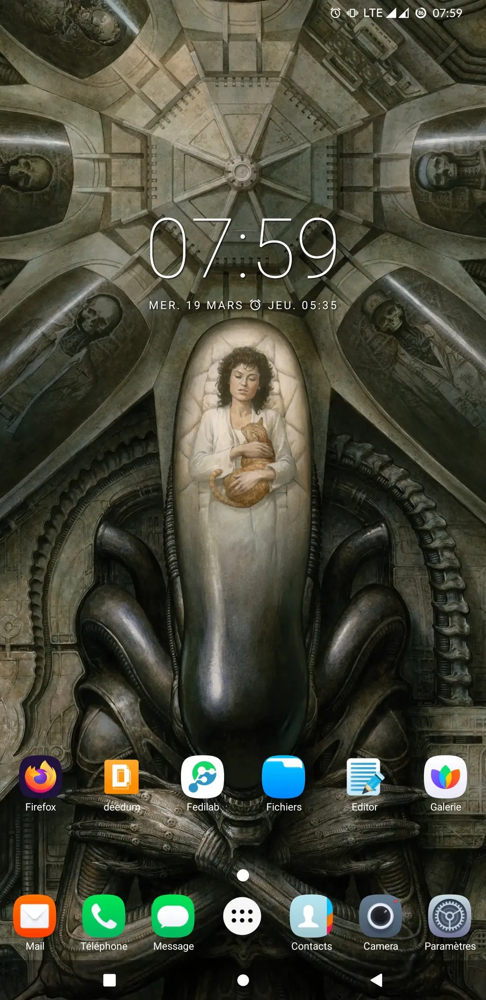

# Divination 2

[Présentation du projet…](https://tcrouzet.com/2025/03/20/mythologies-de-poche/)

Impossible de pas m’arrêter devant ce fond d’écran. J’ai vu *Alien* à sa sortie en 1979, j’avais 15 ans, j’étais seul dans la salle, un mercredi après-midi, une véritable expérience mystique pour un fan de science-fiction. L’image me rappelle les œuvres originales de [Hans Ruedi Giger](https://fr.wikipedia.org/wiki/Hans_Ruedi_Giger), sans être aussi détaillée, aussi baveuse, aussi violente. Elle n’en revendique pas moins un goût esthétique affirmé, tout en restant encore incertain, puisque par contraste les rares icônes s’ordonnent en bas de l’écran avec méticulosité. Je ressens une tension entre baroque et minimalisme.

J’imagine un homme, plutôt baraqué, à l’humeur changeante, aux désirs antagonistes et peut-être inconciliables, mais un homme déterminé : il se lève à 5h35. Information intéressante. S’il se levait pour faire du sport, il programmerait son réveil à 5h30. Le 35 indique une vie minutée avec l’horizon d’un transport en commun à ne pas manquer. Peut-être à 6h.

Il refuse les normes et aime lire les auteurs soucieux de réduire leur impact écologique tout en diffusant leurs textes dans le dénuement le plus brut (selon le protocole Gemini) ; ce qui apparaît à nouveau en contradiction avec le fond d’écran, ou du moins révèle une complexité difficile à cerner. Un auteur pourrait se cacher derrière cet écran.

*PS : « Homme oui, baraqué non (plutôt un ancien freluquet ayant pris du bide avec l’âge, j’ai bien 20 kg de trop et c’est pas du muscle). Les désirs antagonistes, à fond. La contradiction présente chez quiconque est très affirmée chez moi et il y a des choses inconciliables. L’heure du réveil vient de mon choix d’aller travailler à pieds et d’élever mes enfants. J’ordonne mes icones comme toutes mes interfaces informatiques avec la méticulosité de quelqu’un qui fuit les surprises dans la vie quotidienne, et les préfère(rait) dans des joies sortant de l’ordinaire. Je soutiens le minimalisme de Gemini, en pur lecteur à défaut d’avoir des choses intéressantes à écrire. L’auteur en moi n’est pas encore né. Sera-t-il un [Chestbuster](https://fr.wikipedia.org/wiki/Alien_(cr%C3%A9ature)#Chestburster) ? L’image de fond est de [Paolo Rivera](https://shop.paolorivera.com/product/alien-priority-one). »*

#divination #y2025 #2025-3-24-13h00
